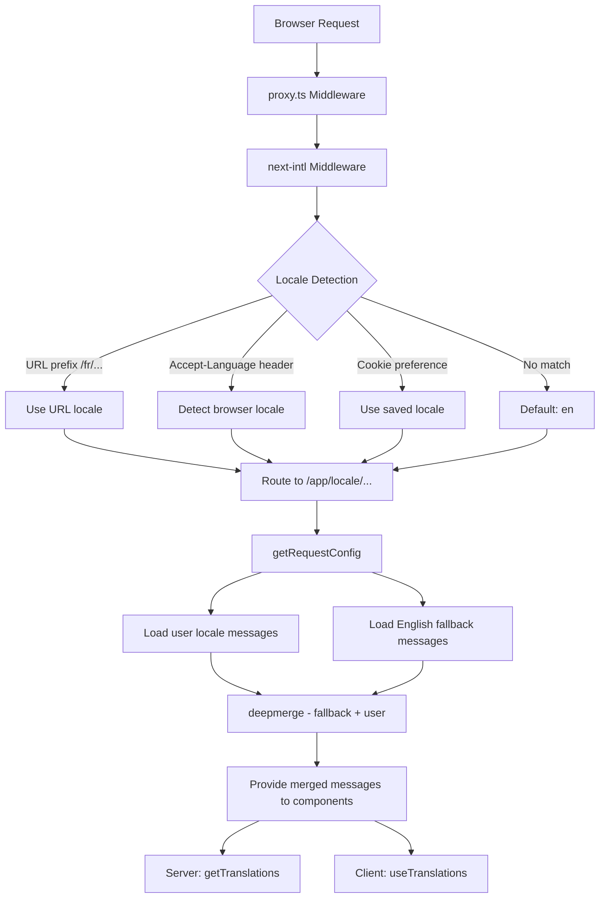

# Implementacja i18n

## Przegląd

Szablon Ever Works implementuje internacjonalizację przy użyciu **next-intl** z obsługą ponad 20 ustawień regionalnych, kierunku tekstu RTL (od prawej do lewej), zastępczych komunikatów typu deep-merge i nawigacji uwzględniającej ustawienia regionalne. System jest zbudowany wokół trzech warstw: konfiguracja routingu, ładowanie komunikatów z rezerwą i pomocnicy nawigacji uwzględniający ustawienia regionalne.

## Architektura



## Pliki źródłowe

|Plik|Cel|
|------|---------|
|`template/i18n/routing.ts`|Konfiguracja routingu lokalnego|
|`template/i18n/request.ts`|Ładowanie wiadomości w zakresie żądania|
|`template/i18n/navigation.ts`|Eksport nawigacji uwzględniający ustawienia regionalne|
|`template/lib/constants.ts`|Definicje ustawień regionalnych i RTL|
|`template/messages/*.json`|Pliki wiadomości tłumaczeniowych|
|`template/proxy.ts`|Oprogramowanie pośredniczące z rozpoznawaniem prefiksów ustawień regionalnych|

## Obsługiwane lokalizacje

```typescript
// lib/constants.ts
export const DEFAULT_LOCALE = 'en';
export const LOCALES = [
    'en', 'fr', 'es', 'de', 'zh', 'ar', 'he',
    'ru', 'uk', 'pt', 'it', 'ja', 'ko', 'nl',
    'pl', 'tr', 'vi', 'th', 'hi', 'id', 'bg'
] as const;

export type Locale = (typeof LOCALES)[number];

/** Locales that use right-to-left text direction */
export const RTL_LOCALES: readonly Locale[] = ['ar', 'he'] as const;
```

Szablon obsługuje 20 ustawień regionalnych, w tym dwa ustawienia regionalne RTL (arabski i hebrajski).

## Konfiguracja routingu

```typescript
// i18n/routing.ts
import { defineRouting } from "next-intl/routing";
import { DEFAULT_LOCALE, LOCALES } from "@/lib/constants";

export const routing = defineRouting({
    locales: LOCALES,
    defaultLocale: DEFAULT_LOCALE,
    localeDetection: true,
    localePrefix: "as-needed",
});
```

|Ustawienie|Wartość|Efekt|
|---------|-------|--------|
|`locales`|20 kodów lokalnych|Obsługiwany zestaw języków|
|`defaultLocale`|`'en'`|Powrót, gdy żadne ustawienia regionalne nie pasują|
|`localeDetection`|`true`|Automatyczne wykrywanie na podstawie nagłówka `Accept-Language`|
|`localePrefix`|`"as-needed"`|Domyślne ustawienia regionalne nie mają przedrostka; inni tak|

Z `localePrefix: "as-needed"`:
- Angielski (domyślny): `https://example.com/about`
- Francuski: `https://example.com/fr/about`
- Arabski: `https://example.com/ar/about`

## Ładowanie wiadomości z opcją powrotu

```typescript
// i18n/request.ts
import deepmerge from "deepmerge";
import { getRequestConfig } from "next-intl/server";

export default getRequestConfig(async ({ requestLocale }) => {
    let locale = await requestLocale;

    if (!locale || !routing.locales.includes(locale as any)) {
        locale = routing.defaultLocale;
    }

    const userMessages = (await import(`../messages/${locale}.json`)).default;
    const defaultMessages = (await import(`../messages/en.json`)).default;
    const messages = deepmerge(defaultMessages, userMessages) as any;

    return { locale, messages };
});
```

Strategia głębokiego łączenia zapewnia, że:
1. Komunikaty w języku angielskim służą jako kompletny zestaw zastępczy
2. Komunikaty specyficzne dla ustawień regionalnych zastępują język angielski, jeśli istnieją tłumaczenia
3. Brakujące tłumaczenia z wdziękiem wracają do języka angielskiego zamiast pokazywać klucze

### Struktura pliku wiadomości

```
messages/
  en.json        # Complete English messages (base)
  fr.json        # French translations
  es.json        # Spanish translations
  de.json        # German translations
  ar.json        # Arabic translations
  he.json        # Hebrew translations
  zh.json        # Chinese translations
  ...            # 13+ more locales
```

### Formaty daty/liczby

```typescript
// i18n/request.ts
export const formats = {
    dateTime: {
        short: {
            day: "numeric",
            month: "short",
            year: "numeric",
        },
    },
    number: {
        precise: {
            maximumFractionDigits: 5,
        },
    },
    list: {
        enumeration: {
            style: "long",
            type: "conjunction",
        },
    },
} satisfies Formats;
```

## Pomocnicy nawigacji

```typescript
// i18n/navigation.ts
import { createNavigation } from "next-intl/navigation";
import { routing } from "./routing";

export const { Link, redirect, usePathname, useRouter, getPathname } =
    createNavigation(routing);
```

Te eksporty zastępują standardowe narzędzia nawigacyjne Next.js wersjami obsługującymi ustawienia regionalne:

|Eksportuj|Standardowy Next.js|Zachowanie uwzględniające lokalizację|
|--------|-----------------|----------------------|
|`Link`|`next/link`|Dodaje przedrostek ustawień regionalnych do `href`|
|`redirect`|`next/navigation`|Zachowuje bieżące ustawienia regionalne w przekierowaniu|
|`usePathname`|`next/navigation`|Zwraca ścieżkę bez prefiksu ustawień regionalnych|
|`useRouter`|`next/navigation`|`push()` / `replace()` dodaj prefiks ustawień regionalnych|
|`getPathname`| -- |Ścieżka po stronie serwera z ustawieniami regionalnymi|

### Zastosowanie w komponentach serwera

```typescript
import { getTranslations } from 'next-intl/server';

export default async function Page({ params }: { params: Promise<{ locale: string }> }) {
    const { locale } = await params;
    const t = await getTranslations({ locale, namespace: 'common' });

    return <h1>{t('WELCOME')}</h1>;
}
```

### Użycie w komponentach klienta

```typescript
'use client';
import { useTranslations } from 'next-intl';
import { Link } from '@/i18n/navigation';

export function NavLink() {
    const t = useTranslations('navigation');
    return <Link href="/about">{t('ABOUT')}</Link>;
}
```

## Rozwiązywanie ustawień regionalnych oprogramowania pośredniczącego

Oprogramowanie pośrednie w `proxy.ts` przetwarza informacje o lokalizacji na potrzeby decyzji strażników autoryzacji:

```typescript
function resolveLocalePrefix(pathname: string): {
    prefix: string;           // "/fr" or ""
    hasLocale: boolean;
    locale?: string;
    pathWithoutLocale: string; // "/admin/items"
} {
    const segments = pathname.split('/').filter(Boolean);
    const maybeLocale = segments[0];
    const hasLocale = routing.locales.includes(maybeLocale as any);
    const pathWithoutLocale = hasLocale
        ? `/${segments.slice(1).join('/')}`
        : pathname;
    return {
        prefix: hasLocale ? `/${maybeLocale}` : '',
        hasLocale,
        locale: hasLocale ? maybeLocale : undefined,
        pathWithoutLocale
    };
}
```

Służy do konstruowania adresów URL przekierowań uwzględniających ustawienia regionalne w modułach uwierzytelniających:

```typescript
url.pathname = `${localePrefix}/auth/signin`;
```

## Wsparcie RTL

Ustawienia regionalne RTL są zdefiniowane w `lib/constants.ts`:

```typescript
export const RTL_LOCALES: readonly Locale[] = ['ar', 'he'] as const;
```

Główny komponent układu powinien zastosować atrybut `dir` w oparciu o bieżące ustawienia regionalne:

```typescript
// app/[locale]/layout.tsx
const isRTL = RTL_LOCALES.includes(locale as Locale);

return (
    <html lang={locale} dir={isRTL ? 'rtl' : 'ltr'}>
        {/* ... */}
    </html>
);
```

## SEO: Hreflang zastępuje

Narzędzie `lib/seo/hreflang.ts` generuje linki w alternatywnych językach na potrzeby SEO:

```typescript
import { generateHreflangAlternates } from '@/lib/seo/hreflang';

export async function generateMetadata(): Promise<Metadata> {
    return {
        alternates: {
            languages: generateHreflangAlternates('/about')
        }
    };
}
```

Spowoduje to wygenerowanie tagów `<link rel="alternate" hreflang="fr" href="...">` dla wszystkich obsługiwanych ustawień regionalnych oraz wpisu `x-default` wskazującego wersję angielską.

## Integracja wtyczki Next.js

```typescript
// next.config.ts
import createNextIntlPlugin from "next-intl/plugin";

const withNextIntl = createNextIntlPlugin('./i18n/request.ts');
const configWithIntl = withNextIntl(nextConfig);
```

Do konfiguracji Next.js stosowana jest wtyczka `next-intl` z jawną ścieżką do pliku konfiguracyjnego żądania.

## Najlepsze praktyki

1. **Zawsze używaj `getTranslations` w komponentach serwera** – ładuje tłumaczenia bez kosztów pakietu klienta
2. **Importuj nawigację z `@/i18n/navigation`** -- zapewnia łączenie uwzględniające ustawienia regionalne
3. **Utrzymuj pełny język angielski** – służy jako wersja zastępcza dla wszystkich innych ustawień regionalnych
4. **Użyj tłumaczeń z przestrzenią nazw** – organizuj według funkcji (`common`, `footer`, `pages` itp.)
5. **Sprawdź RTL za pomocą `RTL_LOCALES`** -- zastosuj `dir="rtl"` na poziomie układu
6. **Generuj tagi hreflang** — użyj `generateHreflangAlternates()` w funkcjach metadanych
