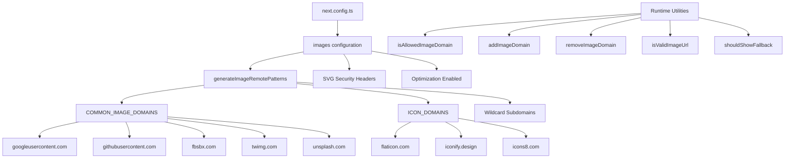

# Optymalizacja obrazu

## Przegląd

Szablon Ever Works konfiguruje optymalizację obrazu Next.js z dynamicznymi wzorcami zdalnymi, obsługą SVG i warstwą narzędziową do zarządzania domeną. System obsługuje obrazy od dostawców OAuth (Google, GitHub, Facebook, Twitter), serwisy zdjęć stockowych (Unsplash) i biblioteki ikon, jednocześnie wymuszając bezpieczeństwo nagłówków dla treści SVG.

## Architektura



## Pliki źródłowe

|Plik|Cel|
|------|---------|
|`template/next.config.ts`|Konfiguracja obrazu Next.js|
|`template/lib/utils/image-domains.ts`|Narzędzia do zarządzania domenami|

## Konfiguracja

### Ustawienia obrazu Next.js

```typescript
// next.config.ts
images: {
    remotePatterns: generateImageRemotePatterns(),
    dangerouslyAllowSVG: true,
    contentDispositionType: 'attachment',
    contentSecurityPolicy: "default-src 'self'; script-src 'none'; sandbox;",
    unoptimized: false,
},
```

|Ustawienie|Wartość|Cel|
|---------|-------|---------|
|`remotePatterns`|Dynamiczny poprzez `generateImageRemotePatterns()`|Dodaj do białej listy zewnętrzne domeny obrazów|
|`dangerouslyAllowSVG`|`true`|Zezwól na obrazy SVG przez optymalizator|
|`contentDispositionType`|`'attachment'`|Wymuś pobieranie zamiast renderowania wbudowanego w celu uzyskania surowego dostępu|
|`contentSecurityPolicy`|Ścisła piaskownica|Zapobiegaj atakom XSS opartym na SVG|
|`unoptimized`|`false`|Pozostaw włączoną optymalizację obrazu|

### Bezpieczeństwo SVG

Pliki SVG mogą zawierać osadzony JavaScript. Szablon łagodzi to za pomocą:
- **Polityka bezpieczeństwa treści**: `script-src 'none'; sandbox;` zapobiega wykonywaniu skryptów w plikach SVG
- **Rozporządzanie treścią**: `attachment` gwarantuje, że pliki SVG zostaną pobrane, a nie wykonane, w przypadku bezpośredniego dostępu

## Zdalne generowanie wzorców

Funkcja `generateImageRemotePatterns()` dynamicznie tworzy listę dozwolonych:

```typescript
export function generateImageRemotePatterns() {
    const patterns = [
        {
            protocol: 'https' as const,
            hostname: 'lh3.googleusercontent.com',
            pathname: '/a/**'
        },
        {
            protocol: 'https' as const,
            hostname: 'avatars.githubusercontent.com',
            pathname: '/u/**'
        },
        {
            protocol: 'https' as const,
            hostname: 'platform-lookaside.fbsbx.com',
            pathname: '/platform/**'
        },
        // ... more specific patterns
    ];

    // Add wildcard subdomain patterns
    [...COMMON_IMAGE_DOMAINS, ...ICON_DOMAINS].forEach((domain) => {
        patterns.push({
            protocol: 'https' as const,
            hostname: `*.${domain}`,
            pathname: '/**'
        });
    });

    return patterns;
}
```

### Dozwolone domeny

**Typowe domeny obrazów** (awatary OAuth, zdjęcia stockowe):

|Domena|Źródło|
|--------|--------|
|`lh3.googleusercontent.com`|Awatary Google OAuth|
|`avatars.githubusercontent.com`|Awatary GitHub OAuth|
|`platform-lookaside.fbsbx.com`|Awatary OAuth na Facebooku|
|`pbs.twimg.com`|Awatary na Twitterze/X|
|`images.unsplash.com`|Zdjęcia stockowe Unsplash|

**Domeny ikon** (ikony przedmiotów):

|Domena|Źródło|
|--------|--------|
|`flaticon.com`|Ikony Flaticonu|
|`iconify.design`|Ikonafikuj ikony|
|`icons8.com`|Ikony8 ikon|
|`feathericons.com`|Ikony piór|
|`heroicons.com`|Ikony bohaterów|
|`tabler-icons.io`|Ikony stołowe|

## Zarządzanie domeną w środowisku wykonawczym

### Sprawdzanie dozwolonych domen

```typescript
import { isAllowedImageDomain } from '@/lib/utils/image-domains';

// Returns true for whitelisted domains
isAllowedImageDomain('https://lh3.googleusercontent.com/a/photo.jpg'); // true
isAllowedImageDomain('https://cdn.flaticon.com/icons/svg/123.svg');    // true
isAllowedImageDomain('https://evil-site.com/image.jpg');               // false

// Relative URLs are always allowed
isAllowedImageDomain('/images/logo.png'); // true
```

### Dynamiczne dodawanie domeny

```typescript
import { addImageDomain, removeImageDomain } from '@/lib/utils/image-domains';

// Add a new domain at runtime
addImageDomain('cdn.example.com');

// Add as an icon domain
addImageDomain('my-icons.com', true);

// Remove a domain
removeImageDomain('old-cdn.com');
```

Uwaga: dodatki środowiska wykonawczego wpływają na funkcje narzędziowe, ale nie modyfikują zdalnych wzorców Next.js `next.config.ts` (te wymagają przebudowania).

### Weryfikacja adresu URL

```typescript
import { isValidImageUrl, isProblematicUrl, shouldShowFallback } from '@/lib/utils/image-domains';

// Check URL format validity
isValidImageUrl('https://example.com/photo.jpg'); // true
isValidImageUrl('/images/local.png');              // true (relative)
isValidImageUrl('not-a-url');                      // false

// Check for problematic URLs (non-image pages, redirect URLs)
isProblematicUrl('https://flaticon.com/icone-gratuite/search'); // true (not a direct image)
isProblematicUrl('https://cdn.flaticon.com/icon.svg');          // false (has image extension)

// Determine if fallback icon should be shown
shouldShowFallback('');                                          // true (empty)
shouldShowFallback('https://flaticon.com/icone-gratuite/123');   // true (problematic)
shouldShowFallback('https://cdn.flaticon.com/icon.svg');         // false
```

## Nagłówki zabezpieczeń

`next.config.ts` stosuje nagłówki zabezpieczeń do wszystkich tras:

```typescript
async headers() {
    return [{
        source: "/(.*)",
        headers: [
            { key: "X-Content-Type-Options", value: "nosniff" },
            { key: "X-Frame-Options", value: "DENY" },
            { key: "Referrer-Policy", value: "strict-origin-when-cross-origin" },
            { key: "X-DNS-Prefetch-Control", value: "on" },
            { key: "Strict-Transport-Security", value: "max-age=63072000; includeSubDomains; preload" },
            {
                key: "Content-Security-Policy",
                value: "default-src 'self'; script-src 'self' 'unsafe-inline' https://assets.lemonsqueezy.com; style-src 'self' 'unsafe-inline'; img-src 'self' data: https:; font-src 'self'; connect-src 'self' https:; frame-ancestors 'none';"
            },
        ],
    }];
},
```

Dyrektywa `img-src 'self' data: https:` dopuszcza obrazy z tego samego źródła, identyfikatorów URI danych i dowolnego źródła HTTPS. Jest to celowo dozwolone dla `img-src`, ponieważ komponent Next.js Image obsługuje weryfikację domeny na poziomie aplikacji.

## Najlepsze praktyki

1. **Użyj `next/image`** dla wszystkich obrazów zewnętrznych — obsługuje optymalizację, leniwe ładowanie i konwersję formatu
2. **Dodaj nowe domeny do `image-domains.ts`** -- nie wbudowane w `next.config.ts`
3. **Sprawdź `shouldShowFallback()`** przed renderowaniem — pokaż domyślną ikonę w przypadku nieprawidłowych/brakujących adresów URL
4. **Zachowaj nagłówki bezpieczeństwa SVG** — nigdy nie usuwaj ustawień `contentSecurityPolicy` lub `contentDispositionType`
5. **Preferuj ograniczenia nazw ścieżek** — jeśli to możliwe, używaj określonych wzorców `pathname` (np. `/a/**`) zamiast ogólnych symboli wieloznacznych
