# Przegląd narzędzi Lib

Katalog `template/lib/` to podstawowe narzędzie i warstwa logiki biznesowej szablonu Ever Works. Zawiera współdzielone moduły do ​​analityki, komunikacji API, uwierzytelniania, zadań w tle, buforowania, konfiguracji, dostępu do baz danych, płatności, narzędzi edytora, strażników i nie tylko. Cała logika niekomponentowa i nietrasowa funkcjonuje tutaj zgodnie z zasadą utrzymywania prezentacji komponentów i delegowania ciężkiej logiki do `lib/`.

## Mapa modułu

```mermaid
graph TD
    subgraph Core Infrastructure
        A[config/] --> B[config.ts / config-manager.ts]
        C[db/] --> D[drizzle.ts / queries/ / migrate.ts]
        E[cache-config.ts] --> F[cache-invalidation.ts]
    end

    subgraph Auth & Security
        G[auth/] --> H[NextAuth / Supabase / Guards / Caching]
        I[guards/] --> J[Plan Feature Access Control]
        K[permissions/] --> L[Role-Based Permissions]
    end

    subgraph API Layer
        M[api/] --> N[ApiClient / ServerClient / Error Handling]
    end

    subgraph Analytics & Tracking
        O[analytics/] --> P[PostHog + Sentry Singleton]
    end

    subgraph Background Processing
        Q[background-jobs/] --> R[Trigger.dev / Local / NoOp]
    end

    subgraph Content & Editor
        S[content.ts] --> T[Git CMS Content Loader]
        U[editor/] --> V[TipTap Rich Text Editor]
        W[lib.ts] --> X[Content Path / File Utilities]
    end

    subgraph Business Logic
        Y[services/] --> Z[20+ Domain Services]
        AA[repositories/] --> AB[Data Access Layer]
        AC[payment/] --> AD[Stripe / LemonSqueezy / Polar]
    end

    subgraph Shared Utilities
        AE[constants.ts + constants/]
        AF[utils.ts + utils/]
        AG[types.ts + types/]
        AH[validations/]
        AI[helpers.ts]
    end
```



## Struktura katalogów

|Katalog/plik|Opis|
|-----------------|-------------|
|`lib/analytics/`|PostHog + pojedynczy moduł analityczny Sentry ([docs](./analytics-module))|
|`lib/api/`|Klienci HTTP dla przeglądarki i serwera ([docs](./api-client-module))|
|`lib/auth/`|Uwierzytelnianie za pomocą NextAuth.js + Supabase ([docs](./auth-utilities-module))|
|`lib/background-jobs/`|Planowanie zadań za pomocą Trigger.dev / local / no-op ([docs](./background-jobs-module))|
|`lib/cache-config.ts`|TTL pamięci podręcznej i definicje tagów ([docs](./cache-invalidation-module))|
|`lib/cache-invalidation.ts`|Funkcje unieważniania pamięci podręcznej ([docs](./cache-invalidation-module))|
|`lib/config/`|Scentralizowana usługa konfiguracji ze schematami Zod|
|`lib/config.ts`|Konfiguracja witryny (`siteConfig`)|
|`lib/config-manager.ts`|Menedżer konfiguracji środowiska wykonawczego|
|`lib/constants.ts`|Baryłka stałych aplikacji ([docs](./constants-reference-module))|
|`lib/constants/`|Stałe specyficzne dla domeny (płatność, analityka)|
|`lib/content.ts`|Ładowanie i buforowanie treści CMS oparte na Git|
|`lib/db/`|Połączenie z bazą danych, migracje, inicjowanie, zapytania ([docs](./db-utilities-module))|
|`lib/editor/`|Komponenty i narzędzia edytora tekstu sformatowanego TipTap ([docs](./editor-utilities-module))|
|`lib/guards/`|Kontrola dostępu do funkcji oparta na planie ([docs](./guards-module))|
|`lib/helpers.ts`|Mapowanie kodu języka na kod kraju|
|`lib/lib.ts`|Rozdzielczość ścieżki zawartości, narzędzia systemu plików|
|`lib/logger.ts`|Narzędzie do rejestrowania strukturalnego|
|`lib/mail/`|Wysyłanie wiadomości e-mail z obsługą szablonów|
|`lib/mappers/`|Mapery transformacji danych|
|`lib/maps/`|Integracje dostawców map (Google Maps, Mapbox)|
|`lib/middleware/`|Narzędzia oprogramowania pośredniego Next.js|
|`lib/newsletter/`|Dostawcy subskrypcji biuletynu|
|`lib/paginate.ts`|Funkcja pomocnika paginacji|
|`lib/payment/`|Przetwarzanie płatności (Stripe, LemonSqueezy, Solidgate, Polar)|
|`lib/permissions/`|Definicje uprawnień oparte na rolach|
|`lib/query-client.ts`|Reaguj na konfigurację klienta Zapytanie|
|`lib/react-query-config.ts`|Domyślne opcje zapytania React|
|`lib/repositories/`|Warstwa dostępu do danych (wzorzec repozytorium)|
|`lib/repository.ts`|Operacje na repozytorium Git (klonowanie, ściąganie, synchronizacja)|
|`lib/seo/`|Metadane SEO i generatory danych strukturalnych|
|`lib/services/`|Usługi logiki biznesowej (ponad 20 usług domenowych)|
|`lib/stripe-helpers.ts`|Narzędzia specyficzne dla pasków|
|`lib/swagger/`|Adnotacje Swagger/OpenAPI|
|`lib/theme-color-manager.ts`|Dynamiczne zarządzanie kolorami motywu|
|`lib/theme-utils.ts`|Funkcje użytkowe motywu|
|`lib/themes.tsx`|Definicje tematów|
|`lib/types.ts`|Udostępnione definicje typów|
|`lib/types/`|Definicje typów specyficznych dla domeny|
|`lib/utils.ts`|Ogólne funkcje użytkowe|
|`lib/utils/`|Narzędzia specyficzne dla domeny (ponad 15 modułów)|
|`lib/validations/`|Schematy walidacji Zoda|

## Kluczowe moduły samodzielne

### `lib/helpers.ts` — Mapowanie kodów języków/krajów

```typescript
type LanguageCode = 'en' | 'fr' | 'es' | 'zh' | 'de' | 'ar' | ... ;

const LANGUAGE_COUNTRY_CODES: Record<LanguageCode, string>;
// { en: 'US', fr: 'FR', es: 'ES', zh: 'CN', ... }

const appLocales: string[];
// All supported locale codes

function getCountryCode(languageCode?: LanguageCode): string;
// 'en' -> 'US', 'fr' -> 'FR'
```

### `lib/lib.ts` — Ścieżka zawartości i system plików

Narzędzia przeznaczone wyłącznie dla serwera do zarządzania katalogami zawartości:

```typescript
function getContentPath(): string;
// Returns '.content' path (local) or '/tmp/.content' (Vercel runtime)

async function ensureContentAvailable(): Promise<string>;
// Ensures content is available, triggering Git clone if needed

async function fsExists(filepath: string): Promise<boolean>;
async function dirExists(dirpath: string): Promise<boolean>;
```

### `lib/paginate.ts` — Pomocnik przy paginacji

```typescript
function paginate<T>(items: T[], page: number, limit: number): T[];
```

### `lib/logger.ts` — Rejestrowanie strukturalne

```typescript
const logger = {
  info(message: string, context?: Record<string, any>): void;
  warn(message: string, context?: Record<string, any>): void;
  error(message: string, context?: Record<string, any>): void;
  debug(message: string, context?: Record<string, any>): void;
};
```

### `lib/color-generator.ts` -- Deterministyczne generowanie kolorów

Generuje spójne kolory z ciągów znaków (używane w przypadku awatarów, tagów itp.).

### `lib/theme-color-manager.ts` — Dynamiczne kolory motywu

Zarządza aktualizacjami właściwości niestandardowych CSS w celu przełączania motywów.

## Warstwa usług (`lib/services/`)

Katalog usług zawiera usługi logiki biznesowej zorganizowane według domeny:

|Serwis|Odpowiedzialność|
|---------|---------------|
|`analytics-background-processor.ts`|Przetwarzanie analiz w tle|
|`analytics-export.service.ts`|Eksport danych analitycznych|
|`analytics-scheduled-reports.service.ts`|Zaplanowane raporty analityczne|
|`category-file.service.ts`|Kategoria operacji na plikach|
|`category-git.service.ts`|Kategoria Operacje Git|
|`collection-git.service.ts`|Kolekcja operacji Git|
|`company.service.ts`|Zarządzanie profilem firmy|
|`currency-detection.service.ts`|Wykrywanie waluty użytkownika|
|`currency.service.ts`|Przeliczanie walut|
|`email-notification.service.ts`|Powiadomienia e-mailowe|
|`engagement.service.ts`|Wyświetl/zagłosuj/ulubione śledzenie|
|`file.service.ts`|Przesyłanie/zarządzanie plikami|
|`geocoding/`|Geokodowanie z dostawcami Google/Mapbox|
|`item-audit.service.ts`|Ścieżka audytu przedmiotu|
|`item-git.service.ts`|Operacje Git na elementach|
|`location/`|Indeksowanie i zarządzanie lokalizacjami|
|`moderation.service.ts`|Moderacja treści|
|`notification.service.ts`|Powiadomienia push|
|`posthog-api.service.ts`|API PostHog po stronie serwera|
|`role-db.service.ts`|Zarządzanie rolami|
|`settings.service.ts`|Ustawienia aplikacji|
|`sponsor-ad.service.ts`|Zarządzanie reklamami sponsorów|
|`stripe-products.service.ts`|Synchronizacja produktów Stripe|
|`subscription-jobs.ts`|Zadania w tle subskrypcji|
|`subscription.service.ts`|Cykl życia subskrypcji|
|`survey.service.ts`|Zarządzanie ankietami|
|`sync-service.ts`|Synchronizacja repozytorium Git|
|`tag-git.service.ts`|Oznacz operacje Git|
|`twenty-crm-*.ts`|Integracja Twenty CRM (5 plików)|
|`user-db.service.ts`|Operacje na bazie danych użytkowników|
|`webhook-subscription.service.ts`|Zarządzanie webhookami|

## Warstwa narzędzi (`lib/utils/`)

Moduły narzędziowe do konkretnych problemów:

|Moduł|Cel|
|--------|---------|
|`api-error.ts`|Klasa błędu interfejsu API|
|`bot-detection.ts`|Wykrywanie klienta użytkownika bota|
|`checkout-utils.ts`|Pomocnicy przy kasie płatniczej|
|`client-auth.ts`|Narzędzia uwierzytelniania po stronie klienta|
|`currency-format.ts`|Formatowanie waluty|
|`custom-navigation.ts`|Niestandardowa nawigacja routera|
|`database-check.ts`|Kontrola kondycji bazy danych|
|`email-validation.ts`|Weryfikacja formatu wiadomości e-mail|
|`error-handler.ts`|Globalna obsługa błędów|
|`featured-items.ts`|Wybór polecanego przedmiotu|
|`footer-utils.ts`|Narzędzia łączy w stopce|
|`image-domains.ts`|Dozwolone domeny obrazów|
|`pagination-validation.ts`|Walidacja parametrów paginacji|
|`payment-provider.ts`|Wykrywanie dostawcy płatności|
|`plan-expiration.utils.ts`|Obliczenia ważności planu|
|`rate-limit.ts`|Ograniczanie szybkości API|
|`request-body.ts`|Poproś o analizę treści|
|`server-url.ts`|Rozwiązywanie adresów URL serwera|
|`settings.ts`|Funkcje pomocnicze ustawień|
|`slug.ts`|Generowanie ślimaków URL|
|`url-cleaner.ts`|Oczyszczanie adresów URL|
|`url-filter-sync.ts`|Synchronizacja stanu filtra URL|

## Zasady projektowania

1. **Rozdzielenie Obaw** -- Logika biznesowa w `services/`, dostęp do danych w `repositories/` i `db/queries/`, prezentacja w `components/`.

2. **Bezpieczeństwo skryptów** — moduły używane przez skrypty migracji/inicjowania (takie jak `constants/payment.ts` i `db/config.ts`) unikają importowania kodu specyficznego dla Next.js.

3. **Leniwa inicjalizacja** — połączenia z bazami danych, klienci API i menedżerowie zadań używają wzorców singletonu z leniwą inicjalizacją, aby uniknąć błędów w czasie kompilacji.

4. **Import dynamiczny** — moduły specyficzne dla Node.js korzystają z importu dynamicznego w zadaniach w tle i podczas uwierzytelniania, aby zapobiec problemom z pakowaniem pakietów internetowych.

5. **Granica serwera/klienta** — Moduły wyłącznie serwerowe korzystają z pakietu `server-only`. Moduły bezpieczne dla klienta pozwalają uniknąć importu serwera. Dyrektywa `'use client'` jest używana oszczędnie.
