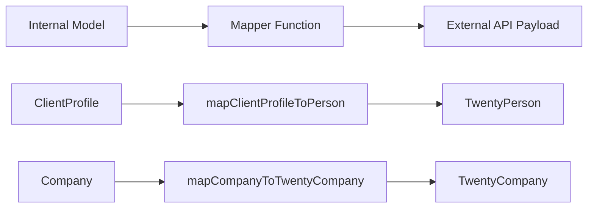

# Wzorce mapera

Szablon wykorzystuje funkcje czystego mapowania do przekształcania danych pomiędzy modelami wewnętrznymi i zewnętrznymi ładunkami API. Programy mapujące są wolne od skutków ubocznych, bezpieczne dla wartości null i sprawdzają wymagane pola przed transformacją.

## Przegląd architektury



## Pliki źródłowe

|Plik|Cel|
|------|---------|
|`lib/mappers/twenty-crm.mapper.ts`|Mapuje podmioty lokalne na ładunki API Twenty CRM|

## Zasady projektowania

Moduł mapujący przestrzega ścisłych konwencji programowania funkcjonalnego:

1. **Czyste funkcje** — żadnych skutków ubocznych, żadnych mutacji, żadnych wywołań baz danych
2. **Bezpieczne dla wartości null** — wszystkie pola opcjonalne korzystają z jawnych kontroli wartości null/niezdefiniowanej
3. **Walidacja przed mapowaniem** – wymagane pola są sprawdzane z błędami opisowymi
4. **Egzekwowanie zewnętrznego identyfikatora** – każdy zmapowany podmiot musi posiadać ważny `external_id`

## Zewnętrzna weryfikacja tożsamości

Każdy podmiot zmapowany do systemu zewnętrznego wymaga prawidłowego identyfikatora:

```typescript
export function ensureExternalId(id: string | undefined | null, entityType: string): string {
  if (!id || id.trim() === '') {
    throw new Error(`${entityType} ID is required for external_id mapping`);
  }
  return id.trim();
}
```

Ta funkcja jest wywoływana na początku każdego programu mapującego, aby zagwarantować, że pole `external_id` nigdy nie będzie puste.

## Ekstrakcja lokalizacji

Funkcja narzędziowa analizuje nazwy miast na podstawie ciągów lokalizacji w postaci dowolnego tekstu:

```typescript
export function extractCityFromLocation(location: string | undefined | null): string | null {
  if (!location || location.trim() === '') return null;
  const parts = location.split(',');
  const city = parts[0]?.trim();
  return city || null;
}
```

Obsługuje formaty takie jak `"San Francisco"`, `"San Francisco, CA"` i `"San Francisco, CA, USA"`.

## Profil klienta dla dwudziestu osób z CRM

Mapuje wewnętrzne rekordy `ClientProfile` na ładunek Twenty CRM `TwentyPerson`:

```typescript
export function mapClientProfileToPerson(clientProfile: ClientProfile): TwentyPerson {
  const external_id = ensureExternalId(clientProfile.id, 'ClientProfile');

  const person: TwentyPerson = {
    external_id,
    name: clientProfile.name,
    email: clientProfile.email,
  };

  // Optional field mapping (null-safe)
  if (clientProfile.phone)     person.phone = clientProfile.phone;
  if (clientProfile.jobTitle)  person.job_title = clientProfile.jobTitle;
  if (clientProfile.company)   person.company_name = clientProfile.company;
  if (clientProfile.website)   person.website = clientProfile.website;

  const city = extractCityFromLocation(clientProfile.location);
  if (city) person.city = city;

  // Custom fields
  if (clientProfile.accountType) person.account_type = clientProfile.accountType;
  if (clientProfile.plan)        person.plan = clientProfile.plan;
  if (clientProfile.totalSubmissions !== null && clientProfile.totalSubmissions !== undefined) {
    person.total_submissions = clientProfile.totalSubmissions;
  }

  return person;
}
```

### Tabela mapowania pól

|Pole ClientProfile|Pole dwudziestoosobowe|Wymagane|Notatki|
|--------------------|--------------------|----------|-------|
|`id`|`external_id`|Tak|Sprawdzone i przycięte|
|`name`|`name`|Tak|Mapowanie bezpośrednie|
|`email`|`email`|Tak|Mapowanie bezpośrednie|
|`phone`|`phone`|Nie|Tylko jeśli jest obecny|
|`jobTitle`|`job_title`|Nie|camelCase do Snake_case|
|`company`|`company_name`|Nie|Pole o zmienionej nazwie|
|`website`|`website`|Nie|Mapowanie bezpośrednie|
|`location`|`city`|Nie|Wyodrębnione przez `extractCityFromLocation`|
|`accountType`|`account_type`|Nie|Pole niestandardowe|
|`plan`|`plan`|Nie|Pole niestandardowe|
|`totalSubmissions`|`total_submissions`|Nie|Wymagane jest jawne sprawdzenie wartości null|

## Firma do Twenty CRM Company

Mapuje wewnętrzne podmioty `Company` na ładunek Twenty CRM `TwentyCompany`:

```typescript
export function mapCompanyToTwentyCompany(company: Company): TwentyCompany {
  const external_id = ensureExternalId(company.id, 'Company');

  const twentyCompany: TwentyCompany = {
    external_id,
    name: company.name,
  };

  if (company.domain)  twentyCompany.domain_name = company.domain;
  if (company.website) twentyCompany.website = company.website;
  if (company.status)  twentyCompany.status = company.status;

  return twentyCompany;
}
```

### Tabela mapowania pól

|Pole firmowe|Pole TwentyCompany|Wymagane|Notatki|
|--------------|---------------------|----------|-------|
|`id`|`external_id`|Tak|Sprawdzone i przycięte|
|`name`|`name`|Tak|Mapowanie bezpośrednie|
|`domain`|`domain_name`|Nie|Pole o zmienionej nazwie|
|`website`|`website`|Nie|Mapowanie bezpośrednie|
|`status`|`status`|Nie|`'active'` lub `'inactive'`|

## Dodawanie nowych maperów

Tworząc mapery dla nowych integracji kieruj się ustalonymi wzorcami:

```typescript
// 1. Always validate external_id first
const external_id = ensureExternalId(entity.id, 'EntityName');

// 2. Build the required fields object
const payload: ExternalType = {
  external_id,
  // ... required fields
};

// 3. Conditionally add optional fields (null-safe)
if (entity.optionalField) {
  payload.optional_field = entity.optionalField;
}

// 4. Return the payload -- never mutate the input
return payload;
```

## Rozważania dotyczące testowania

Ponieważ narzędzia mapujące są czystymi funkcjami, można je łatwo przetestować jednostkowo:

- Przetestuj z wypełnionymi wszystkimi opcjonalnymi polami
- Przetestuj ze wszystkimi opcjonalnymi polami, takimi jak `null` lub `undefined`
- Sprawdź, czy brakujące wymagane identyfikatory powodują błędy opisowe
- Przetestuj ekstrakcję lokalizacji przy użyciu różnych formatów ciągów
- Sprawdź, czy obiekt wejściowy nigdy nie jest zmutowany
