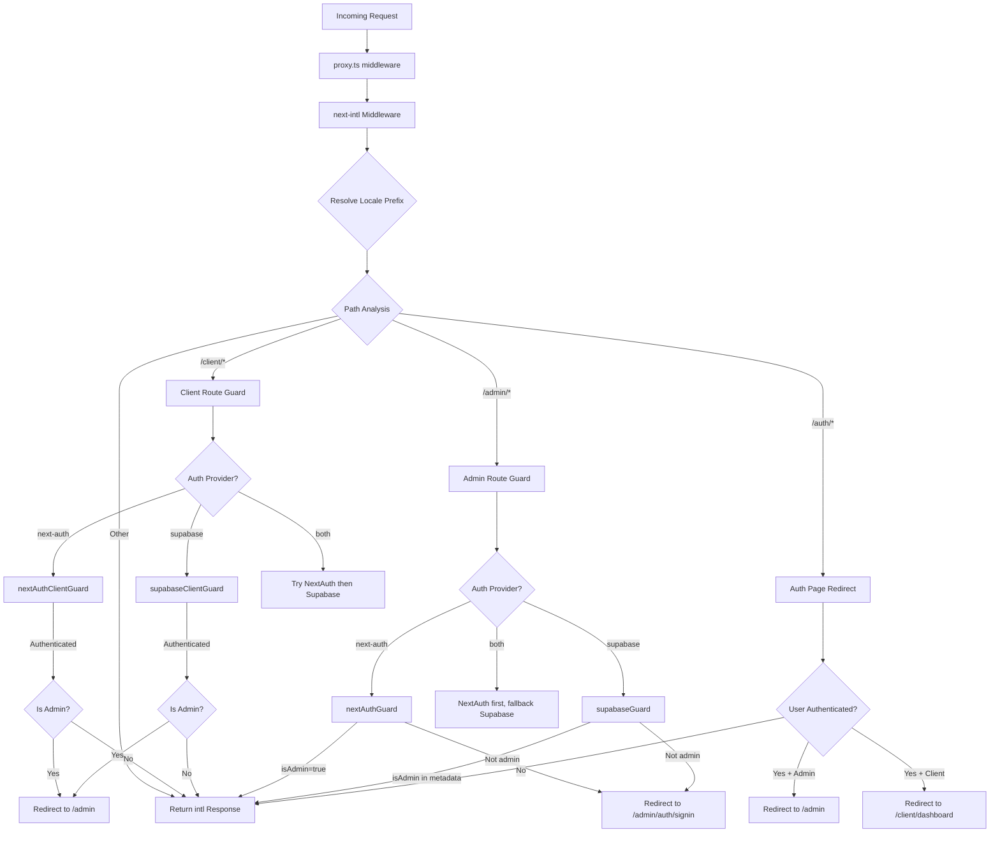

# Łańcuch oprogramowania pośredniego i przetwarzanie żądań

## Przegląd

Szablon Ever Works wykorzystuje **ujednoliconą architekturę oprogramowania pośredniego** zdefiniowaną w `proxy.ts` w katalogu głównym projektu. To oprogramowanie pośredniczące uwzględnia trzy krytyczne problemy dotyczące każdego przychodzącego żądania:

1. **Internacjonalizacja** — wykrywanie ustawień regionalnych, wstawianie prefiksów i routing za pośrednictwem `next-intl`
2. **Ochrona uwierzytelniania** – ochrona tras `/admin/*` i `/client/*` przy użyciu NextAuth, Supabase lub obu
3. **Przekierowanie oparte na rolach** – wysyłanie uwierzytelnionych użytkowników z publicznych stron autoryzacji i przekierowywanie administratorów/klientów do odpowiednich pulpitów nawigacyjnych

Projekt obsługuje model **wtykowego dostawcy uwierzytelniania**: oprogramowanie pośrednie odczytuje bieżący `AuthProviderType` (`'next-auth'`, `'supabase'` lub `'both'`) ze scentralizowanej konfiguracji uwierzytelniania i odpowiednio wybiera odpowiednie funkcje ochronne.

## Schemat architektury



## Pliki źródłowe

|Plik|Cel|
|------|---------|
|`template/proxy.ts`|Główny punkt wejścia oprogramowania pośredniego|
|`template/lib/auth/config.ts`|Konfiguracja dostawcy uwierzytelniania (`getAuthConfig()`)|
|`template/lib/auth/supabase/middleware.ts`|Pomocnik odświeżania sesji Supabase|
|`template/lib/auth/validate-callback-url.ts`|Bezpieczna konstrukcja adresu URL wywołania zwrotnego|
|`template/i18n/routing.ts`|Konfiguracja routingu lokalnego|

## Poproś o zamówienie przetwarzania

### Krok 1: Internacjonalizacja

Każde żądanie przechodzi najpierw przez oprogramowanie pośrednie `next-intl` utworzone za pomocą `createIntlMiddleware(routing)`:

```typescript
import createIntlMiddleware from 'next-intl/middleware';
import { routing } from './i18n/routing';

const intl = createIntlMiddleware(routing);
```

Obsługuje to wykrywanie ustawień regionalnych za pomocą nagłówka `Accept-Language`, preferencji plików cookie i prefiksu adresu URL. Konfiguracja routingu wykorzystuje `localePrefix: "as-needed"`, co oznacza, że ​​domyślne ustawienia regionalne (`en`) nie wymagają prefiksu adresu URL.

### Krok 2: Rozwiązanie regionalne

Pomocnik `resolveLocalePrefix` wyodrębnia informacje o ustawieniach regionalnych z nazwy ścieżki:

```typescript
function resolveLocalePrefix(pathname: string): {
    prefix: string;       // e.g., "/fr" or ""
    hasLocale: boolean;
    locale?: string;
    pathWithoutLocale: string;  // e.g., "/admin/items"
}
```

Jest to krytyczne, ponieważ całe późniejsze dopasowywanie ścieżki (np. sprawdzanie `/admin` lub `/client`) musi działać na ścieżce **bez** przedrostka ustawień regionalnych.

### Krok 3: Wybór strażnika na podstawie trasy

Oprogramowanie pośrednie ocenia `pathWithoutLocale`, aby określić, który łańcuch ochronny zastosować:

|Wzór ścieżki|Zastosowano osłonę|Cel|
|-------------|--------------|---------|
|`/client` lub `/client/*`|Strażnik autoryzacji klienta|Wymaga uwierzytelnienia; przekierowuje administratorów do `/admin`|
|`/admin/*` (z wyjątkiem `/admin/auth/signin`)|Strażnik autoryzacji administratora|Wymaga uwierzytelnienia + flagi `isAdmin`|
|`/auth/*`|Przekierowanie strony uwierzytelniania|Przekierowuje uwierzytelnionych użytkowników z dala od logowania/rejestracji|
|Wszystko inne|Żadnego strażnika|Przechodzi z odpowiedzią i18n|

### Krok 4: Weryfikacja uwierzytelnienia

#### NastępnyAuth Guard (oparty na JWT)

```typescript
const token = await getToken({ req, secret: process.env.AUTH_SECRET });
if (token?.isAdmin === true) {
    return baseRes; // Admin access granted
}
```

Strażnicy NextAuth używają `getToken()` z `next-auth/jwt` do odczytania tokena JWT z plików cookie. Jest to zgodne z Edge Runtime i nie wymaga przeszukiwania bazy danych.

#### Strażnik Supabase

```typescript
const supRes = await supabaseUpdate(req);
// Merge cookies...
const { data: { user } } = await supabase.auth.getUser();
const isAdmin = user?.user_metadata?.isAdmin === true
    || user?.user_metadata?.role === 'admin';
```

Strażnik Supabase najpierw odświeża sesję za pomocą `updateSession()`, a następnie sprawdza metadane użytkownika pod kątem flag administratora.

### Krok 5: Rozpowszechnianie plików cookie

Krytyczny szczegół implementacji: gdy strażnik generuje odpowiedź przekierowania, wszystkie pliki cookie z `intlResponse` muszą zostać propagowane:

```typescript
const redirectRes = NextResponse.redirect(url);
baseRes.cookies.getAll().forEach((c) => redirectRes.cookies.set(c));
return redirectRes;
```

Dzięki temu preferencje regionalne i pliki cookie sesji uwierzytelniania przetrwają przekierowania.

## Konfiguracja

### Wybór dostawcy uwierzytelniania

Dostawca autoryzacji jest określony przez `getAuthConfig()` w `lib/auth/config.ts`:

```typescript
export type AuthProviderType = 'supabase' | 'next-auth' | 'both';

export function getAuthConfig(): AuthConfig {
    // Priority 1: Global override via configureAuth()
    // Priority 2: Environment-based (detects Supabase env vars)
    // Priority 3: Default ('next-auth')
}
```

### Middleware Matcher

```typescript
export const config = {
    matcher: ['/((?!api|trpc|_next|_vercel|.*\\..*).*)']
};
```

To wyrażenie regularne wyklucza:
- Trasy `/api/*` (obsługiwane przez warstwę API Next.js)
- `/trpc/*` trasy
- `/_next/*` (wewnętrzne elementy Next.js)
- `/_vercel/*` (elementy wewnętrzne Vercel)
- Dowolna ścieżka z rozszerzeniem pliku (zasoby statyczne)

### Bezpieczeństwo adresu URL wywołania zwrotnego

Oprogramowanie pośrednie wykorzystuje `createSafeCallbackUrl()`, aby zapobiec atakom z otwartym przekierowaniem:

```typescript
export function createSafeCallbackUrl(pathname: string, search?: string): string {
    // Limits URL length to 2048 characters
    // Validates relative-only paths
}

export function isValidCallbackUrl(url: string | null): boolean {
    return url?.startsWith('/') && !url.startsWith('//');
}
```

## Tryb podwójnego dostawcy („oba”)

Kiedy `provider === 'both'`, oprogramowanie pośredniczące implementuje łańcuch awaryjny:

1. **Trasy klientów**: najpierw wypróbuj NextAuth; jeśli nie jest uwierzytelniony, spróbuj Supabase
2. **Trasy administracyjne**: najpierw wypróbuj NextAuth; jeśli generuje przekierowanie (odmowa), spróbuj Supabase
3. **Strony uwierzytelniające**: Najpierw sprawdź token NextAuth, a następnie sprawdź sesję Supabase

Umożliwia to organizacjom migrację między dostawcami uwierzytelniania bez zakłócania pracy istniejących użytkowników.

## Kluczowe szczegóły wdrożenia

### Zgodność środowiska wykonawczego Edge

Oprogramowanie pośrednie działa w środowisku wykonawczym Next.js Edge. Wszystkie kontrole uwierzytelniania korzystają z interfejsów API zgodnych z Edge:
- NextAuth: `getToken()` (oparty na JWT, nie wymaga bazy danych)
- Supabase: `createServerClient()` z sesją opartą na plikach cookie

### Rozwój a rejestrowanie produkcji

Rejestrowanie debugowania jest bramkowane za `NODE_ENV === 'development'`:

```typescript
if (process.env.NODE_ENV === 'development') {
    console.log('[Middleware] Admin access granted via token');
}
```

### Odświeżanie sesji Supabase

Pomocnik oprogramowania pośredniego Supabase (`updateSession`) jest wywoływany przed każdym sprawdzeniem autoryzacji, aby zapewnić odświeżenie tokenów:

```typescript
export async function updateSession(request: NextRequest) {
    const supabase = createServerClient(url, anonKey, {
        cookies: { getAll, setAll }
    });
    // IMPORTANT: DO NOT REMOVE auth.getUser()
    await supabase.auth.getUser();
    return supabaseResponse;
}
```

Komentarz w kodzie źródłowym podkreśla, że nie wolno usuwać `auth.getUser()` – uruchamia to cykl odświeżania tokena, który zapobiega przypadkowym wylogowaniom.
