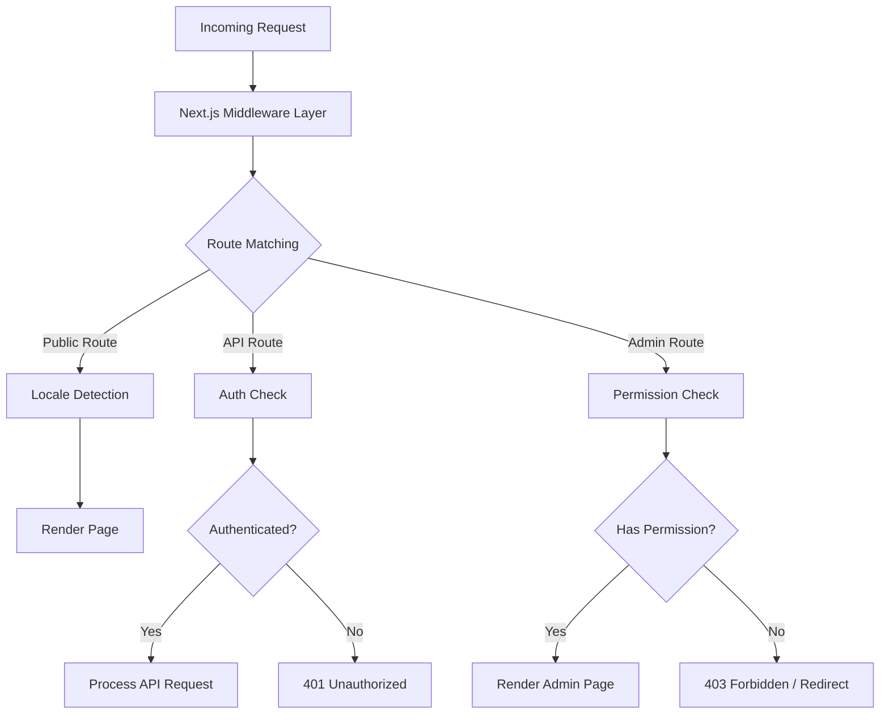
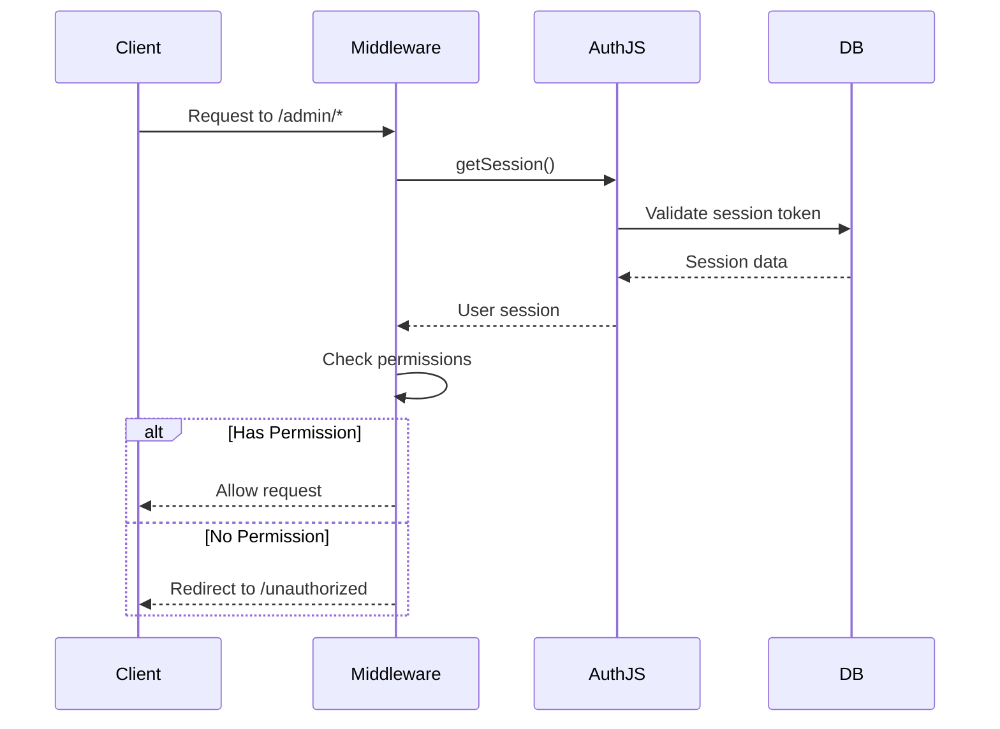
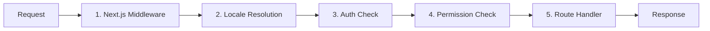

# Głębokie nurkowanie w oprogramowaniu pośrednim

Szablon Ever Works wykorzystuje warstwową architekturę oprogramowania pośredniego zbudowaną w oparciu o konwencje routera aplikacji Next.js i niestandardową logikę sprawdzania uprawnień. W tym dokumencie opisano pełny potok przetwarzania żądań, sprawdzanie uprawnień, oprogramowanie pośredniczące do uwierzytelniania, obsługę ustawień regionalnych i zamawianie oprogramowania pośredniczącego.

## Przegląd architektury



## Oprogramowanie pośredniczące sprawdzające uprawnienia

System sprawdzania uprawnień znajduje się w `lib/middleware/permission-check.ts` i zapewnia szczegółową kontrolę dostępu do tras API i stron administracyjnych.

### Podstawowy interfejs

```typescript
interface UserPermissions {
  userId: string;
  roles: string[];
  permissions: Permission[];
}
```

### Funkcje sprawdzania uprawnień

|Funkcja|Cel|Powroty|
|---|---|---|
|`hasPermission(user, permission)`|Sprawdź pojedyncze pozwolenie|`boolean`|
|`hasAnyPermission(user, permissions)`|Sprawdź, czy użytkownik ma przynajmniej jeden|`boolean`|
|`hasAllPermissions(user, permissions)`|Sprawdź, czy użytkownik umieścił wszystkie na liście|`boolean`|
|`hasResourcePermission(user, resource, action)`|Sprawdź format `resource:action`|`boolean`|
|`getResourcePermissions(user, resource)`|Uzyskaj wszystkie uprawnienia do zasobu|`Permission[]`|
|`canManageResource(user, resource)`|Sprawdź dostęp do tworzenia/aktualizowania/usuwania|`boolean`|
|`isSuperAdmin(user)`|Sprawdź rolę superadministratora lub wszystkie uprawnienia|`boolean`|

### Użycie w trasach API

```typescript
import { hasPermission, hasAnyPermission } from '@/lib/middleware/permission-check';

export async function GET(request: Request) {
  const userPermissions = await getUserPermissions(session);

  // Single permission check
  if (!hasPermission(userPermissions, 'items:read')) {
    return new Response('Forbidden', { status: 403 });
  }

  // Multiple permission check (any)
  if (!hasAnyPermission(userPermissions, ['items:review', 'items:approve'])) {
    return new Response('Forbidden', { status: 403 });
  }
}
```

### Kontrole na poziomie zasobów

```typescript
// Check specific resource and action
const canEdit = hasResourcePermission(userPermissions, 'items', 'update');

// Get all permissions for a resource
const itemPerms = getResourcePermissions(userPermissions, 'items');
// Returns: ['items:read', 'items:create', 'items:update']

// Check management capability (create, update, or delete)
const canManage = canManageResource(userPermissions, 'categories');
```

### Wyspecjalizowani pomocnicy ds. uprawnień

Oprogramowanie pośredniczące zapewnia pomoce specyficzne dla domeny, które łączą wiele kontroli uprawnień:

```typescript
// Can the user review, approve, or reject items?
const canReview = canReviewItems(userPermissions);

// Can the user manage users (read, create, update, delete, assignRoles)?
const canAdmin = canManageUsers(userPermissions);

// Can the user view analytics data?
const canView = canViewAnalytics(userPermissions);

// Is the user a super admin?
const isAdmin = isSuperAdmin(userPermissions);
```

### Wykrywanie superadministratora

Funkcja `isSuperAdmin` wykorzystuje podejście dwupoziomowe:

1. **Sprawdzanie roli** (podstawowe): Sprawdza, czy użytkownik ma rolę `super-admin`
2. **Sprawdzanie uprawnień** (awaryjne): sprawdza, czy użytkownik ma wszystkie uprawnienia systemowe

```typescript
function isSuperAdmin(userPermissions: UserPermissions): boolean {
  // Fast path: check role
  if (userPermissions.roles.includes('super-admin')) {
    return true;
  }
  // Exhaustive check: verify all permissions
  return hasAllPermissions(userPermissions, allSystemPermissions);
}
```

## Oprogramowanie pośredniczące do uwierzytelniania

Uwierzytelnianie odbywa się poprzez NextAuth.js (Auth.js v5) skonfigurowany w `auth.config.ts`. Oprogramowanie pośredniczące działa na każde żądanie do chronionych tras.

### Konfiguracja dostawcy

Konfiguracja uwierzytelniania dynamicznie konfiguruje dostawców OAuth z płynnym powrotem:

|Dostawca|Źródło konfiguracji|
|---|---|
|Google|`authConfig.google.clientId/clientSecret`|
|GitHub|`authConfig.github.clientId/clientSecret`|
|Facebooku|`authConfig.facebook.clientId/clientSecret`|
|Twitterze/X|`authConfig.twitter.clientId/clientSecret`|
|Poświadczenia|Zawsze włączone|

Jeśli konfiguracja protokołu OAuth nie powiedzie się, system powróci do uwierzytelniania opartego wyłącznie na poświadczeniach.

### Przebieg sesji uwierzytelniania



## Lokalne oprogramowanie pośredniczące

Szablon obsługuje ponad 20 ustawień regionalnych dzięki integracji oprogramowania pośredniego `next-intl`. Wykrywanie ustawień regionalnych odbywa się według wzorca prefiksów „w razie potrzeby”:

- Domyślne ustawienia regionalne (`en`): Brak prefiksu adresu URL -- `/items/my-app`
- Inne ustawienia regionalne: Prefiks ustawień regionalnych -- `/fr/items/my-app`

### Obsługiwane lokalizacje

|Lokalne|Język|Lokalne|Język|
|---|---|---|---|
|`en`|Angielski (domyślny)|`ja`|Japoński|
|`fr`|Francuski|`ko`|koreański|
|`es`|Hiszpański|`nl`|holenderski|
|`de`|niemiecki|`pl`|Polski|
|`zh`|chiński|`tr`|turecki|
|`ar`|Arabski|`vi`|wietnamski|
|`he`|hebrajski|`th`|Tajski|
|`ru`|Rosyjski|`hi`|hindi|
|`uk`|ukraiński|`id`|Indonezyjski|
|`pt`|portugalski|`bg`|bułgarski|
|`it`|włoski| | |

## Potok przetwarzania żądania

Kompletny potok przetwarzania żądań jest zgodny z następującą kolejnością:



### Kroki rurociągu

1. **Next.js Middleware** (`middleware.ts`): Uruchamia się przy każdym żądaniu pasującym do skonfigurowanych elementów dopasowujących. Obsługuje przekierowania, przepisywanie i wstrzykiwanie nagłówka.

2. **Rozdzielczość ustawień regionalnych**: Wykrywa preferowane ustawienia regionalne użytkownika na podstawie ścieżki adresu URL, nagłówka `Accept-Language` lub pliku cookie. Ustawia ustawienia regionalne dla kontekstu żądania.

3. **Sprawdzanie uwierzytelnienia**: Dla tras chronionych (`/admin/*`, `/dashboard/*`, `/api/admin/*`), sprawdza token sesji użytkownika.

4. **Sprawdzanie uprawnień**: Po uwierzytelnieniu sprawdza, czy użytkownik ma wymagane uprawnienia do określonego zasobu i działania.

5. **Proces obsługi trasy**: Rzeczywisty komponent strony lub moduł obsługi trasy API przetwarza żądanie.

### Gwarancje zamawiania oprogramowania pośredniego

System wymusza ścisłe uporządkowanie:

- Wykrywanie ustawień regionalnych zawsze działa jako pierwsze (wymagane w przypadku stron błędów)
- Kontrole uwierzytelniania są uruchamiane przed sprawdzeniem uprawnień (potrzebny jest użytkownik do sprawdzenia uprawnień)
- Kontrola uprawnień to ostatnia bramka przed osobami obsługującymi trasy
- Trasy API korzystają ze sprawdzania uprawnień na poziomie funkcji (a nie na poziomie oprogramowania pośredniego)

## Narzędzia do sprawdzania uprawnień

Oprogramowanie pośrednie zawiera pomocników sprawdzania poprawności do pracy z ciągami uprawnień:

```typescript
// Validate a permission string
validatePermission('items:read');     // true
validatePermission('invalid:perm');   // false

// Parse a permission into parts
parsePermission('items:update');
// Returns: { resource: 'items', action: 'update' }

// Get summary grouped by resource
getPermissionSummary(userPermissions);
// Returns: { items: ['read', 'create'], categories: ['read'] }
```

## Obsługa błędów

System oprogramowania pośredniczącego obsługuje błędy w każdej warstwie:

|Warstwa|Błąd|Odpowiedź|
|---|---|---|
|Lokalne|Nieprawidłowe ustawienia regionalne|Przekieruj do domyślnych ustawień regionalnych|
|Autoryt|Brak sesji|401 lub przekierowanie do logowania|
|Autoryt|Expired session|401 z podpowiedzią odświeżania|
|Pozwolenie|Brak pozwolenia|403 Zabronione|
|Pozwolenie|Nieprawidłowy ciąg uprawnień|Ostrzeżenie zarejestrowane, odmowa dostępu|

## Najlepsze praktyki

1. **Użyj najbardziej szczegółowego testu** — preferuj `hasPermission` z pojedynczym uprawnieniem zamiast `isSuperAdmin` w przypadku zwykłego bramkowania funkcji.

2. **Sprawdź uprawnienia w trasach API** – nie polegaj wyłącznie na oprogramowaniu pośrednim; zawsze sprawdzaj w procedurze obsługi trasy, aby zapewnić głęboką obronę.

3. **Użyj importu dynamicznego** w oprogramowaniu pośrednim, aby uniknąć łączenia modułów tylko dla serwera w środowisku wykonawczym brzegowym.

4. **Zapewnij szybkie sprawdzanie uprawnień** — wyszukiwanie zestawu uprawnień `O(1)` zapewnia minimalny narzut na żądanie.

5. ** Rejestruj błędy uprawnień** – użyj rejestrowania strukturalnego z identyfikatorem użytkownika i próbą uzyskania pozwolenia na potrzeby audytu bezpieczeństwa.
