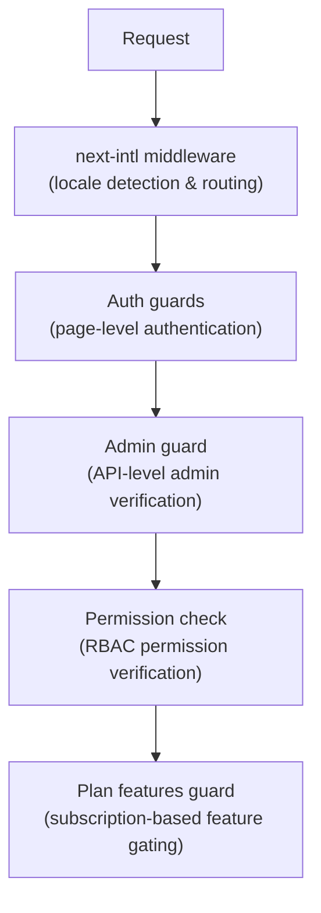

# Oprogramowanie pośrednie i osłony

Szablon Ever Works korzysta z warstwowego systemu ochrony składającego się z oprogramowania pośredniego Next.js do routingu, strażników uwierzytelniania do ochrony stron i interfejsów API, sprawdzania uprawnień dla RBAC oraz opartych na planach strażników funkcji do bramkowania subskrypcji.

## Warstwy oprogramowania pośredniego



## Lokalne oprogramowanie pośredniczące (next-intl)

Oprogramowanie pośrednie root obsługuje routing internacjonalizacji poprzez `next-intl`. Konfiguruje się go poprzez `i18n/routing.ts` i `i18n/request.ts`.

Obowiązki:
- Wykryj ustawienia regionalne użytkownika na podstawie ścieżki adresu URL, plików cookie lub nagłówka `Accept-Language`
- Przekieruj żądania bez prefiksu ustawień regionalnych do odpowiednich ustawień regionalnych
- Domyślnie angielski (`en`), jeśli nie wykryto żadnych preferencji
- Obsługa 6 lokalizacji: `en`, `fr`, `es`, `de`, `ar`, `zh`

## Strażnicy uwierzytelniania

### Strażnicy na poziomie strony (`lib/auth/guards.ts`)

Moduł strażników zapewnia kontrolę uwierzytelniania stron po stronie serwera. Są one wywoływane na górze komponentów serwera i służą do ochrony dostępu do strony.

**`requireAuth()`** — Wymaga uwierzytelnienia użytkownika:

```typescript
import { requireAuth } from '@/lib/auth/guards';

export default async function ProtectedPage() {
  const session = await requireAuth();
  // session.user is guaranteed to exist here
  return <div>Welcome {session.user.email}</div>;
}
```

Jeśli użytkownik nie zostanie uwierzytelniony, zostanie przekierowany na adres `/auth/signin`.

**`requireAdmin()`** — Wymaga uwierzytelnienia użytkownika ORAZ posiadania roli administratora:

```typescript
import { requireAdmin } from '@/lib/auth/guards';

export default async function AdminPage() {
  const session = await requireAdmin();
  return <div>Admin: {session.user.email}</div>;
}
```

Jeśli użytkownik nie zostanie uwierzytelniony, zostanie przekierowany na adres `/admin/auth/signin`. Jeśli są uwierzytelnieni, ale nie są administratorami, zostaną przekierowani do `/unauthorized`.

**`getSession()`** — Pobiera sesję bez przekierowania:

```typescript
const session = await getSession();
if (session) {
  // Authenticated
} else {
  // Guest
}
```

**`checkIsAdmin()`** -- Sprawdza status administratora bez przekierowywania:

```typescript
const isAdmin = await checkIsAdmin();
// Returns true or false
```

### Zatwierdzone działania (`lib/auth/guards.ts`)

Modułguards udostępnia również sprawdzone opakowania akcji dla akcji serwera Next.js:

**`validatedAction(schema, action)`** -- Sprawdza poprawność danych formularza względem schematu Zoda:

```typescript
export const myAction = validatedAction(mySchema, async (data, formData) => {
  // data is validated and typed
});
```

**`validatedActionWithUser(schema, action)`** -- Sprawdza i wymaga uwierzytelnienia:

```typescript
export const myAction = validatedActionWithUser(mySchema, async (data, formData, user) => {
  // data is validated, user is authenticated
});
```

## Strażnik Admina (`lib/auth/admin-guard.ts`)

Strażnik administratora zapewnia ochronę tras API specjalnie dla administracyjnych punktów końcowych.

**`checkAdminAuth()`** -- Funkcja oprogramowania pośredniczącego dla tras API:

```typescript
import { checkAdminAuth } from '@/lib/auth/admin-guard';

export async function GET(request: NextRequest) {
  const authError = await checkAdminAuth();
  if (authError) return authError;

  // User is verified admin, proceed with handler
}
```

Zwraca `null`, jeśli jest autoryzowany, lub `NextResponse` z odpowiednim statusem błędu (401 lub 403).

**`withAdminAuth(handler)`** -- Opakowanie funkcji wyższego rzędu:

```typescript
import { withAdminAuth } from '@/lib/auth/admin-guard';

export const GET = withAdminAuth(async (request) => {
  // Already verified as admin
  return NextResponse.json({ data: 'admin only' });
});
```

Strażnik administracyjny weryfikuje zarówno uwierzytelnienie (istnieje sesja), jak i autoryzację (użytkownik ma rolę administratora w bazie danych poprzez sprawdzenie `isAdmin()`).

## System sprawdzania uprawnień (`lib/middleware/permission-check.ts`)

System uprawnień implementuje kontrolę dostępu opartą na rolach (RBAC) z szczegółowymi uprawnieniami.

### Struktura uprawnień

Uprawnienia mają format `resource:action`:

```typescript
// Examples of permission keys
'items:read'
'items:create'
'items:update'
'items:delete'
'items:review'
'items:approve'
'items:reject'
'categories:read'
'categories:create'
'users:assignRoles'
'analytics:read'
'system:settings'
```

### Funkcje sprawdzania uprawnień

```typescript
import {
  hasPermission,
  hasAnyPermission,
  hasAllPermissions,
  hasResourcePermission,
  canManageResource,
  canReviewItems,
  canManageUsers,
  canManageRoles,
  canViewAnalytics,
  isSuperAdmin,
} from '@/lib/middleware/permission-check';

// Single permission check
hasPermission(userPermissions, 'items:create');

// Any of multiple permissions
hasAnyPermission(userPermissions, ['items:create', 'items:update']);

// All permissions required
hasAllPermissions(userPermissions, ['items:read', 'items:update']);

// Resource-level check
hasResourcePermission(userPermissions, 'items', 'create');

// Domain-specific helpers
canManageResource(userPermissions, 'categories'); // create, update, or delete
canReviewItems(userPermissions);                  // review, approve, or reject
canManageUsers(userPermissions);                  // user CRUD + assignRoles
isSuperAdmin(userPermissions);                    // all system permissions
```

### Wykrywanie superadministratora

Funkcja `isSuperAdmin()` sprawdza dwa warunki:
1. Czy użytkownik ma rolę `super-admin` (preferowana)
2. Jako rozwiązanie awaryjne sprawdza, czy użytkownik ma WSZYSTKIE uprawnienia systemowe

### Weryfikacja uprawnień

```typescript
// Validate a permission string is defined in the system
validatePermission('items:create'); // true
validatePermission('invalid:perm'); // false

// Parse permission into resource and action
parsePermission('items:create'); // { resource: 'items', action: 'create' }
```

## Funkcje planu Strażnik (`lib/guards/plan-features.guard.ts`)

Plan obejmuje funkcje kontroli strażnika w oparciu o plany subskrypcyjne (Bezpłatny, Standardowy, Premium).

### Hierarchia planu

```typescript
const PLAN_LEVELS = {
  free: 1,
  standard: 2,
  premium: 3,
};
```

### Macierz dostępu do funkcji

Każda funkcja jest przypisana do planów, które mają do niej dostęp:

|Funkcja|Bezpłatny|Standardowe|Premium|
|---------|------|----------|---------|
|Prześlij produkt|Tak|Tak|Tak|
|Prześlij obrazy|Tak|Tak|Tak|
|Wsparcie e-mailowe|Tak|Tak|Tak|
|Rozszerzony opis| - |Tak|Tak|
|Zweryfikowana odznaka| - |Tak|Tak|
|Przegląd priorytetowy| - |Tak|Tak|
|Zobacz statystyki| - |Tak|Tak|
|Prześlij wideo| - | - |Tak|
|Odznaka sponsorowana| - | - |Tak|
|Polecana strona główna| - | - |Tak|
|Zaawansowana analityka| - | - |Tak|
|Nieograniczona liczba zgłoszeń| - | - |Tak|

### Limity planu

Każdy plan ma ograniczenia liczbowe dla niektórych funkcji:

|Limit|Bezpłatny|Standardowe|Premium|
|-------|------|----------|---------|
|Maks. obrazy| 1 | 5 |Nieograniczony|
|Maksymalna liczba słów opisu| 200 | 500 |Nieograniczony|
|Maksymalna liczba zgłoszeń| 1 | 10 |Nieograniczony|
|Przejrzyj Dni| 7 | 3 | 1 |
|Dni bezpłatnych modyfikacji| 0 | 30 | 365 |

### Korzystanie z funkcji Plan Guard

**Bezpośrednie wywołania funkcji:**

```typescript
import { canAccessFeature, getFeatureLimit, isWithinLimit } from '@/lib/guards';

canAccessFeature('upload_video', 'free');    // false
canAccessFeature('upload_video', 'premium'); // true
getFeatureLimit('max_images', 'standard');   // 5
isWithinLimit('max_submissions', 3, 'free'); // false (limit is 1)
```

**Fabryka strażników (w przypadku wielokrotnych kontroli):**

```typescript
import { createPlanGuard } from '@/lib/guards';

const guard = createPlanGuard('standard');
guard.canAccess('verified_badge');     // true
guard.canAccess('upload_video');       // false
guard.getLimit('max_images');          // 5
guard.requireFeature('upload_video');  // throws PlanGuardError
```

**Integracja haka React:**

```typescript
import { createPlanGuardResult } from '@/lib/guards';

// In a hook or component
const guardResult = createPlanGuardResult(userPlan);
guardResult.canAccess('verified_badge');
guardResult.accessibleFeatures; // array of all accessible features
```

`PlanGuardError` wygenerowany przez `requireFeature()` zawiera nazwę funkcji, bieżący plan użytkownika i wymagany plan, umożliwiając wyświetlanie informacyjnych monitów o aktualizację w interfejsie użytkownika.
