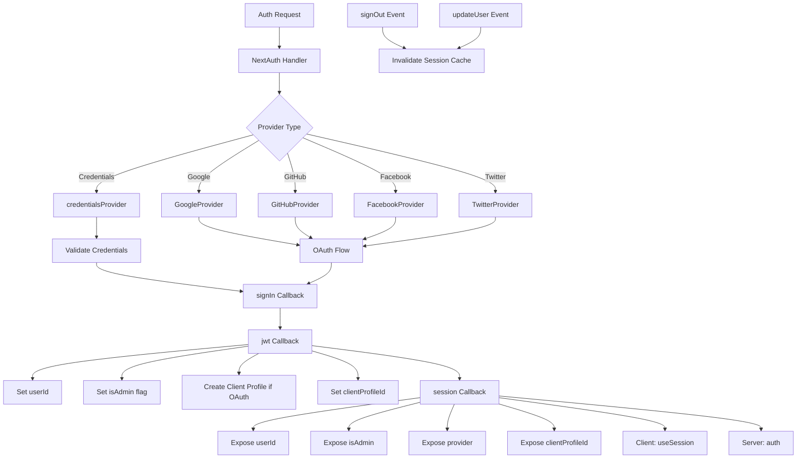

# Następna konfiguracja uwierzytelniania

## Przegląd

Szablon Ever Works konfiguruje plik NextAuth.js (Auth.js v5) z sesjami opartymi na JWT, adapterem Drizzle ORM, wieloma dostawcami OAuth (Google, GitHub, Facebook, Twitter), uwierzytelnianiem opartym na poświadczeniach i niestandardowymi wywołaniami zwrotnymi do zarządzania rolami administratora/klienta. System obsługuje automatyczne tworzenie profili klientów dla użytkowników OAuth oraz buforowanie sesji z unieważnianiem pamięci podręcznej.

## Architektura



## Pliki źródłowe

|Plik|Cel|
|------|---------|
|`template/lib/auth/index.ts`|Główna konfiguracja i eksport NextAuth|
|`template/auth.config.ts`|Konfiguracja dostawcy (kompatybilna z Edge)|
|`template/lib/auth/config.ts`|Wybór typu dostawcy uwierzytelniania|
|`template/lib/auth/providers.ts`|Funkcje fabryczne dostawcy OAuth|
|`template/lib/auth/credentials.ts`|Wdrożenie dostawcy poświadczeń|
|`template/lib/auth/guards.ts`|Narzędzia do ochrony autoryzacji po stronie serwera|
|`template/lib/auth/middleware.ts`|Sprawdzone opakowania akcji|
|`template/lib/auth/setup.ts`|Pomocnik inicjalizacji uwierzytelniania|
|`template/lib/auth/cached-session.ts`|Zarządzanie pamięcią podręczną sesji|
|`template/lib/auth/session-cache.ts`|Implementacja pamięci podręcznej sesji|
|`template/lib/auth/admin-guard.ts`|Logika strażnika specyficzna dla administratora|

## Dalej Inicjalizacja uwierzytelniania

```typescript
// lib/auth/index.ts
export const { handlers, auth, signIn, signOut, unstable_update } = NextAuth({
    adapter: drizzle,
    session: {
        strategy: 'jwt',
        maxAge: 30 * 24 * 60 * 60,    // 30 days
        updateAge: 24 * 60 * 60        // Refresh every 24 hours
    },
    jwt: {
        maxAge: 30 * 24 * 60 * 60      // 30 days
    },
    callbacks: { authorized, redirect, signIn, jwt, session },
    events: { signOut, updateUser },
    pages: {
        signIn: '/auth/signin',
        signOut: '/auth/signout',
        error: '/auth/error',
        verifyRequest: '/auth/verify-request',
        newUser: '/auth/register'
    },
    ...authConfig  // Merges providers from auth.config.ts
});
```

### Strategia sesji

Szablon wykorzystuje **sesje JWT** (`strategy: 'jwt'`), a nie sesje bazy danych. To oznacza:
- Sesje są przechowywane w zaszyfrowanych plikach cookie, a nie w bazie danych
- Do sprawdzenia sesji nie jest potrzebne żadne zapytanie do bazy danych
- Kompatybilny z Edge Runtime (oprogramowanie pośrednie)
- Dane sesji są ograniczone do tego, co mieści się w tokenie JWT

## Adapter bazy danych

```typescript
const isDatabaseAvailable = !!coreConfig.DATABASE_URL && typeof db !== 'undefined';

const drizzle = isDatabaseAvailable
    ? DrizzleAdapter(getDrizzleInstance(), {
        usersTable: users,
        accountsTable: accounts,
        sessionsTable: sessions,
        verificationTokensTable: verificationTokens
    })
    : undefined;
```

Adapter jest tworzony warunkowo na podstawie dostępności bazy danych. Dzięki temu szablon może zostać uruchomiony nawet bez bazy danych (np. podczas wstępnej konfiguracji), chociaż uwierzytelnianie będzie ograniczone.

## Konfiguracja dostawcy

### auth.config.ts (kompatybilny z Edge)

```typescript
// auth.config.ts
const configureProviders = () => {
    try {
        const oauthProviders = configureOAuthProviders();
        return createNextAuthProviders({
            google: oauthProviders.find((p) => p.id === 'google')
                ? { enabled: true, clientId: '...', clientSecret: '...' }
                : { enabled: false },
            github: { /* ... */ },
            facebook: { /* ... */ },
            twitter: { /* ... */ },
            credentials: { enabled: true },
        });
    } catch (error) {
        // Fallback to credentials only
        return createNextAuthProviders({
            credentials: { enabled: true },
            google: { enabled: false },
            github: { enabled: false },
            facebook: { enabled: false },
            twitter: { enabled: false },
        });
    }
};

export default {
    trustHost: true,
    providers: configureProviders(),
} satisfies NextAuthConfig;
```

### Fabryka Dostawców

```typescript
// lib/auth/providers.ts
export function createNextAuthProviders(config: OAuthProvidersConfig) {
    const providers = [];

    if (config.google?.enabled && config.google.clientId && config.google.clientSecret) {
        providers.push(GoogleProvider({
            clientId: config.google.clientId,
            clientSecret: config.google.clientSecret,
            ...config.google.options,
        }));
    }
    // GitHub, Facebook, Twitter follow the same pattern...

    if (config.credentials?.enabled) {
        providers.push(credentialsProvider);
    }

    return providers;
}
```

Dostawcy są dodawani tylko wtedy, gdy mają prawidłowe poświadczenia, co zapobiega błędom konfiguracji podczas uruchamiania.

## Oddzwonienia

### zaloguj się Oddzwanianie

```typescript
signIn: async ({ user, account, profile }) => {
    const isCredentials = account?.provider === 'credentials';

    if (!user?.email) {
        return !isCredentials; // Allow OAuth without email
    }

    if (!isDatabaseAvailable) {
        return !isCredentials; // Skip DB validation if no DB
    }

    // For OAuth providers, allow account linking
    if (!isCredentials && account?.provider) {
        return true;
    }

    return true;
}
```

### jwt Oddzwonienie

Wywołanie zwrotne JWT jest rdzeniem potoku uwierzytelniania. Działa na każde żądanie i zarządza:

```typescript
jwt: async ({ token, user, account }) => {
    // 1. Set userId from user object or token.sub
    if (user?.id) token.userId = user.id;
    if (!token.userId && token.sub) token.userId = token.sub;

    // 2. Set clientProfileId
    if (user?.clientProfileId) token.clientProfileId = user.clientProfileId;

    // 3. Record provider
    if (account?.provider) token.provider = account.provider;

    // 4. Auto-create client profile for OAuth users
    if (isOAuthProvider && !token.clientProfileId && token.userId) {
        let clientProfile = await getClientProfileByUserId(token.userId);
        if (!clientProfile) {
            clientProfile = await createClientProfile({
                userId: token.userId,
                email: token.email,
                name: token.name || token.email?.split('@')[0],
            });
        }
        token.clientProfileId = clientProfile?.id;
    }

    // 5. Set isAdmin flag
    if (user?.isClient !== undefined) {
        token.isAdmin = !user.isClient;
    } else if (user?.isAdmin !== undefined) {
        token.isAdmin = user.isAdmin;
    } else if (token.isAdmin === undefined) {
        token.isAdmin = false; // Default: non-admin
    }

    return token;
}
```

### Sesja wywołania zwrotnego

Mapuje pola tokenów JWT na obiekt sesji udostępniony komponentom klienta:

```typescript
session: async ({ session, token }) => {
    if (token && session.user) {
        session.user.id = token.userId;
        session.user.clientProfileId = token.clientProfileId;
        session.user.provider = token.provider || 'credentials';
        session.user.isAdmin = token.isAdmin;
    }
    return session;
}
```

## Wydarzenia

### Unieważnienie pamięci podręcznej sesji

```typescript
events: {
    signOut: async (event) => {
        const token = 'token' in event ? event.token : undefined;
        if (token?.userId) {
            await invalidateSessionCache(undefined, token.userId);
        }
    },
    updateUser: async ({ user }) => {
        if (user?.id) {
            await invalidateSessionCache(undefined, user.id);
        }
    }
}
```

Zarówno zdarzenia `signOut`, jak i `updateUser` powodują unieważnienie pamięci podręcznej sesji, zapewniając, że nieaktualne dane sesji nie będą udostępniane po zmianie stanu uwierzytelniania.

## Strażnicy po stronie serwera

### wymagaj autoryzacji

```typescript
export async function requireAuth() {
    const session = await auth();
    if (!session?.user) {
        redirect('/auth/signin');
    }
    return session;
}
```

### wymagaj administratora

```typescript
export async function requireAdmin() {
    const session = await auth();
    if (!session?.user) {
        redirect('/admin/auth/signin');
    }
    if (!session.user.isAdmin) {
        redirect('/unauthorized');
    }
    return session;
}
```

### Strażnicy Użyteczni

```typescript
// Check without redirecting
export async function getSession() {
    return await auth();
}

export async function checkIsAdmin() {
    const session = await auth();
    return session?.user?.isAdmin === true;
}
```

## Strony niestandardowe

|Strona|Ścieżka|Cel|
|------|------|---------|
|Zaloguj się|`/auth/signin`|Formularz logowania|
|Wyloguj się|`/auth/signout`|Potwierdzenie wylogowania|
|Błąd|`/auth/error`|Wyświetlanie błędu autoryzacji|
|Zweryfikuj żądanie|`/auth/verify-request`|Monit o weryfikację e-mailem|
|Zarejestruj się|`/auth/register`|Rejestracja nowego użytkownika|

## Zmienne środowiskowe

|Zmienna|Wymagane|Cel|
|----------|----------|---------|
|`AUTH_SECRET`|Tak|Sekret szyfrowania JWT|
|`AUTH_GOOGLE_ID`|Nie|Identyfikator klienta Google OAuth|
|`AUTH_GOOGLE_SECRET`|Nie|Sekret klienta Google OAuth|
|`AUTH_GITHUB_ID`|Nie|Identyfikator klienta GitHub OAuth|
|`AUTH_GITHUB_SECRET`|Nie|Sekret klienta GitHub OAuth|
|`AUTH_FACEBOOK_ID`|Nie|Identyfikator klienta Facebook OAuth|
|`AUTH_FACEBOOK_SECRET`|Nie|Sekret klienta Facebook OAuth|
|`AUTH_TWITTER_ID`|Nie|Identyfikator klienta Twitter/X OAuth|
|`AUTH_TWITTER_SECRET`|Nie|Sekret klienta Twitter/X OAuth|
|`DATABASE_URL`|Do adaptera|Parametry połączenia z bazą danych|

## Najlepsze praktyki

1. **Użyj strategii JWT**, aby zapewnić zgodność z Edge Runtime w oprogramowaniu pośrednim
2. **Automatycznie twórz profile klientów** dla użytkowników OAuth w wywołaniu zwrotnym JWT
3. **Łagodna degradacja** — jeśli konfiguracja OAuth nie powiedzie się, wróć tylko do poświadczeń
4. **Unieważnij pamięć podręczną w przypadku zdarzeń uwierzytelniania** — wylogowanie i aktualizacja użytkownika wyczyszczą sesje w pamięci podręcznej
5. **Adapter warunkowy** — umożliwia uruchomienie bez bazy danych do wstępnej konfiguracji
6. **Funkcje ochronne** — użyj `requireAuth()` / `requireAdmin()` w komponentach serwera, a nie ręcznej kontroli sesji
7. **Strony niestandardowe** — zastąp domyślne strony NextAuth, aby uzyskać spójny interfejs użytkownika z projektem szablonu
