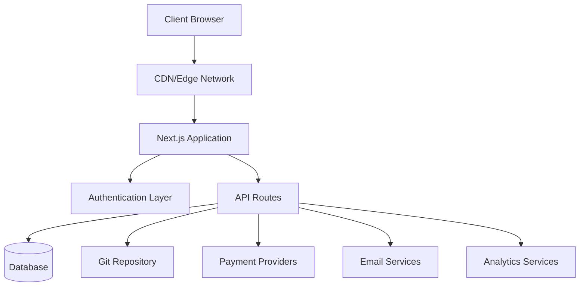
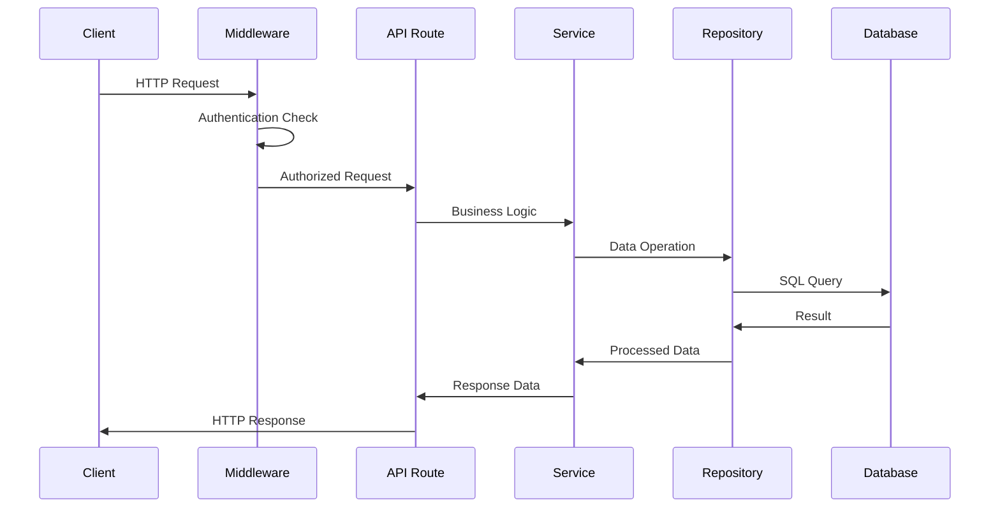
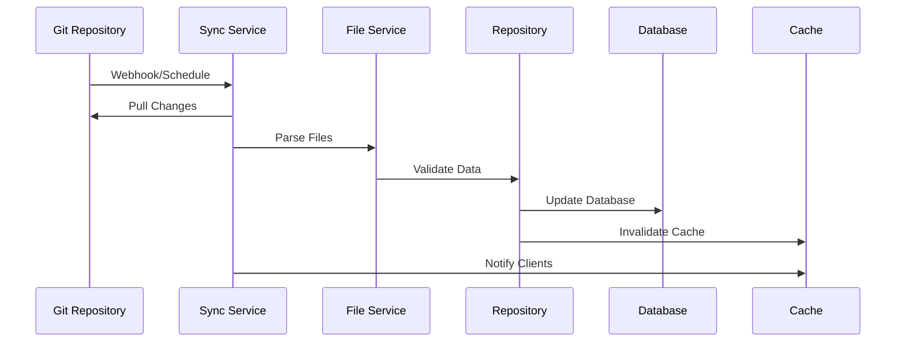
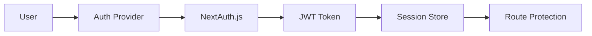

# Przegląd architektury

Ever Works opiera się na nowoczesnej, skalowalnej architekturze zaprojektowanej z myślą o wydajności, łatwości konserwacji i wygodzie programistów.

## Architektura wysokiego poziomu



## Podstawowe zasady

### 1. Oddzielenie obaw
- **Warstwa prezentacji**: Komponenty React i logika interfejsu użytkownika
- **Warstwa biznesowa**: Usługi i repozytoria
- **Warstwa danych**: Baza danych i zewnętrzne interfejsy API

### 2. Konstrukcja modułowa
- Organizacja oparta na funkcjach
- Komponenty wielokrotnego użytku
- Integracje przypominające wtyczki

### 3. Wpisz Bezpieczeństwo
- TypeScript w całym tekście
- Ścisłe sprawdzanie typu
- Walidacja środowiska wykonawczego za pomocą Zoda

### 4. Przede wszystkim wydajność
- Renderowanie po stronie serwera
- Generowanie statyczne, jeśli to możliwe
- Zoptymalizowane strategie buforowania

## Warstwy aplikacji

### Warstwa frontendowa

**Technologia**: React 19 + Next.js 15
**Obowiązki**:
- Renderowanie interfejsu użytkownika
- Zarządzanie stanem po stronie klienta
- Interakcje użytkowników
- Obsługa tras

**Kluczowe komponenty**:
- Elementy strony (`app/[locale]/`)
- Komponenty interfejsu użytkownika wielokrotnego użytku (`components/`)
- Niestandardowe haczyki (`hooks/`)
- Dostawcy kontekstu (`components/providers/`)

### Warstwa API

**Technologia**: Trasy API Next.js
**Obowiązki**:
- Wykonanie logiki biznesowej
- Walidacja danych
- Integracja usług zewnętrznych
- Obsługa uwierzytelniania

**Struktura**:
```
app/api/
├── auth/           # Authentication endpoints
├── admin/          # Admin-only endpoints
├── items/          # Item management
└── webhooks/       # External service webhooks
```

### Warstwa danych

**Technologie**: Drizzle ORM + PostgreSQL
**Obowiązki**:
- Trwałość danych
- Optymalizacja zapytań
- Zarządzanie transakcjami
- Migracje schematów

**Komponenty**:
- Schemat bazy danych (`lib/db/schema.ts`)
- Repozytoria (`lib/repositories/`)
- Pliki migracji (`lib/db/migrations/`)

### Warstwa treści

**Technologia**: CMS oparty na Git
**Obowiązki**:
- Synchronizacja treści
- Kontrola wersji
- Wspólna edycja
- Walidacja treści

**Struktura**:
```
.content/
├── config.yml      # Site configuration
├── items/          # Item definitions
├── categories/     # Category definitions
└── tags/           # Tag definitions
```

## Wzorce projektowe

### 1. Wzorzec repozytorium

Streszczenia logiki dostępu do danych:

```typescript
interface ItemRepository {
  findById(id: string): Promise<Item | null>;
  findBySlug(slug: string): Promise<Item | null>;
  findWithFilters(filters: ItemFilters): Promise<Item[]>;
  create(item: CreateItemRequest): Promise<Item>;
  update(id: string, updates: UpdateItemRequest): Promise<Item>;
  delete(id: string): Promise<void>;
}
```

### 2. Wzorzec warstwy usług

Hermetyzuje logikę biznesową:

```typescript
class ItemService {
  constructor(
    private itemRepository: ItemRepository,
    private gitService: GitService,
    private notificationService: NotificationService
  ) {}

  async submitItem(data: SubmitItemRequest): Promise<SubmissionResult> {
    // Business logic here
  }
}
```

### 3. Wzór fabryczny

Tworzy instancje usługi:

```typescript
class PaymentProviderFactory {
  static create(provider: PaymentProvider): PaymentService {
    switch (provider) {
      case 'stripe':
        return new StripePaymentService();
      case 'lemonsqueezy':
        return new LemonSqueezyPaymentService();
      default:
        throw new Error(`Unsupported provider: ${provider}`);
    }
  }
}
```

### 4. Wzorzec obserwatora

Aktualizacje oparte na zdarzeniach:

```typescript
class ContentSyncService {
  private observers: ContentObserver[] = [];

  addObserver(observer: ContentObserver): void {
    this.observers.push(observer);
  }

  notifyObservers(event: ContentEvent): void {
    this.observers.forEach(observer => observer.update(event));
  }
}
```

## Przepływ danych

### 1. Przepływ żądania



### 2. Przepływ synchronizacji treści



## Architektura bezpieczeństwa

### 1. Przebieg uwierzytelniania



### 2. Warstwy autoryzacji

- **Na poziomie trasy**: Ochrona oprogramowania pośredniczącego
- **Poziom API**: Strażnicy punktów końcowych
- **Na poziomie danych**: Bezpieczeństwo na poziomie wiersza
- **Poziom interfejsu użytkownika**: Kontrola dostępu oparta na komponentach

### 3. Środki bezpieczeństwa

- **Weryfikacja danych wejściowych**: Schematy ZOD
- **Wstrzykiwanie SQL**: Zapytania parametryczne
- **Ochrona XSS**: Odkażanie zawartości
- **Ochrona CSRF**: Weryfikacja tokena
- **Ograniczenie szybkości**: Ograniczanie żądań

## Strategia buforowania

### 1. Pamięć podręczna aplikacji

- **Zapytanie w reakcji**: pamięć podręczna danych po stronie klienta
- **Next.js Cache**: pamięć podręczna tras stron i API
- **Generowanie statyczne**: Wstępnie utworzone strony

### 2. Pamięć podręczna bazy danych

- **Łączenie połączeń**: Wydajne połączenia DB
- **Optymalizacja zapytań**: Zapytania indeksowane
- **Odczyt replik**: Rozproszone operacje odczytu

### 3. Pamięć podręczna CDN

- **Zasoby statyczne**: obrazy, CSS, JS
- **Odpowiedzi API**: Punkty końcowe z możliwością buforowania
- **Lokalizacja brzegowa**: dystrybucja globalna

## Rozważania dotyczące skalowalności

### 1. Skalowanie poziome

- **Projekt bezstanowy**: Brak sesji po stronie serwera
- **Skalowanie bazy danych**: Odczyt replik i fragmentowanie
- **Dystrybucja CDN**: Globalne buforowanie brzegowe

### 2. Optymalizacja wydajności

- **Podział kodu**: Import dynamiczny
- **Optymalizacja obrazu**: Komponent obrazu Next.js
- **Optymalizacja pakietu**: Potrząsanie drzewami i minifikacja

### 3. Monitorowanie i obserwowalność

- **Śledzenie błędów**: Integracja Sentry
- **Monitorowanie wydajności**: Podstawowe wskaźniki internetowe
- **Analiza**: Integracja z PostHog
- **Logowanie**: Rejestrowanie strukturalne

## Decyzje technologiczne

### Dlaczego Next.js?
- **Framework pełnego stosu**: trasy API + frontend
- **Wydajność**: SSR, SSG i ISR
- **Doświadczenie programisty**: Ładowanie na gorąco, obsługa TypeScript
- **Ekosystem**: Bogaty ekosystem wtyczek

### Dlaczego Drizzle ORM?
- **Bezpieczeństwo typów**: Pełna obsługa TypeScriptu
- **Wydajność**: Minimalne koszty ogólne
- **Elastyczność**: Surowy SQL w razie potrzeby
- **System migracji**: Zmiany schematu kontrolowane przez wersję

### Dlaczego CMS oparty na Git?
- **Kontrola wersji**: Pełne śledzenie historii
- **Współpraca**: Przepływ pracy z żądaniem ściągnięcia
- **Kopia zapasowa**: Dystrybucja naturalna
- **Elastyczność**: dowolny dostawca Git

### Dlaczego warto reagować na zapytania?
- **Buforowanie**: Inteligentne zarządzanie pamięcią podręczną
- **Synchronizacja**: aktualizacje w tle
- **Optymistyczne aktualizacje**: Lepszy UX
- **Obsługa błędów**: Logika ponów próbę

## Punkty rozszerzenia

Architektura zapewnia kilka punktów rozszerzeń:

### 1. Niestandardowi dostawcy uwierzytelniania
```typescript
// lib/auth/providers/custom-provider.ts
export function CustomProvider(options: CustomProviderOptions) {
  return {
    id: "custom",
    name: "Custom Provider",
    type: "oauth",
    // Implementation
  }
}
```

### 3. Integracja źródła treści
```typescript
// lib/content/sources/custom-source.ts
export class CustomContentSource implements ContentSource {
  async sync(): Promise<SyncResult> {
    // Implementation
  }
}
```

## Następne kroki

- [Przejrzyj szczegółowo stos technologii](./tech-stack).
