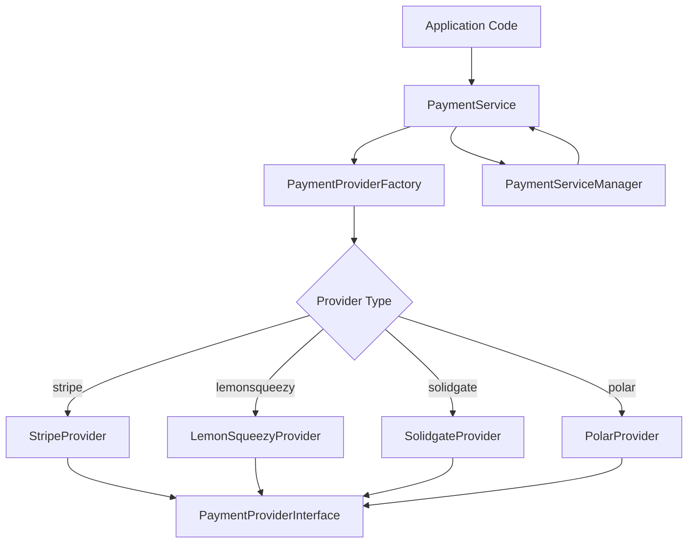
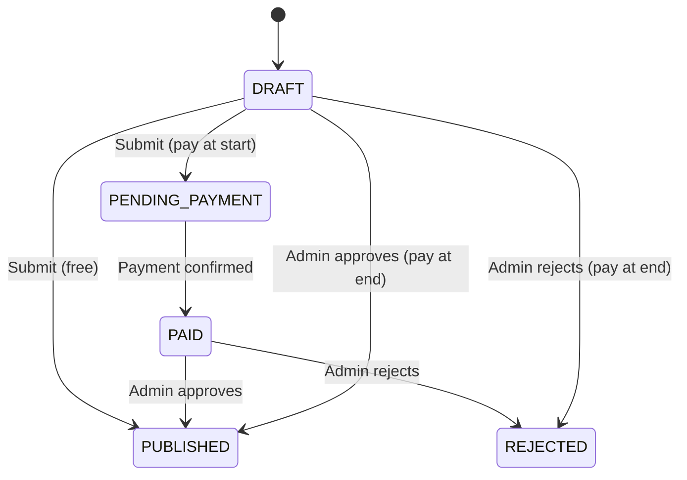

# Biblioteka płatności

Szablon implementuje system płatności wielu dostawców przy użyciu wzorców Factory i Strategy. Obsługuje Stripe, LemonSqueezy, Solidgate i Polar jako dostawców płatności, oferując ujednolicony interfejs płatności, subskrypcji, webhooków i zwrotów pieniędzy.

## Przegląd architektury



## Pliki źródłowe

|Plik|Cel|
|------|---------|
|`lib/payment/index.ts`|Eksport publicznych interfejsów API|
|`lib/payment/lib/payment-provider-factory.ts`|Fabryka do tworzenia instancji dostawców|
|`lib/payment/lib/payment-service.ts`|Ujednolicona fasada usług|
|`lib/payment/lib/payment-service-manager.ts`|Singleton menadżer cyklu życia usług|
|`lib/payment/types/payment-types.ts`|Podstawowe interfejsy i wyliczenia|
|`lib/payment/types/payment.ts`|Przepływ płatności i typy zgłoszeń|
|`lib/payment/config/`|Konfiguracja i weryfikacja dostawcy|
|`lib/payment/lib/providers/`|Indywidualne wdrożenia dostawców|
|`lib/payment/hooks/`|Reaguj na przepływy płatności po stronie klienta|
|`lib/payment/ui/`|Elementy formularza płatności|

## Podstawowe interfejsy

### Interfejs dostawcy płatności

Każdy dostawca wdraża ten kompleksowy interfejs:

```typescript
export interface PaymentProviderInterface {
  // Payment operations
  createPaymentIntent(params: CreatePaymentParams): Promise<PaymentIntent>;
  confirmPayment(paymentId: string, paymentMethodId: string): Promise<PaymentIntent>;
  verifyPayment(paymentId: string): Promise<PaymentVerificationResult>;
  createSetupIntent(user: User | null): Promise<SetupIntent>;

  // Subscription management
  createCustomer(params: CreateCustomerParams): Promise<CustomerResult>;
  createSubscription(params: CreateSubscriptionParams): Promise<SubscriptionInfo>;
  cancelSubscription(subscriptionId: string, cancelAtPeriodEnd?: boolean): Promise<SubscriptionInfo>;
  updateSubscription(params: UpdateSubscriptionParams): Promise<SubscriptionInfo>;
  hasCustomerId(user: User | null): boolean;
  getCustomerId(user: User | null): Promise<string | null>;

  // Webhooks and refunds
  handleWebhook(payload: any, signature: string, ...args: any[]): Promise<WebhookResult>;
  refundPayment(paymentId: string, amount?: number): Promise<any>;

  // Client configuration and UI
  getClientConfig(): ClientConfig;
  getUIComponents(): UIComponents;
}
```

### Fabryka dostawcy płatności

Tworzy instancje dostawcy w oparciu o konfigurację:

```typescript
export type SupportedProvider = 'stripe' | 'solidgate' | 'lemonsqueezy' | 'polar';

export class PaymentProviderFactory {
  static createProvider(
    providerType: SupportedProvider,
    config: PaymentProviderConfig
  ): PaymentProviderInterface {
    switch (providerType) {
      case 'stripe':       return new StripeProvider(config);
      case 'solidgate':    return new SolidgateProvider(config);
      case 'lemonsqueezy': return new LemonSqueezyProvider(config);
      case 'polar':        return new PolarProvider(config);
      default:             throw new Error(`Unsupported payment provider: ${providerType}`);
    }
  }
}
```

## Usługa płatności

Klasa `PaymentService` zapewnia ujednoliconą fasadę wszystkich operacji dostawcy:

```typescript
export class PaymentService {
  private provider: PaymentProviderInterface;

  constructor(config: PaymentServiceConfig) {
    this.provider = PaymentProviderFactory.createProvider(config.provider, config.config);
  }

  // All methods delegate to the underlying provider
  async createPaymentIntent(params: CreatePaymentParams): Promise<PaymentIntent> {
    return this.provider.createPaymentIntent(params);
  }

  async createSubscription(params: CreateSubscriptionParams): Promise<SubscriptionInfo> {
    return this.provider.createSubscription(params);
  }

  // ... additional delegated methods
}
```

## Typy danych

### Wyliczenia płatności

```typescript
export enum PaymentType {
  ONE_TIME = 'one_time',
  SUBSCRIPTION = 'subscription',
  FREE = 'free',
}

export enum SubscriptionStatus {
  INCOMPLETE = 'incomplete',
  INCOMPLETE_EXPIRED = 'incomplete_expired',
  TRIALING = 'trialing',
  ACTIVE = 'active',
  PAST_DUE = 'past_due',
  CANCELED = 'canceled',
  UNPAID = 'unpaid',
}

export enum PaymentFlow {
  PAY_AT_START = "pay_at_start",
  PAY_AT_END = "pay_at_end",
}
```

### Zdarzenia webhooka

```typescript
export enum WebhookEventType {
  PAYMENT_SUCCEEDED = 'payment_succeeded',
  PAYMENT_FAILED = 'payment_failed',
  SUBSCRIPTION_CREATED = 'subscription_created',
  SUBSCRIPTION_UPDATED = 'subscription_updated',
  SUBSCRIPTION_CANCELLED = 'subscription_cancelled',
  INVOICE_PAID = 'invoice_paid',
  REFUND_CREATED = 'refund_created',
  // ... additional event types
}
```

### Kluczowe struktury danych

|Wpisz|Cel|
|------|---------|
|`PaymentIntent`|Sesja płatnicza z identyfikatorem, kwotą, walutą, statusem, tajemnicą klienta|
|`SubscriptionInfo`|Szczegóły subskrypcji ze statusem, końcem okresu i informacjami o wersji próbnej|
|`CustomerResult`|Utworzono klienta z identyfikatorem, adresem e-mail i imieniem|
|`WebhookResult`|Przetworzony webhook z typem, identyfikatorem i danymi|
|`ClientConfig`|Konfiguracja bezpieczna dla frontonu z kluczem publicznym i typem bramy|
|`UIComponents`|Komponenty React i zasoby wizualne dla dostawcy|

## Narzędzia walutowe

Biblioteka zawiera funkcje pomocnicze do formatowania waluty:

```typescript
// Format cents to display currency
export function formatCentsToCurrency(
  cents: number, currency: string = 'USD', locale: string = 'en-US'
): string {
  const amount = cents / 100;
  return new Intl.NumberFormat(locale, {
    style: 'currency', currency,
    minimumFractionDigits: 2, maximumFractionDigits: 2,
  }).format(amount);
}

// Convert between cents and decimal
export function convertCentsToDecimal(cents: number): number;
export function convertDecimalToCents(decimal: number): number;

// Convert timestamps to Date objects
export function convertNumberToDate(timestamp?: number): Date | null;
export function safeTimestampToDate(timestamp: number | null | undefined): Date | undefined;
```

## Typy przepływu płatności

System obsługuje dwa strumienie płatności składanych:

|Przepływ|Enum|Opis|
|------|------|-------------|
|Zapłać na starcie|`PAY_AT_START`|Wymagana płatność przed sprawdzeniem zgłoszenia|
|Zapłać na końcu|`PAY_AT_END`|Płatność pobierana po zatwierdzeniu przez administratora|

### Cykl życia statusu zgłoszenia



## Interfejs komponentów interfejsu użytkownika

Każdy dostawca udostępnia komponenty interfejsu użytkownika do integracji frontendu:

```typescript
export interface UIComponents {
  PaymentForm: React.ComponentType<PaymentFormProps>;
  logo: string;
  cardBrands: CardBrandIcon[];
  supportedPaymentMethods: string[];
  translations: Record<string, Record<string, string>>;
}
```

## Integracja po stronie klienta

Hak `usePayment` i kontekst `PaymentProvider` zapewniają integrację z Reactem:

```typescript
import { usePayment, PaymentProvider } from '@/lib/payment';

// Wrap your app with the payment provider
<PaymentProvider>
  <PaymentForm
    amount={2999}
    currency="usd"
    isSubscription={false}
    onSuccess={(paymentId) => console.log('Paid:', paymentId)}
    onError={(error) => console.error('Failed:', error)}
  />
</PaymentProvider>
```

## Konfiguracja dostawcy

```typescript
export interface PaymentProviderConfig {
  apiKey: string;
  webhookSecret?: string;
  secretKey?: string;
  options?: Record<string, any>;
}
```

Każdy dostawca wymaga co najmniej `apiKey`. Stripe i Solidgate używają również `webhookSecret` do weryfikacji podpisu webhooka.
