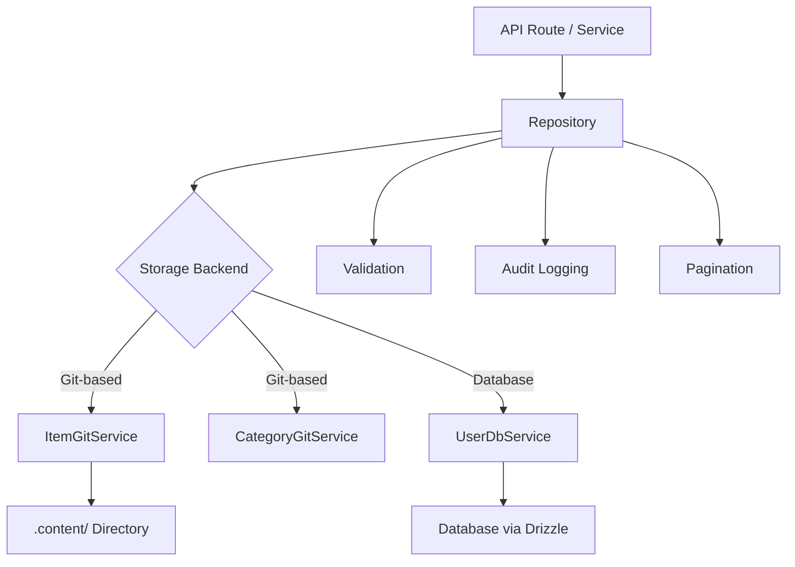

# Wzorce repozytorium

Szablon implementuje wzorzec Repozytorium, aby zapewnić czystą warstwę dostępu do danych pomiędzy logiką biznesową a magazynem danych. Repozytoria obejmują tworzenie zapytań, sprawdzanie poprawności, paginację i rejestrowanie inspekcji, jednocześnie delegując rzeczywistą pamięć do podstawowych usług (opartych na Git lub bazach danych).

## Przegląd architektury



## Pliki źródłowe

|Plik|Cel|
|------|---------|
|`lib/repositories/item.repository.ts`|Element CRUD z przechowywaniem, filtrowaniem i audytem Git|
|`lib/repositories/category.repository.ts`|Zarządzanie kategoriami za pomocą pamięci Git|
|`lib/repositories/user.repository.ts`|Operacje użytkownika na magazynie bazy danych|
|`lib/repositories/tag.repository.ts`|Zarządzanie tagami|
|`lib/repositories/role.repository.ts`|Zarządzanie rolami|
|`lib/repositories/collection.repository.ts`|Zarządzanie zbiorami|
|`lib/repositories/sponsor-ad.repository.ts`|Zarządzanie reklamami sponsorów|
|`lib/repositories/client-item.repository.ts`|Operacje na elementach skierowane do klienta|
|`lib/repositories/client-dashboard.repository.ts`|Dane panelu klienta|
|`lib/repositories/admin-stats.repository.ts`|Statystyki administratora|
|`lib/repositories/admin-analytics-optimized.repository.ts`|Zoptymalizowane zapytania analityczne|
|`lib/repositories/integration-mapping.repository.ts`|Mapowania integracji zewnętrznej|
|`lib/repositories/twenty-crm-config.repository.ts`|Dwadzieścia konfiguracji CRM|

## Typowe metody repozytorium

Wszystkie repozytoria mają spójną powierzchnię API:

|Metoda|Opis|
|--------|-------------|
|`findAll(options?)`|Pobierz wszystkie rekordy z opcjonalnym filtrowaniem|
|`findAllPaginated(page, limit, options?)`|Pobieranie stronicowane|
|`findById(id)`|Znajdź pojedynczy rekord według identyfikatora|
|`findBySlug(slug)`|Znajdź pojedynczy rekord według ślimaka|
|`create(data)`|Utwórz nowy rekord z walidacją|
|`update(id, data)`|Zaktualizuj istniejący rekord za pomocą walidacji|
|`delete(id)`|Twarde usunięcie rekordu|
|`getStats()`|Uzyskaj zbiorcze statystyki|

## Repozytorium przedmiotów

Najbardziej wszechstronne repozytorium, demonstrujące wszystkie kluczowe wzorce.

### Leniwa inicjalizacja usługi

Usługa Git jest inicjowana leniwie przy pierwszym użyciu:

```typescript
export class ItemRepository {
  private gitService: ItemGitService | null = null;

  private async getGitService(): Promise<ItemGitService> {
    if (!this.gitService) {
      const dataRepo = coreConfig.content.dataRepository;
      const token = coreConfig.content.ghToken;
      // Parse GitHub URL, create service config
      this.gitService = await createItemGitService(config);
    }
    return this.gitService;
  }
}
```

### Filtrowanie

Metoda `findAll` obsługuje filtrowanie wielokryterialne z logiką OR dla tablic:

```typescript
async findAll(options: ItemListOptions = {}): Promise<ItemData[]> {
  const items = await gitService.readItems(options.includeDeleted ?? false);
  let filteredItems = items;

  if (options.status)
    filteredItems = filteredItems.filter(item => item.status === options.status);

  if (options.categories?.length > 0)
    filteredItems = filteredItems.filter(item => {
      const itemCategories = Array.isArray(item.category) ? item.category : [item.category];
      return options.categories!.some(cat => itemCategories.includes(cat));
    });

  if (options.tags?.length > 0)
    filteredItems = filteredItems.filter(item =>
      options.tags!.some(tag => item.tags.includes(tag))
    );

  if (options.search) {
    const searchLower = options.search.toLowerCase();
    filteredItems = filteredItems.filter(item =>
      item.name.toLowerCase().includes(searchLower) ||
      item.description.toLowerCase().includes(searchLower)
    );
  }

  return filteredItems;
}
```

### Paginacja

```typescript
async findAllPaginated(page = 1, limit = 10, options = {}): Promise<{
  items: ItemData[];
  total: number;
  page: number;
  limit: number;
  totalPages: number;
}> {
  return await gitService.getItemsPaginated(page, limit, options);
}
```

### Rejestrowanie audytu

Wszystkie operacje mutowania są rejestrowane w ścieżce audytu (najlepiej, bez blokowania):

```typescript
async create(data: CreateItemRequest, auditUser?: AuditUser): Promise<ItemData> {
  this.validateCreateData(data);
  const item = await gitService.createItem(data);

  try {
    await itemAuditService.logCreation(item, auditUser);
  } catch (err) {
    console.warn('Audit logCreation failed:', err);
  }

  return item;
}
```

Przechwycone zdarzenia audytu:

|Operacja|Metoda audytu|Przechwycone dane|
|-----------|-------------|---------------|
|Utwórz|`logCreation`|Nowy przedmiot, użytkownik|
|Aktualizacja|`logUpdate`|Poprzedni stan, nowy stan, użytkownik|
|Recenzja|`logReview`|Przedmiot, poprzedni status, notatki, użytkownik|
|Usuń|`logDeletion`|Przedmiot, użytkownik, flaga miękka/twarda|
|Przywróć|`logRestoration`|Rzecz, użytkownik|

### Operacje wsadowe

Metoda `batchUpdate` optymalizuje wiele aktualizacji za pomocą jednego zatwierdzenia Git:

```typescript
async batchUpdate(updates: Array<{ id: string; data: UpdateItemRequest }>): Promise<ItemData[]> {
  // Pre-validate ALL updates before writing
  for (const { id, data } of updates) {
    this.validateUpdateData(id, data);
  }

  // Write each update without committing
  for (const { id, data } of updates) {
    await gitService.updateItemWithoutCommit(id, data);
  }

  // Single commit for all changes
  await gitService.commitAndPushBatch(`Batch update ${updates.length} items`);

  // Audit logging after successful commit
  for (const entry of auditEntries) {
    await itemAuditService.logUpdate(entry.previous, entry.updated, auditUser);
  }
}
```

### Walidacja

Repozytoria sprawdzają poprawność danych wejściowych przed operacjami przechowywania:

```typescript
private validateCreateData(data: CreateItemRequest): void {
  if (!data.id?.trim())          throw new Error('Item ID is required');
  if (!data.name?.trim())        throw new Error('Item name is required');
  if (!data.slug?.trim())        throw new Error('Item slug is required');
  if (!data.description?.trim()) throw new Error('Item description is required');
  if (!data.source_url?.trim())  throw new Error('Item source URL is required');

  if (!/^[a-z0-9-]+$/.test(data.slug))
    throw new Error('Slug must contain only lowercase letters, numbers, and hyphens');

  try { new URL(data.source_url); }
  catch { throw new Error('Invalid source URL format'); }
}
```

### Miękkie usuwanie i przywracanie

```typescript
async softDelete(id: string): Promise<ItemData> {
  return await gitService.softDeleteItem(id);
}

async restore(id: string): Promise<ItemData> {
  return await gitService.restoreItem(id);
}
```

## KategoriaRepozytorium

Demonstruje wzór singletonu i sprawdzanie duplikatów:

```typescript
export class CategoryRepository {
  // Duplicate name checking (case-insensitive, excludes self for updates)
  private async checkDuplicateName(name: string, excludeId?: string): Promise<void> {
    const categories = await gitService.readCategories();
    const duplicate = categories.find(cat =>
      cat.name.toLowerCase() === name.toLowerCase() && cat.id !== excludeId
    );
    if (duplicate) throw new Error(`Category with name "${name}" already exists`);
  }

  // Sorting
  private sortCategories(categories, options): CategoryData[] {
    return categories.sort((a, b) => {
      const comparison = a.name.localeCompare(b.name);
      return options.sortOrder === 'desc' ? -comparison : comparison;
    });
  }
}

// Singleton export
export const categoryRepository = new CategoryRepository();
```

## Repozytorium użytkowników

Korzysta z pamięci masowej opartej na bazie danych poprzez `UserDbService` z walidacją Zod:

```typescript
export class UserRepository {
  private userDbService: UserDbService;

  async create(data: CreateUserRequest): Promise<AuthUserData> {
    // Zod schema validation
    const validatedData = userValidationSchema
      .pick({ email: true, password: true })
      .parse(data);

    // Uniqueness check
    const exists = await this.userDbService.emailExists(validatedData.email);
    if (exists) throw new Error('Email already in use');

    return await this.userDbService.createUser(validatedData);
  }
}
```

## Strategia obsługi błędów

Repozytoria działają według spójnego wzorca obsługi błędów:

1. Zgłoś ponownie znane błędy biznesowe (np. „E-mail jest już używany”)
2. Rejestruj i otaczaj nieznane błędy komunikatami ogólnymi
3. Błędy rejestrowania inspekcji są wychwytywane i ostrzegane, nigdy nie blokując operacji
