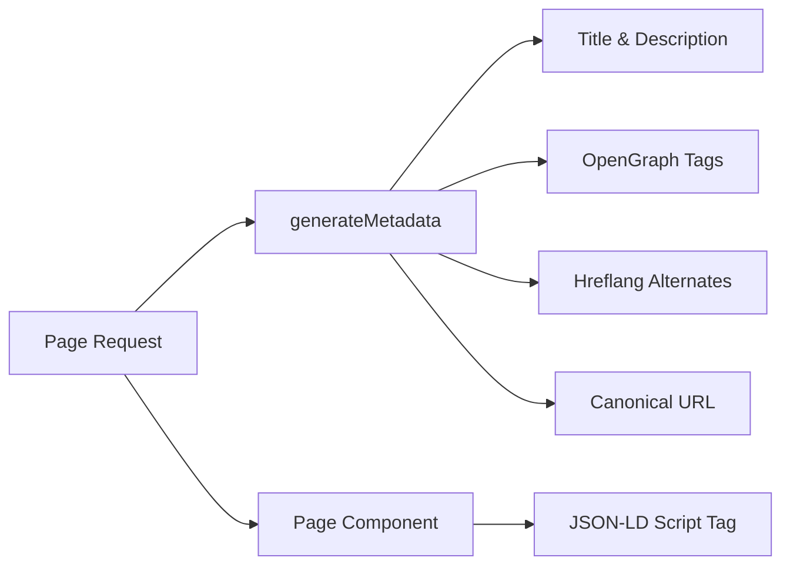

# Systemu SEO

Szablon Ever Works zawiera kompleksowy system SEO, który generuje dane strukturalne (JSON-LD), tagi hreflang, metadane OpenGraph i dynamiczne mapy witryn. Wszystkie narzędzia SEO działają pod `lib/seo/` i integrują się z API metadanych Next.js.

## Przegląd architektury



### Pliki źródłowe

|Plik|Cel|
|---|---|
|`lib/seo/schema.ts`|Generatory danych strukturalnych JSON-LD|
|`lib/seo/hreflang.ts`|Generatory alternatywnych języków URL|
|`lib/seo/listing-metadata.ts`|Fabryka metadanych strony z listą|

## Dane strukturalne JSON-LD

Moduł `lib/seo/schema.ts` generuje uporządkowane dane Schema.org w celu uzyskania bogatych wyników w wyszukiwarkach.

### Schemat produktu

Dla stron szczegółów pozycji generuje schemat `Product`:

```typescript
import { generateProductSchema } from '@/lib/seo/schema';

const schema = generateProductSchema({
  name: 'My App',
  description: 'A productivity tool',
  image: 'https://example.com/icon.png',
  url: 'https://example.com/items/my-app',
  category: 'Productivity',
  sourceUrl: 'https://myapp.com',
  brandName: 'MyApp Inc.',
});
```

Wygenerowane dane wyjściowe:

```json
{
  "@context": "https://schema.org",
  "@type": "Product",
  "name": "My App",
  "description": "A productivity tool",
  "image": "https://example.com/icon.png",
  "url": "https://example.com/items/my-app",
  "category": "Productivity",
  "brand": {
    "@type": "Brand",
    "name": "MyApp Inc."
  },
  "offers": {
    "@type": "Offer",
    "url": "https://myapp.com",
    "availability": "https://schema.org/InStock"
  }
}
```

### Schemat organizacyjny

Generuje schemat `Organization` obejmujący całą witrynę w celu zapewnienia widoczności Panelu Wiedzy:

```typescript
import { generateOrganizationSchema } from '@/lib/seo/schema';

const schema = generateOrganizationSchema();
```

Schemat ten obejmuje:
- Nazwa marki, adres URL i logo
- Linki do profili społecznościowych (`sameAs` tablica) z `siteConfig.social`
- Punkt kontaktowy z adresem e-mail (jeśli jest skonfigurowany)

### Schemat witryny internetowej z SearchAction

Włącza pole wyszukiwania Linków do podstron Google:

```typescript
import { generateWebSiteSchema } from '@/lib/seo/schema';

const schema = generateWebSiteSchema('en');
// Includes potentialAction with SearchAction targeting /?q={search_term_string}
```

Schemat uwzględnia prefiksy regionalne:
- Domyślne ustawienia regionalne: `https://example.com`
- Inne lokalizacje: `https://example.com/fr`

### Schemat bułki tartej

Generuje `BreadcrumbList` dla wyników wyszukiwania dostosowanych do nawigacji:

```typescript
import { generateBreadcrumbSchema } from '@/lib/seo/schema';

const schema = generateBreadcrumbSchema([
  { name: 'Home', url: 'https://example.com' },
  { name: 'Productivity', url: 'https://example.com/categories/productivity' },
  { name: 'My App', url: 'https://example.com/items/my-app' },
]);
```

### Osadzanie na stronach

JSON-LD jest osadzony przy użyciu tagu `<script>` w komponencie strony:

```tsx
export default function ItemDetailPage({ item }) {
  const schema = generateProductSchema({ ... });

  return (
    <>
      <script
        type="application/ld+json"
        dangerouslySetInnerHTML={{ __html: JSON.stringify(schema) }}
      />
      <ItemDetail item={item} />
    </>
  );
}
```

## Tagi Hreflang

Moduł `lib/seo/hreflang.ts` generuje alternatywne adresy URL w różnych językach na potrzeby SEO w wielu lokalizacjach.

### Wzorzec adresu URL

Szablon używa wzorca prefiksu ustawień regionalnych „w razie potrzeby”:

|Lokalne|Wzorzec adresu URL|
|---|---|
|`en` (domyślnie)|`https://example.com/items/my-app`|
|`fr`|`https://example.com/fr/items/my-app`|
|`es`|`https://example.com/es/items/my-app`|
|`x-default`|Tak samo jak `en` (domyślne ustawienia regionalne)|

### Generowanie alternatyw

```typescript
import { generateHreflangAlternates } from '@/lib/seo/hreflang';

// For any page path
const alternates = generateHreflangAlternates('/about');
// Returns: { en: 'https://example.com/about', fr: 'https://example.com/fr/about', ... }

// Convenience functions for common page types
import { generateItemHreflangAlternates } from '@/lib/seo/hreflang';
const itemAlternates = generateItemHreflangAlternates('my-app');

import { generatePageHreflangAlternates } from '@/lib/seo/hreflang';
const pageAlternates = generatePageHreflangAlternates('about');
```

### Integracja z metadanymi Next.js

```typescript
export async function generateMetadata({ params }) {
  const { locale, slug } = await params;
  return {
    alternates: {
      canonical: `https://example.com/${locale}/items/${slug}`,
      languages: generateItemHreflangAlternates(slug),
    },
  };
}
```

### Obsługiwane mapowania regionalne

Wszystkie ponad 20 lokalizacji jest mapowanych w `LOCALE_TO_HREFLANG`:

```
en -> en, fr -> fr, es -> es, de -> de, zh -> zh,
ar -> ar, he -> he, ru -> ru, uk -> uk, pt -> pt,
it -> it, ja -> ja, ko -> ko, nl -> nl, pl -> pl,
tr -> tr, vi -> vi, th -> th, hi -> hi, id -> id, bg -> bg
```

## Metadane strony z listą

Moduł `lib/seo/listing-metadata.ts` generuje kompletne obiekty `Metadata` dla stron list i kategorii.

### Użycie

```typescript
import { generateListingMetadata } from '@/lib/seo/listing-metadata';

export async function generateMetadata({ params }) {
  const { locale } = await params;
  return generateListingMetadata({
    title: 'Time Tracking Tools',
    description: 'Browse the best time tracking tools',
    path: '/categories/time-tracking',
    locale,
    itemCount: 42,
    keywords: ['time tracking', 'productivity', 'tools'],
    imageUrl: 'https://example.com/og/time-tracking.png',
  });
}
```

### Wygenerowana struktura metadanych

Funkcja tworzy kompletny obiekt Next.js `Metadata`:

|Pole|Źródło|
|---|---|
|`title`|`{tytuł} \|{nazwa witryny}`|
|`description`|Niestandardowe lub generowane automatycznie na podstawie tytułu i liczby pozycji|
|`keywords`|Połączona tablica słów kluczowych|
|`openGraph.type`|`'website'`|
|`openGraph.siteName`|Od `siteConfig.name`|
|`openGraph.url`|Kanoniczny adres URL z ustawieniami regionalnymi|
|`openGraph.images`|Opcjonalny adres URL obrazu|
|`twitter.card`|`'summary_large_image'`|
|`alternates.canonical`|Pełny kanoniczny adres URL|
|`alternates.languages`|Hreflang jest alternatywny dla wszystkich ustawień regionalnych|

## Generowanie obrazu OpenGraph

Dynamiczne obrazy OG są generowane przy użyciu Next.js `ImageResponse` na dwóch poziomach:

|Plik|Trasa|Cel|
|---|---|---|
|`app/opengraph-image.tsx`|`/opengraph-image`|Domyślny obraz OG w całej witrynie|
|`app/[locale]/items/[slug]/opengraph-image.tsx`|`/items/{slug}/opengraph-image`|Dynamiczny obraz OG dla każdego elementu|

Pliki te wykorzystują moduł `next/og` do renderowania komponentów React jako obrazów na żądanie, umożliwiając dynamiczny tekst, logo i branding.

## Lista kontrolna SEO

Dodając nowy typ strony, upewnij się, że zastosowano następujące elementy SEO:

|Elementu|Wdrożenie|
|---|---|
|Tytuł strony|`generateMetadata` z opisowym tytułem|
|Metaopis|Opis niestandardowy lub wygenerowany automatycznie|
|Kanoniczny adres URL|Ustaw w `alternates.canonical`|
|Tagi Hreflang|Użyj `generateHreflangAlternates`|
|Tagi OpenGraph|Dołączone poprzez `generateListingMetadata` lub ręcznie|
|Karta Twittera|Ustaw `twitter.card` na `summary_large_image`|
|JSON-LD|Dodaj schemat poprzez `<script type="application/ld+json">`|
|Bułka tarta|W przypadku stron zagnieżdżonych użyj `generateBreadcrumbSchema`|

## Najlepsze praktyki

1. **Zawsze ustawiaj kanoniczne adresy URL** – zapobiega problemom z duplikacją treści w różnych lokalizacjach.
2. **Dołącz hreflang do wszystkich ustawień regionalnych** – nawet jeśli treść nie została jeszcze przetłumaczona, struktura adresu URL pomaga wyszukiwarkom.
3. **Używaj opisowych, unikalnych tytułów** – unikaj ogólnych tytułów, takich jak „Strona główna” bez nazwy witryny.
4. **Trzymaj opisy krótsze niż 160 znaków** – dłuższe opisy są obcinane w wynikach wyszukiwania.
5. **Przed wdrożeniem przetestuj uporządkowane dane** za pomocą narzędzia Google Rich Results Test.
6. ** Dynamicznie generuj obrazy OG** – statyczne obrazy zastępcze tracą możliwości promowania marki specyficzne dla produktu.
