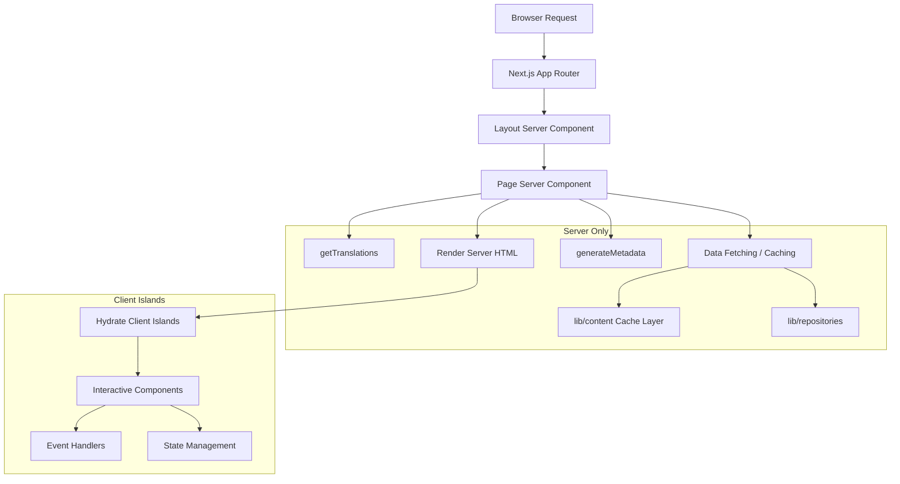

# Wzorce komponentów serwera

## Przegląd

Szablon Ever Works wykorzystuje komponenty React Server Components (RSC) jako domyślną strategię renderowania w routerze aplikacji Next.js. Komponenty serwera obsługują pobieranie danych, ładowanie tłumaczeń, generowanie metadanych i tworzenie układu na serwerze, wysyłając do klienta tylko wyrenderowany kod HTML.

## Architektura



## Pliki źródłowe

|Plik|Pokazano wzór|
|------|---------------------|
|`template/app/[locale]/about/page.tsx`|Pobieranie danych, i18n, metadane, renderowanie MDX|
|`template/app/[locale]/layout.tsx`|Układ główny z dostawcą ustawień regionalnych|
|`template/app/layout.tsx`|Układ globalny, czcionki, dostawcy|
|`template/app/sitemap.ts`|Generowanie tras tylko dla serwera|
|`template/app/robots.ts`|Konfiguracja tylko serwerowa|

## Podstawowe wzory

### Wzorzec 1: Asynchroniczne składniki strony z i18n

Każda zlokalizowana strona jest zgodna z następującym wzorcem:

```typescript
// Server Component -- no "use client" directive
export const revalidate = 3600; // ISR: revalidate every hour

interface PageProps {
    params: Promise<{ locale: string }>;
}

export async function generateMetadata({ params }: PageProps): Promise<Metadata> {
    const { locale } = await params;
    const t = await getTranslations({ locale, namespace: 'footer' });
    return {
        title: t('ABOUT_US'),
        description: t('ABOUT_PAGE_META_DESCRIPTION'),
        alternates: {
            languages: generateHreflangAlternates('/about')
        }
    };
}

export default async function AboutPage({ params }: PageProps) {
    const { locale } = await params;
    const pageData = await getCachedPageContent('about', locale);
    const tCommon = await getTranslations({ locale, namespace: 'common' });

    return (
        <PageContainer>
            <MDX source={pageData?.content || DEFAULT_CONTENT} />
        </PageContainer>
    );
}
```

Kluczowe cechy:
- `params` to `Promise` (konwencja routera aplikacji Next.js 15+)
- Wiele wywołań `getTranslations()` dla różnych przestrzeni nazw
- Pobieranie treści z pamięci podręcznej za pośrednictwem `getCachedPageContent()`
- Statyczny interwał ponownej walidacji z `export const revalidate`

### Wzorzec 2: Generowanie metadanych

Komponenty serwera generują metadane SEO na poziomie trasy:

```typescript
export async function generateMetadata({ params }: PageProps): Promise<Metadata> {
    const { locale } = await params;
    const t = await getTranslations({ locale, namespace: 'pages' });

    return {
        metadataBase: new URL(appUrl),
        title: t('PAGE_TITLE'),
        description: t('PAGE_DESCRIPTION'),
        alternates: {
            languages: generateHreflangAlternates('/path')
        }
    };
}
```

Narzędzie `generateHreflangAlternates()` z `lib/seo/hreflang.ts` automatycznie generuje łącza do alternatywnych języków dla wszystkich obsługiwanych ustawień regionalnych.

### Wzorzec 3: ISR z buforowaniem zawartości

```typescript
export const revalidate = 3600; // Revalidate every hour

export default async function Page({ params }: PageProps) {
    const data = await getCachedPageContent('page-name', locale);
    // Render with cached data...
}
```

Funkcja `getCachedPageContent()` zapewnia warstwę pamięci podręcznej po stronie serwera nad treścią CMS opartą na Git w `.content/`. W połączeniu z `revalidate` tworzy to wzorzec ISR (przyrostowej regeneracji statycznej), w którym strony są generowane statycznie i okresowo odświeżane.

### Wzorzec 4: Kontrole uwierzytelniania po stronie serwera

Strony chronione korzystają ze strażników po stronie serwera `lib/auth/guards.ts`:

```typescript
import { requireAuth, requireAdmin } from '@/lib/auth/guards';

export default async function ProtectedPage() {
    const session = await requireAuth();
    // session.user is guaranteed to exist here
    return <div>Welcome {session.user.email}</div>;
}

export default async function AdminPage() {
    const session = await requireAdmin();
    // session.user.isAdmin is guaranteed true here
    return <AdminDashboard />;
}
```

Ci strażnicy dzwonią do `auth()` wewnętrznie i używają `redirect()` z `next/navigation`, aby odsyłać nieuwierzytelnionych użytkowników na stronę logowania. Przekierowanie odbywa się po stronie serwera, więc nie jest potrzebny JavaScript klienta.

### Wzorzec 5: Komponowanie komponentów serwera i klienta

Komponenty serwera delegują interakcję do „wysp” komponentów klienta:

```typescript
// Server Component (page.tsx)
export default async function Page({ params }: PageProps) {
    const { locale } = await params;
    const data = await fetchData();
    const t = await getTranslations({ locale, namespace: 'page' });

    return (
        <div>
            <h1>{t('TITLE')}</h1>
            {/* Server-rendered static content */}
            <StaticContent data={data} />
            {/* Client island for interactivity */}
            <InteractiveFilter initialData={data} />
        </div>
    );
}
```

Dane przepływają z serwera do klienta jako możliwe do serializacji rekwizyty. Komponenty klienta otrzymują wstępnie pobrane dane i obsługują interakcje użytkownika.

## Strategie pobierania danych

### Bezpośredni dostęp do repozytorium

Komponenty serwera mogą bezpośrednio importować i wywoływać funkcje repozytorium:

```typescript
import { getItemBySlug } from '@/lib/repositories/item-repository';

export default async function ItemPage({ params }) {
    const item = await getItemBySlug(params.slug);
    // ...
}
```

### Warstwa zawartości buforowanej

W przypadku treści CMS opartych na Git:

```typescript
import { getCachedPageContent } from '@/lib/content';

const pageData = await getCachedPageContent('about', locale);
```

### Zewnętrzne wywołania API

Funkcje usługowe w `lib/services/` obejmują zewnętrzne interakcje API:

```typescript
import { triggerManualSync } from '@/lib/services/sync-service';
```

## Transmisja strumieniowa i napięcie

Komponenty serwera obsługują przesyłanie strumieniowe poprzez granice React Suspense. Duże strony mogą pokazywać stany ładowania poszczególnych sekcji:

```typescript
import { Suspense } from 'react';

export default async function Page() {
    return (
        <div>
            <Header /> {/* Renders immediately */}
            <Suspense fallback={<LoadingSkeleton />}>
                <SlowDataSection /> {/* Streams when ready */}
            </Suspense>
        </div>
    );
}
```

## Najlepsze praktyki w szablonie

1. **Nie `"use client"`, chyba że jest to potrzebne** — komponenty są domyślnie komponentami serwera
2. **Tłumaczenia ładowane po stronie serwera** -- `getTranslations()` działa tylko na serwerze
3. **Metadane umieszczone razem ze stronami** -- `generateMetadata` są eksportowane z tego samego pliku
4. **Ponowna walidacja na poziomie trasy** -- `export const revalidate` kontroluje czas ISR
5. **Funkcje zabezpieczające autoryzację** — przekierowania po stronie serwera bez kosztów pakietu klienta
6. **Rekwizyty wyłączone, zdarzenia włączone** -- komponenty serwera przekazują dane do wysp klienckich jako rekwizyty
