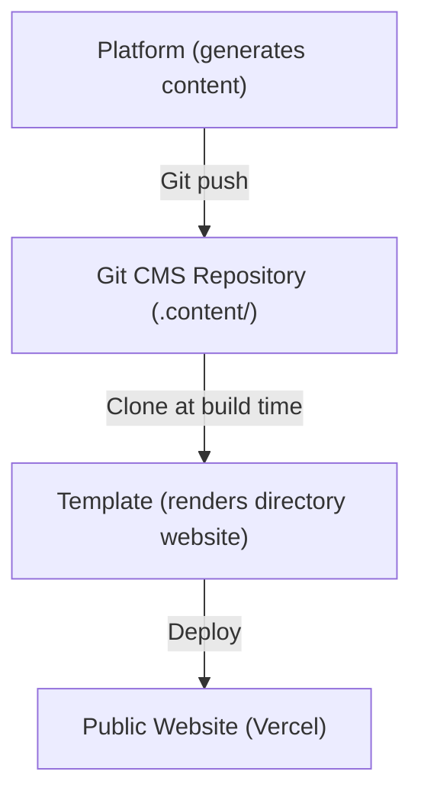
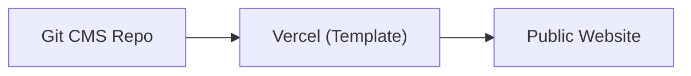
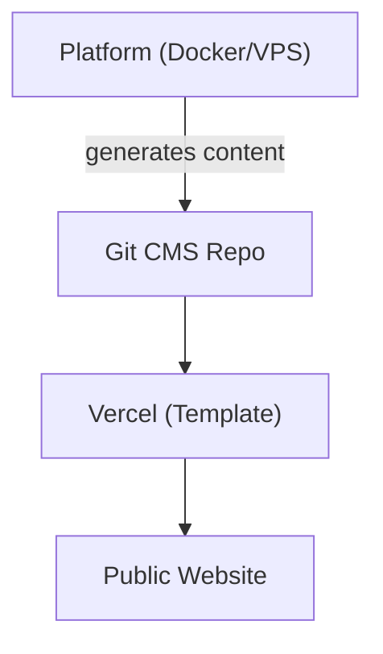
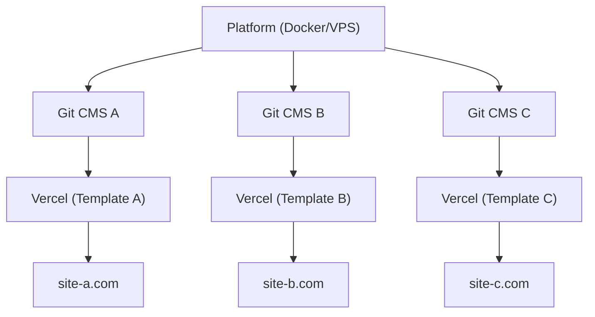

# Platforma vs Szablon

Ever Works składa się z dwóch głównych produktów, które służą różnym celom, ale współpracują jako ujednolicony ekosystem. Ta strona wyjaśnia różnicę i kiedy używać którego z nich.

## Platforma Ever Works

**Platforma Ever Works** to infrastruktura backendowa do budowania i zarządzania stronami katalogowymi na skalę. Zapewnia REST API, potoki generowania treści oparte na AI, system wtyczek i orkiestrację wdrożeń.

Pełną dokumentację platformy znajdziesz pod adresem [docs.ever.works](https://docs.ever.works).

## Szablon Directory Web

**Directory Web Template** (ten projekt) to gotowa do produkcji, pełnostosowa strona katalogowa, którą możesz sklonować, dostosować i wdrożyć jako samodzielną aplikację.

### Co robi

- Zapewnia kompletną **stronę katalogową** z listingami elementów, wyszukiwaniem, filtrowaniem, kategoriami, tagami i kolekcjami
- Zawiera **uwierzytelnianie** via NextAuth.js v5 z dostawcami OAuth (Google, GitHub, Facebook, Twitter, Microsoft) i Supabase Auth
- Obsługuje **płatności** przez Stripe, LemonSqueezy i Polar z zarządzaniem subskrypcjami
- Oferuje **internacjonalizację** z wieloma językami i obsługą RTL przez next-intl
- Używa **CMS opartego na Git** do synchronizacji treści katalogu z repozytoriów Git
- Zawiera **system motywów** z wbudowanymi motywami i dynamicznym generowaniem kolorów
- Zapewnia **analizy i monitoring** przez PostHog i Sentry
- Zawiera **optymalizację SEO**, generowanie mapy witryny i dane strukturalne (JSON-LD)
- Obejmuje **panel administracyjny** z zarządzaniem treścią, użytkownikami i analizami

### Stos Technologiczny

- **Framework:** Next.js 15, React 19
- **Język:** TypeScript 5
- **ORM:** Drizzle ORM (PostgreSQL)
- **UI:** Tailwind CSS 4, HeroUI React, Radix UI
- **Auth:** NextAuth.js v5, Supabase Auth
- **Płatności:** Stripe, LemonSqueezy, Polar
- **Testowanie:** Playwright (E2E)
- **Wdrożenie:** Vercel (podstawowy), Docker (alternatywny)

## Porównanie Obok Siebie

| Aspekt               | Platforma                                  | Szablon                                |
| -------------------- | ------------------------------------------ | -------------------------------------- |
| **Cel**              | Infrastruktura backendowa i potok AI       | Frontendowa strona katalogowa          |
| **Architektura**     | Monorepo (Turborepo + pnpm)                | Samodzielna aplikacja Next.js          |
| **Backend**          | NestJS 11 API                              | Trasy API Next.js                      |
| **ORM bazy danych**  | TypeORM                                    | Drizzle ORM                            |
| **Uwierzytelnianie** | JWT + OAuth (NestJS Guards)                | NextAuth.js v5 + Supabase Auth         |
| **Płatności**        | Nieuwzględnione                            | Stripe, LemonSqueezy, Polar            |
| **Funkcje AI**       | Agenci LangChain, 7 dostawców LLM          | Brak (konsumuje treść generowaną przez AI) |
| **Treść**            | Generuje treść przez potoki AI             | Odczytuje treść z CMS opartego na Git  |
| **Wdrożenie**        | Docker na dowolnym VPS                     | Vercel (lub Docker)                    |
| **Testowanie**       | Jest + Vitest                              | Playwright                             |
| **Odbiorcy**         | Operatorzy platform, deweloperzy AI        | Twórcy stron internetowych, twórcy katalogów |

## Jak się łączą

Platforma i Szablon współpracują przez wzorzec **CMS opartego na Git**:

### Niezależna Praca

- **Szablon bez Platformy:** Ręcznie zarządzaj treścią katalogu, edytując pliki YAML i Markdown w repozytorium Git CMS. Szablon działa jako w pełni funkcjonalna strona katalogowa bez generowania AI.
- **Platforma bez Szablonu:** Użyj API Platformy do generowania danych katalogu i eksportowania ich do dowolnego frontendu.

## Kiedy Używać Czego

### Użyj Szablonu, gdy...

- Chcesz szybko uruchomić stronę katalogową z minimalną konfiguracją backendu
- Treść Twojego katalogu jest kuratowana ręcznie lub pochodzi ze statycznego źródła danych
- Potrzebujesz gotowej do produkcji strony z uwierzytelnianiem, płatnościami i SEO od razu
- Wolisz wdrożyć na Vercel bez zarządzania serwerem

### Użyj Platformy, gdy...

- Potrzebujesz generowania treści opartego na AI dla dużych katalogów
- Chcesz zautomatyzowane potoki odkrywające, wzbogacające i aktualizujące elementy katalogu
- Musisz zarządzać wieloma katalogami z jednego backendu
- Chcesz używać systemu wtyczek dla niestandardowych integracji

### Użyj Obydwóch, gdy...

- Chcesz, żeby treść generowana przez AI płynęła do strony produkcyjnej
- Budujesz produkt SaaS na bazie Ever Works
- Potrzebujesz automatycznego generowania treści ORAZ dopracowanego frontendu

## Architektury Wdrożeń

### Tylko Szablon (Najprostsze)

Ręczne zarządzanie treścią przez Git. Pojedyncze wdrożenie Vercel.

### Platforma + Szablon (Full Stack)

Automatyczne generowanie treści przez Platformę. Połączone przez Git.

### Platforma + Wiele Szablonów

Jedna instancja Platformy zarządzająca wieloma stronami katalogowymi.
