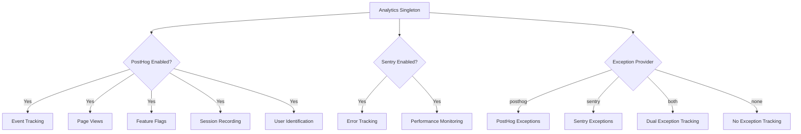
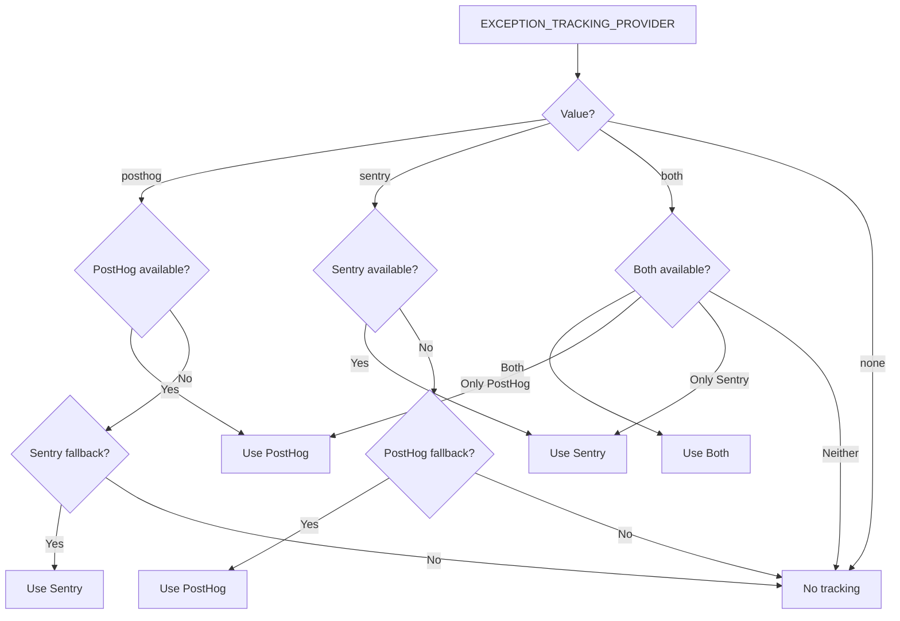

# Konfiguracja Analityki

Szablon udostępnia ujednolicony system analityczny integrujący PostHog do analizy produktu oraz Sentry do śledzenia błędów. Obaj dostawcy są zarządzani przez klasę singleton `Analytics` z automatycznym zachowaniem awaryjnym.

## Architektura



## Zmienne Środowiskowe

### Konfiguracja PostHog

| Variable | Wymagane | Domyślne | Opis |
|---|---|---|---|
| `NEXT_PUBLIC_POSTHOG_KEY` | Tak (dla analityki) | -- | Klucz API projektu PostHog |
| `NEXT_PUBLIC_POSTHOG_HOST` | Tak (dla analityki) | -- | URL instancji PostHog |
| `POSTHOG_DEBUG` | Nie | `false` | Włącz logowanie debugowania |
| `POSTHOG_SESSION_RECORDING_ENABLED` | Nie | `true` | Włącz nagrywanie sesji |
| `POSTHOG_AUTO_CAPTURE` | Nie | `false` | Automatyczne przechwytywanie odsłon stron |
| `POSTHOG_EXCEPTION_TRACKING` | Nie | `true` | Włącz śledzenie wyjątków PostHog |

### Konfiguracja Sentry

| Variable | Wymagane | Domyślne | Opis |
|---|---|---|---|
| `NEXT_PUBLIC_SENTRY_DSN` | Tak (dla błędów) | -- | Sentry Data Source Name |
| `SENTRY_ENABLE_DEV` | Nie | `false` | Włącz Sentry w środowisku deweloperskim |
| `SENTRY_DEBUG` | Nie | `false` | Włącz tryb debugowania Sentry |
| `SENTRY_EXCEPTION_TRACKING` | Nie | `true` | Włącz śledzenie wyjątków Sentry |

### Ujednolicone Śledzenie Wyjątków

| Variable | Wymagane | Domyślne | Opis |
|---|---|---|---|
| `EXCEPTION_TRACKING_PROVIDER` | Nie | `both` | Dostawca do użycia: `posthog`, `sentry`, `both` lub `none` |

## Konfiguracja PostHog

### Krok 1: Uzyskaj Dane Uwierzytelniające

1. Zarejestruj się na [posthog.com](https://posthog.com) lub uruchom PostHog samodzielnie
2. Utwórz projekt
3. Skopiuj klucz API projektu i URL hosta

### Krok 2: Skonfiguruj Środowisko

```env
NEXT_PUBLIC_POSTHOG_KEY=phc_your_project_key_here
NEXT_PUBLIC_POSTHOG_HOST=https://app.posthog.com
```

PostHog jest automatycznie włączany, gdy ustawione są zarówno `NEXT_PUBLIC_POSTHOG_KEY`, jak i `NEXT_PUBLIC_POSTHOG_HOST`.

### Krok 3: Częstotliwości Próbkowania

Częstotliwości próbkowania są automatycznie dostosowywane w zależności od środowiska:

| Środowisko | Częstotliwość Próbkowania Zdarzeń | Częstotliwość Próbkowania Nagrywania Sesji |
|---|---|---|
| Produkcja | 10% (`0.1`) | 10% (`0.1`) |
| Rozwój | 100% (`1.0`) | 100% (`1.0`) |

## Konfiguracja Sentry

### Krok 1: Uzyskaj DSN

1. Utwórz projekt na [sentry.io](https://sentry.io)
2. Skopiuj DSN z ustawień projektu

### Krok 2: Skonfiguruj Środowisko

```env
NEXT_PUBLIC_SENTRY_DSN=https://examplePublicKey@o0.ingest.sentry.io/0
SENTRY_ENABLE_DEV=true  # Opcjonalne: włącz w środowisku deweloperskim
```

Sentry jest automatycznie włączany w produkcji, gdy DSN jest ustawiony. W środowisku deweloperskim należy jawnie ustawić `SENTRY_ENABLE_DEV=true`.

## API Klasy Analytics

Klasa `Analytics` jest singletonem dostępnym w całej aplikacji:

```typescript
import { analytics } from '@/lib/analytics';
```

### Inicjalizacja

```typescript
// Zainicjuj analitykę (wywołaj raz w korzeniu aplikacji)
analytics.init();
```

Metoda `init()` działa tylko po stronie klienta i można ją bezpiecznie wywoływać w kontekstach serwera (nie wykona żadnej akcji).

### Śledzenie Zdarzeń

```typescript
// Śledź niestandardowe zdarzenie
analytics.track('button_clicked', {
  buttonName: 'signup',
  page: '/landing'
});

// Śledź odsłonę strony
analytics.trackPageView('/dashboard', {
  referrer: document.referrer
});
```

### Identyfikacja Użytkownika

```typescript
// Zidentyfikuj użytkownika (po zalogowaniu)
analytics.identify('user-123', {
  email: 'user@example.com',
  plan: 'premium',
  company: 'Acme Inc.'
});

// Zresetuj tożsamość (po wylogowaniu)
analytics.reset();

// Ustaw trwałe właściwości użytkownika
analytics.setUserProperties({
  subscription_tier: 'premium',
  signup_date: '2024-01-15'
});

// Ustaw super właściwości (wysyłane z każdym zdarzeniem)
analytics.setSuperProperties({
  app_version: '2.0.0',
  platform: 'web'
});
```

### Flagi Funkcji

```typescript
// Sprawdź, czy flaga funkcji jest włączona
const isEnabled = analytics.isFeatureEnabled('new-dashboard', false);

// Przeładuj flagi funkcji z serwera
await analytics.reloadFeatureFlags();
```

### Śledzenie Wyjątków

```typescript
// Przechwyć wyjątek (kierowany do skonfigurowanego dostawcy)
analytics.captureException(error, {
  component: 'PaymentForm',
  action: 'submit'
});

// Przechwyć z komunikatem tekstowym
analytics.captureException('Payment processing failed', {
  orderId: 'ord-123'
});
```

## Wybór Dostawcy Śledzenia Wyjątków



## Nagrywanie Sesji

Gdy `POSTHOG_SESSION_RECORDING_ENABLED=true`, PostHog nagrywa sesje użytkowników z tymi ustawieniami prywatności:

```typescript
session_recording: {
  maskAllInputs: true,        // Maskuj wartości pól formularza
  maskTextSelector: "[data-mask]",  // Maskuj elementy z data-mask
  sampleRate: 0.1,            // 10% w produkcji
}
```

Dodaj `data-mask` do dowolnego elementu, którego zawartość tekstowa powinna być ukryta w nagraniach.

## Śledzenie Wyjątków z PostHog

Gdy śledzenie wyjątków PostHog jest włączone, system instaluje globalne procedury obsługi błędów:

- **`window.onerror`** -- Przechwytuje nieobsłużone błędy JavaScript
- **`unhandledrejection`** -- Przechwytuje nieobsłużone odrzucenia Promise

Są one przekazywane do PostHog jako zdarzenia `$exception` ze śledami stosu.

## Integracja Sentry-PostHog

Gdy obaj dostawcy są aktywni (`EXCEPTION_TRACKING_PROVIDER=both`), system tworzy dwukierunkowe połączenie:

1. Właściwość `sentry` PostHog jest ustawiona na SDK Sentry
2. Niestandardowy procesor zdarzeń Sentry przekazuje błędy do PostHog jako zdarzenia `sentry_error`
3. Umożliwia to korelację sesji użytkowników (PostHog) ze szczegółami błędów (Sentry)

## Stałe Śledzenia Odwiedzających

Plik `lib/constants/analytics.ts` zawiera stałe do anonimowego śledzenia odwiedzających:

```typescript
// Nazwa pliku cookie dla anonimowego ID odwiedzającego
```
