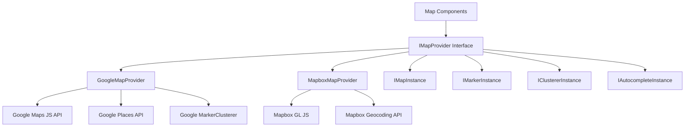
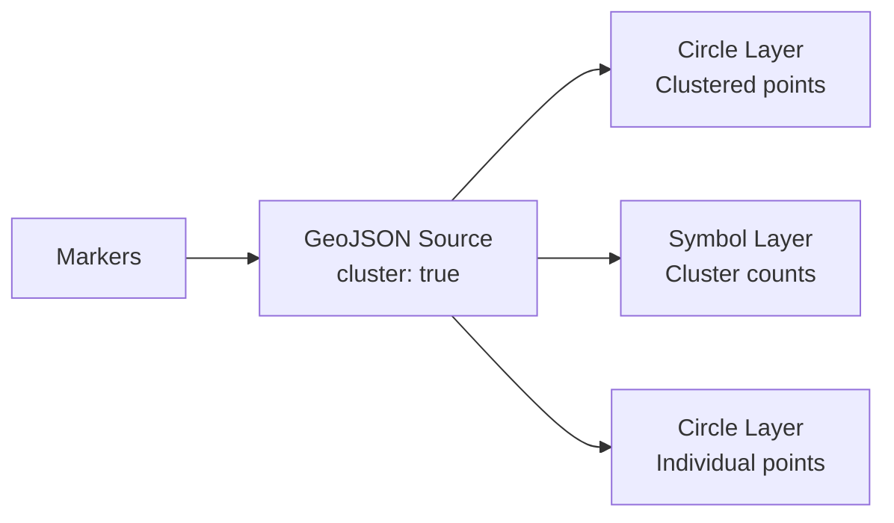

# Konfiguracja Mapy

Szablon zawiera niezależny od dostawcy system map obsługujący zarówno Google Maps, jak i Mapbox GL JS. Wspólna warstwa interfejsu umożliwia przełączanie się między dostawcami bez zmiany kodu komponentów.

## Architektura



## Wybór Dostawcy

Dostawca mapy jest określany na podstawie skonfigurowanych kluczy API:

| Dostawca | Wymagana Zmienna Środowiskowa |
|---|---|
| Google Maps | `NEXT_PUBLIC_GOOGLE_MAPS_API_KEY` |
| Mapbox | `NEXT_PUBLIC_MAPBOX_ACCESS_TOKEN` |

Jeśli obaj są skonfigurowani, dostawca jest wybierany przez ustawienia konfiguracji mapy aplikacji.

## Konfiguracja Google Maps

### Krok 1: Uzyskaj Klucz API

1. Przejdź do [konsoli Google Cloud](https://console.cloud.google.com)
2. Włącz następujące API:
   - Maps JavaScript API
   - Places API
   - Geocoding API
3. Utwórz klucz API z ograniczeniami HTTP referrer

### Krok 2: Skonfiguruj Środowisko

```env
NEXT_PUBLIC_GOOGLE_MAPS_API_KEY=AIzaSy...your-api-key
NEXT_PUBLIC_GOOGLE_MAPS_MAP_ID=your-map-id        # Optional: for styled maps
```

### Krok 3: Bezpieczeństwo

Dostawca Google Maps wymusza użycie klucza tylko w przeglądarce:

```typescript
// @security Uses NEXT_PUBLIC_GOOGLE_MAPS_API_KEY (browser-exposed).
// Only use HTTP referrer-restricted keys, never unrestricted or server keys.
```

**Wymagane ograniczenia klucza API:**
- Ograniczenie aplikacji: HTTP referrer
- Dodaj wzorce domeny (np. `https://twojastrona.com/*`)
- Ograniczenie API: Ogranicz do Maps JavaScript, Places i Geocoding API

## Konfiguracja Mapbox

### Krok 1: Uzyskaj Token Dostępu

1. Zarejestruj się na [mapbox.com](https://www.mapbox.com)
2. Skopiuj swój publiczny token dostępu (zaczyna się od `pk.`)

### Krok 2: Skonfiguruj Środowisko

```env
NEXT_PUBLIC_MAPBOX_ACCESS_TOKEN=pk.eyJ1Ijoi...your-token
```

### Krok 3: Bezpieczeństwo

```typescript
// @security Uses NEXT_PUBLIC_MAPBOX_ACCESS_TOKEN (browser-exposed).
// Only use public tokens (pk.*) with URL restrictions, never secret tokens (sk.*).
```

**Wymagane ograniczenia tokenu:**
- Używaj tokenu **publicznego** (prefiks `pk.`)
- Dodaj ograniczenia URL dla swoich domen
- Nigdy nie używaj tajnych tokenów (`sk.*`) w kodzie po stronie klienta

## Interfejs Dostawcy

Obaj dostawcy implementują interfejs `IMapProvider` z identycznymi możliwościami:

### Metody IMapProvider

| Metoda | Opis |
|---|---|
| `isLoaded()` | Sprawdź czy skrypt dostawcy jest załadowany |
| `loadScript()` | Załaduj bibliotekę dostawcy (idempotentna) |
| `createMap(container, options)` | Utwórz instancję mapy w elemencie DOM |
| `createMarker(map, options)` | Dodaj znacznik do mapy |
| `createClusterer(map, options, onClick)` | Grupuj pobliskie znaczniki w klastry |
| `createAutocomplete(input, onSelect)` | Dołącz autouzupełnianie adresu do pola wejściowego |
| `getStyleUrl(style)` | Pobierz URL stylu dla widoku ulicy lub satelity |
| `isConfigured()` | Sprawdź czy klucze API są obecne |

### Style Mapy

| Styl | Google Maps | Mapbox |
|---|---|---|
| `streets` | `roadmap` | `mapbox://styles/mapbox/streets-v12` |
| `satellite` | `satellite` | `mapbox://styles/mapbox/satellite-streets-v12` |

## System Typów

Biblioteka map definiuje kompleksowe typy w `lib/maps/types.ts`:

### Typy Podstawowe

```typescript
interface Coordinates {
  latitude: number;
  longitude: number;
}

interface MapBounds {
  north: number;
  south: number;
  east: number;
  west: number;
}

interface MapViewport {
  center: Coordinates;
  zoom: number;
  bounds?: MapBounds;
}
```

### Typy Znaczników

```typescript
interface MapMarkerData {
  id: string;
  coordinates: Coordinates;
  title: string;
  icon?: string;
  category?: string;
  slug: string;
  description?: string;
}

interface MapMarkerWithDistance extends MapMarkerData {
  distanceKm?: number;
}
```

### Konfiguracja Klastra

```typescript
interface ClusterOptions {
  radius?: number;     // Cluster radius in pixels (default: 60)
  maxZoom?: number;    // Max zoom for clustering (default: 16)
  minZoom?: number;    // Min zoom for clustering (default: 0)
  minPoints?: number;  // Min points to form cluster (default: 2)
}
```

### Obsługa Zdarzeń

```typescript
interface MapEventHandlers {
  onMarkerClick?: (marker: MapMarkerData) => void;
  onClusterClick?: (cluster: MapClusterData) => void;
  onViewportChange?: (viewport: MapViewport) => void;
  onMapReady?: () => void;
  onMapError?: (error: Error) => void;
}
```

## Właściwości Komponentu Mapy

Interfejs `MapComponentProps` definiuje pełny zestaw właściwości głównego komponentu mapy:

| Właściwość | Typ | Domyślna | Opis |
|---|---|---|---|
| `markers` | `MapMarkerData[]` | `[]` | Znaczniki do wyświetlenia |
| `center` | `Coordinates` | -- | Początkowa pozycja centrum |
| `zoom` | `number` | -- | Początkowy poziom powiększenia (1-20) |
| `style` | `MapStyle` | `streets` | Styl mapy (ulice/satelita) |
| `height` | `string \| number` | -- | Wysokość kontenera |
| `width` | `string \| number` | -- | Szerokość kontenera |
| `enableClustering` | `boolean` | `false` | Włącz klastrowanie znaczników |
| `clusterOptions` | `ClusterOptions` | -- | Konfiguracja klastrowania |
| `controls` | `MapControlsConfig` | -- | Ustawienia elementów sterujących interfejsu |
| `isLoading` | `boolean` | `false` | Zewnętrzny stan ładowania |
| `isDisabled` | `boolean` | `false` | Wyłącz interakcję |
| `onMarkerClick` | `function` | -- | Obsługa kliknięcia znacznika |
| `onClusterClick` | `function` | -- | Obsługa kliknięcia klastra |
| `onViewportChange` | `function` | -- | Obsługa zmiany widoku |

## Autouzupełnianie Adresu

Obaj dostawcy obsługują autouzupełnianie adresu z jednolitym interfejsem:

```typescript
interface AddressSuggestion {
  id: string;
  mainText: string;       // Street address
  secondaryText: string;  // City, state
  fullAddress: string;    // Complete formatted address
  coordinates?: Coordinates;
}
```

**Google Maps:** Używa API Place Autocomplete z polami `formatted_address`, `geometry`, `name` i `address_components`.

**Mapbox:** Używa API Geocoding (`/geocoding/v5/mapbox.places/`) z opóźnionym wejściem (300ms) i niestandardowym interfejsem listy rozwijanej.

## Selektor Lokalizacji

Interfejs `LocationPickerProps` obsługuje kompletne doświadczenie wyboru lokalizacji:

```typescript
interface LocationPickerValue {
  address?: string;
  city?: string;
  state?: string;
  country?: string;
  postalCode?: string;
  latitude?: number;
  longitude?: number;
  serviceArea?: 'local' | 'regional' | 'national' | 'global';
  isRemote?: boolean;
}
```

## Usługi Geokodowania

Geokodowanie po stronie serwera jest dostępne przez `lib/services/geocoding/`:

| Plik | Przeznaczenie |
|---|---|
| `geocoding-provider.interface.ts` | Wspólny interfejs geokodowania |
| `google-geocoding.provider.ts` | Implementacja Google Geocoding API |
| `mapbox-geocoding.provider.ts` | Implementacja Mapbox Geocoding API |
| `geocoding.service.ts` | Zunifikowana usługa geokodowania |

## Implementacja Klastrowania

### Klastrowanie Google Maps

Używa `@googlemaps/markerclusterer` z `AdvancedMarkerElement`:

- Dynamicznie importuje bibliotekę klastera
- Tworzy niestandardowe elementy zawartości znaczników z ikonami
- Domyślne zachowanie: powiększenie do granic klastra po kliknięciu

### Klastrowanie Mapbox

Używa natywnego klastrowania na poziomie źródła Mapbox GL:

- Źródło GeoJSON z `cluster: true`
- Trzy warstwy: okręgi klastrów, etykiety liczników, punkty niezgrupowane
- Kodowanie kolorami wg rozmiaru klastra (mały: cyjan, średni: żółty, duży: różowy)



## Konfiguracja Elementów Sterujących

```typescript
interface MapControlsConfig {
  showZoomControls?: boolean;        // Zoom in/out buttons
  showFullscreenControl?: boolean;   // Fullscreen toggle
  showNavigationControl?: boolean;   // Compass/navigation
  showScaleControl?: boolean;        // Distance scale
}
```

## Rozwiązywanie Problemów

| Problem | Rozwiązanie |
|---|---|
| Mapa nie renderuje się | Sprawdź czy klucz API jest ustawiony i poprawny |
| "Google Maps API key not configured" | Ustaw `NEXT_PUBLIC_GOOGLE_MAPS_API_KEY` |
| Pusta mapa Mapbox | Upewnij się, że token zaczyna się od `pk.` (publiczny) |
| Znaczniki nie są grupowane | Ustaw `enableClustering={true}` na komponencie mapy |
| Autouzupełnianie nie działa | Sprawdź czy Places API jest włączone (Google) |
| Błędy CORS | Sprawdź ograniczenia domeny klucza API |
| Ograniczenie szybkości | Monitoruj użycie API w panelu dostawcy |
