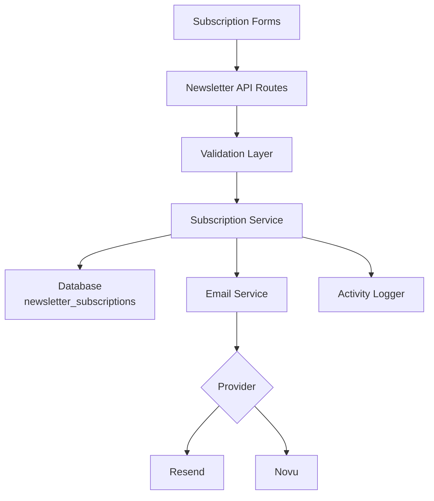
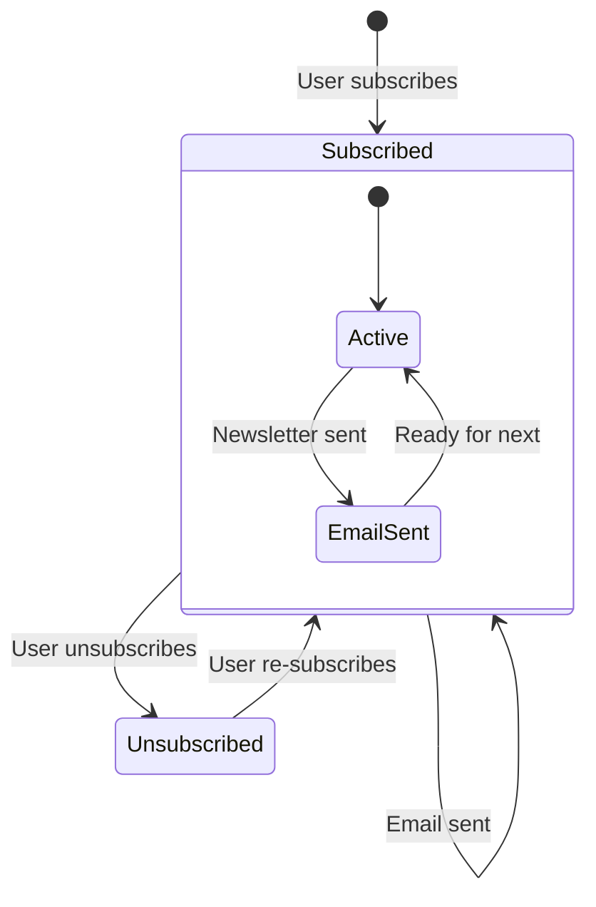

# Konfiguracja Newslettera

Szablon zawiera kompletny system subskrypcji newslettera z integracją dostawcy poczty email, walidacją, zarządzaniem cyklem życia subskrypcji i rejestrowaniem aktywności. Konfiguracja jest scentralizowana w `lib/newsletter/`.

## Architektura



## Struktura Plików

```
lib/newsletter/
├── config.ts    # Configuration, types, validation schemas
└── utils.ts     # Email sending, subscription validation, logging
```

## Stałe Konfiguracyjne

Obiekt `NEWSLETTER_CONFIG` w `config.ts` definiuje wszystkie wartości domyślne i komunikaty:

```typescript
export const NEWSLETTER_CONFIG = {
  DEFAULT_PROVIDER: "resend",
  DEFAULT_FROM: "onboarding@resend.dev",
  DEFAULT_COMPANY_NAME: "Ever Works",

  SOURCES: {
    FOOTER: "footer",
    POPUP: "popup",
    SIGNUP: "signup",
  },

  ERRORS: {
    INVALID_EMAIL: "Please enter a valid email address",
    ALREADY_SUBSCRIBED: "Email is already subscribed to the newsletter",
    NOT_SUBSCRIBED: "Email is not subscribed to the newsletter",
    SUBSCRIPTION_FAILED: "Failed to create subscription. Please try again.",
    UNSUBSCRIPTION_FAILED: "Failed to unsubscribe. Please try again.",
    EMAIL_SEND_FAILED: "Failed to send email. Please try again.",
    STATS_FAILED: "Failed to get newsletter statistics",
  },

  SUCCESS: {
    SUBSCRIBED: "Successfully subscribed to newsletter",
    UNSUBSCRIBED: "Successfully unsubscribed from newsletter",
  },
};
```

## Konfiguracja Dostawcy Email

### Resend (Domyślny)

```env
RESEND_API_KEY=re_your_api_key_here
```

1. Zarejestruj się na [resend.com](https://resend.com)
2. Utwórz klucz API
3. Zweryfikuj domenę wysyłania (lub użyj `onboarding@resend.dev` do testów)

### Novu

```env
NOVU_API_KEY=your_novu_api_key
```

Dla Novu dostępna jest dodatkowa konfiguracja w konfiguracji witryny:

```yaml
mail:
  provider: "novu"
  template_id: "your-template-id"
  backend_url: "https://api.novu.co"
```

## Konfiguracja Email

Funkcja `createEmailConfig()` buduje konfigurację email z konfiguracji aplikacji:

```typescript
interface EmailConfig {
  provider: string;      // "resend" or "novu"
  defaultFrom: string;   // Sender email address
  domain: string;        // Application domain URL
  apiKeys: {
    resend: string;
    novu: string;
  };
  novu?: {
    templateId?: string;
    backendUrl?: string;
  };
}
```

Priorytet konfiguracji:

| Ustawienie       | Źródło                          | Fallback                   |
|---|---|---|
| Dostawca         | `config.mail.provider`          | `"resend"`                 |
| Adres nadawcy    | `config.mail.default_from`      | `"onboarding@resend.dev"`  |
| Domena           | `config.app_url`                | `coreConfig.APP_URL`       |
| Klucz Resend     | Zmienna środowiskowa `RESEND_API_KEY` | Pusty ciąg          |
| Klucz Novu       | Zmienna środowiskowa `NOVU_API_KEY`  | Pusty ciąg          |

## Schematy Walidacji

System newslettera używa schematów Zod do walidacji danych wejściowych:

### Schemat Email

```typescript
const emailSchema = z.object({
  email: z
    .string()
    .email("Please enter a valid email address")
    .transform((email) => email.toLowerCase().trim()),
});
```

### Schemat Subskrypcji

```typescript
const newsletterSubscriptionSchema = z.object({
  email: z
    .string()
    .email("Please enter a valid email address")
    .transform((email) => email.toLowerCase().trim()),
  source: z
    .enum(["footer", "popup", "signup"])
    .default("footer"),
});
```

## Źródła Subskrypcji

Śledzenie, skąd pochodzą subskrypcje:

| Źródło   | Opis                                          |
|---|---|
| `footer` | Formularz subskrypcji w stopce strony         |
| `popup`  | Popup/modal newslettera                       |
| `signup` | Przepływ rejestracji konta                    |

## Narzędzia Newslettera

### Wysyłanie Email

```typescript
import { sendEmailSafely, createEmailService } from '@/lib/newsletter/utils';

// Create email service
const { service, config } = await createEmailService();

// Send email with error handling
const result = await sendEmailSafely(
  service,
  config,
  {
    subject: "Welcome to our newsletter!",
    html: "<h1>Welcome!</h1>",
    text: "Welcome!"
  },
  "user@example.com",
  "welcome"
);

if (!result.success) {
  console.error(result.error);
}
```

### Walidacja Subskrypcji

```typescript
import { canSubscribe, canUnsubscribe } from '@/lib/newsletter/utils';

// Check if email can be subscribed
const { canSubscribe: allowed, error } = await canSubscribe("user@example.com");
if (!allowed) {
  // Email is already subscribed
}

// Check if email can be unsubscribed
const { canUnsubscribe: allowed, error } = await canUnsubscribe("user@example.com");
if (!allowed) {
  // Email is not currently subscribed
}
```

### Rejestrowanie Aktywności

```typescript
import { logNewsletterActivity, trackNewsletterMetric } from '@/lib/newsletter/utils';

// Log newsletter activity
logNewsletterActivity("subscribe", "user@example.com", "footer", {
  ip: "192.168.1.1"
});

// Track newsletter metrics
trackNewsletterMetric("subscription", "user@example.com", "popup");
```

Typy aktywności:

| Akcja          | Kiedy Rejestrowana                                  |
|---|---|
| `subscribe`    | Użytkownik subskrybuje newsletter                   |
| `unsubscribe`  | Użytkownik anuluje subskrypcję                      |
| `email_sent`   | Email newslettera wysłany pomyślnie                 |
| `email_failed` | Wysłanie emaila newslettera nie powiodło się        |

### Narzędzia Szablonów

```typescript
import { getTemplateWithCompany } from '@/lib/newsletter/utils';

// Generate email template with company name
const template = await getTemplateWithCompany(
  (email, companyName) => ({
    subject: `Welcome to ${companyName}`,
    html: `<p>Thanks for subscribing, ${email}!</p>`,
    text: `Thanks for subscribing, ${email}!`
  }),
  "user@example.com"
);
```

### Pomocniki Odpowiedzi

```typescript
import { createErrorResponse, createSuccessResponse } from '@/lib/newsletter/utils';

// Standardized error response
const error = createErrorResponse(
  "Subscription failed",
  "user@example.com",
  "subscribe"
);
// { error: "Subscription failed", email: "user@example.com", context: "subscribe" }

// Standardized success response
const success = createSuccessResponse("user@example.com", "subscribe");
// { success: true, email: "user@example.com", context: "subscribe" }
```

## Schemat Bazy Danych

Subskrypcje newslettera są przechowywane w tabeli `newsletter_subscriptions`:

| Kolumna          | Typ       | Opis                                             |
|---|---|---|
| `id`             | UUID      | Klucz główny                                     |
| `email`          | String    | Email subskrybenta (unikalny)                    |
| `isActive`       | Boolean   | Aktualny status subskrypcji                      |
| `subscribedAt`   | Timestamp | Kiedy subskrypcja się rozpoczęła                 |
| `unsubscribedAt` | Timestamp | Kiedy anulowano subskrypcję (nullable)           |
| `lastEmailSent`  | Timestamp | Ostatni email wysłany do subskrybenta            |
| `source`         | String    | Źródło subskrypcji (footer, popup, signup)       |

## Cykl Życia Subskrypcji



## Typy

```typescript
type NewsletterSource = "footer" | "popup" | "signup";

interface NewsletterActionResult {
  success?: boolean;
  error?: string;
  email?: string;
}

interface NewsletterStats {
  totalActive: number;
  recentSubscriptions: number;
}
```

## Bezpieczeństwo

- Adresy email są normalizowane do małych liter i przycinane przed zapisem
- Walidacja email używa bezpiecznego wyrażenia regularnego zapobiegającego atakom ReDoS (z `lib/utils/email-validation.ts`)
- Funkcja `sendEmailSafely` opakowuje wszystkie operacje email w bloki try-catch
- Klucze API nigdy nie są ujawniane klientowi — wszystkie operacje email odbywają się po stronie serwera

## Rozwiązywanie Problemów

| Problem                             | Rozwiązanie                                                                   |
|---|---|
| Emaile nie są wysyłane              | Sprawdź, czy `RESEND_API_KEY` lub `NOVU_API_KEY` jest ustawiony               |
| Błąd „już subskrybowany"            | Sprawdź tabelę `newsletter_subscriptions` pod kątem aktywnego wpisu           |
| Błędny adres nadawcy                | Zaktualizuj `mail.default_from` w konfiguracji witryny                        |
| Szablon nie ładuje się              | Upewnij się, że `getCompanyName()` może uzyskać dostęp do konfiguracji witryny |
| Źródło nie jest śledzone            | Przekaż parametr `source` w żądaniach subskrypcji                             |
