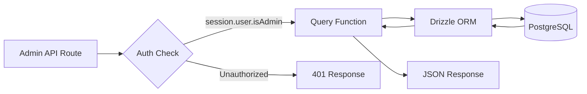
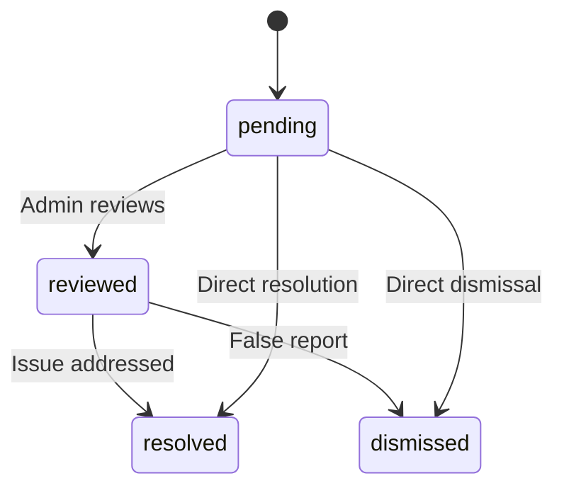

# Zapytania do bazy danych administratora

Zapytania administracyjne dotyczą zarządzania elementami, zarządzania użytkownikami/klientami, dostępu opartego na rolach, statystyk pulpitu nawigacyjnego, moderowania raportów i ustawień. Funkcje te są wykorzystywane głównie przez trasy API w ramach `app/api/admin/`.

## Przepływ zapytań administratora



## Zarządzanie użytkownikami (`user.queries.ts`)

### Podstawowe funkcje

|Funkcja|Parametry|Powroty|Opis|
|----------|-----------|---------|-------------|
|`getUserByEmail`|`email: string`|`Użytkownik \|null`|Znajdź użytkownika według adresu e-mail|
|`getUserById`|`id: string`|`Użytkownik \|null`|Znajdź użytkownika według klucza podstawowego|
|`insertNewUser`|`user: NewUser`|`User[]`|Utwórz nowy rekord użytkownika|
|`updateUserPassword`|`hash, userId`|`void`|Zaktualizuj skrót hasła|
|`updateUserVerification`|`email, verified`|`void`|Ustaw status weryfikacji e-mail|
|`softDeleteUser`|`userId: string`|`void`|Usuwanie miękkie (dołącza `-deleted` do wiadomości e-mail)|
|`isUserAdmin`|`userId: string`|`boolean`|Sprawdź rolę administratora poprzez dołączenie|

### Kontrola roli administratora

Funkcja `isUserAdmin` wykonuje złączenie wielu tabel w celu sprawdzenia statusu administratora:

```typescript
export async function isUserAdmin(userId: string): Promise<boolean> {
  const result = await db
    .select({ isAdmin: roles.isAdmin })
    .from(userRoles)
    .innerJoin(roles, eq(userRoles.roleId, roles.id))
    .where(and(
      eq(userRoles.userId, userId),
      eq(roles.isAdmin, true),
      eq(roles.status, 'active')
    ))
    .limit(1);

  return result.length > 0;
}
```

### Miękki wzór usuwania

Użytkownicy nigdy nie są fizycznie usuwani. Usunięcie nietrwałe łączy identyfikator użytkownika z wiadomością e-mail, aby zwolnić adres e-mail na potrzeby ponownej rejestracji:

```typescript
export async function softDeleteUser(userId: string) {
  return db
    .update(users)
    .set({
      deletedAt: sql`CURRENT_TIMESTAMP`,
      email: sql`CONCAT(email, '-', id, '-deleted')`
    })
    .where(eq(users.id, userId));
}
```

## Zarządzanie Klientami (`client.queries.ts`)

### Profil CRUD

|Funkcja|Opis|
|----------|-------------|
|`createClientProfile(data)`|Utwórz profil z automatycznie wygenerowaną unikalną nazwą użytkownika|
|`getClientProfileById(id)`|Pobierz według identyfikatora profilu|
|`getClientProfileByUserId(userId)`|Pobierz według odniesienia użytkownika|
|`getClientProfileByEmail(email)`|Pobierz poprzez przeszukiwanie tabeli kont|
|`updateClientProfile(id, data)`|Częściowa aktualizacja ze znacznikiem czasu|
|`deleteClientProfile(id)`|Twarde usunięcie rekordu profilu|

### Dane panelu administracyjnego

Funkcja `getAdminDashboardData` jest zoptymalizowana pod kątem panelu administracyjnego, wyświetlając zarówno podzieloną na strony listę klientów, jak i kompleksowe statystyki w minimalnej liczbie zapytań:

```typescript
export async function getAdminDashboardData(params: {
  page: number;
  limit: number;
  search?: string;
  status?: string;
  plan?: string;
  accountType?: string;
  provider?: string;
  createdAfter?: Date;
  createdBefore?: Date;
}): Promise<{
  clients: ClientProfileWithAuth[];
  stats: { overview, byProvider, byPlan, byAccountType, activity, growth };
  pagination: { page, totalPages, total, limit };
}>
```

Funkcja wyklucza administratorów z list klientów przy użyciu wzorca LEFT JOIN + IS NULL:

```typescript
// Exclude admin users from client listing
.leftJoin(userRoles, eq(userRoles.userId, clientProfiles.userId))
.leftJoin(roles, and(eq(userRoles.roleId, roles.id), eq(roles.isAdmin, true)))
.where(isNull(roles.id))  // Only non-admin users
```

### Zaawansowane wyszukiwanie klientów

`advancedClientSearch` obsługuje złożone filtrowanie wielokryterialne:

|Kategoria filtra|Parametry|
|----------------|------------|
|**Wyszukiwanie tekstowe**|`search` (imię i nazwisko, adres e-mail, nazwa użytkownika, firma, biografia, stanowisko, branża, lokalizacja)|
|**Filtry wyliczeniowe**|`status`, `plan`, `accountType`, `provider`|
|**Zakresy dat**|`createdAfter`, `createdBefore`, `updatedAfter`, `updatedBefore`, `dateRange`|
|**Specyficzne dla danej dziedziny**|`emailDomain`, `companySearch`, `locationSearch`, `industrySearch`|
|**Numeryczne**|`minSubmissions`, `maxSubmissions`|
|**wartość logiczna**|`hasAvatar`, `hasWebsite`, `hasPhone`, `emailVerified`, `twoFactorEnabled`|
|**Sortowanie**|`sortBy` (utworzono w, zaktualizowano w, imię i nazwisko, adres e-mail, firma, całkowita liczba zgłoszeń), `sortOrder`|

### Statystyki klientów

`getEnhancedClientStats` zwraca kompleksowe zestawienie:

```typescript
{
  overview: { total, active, inactive, suspended, trial },
  byProvider: { credentials, google, github, facebook, twitter, linkedin, other },
  byPlan: { free: number, standard: number, premium: number },
  byAccountType: { individual, business, enterprise },
  activity: { newThisWeek, newThisMonth, activeThisWeek, activeThisMonth },
  growth: { weeklyGrowth, monthlyGrowth },
}
```

## Zarządzanie raportami (`report.queries.ts`)

### Zgłoś CRUD

|Funkcja|Opis|
|----------|-------------|
|`createReport(data)`|Utwórz raport dotyczący treści (element lub komentarz)|
|`getReportById(id)`|Uzyskaj raport ze szczegółami reportera i recenzenta|
|`getReports(params)`|Lista raportów podzielona na strony z filtrami|
|`updateReport(id, data)`|Zaktualizuj status, rozdzielczość, dodaj notatki z recenzji|
|`getReportStats()`|Statystyki według statusu, rodzaju treści, przyczyny|
|`hasUserReportedContent(reportedBy, contentType, contentId)`|Sprawdzenie duplikatu raportu|

### Raportuj przepływ stanu



### Filtrowanie raportów

Raporty obsługują filtrowanie według stanu, typu treści (element/komentarz) i przyczyny (spam, nękanie, nieodpowiednie, inne):

```typescript
export async function getReports(params: {
  page?: number;
  limit?: number;
  search?: string;
  status?: ReportStatusValues;
  contentType?: ReportContentTypeValues;
  reason?: ReportReasonValues;
}): Promise<{
  reports: ReportWithReporter[];
  total: number;
  page: number;
  totalPages: number;
  limit: number;
}>
```

## Statystyki panelu (`dashboard.queries.ts`)

### Dostępne metryki

|Funkcja|Cel|Używany w|
|----------|---------|---------|
|`getVotesReceivedCount(itemSlugs)`|Łączna liczba głosów na przedmioty|Podsumowanie panelu|
|`getCommentsReceivedCount(itemSlugs)`|Łączna liczba komentarzy do elementów|Podsumowanie panelu|
|`getUniqueItemsInteractedCount(clientId)`|Elementy, z którymi użytkownik się kontaktował|Panel aktywności|
|`getUserTotalActivityCount(clientId)`|Całkowita liczba głosów + komentarze użytkownika|Panel aktywności|
|`getWeeklyEngagementData(itemSlugs, weeks)`|Tygodniowy wykres głosów/komentarzy|Wykres zaangażowania|
|`getDailyActivityData(clientId, itemSlugs, days)`|Dzienny podział aktywności|Wykres aktywności|
|`getTopItemsEngagement(itemSlugs, limit)`|Najpopularniejsze pozycje według zaangażowania|Panel najlepszych elementów|

### Tygodniowe dane dotyczące zaangażowania

Zwraca dane dotyczące zaangażowania zagregowane według tygodnia ISO, zgodne z formatem `to_char(date, 'IYYY-IW')` PostgreSQL:

```typescript
const weeklyVotes = await db
  .select({
    week: sql<string>`to_char(${votes.createdAt}, 'IYYY-IW')`.as('week'),
    count: count(),
  })
  .from(votes)
  .where(and(inArray(votes.itemId, itemSlugs), gte(votes.createdAt, startDate)))
  .groupBy(sql`to_char(${votes.createdAt}, 'IYYY-IW')`)
  .orderBy(sql`to_char(${votes.createdAt}, 'IYYY-IW')`);
```

## Zarządzanie tokenami autoryzacyjnymi (`auth.queries.ts`)

|Funkcja|Opis|
|----------|-------------|
|`getPasswordResetTokenByEmail(email)`|Znajdź token resetowania przez e-mail|
|`getPasswordResetTokenByToken(token)`|Znajdź token resetowania według ciągu tokena|
|`deletePasswordResetToken(token)`|Usuń zużyty/wygasły token|
|`getVerificationTokenByEmail(email)`|Znajdź token weryfikacyjny przez e-mail|
|`getVerificationTokenByToken(token)`|Znajdź token weryfikacyjny według ciągu tokena|
|`deleteVerificationToken(token)`|Usuń zużyty/wygasły token|

Wszystkie funkcje tokenów działają zgodnie z tym samym prostym wzorcem wyboru według pola z `.limit(1)`.
