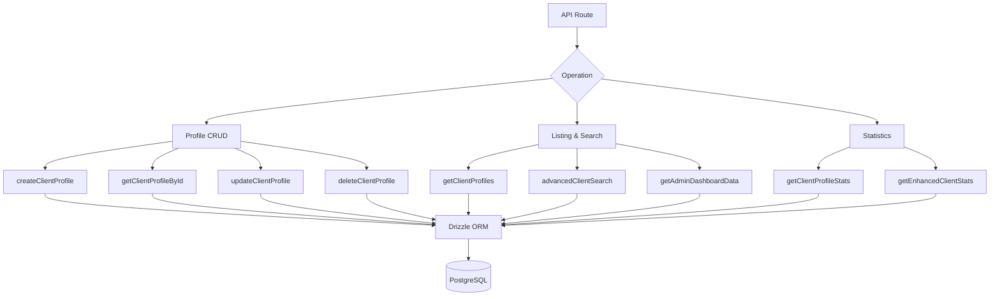

# Zapytania skierowane do klienta

Zapytania klientów obsługują zarządzanie profilami, wyświetlanie list z metadanymi uwierzytelniającymi, zaawansowane wyszukiwanie wielokryterialne i kompleksowe statystyki. Wszystkie funkcje znajdują się w `client.queries.ts` i są wykorzystywane zarówno przez interfejsy API skierowane do administratora, jak i klienta.

## Architektura zapytań klientów



## Profil CRUD

### Utwórz profil

Nowe profile automatycznie generują unikalne nazwy użytkowników na podstawie adresu e-mail, jeśli nie podano żadnej nazwy użytkownika:

```typescript
export async function createClientProfile(data: {
  userId: string;
  email: string;
  name: string;
  displayName?: string;
  username?: string;
  bio?: string;
  jobTitle?: string;
  company?: string;
  status?: string;
  plan?: string;
  accountType?: string;
}): Promise<ClientProfile>
```

Logika generowania nazwy użytkownika:

1. Jeśli podano `username`, znormalizuj i zapewnij niepowtarzalność
2. W przeciwnym razie wyodrębnij nazwę użytkownika z wiadomości e-mail za pośrednictwem `extractUsernameFromEmail()`
3. Rozwiązanie zastępcze: wygeneruj prefiks `user<timestamp>`
4. Wszystkie ścieżki przebiegają przez `ensureUniqueUsername()`, który w razie potrzeby dodaje przyrostki numeryczne

Wartości domyślne stosowane podczas tworzenia:

|Pole|Domyślne|
|-------|---------|
|`displayName`|Taki sam jak `name`|
|`bio`|`"Welcome! I'm a new user on this platform."`|
|`jobTitle`|`"User"`|
|`company`|`"Unknown"`|
|`status`|`"active"`|
|`plan`|`"free"`|
|`accountType`|`"individual"`|

### Przeczytaj Operacje

|Funkcja|Pole wyszukiwania|Powroty|
|----------|-------------|---------|
|`getClientProfileById(id)`|`clientProfiles.id`|`Profil Klienta \|null`|
|`getClientProfileByUserId(userId)`|`clientProfiles.userId`|`Profil Klienta \|null`|
|`getClientProfileByEmail(email)`|Za pośrednictwem tabeli `accounts`|`Profil Klienta \|null`|

Wyszukiwanie e-mailowe odbywa się poprzez tabelę `accounts` w celu znalezienia powiązanego `userId`, a następnie wysyła zapytanie `clientProfiles`:

```typescript
export async function getClientProfileByEmail(email: string): Promise<ClientProfile | null> {
  const account = await getClientAccountByEmail(email);
  if (!account) return null;
  const [profile] = await db
    .select()
    .from(clientProfiles)
    .where(eq(clientProfiles.userId, account.userId))
    .limit(1);
  return profile || null;
}
```

### Aktualizuj i usuń

- **`updateClientProfile(id, data)`** — Częściowa aktualizacja z automatycznym znacznikiem czasu `updatedAt`
- **`deleteClientProfile(id)`** — Twarde usunięcie (zwraca sukces boolowski)

## Lista paginowana

`getClientProfiles` zwraca wyniki podzielone na strony z danymi dostawcy uwierzytelniania, z wyłączeniem użytkowników administracyjnych:

```typescript
export async function getClientProfiles(params: {
  page?: number;
  limit?: number;
  search?: string;
  status?: string;
  plan?: string;
  accountType?: string;
  provider?: string;
}): Promise<{
  profiles: ClientProfileWithAuth[];
  total: number;
  page: number;
  totalPages: number;
  limit: number;
}>
```

### Admin Exclusion Pattern

Zarówno zapytanie o liczbę, jak i zapytanie o dane używają wzorca LEFT JOIN + IS NULL, aby wykluczyć użytkowników administracyjnych:

```typescript
.leftJoin(userRoles, eq(userRoles.userId, clientProfiles.userId))
.leftJoin(roles, and(eq(userRoles.roleId, roles.id), eq(roles.isAdmin, true)))
.where(isNull(roles.id))  // Only non-admin users
```

### Provider Subquery

Aby uniknąć zduplikowanych wierszy, gdy użytkownik ma wiele kont uwierzytelniających, dostawca jest rozpoznawany za pomocą podzapytania skalarnego:

```typescript
accountProvider: sql<string>`coalesce(
  (SELECT provider FROM ${accounts}
   WHERE ${accounts.userId} = ${clientProfiles.userId}
   LIMIT 1),
  'unknown'
)`
```

### Search Filter

Wyszukiwanie tekstowe wykorzystuje `ILIKE` w wielu polach z zapobieganiem wstrzykiwaniu SQL:

```typescript
const escapedSearch = search
  .replace(/\\/g, '\\\\')
  .replace(/[%_]/g, '\\$&');

whereConditions.push(
  sql`(${clientProfiles.username} ILIKE ${`%${escapedSearch}%`} OR
       ${clientProfiles.displayName} ILIKE ${`%${escapedSearch}%`} OR
       ${clientProfiles.company} ILIKE ${`%${escapedSearch}%`} OR
       ${clientProfiles.name} ILIKE ${`%${escapedSearch}%`} OR
       ${clientProfiles.email} ILIKE ${`%${escapedSearch}%`})`
);
```

## Zaawansowane wyszukiwanie klientów

`advancedClientSearch` obsługuje ponad 20 kryteriów filtrowania w wielu kategoriach:

|Kategoria filtra|Parametry|
|----------------|------------|
|**Wyszukiwanie tekstowe**|`search` (imię i nazwisko, adres e-mail, nazwa użytkownika, firma, biografia, stanowisko, branża, lokalizacja)|
|**Filtry wyliczeniowe**|`status`, `plan`, `accountType`, `provider`|
|**Zakresy dat**|`createdAfter`, `createdBefore`, `updatedAfter`, `updatedBefore`, `dateRange`|
|**Specyficzne dla danej dziedziny**|`emailDomain`, `companySearch`, `locationSearch`, `industrySearch`|
|**Numeryczne**|`minSubmissions`, `maxSubmissions`|
|**wartość logiczna**|`hasAvatar`, `hasWebsite`, `hasPhone`, `emailVerified`, `twoFactorEnabled`|
|**Sortowanie**|`sortBy`, `sortOrder`|

## Statystyki klientów

### Basic Statistics

`getClientProfileStats` zwraca proste liczby:

```typescript
{
  total: number;
  active: number;
  inactive: number;
  byPlan: Record<string, number>;
  byAccountType: Record<string, number>;
}
```

### Enhanced Statistics

`getEnhancedClientStats` zapewnia kompleksowy, wielowymiarowy podział:

```typescript
{
  overview: { total, active, inactive, suspended, trial },
  byProvider: { credentials, google, github, facebook, twitter, linkedin, other },
  byPlan: { free: number, standard: number, premium: number },
  byAccountType: { individual, business, enterprise },
  activity: { newThisWeek, newThisMonth, activeThisWeek, activeThisMonth },
  growth: { weeklyGrowth, monthlyGrowth },
}
```

Ulepszone statystyki wykorzystują `countDistinct` z połączeniami wielostołowymi, aby generować dokładne liczby, nawet jeśli użytkownicy mają wielu dostawców kont:

```typescript
const statsResult = await db
  .select({
    status: clientProfiles.status,
    plan: clientProfiles.plan,
    accountType: clientProfiles.accountType,
    provider: accounts.provider,
    count: countDistinct(clientProfiles.id)
  })
  .from(clientProfiles)
  .leftJoin(accounts, eq(clientProfiles.userId, accounts.userId))
  .leftJoin(userRoles, eq(userRoles.userId, clientProfiles.userId))
  .leftJoin(roles, and(eq(userRoles.roleId, roles.id), eq(roles.isAdmin, true)))
  .where(isNull(roles.id))
  .groupBy(
    clientProfiles.status,
    clientProfiles.plan,
    clientProfiles.accountType,
    accounts.provider
  );
```

### Activity Metrics

Okna aktywności są obliczane przy użyciu arytmetyki dat:

```typescript
const oneWeekAgo = new Date(now.getTime() - 7 * 24 * 60 * 60 * 1000);
const oneMonthAgo = new Date(now.getTime() - 30 * 24 * 60 * 60 * 1000);
```

Wskaźniki wzrostu to uproszczone odsetki nowych rejestracji w stosunku do całości:

```typescript
const weeklyGrowth = total > 0 ? Math.round((newThisWeek / total) * 100) : 0;
```

## Typy

Wszystkie typy zapytań klientów są zdefiniowane w `lib/db/queries/types.ts`:

```typescript
export type ClientProfileWithAuth = ClientProfile & {
  accountProvider: string;
  isActive: boolean;
};

export type ClientStatus = "active" | "inactive" | "suspended" | "trial";
export type ClientPlan = "free" | "standard" | "premium";
export type ClientAccountType = "individual" | "business" | "enterprise";
```
