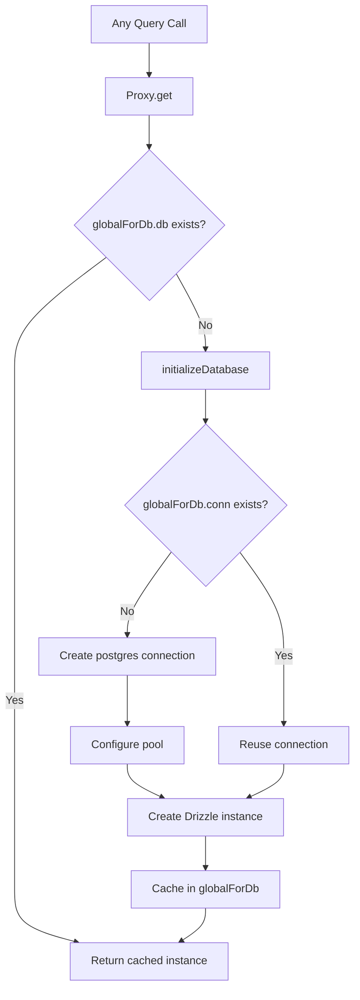

# Połączenie z bazą danych i tworzenie puli

Szablon wykorzystuje `postgres.js` (pakiet `postgres` npm) jako sterownik PostgreSQL z Drizzle ORM. Zarządzanie połączeniami odbywa się poprzez leniwy wzorzec inicjalizacji z globalną pamięcią podręczną singleton, aby przetrwać wymianę modułu na gorąco (HMR) w Next.js w fazie rozwoju.

## Architektura połączeń



## Konfiguracja bazy danych (`lib/db/drizzle.ts`)

### Leniwa inicjalizacja za pomocą serwera proxy

Instancja bazy danych jest eksportowana jako `Proxy`, który inicjuje połączenie przy pierwszym dostępie:

```typescript
export const db = new Proxy({} as ReturnType<typeof drizzle>, {
  get(target, prop) {
    const database = initializeDatabase();
    return database[prop as keyof typeof database];
  },
});
```

Zapewnia to:
- W czasie importu nie jest tworzone żadne połączenie
- Skrypty, które importują moduł, ale nie wysyłają zapytań do bazy danych, nie powodują narzutu połączenia
- Pierwsza faktyczna operacja na bazie danych wyzwala inicjalizację

### Funkcja inicjalizacji

```typescript
function initializeDatabase(): ReturnType<typeof drizzle> {
  if (!getDatabaseUrl()) {
    throw new Error('DATABASE_URL environment variable is required');
  }

  if (globalForDb.db) {
    return globalForDb.db;
  }

  const poolSize = getPoolSize();
  const conn = postgres(getDatabaseUrl()!, {
    max: poolSize,
    idle_timeout: 20,
    connect_timeout: 30,
    prepare: false,
    onnotice: getNodeEnv() === 'development' ? console.log : undefined,
  });

  globalForDb.conn = conn;
  globalForDb.db = drizzle(conn, { schema });
  return globalForDb.db;
}
```

### Opcje połączenia

|Opcja|Wartość|Cel|
|--------|-------|---------|
|`max`|Konfigurowalny (patrz rozmiar basenu)|Maksymalna liczba połączeń w basenie|
|`idle_timeout`|`20` sekund|Po upływie tego czasu zamknij nieużywane połączenia|
|`connect_timeout`|`30` sekund|Maksymalny czas nawiązania połączenia|
|`prepare`|`false`|Wyłącz przygotowane instrukcje (wymagane w niektórych środowiskach PaaS)|
|`onnotice`|`console.log` (tylko dla programistów)|Rejestruj komunikaty PostgreSQL UWAGA w fazie rozwoju|

## Rozmiar basenu

### Konfiguracja

Rozmiar puli można konfigurować za pomocą zmiennej środowiskowej `DB_POOL_SIZE`, z ustawieniami domyślnymi uwzględniającymi środowisko:

```typescript
const getPoolSize = (): number => {
  const envPoolSize = process.env.DB_POOL_SIZE;
  if (envPoolSize) {
    const parsed = parseInt(envPoolSize, 10);
    return isNaN(parsed) ? 20 : Math.max(1, Math.min(parsed, 50));
  }
  return getNodeEnv() === 'production' ? 20 : 10;
};
```

### Domyślne

|Środowisko|Domyślny rozmiar puli|Zasięg|
|-------------|------------------|-------|
|Produkcja| 20 | 1 - 50 |
|Rozwój| 10 | 1 - 50 |

Rozmiar puli jest ograniczony w zakresie od 1 do 50, niezależnie od skonfigurowanej wartości.

### Wytyczne dotyczące wielkości basenu

- **Rozwój (10):** Wystarczający dla jednego programisty z HMR. Utrzymuje niskie zużycie zasobów.
- **Produkcja (20):** Obsługuje współbieżne żądania API. Zwiększenie w przypadku wdrożeń o dużym natężeniu ruchu.
- **Bezserwerowy (1-5):** Użyj małych pul w przypadku wdrożenia na platformach bezserwerowych, gdzie każda instancja otrzymuje własną pulę.

## Globalny wzór singletona

### Bezpieczeństwo HMR

Tryb programistyczny Next.js ponownie wykonuje moduły po zmianie pliku. Bez ochrony każdy cykl HMR tworzyłby nową pulę połączeń, szybko wyczerpując połączenia z bazą danych.

Szablon dołącza połączenie do `globalThis`, aby przetrwać HMR:

```typescript
const globalForDb = globalThis as unknown as {
  conn: postgres.Sql | undefined;
  db: ReturnType<typeof drizzle> | undefined;
};
```

Kiedy moduł wykonuje się ponownie:
1. `initializeDatabase()` sprawdza `globalForDb.db`
2. Jeśli instancja istnieje, jest natychmiast zwracana
3. Jeśli połączenie istnieje, ale instancja Drizzle nie, istniejące połączenie zostanie ponownie wykorzystane

Rejestrowanie rozwoju wskazuje, czy połączenie zostało ponownie wykorzystane:

```
Reusing existing database connection; pool size is unchanged
```

lub świeżo utworzone:

```
Database connection established successfully with pool size: 10
```

### Bezpośredni dostęp do instancji

W przypadku bibliotek wymagających konkretnej instancji Drizzle (np. adaptera Auth.js) dostępna jest funkcja getter:

```typescript
export function getDrizzleInstance(): ReturnType<typeof drizzle> {
  return initializeDatabase();
}
```

## Moduł konfiguracyjny (`lib/db/config.ts`)

Bezpieczny dla skryptów moduł konfiguracyjny, który **nie** importuje `server-only`, umożliwiając jego użycie w skryptach migracji i inicjowania:

```typescript
export function getDatabaseUrl(): string | undefined {
  return process.env.DATABASE_URL;
}

export function getNodeEnv(): 'development' | 'production' | 'test' {
  const env = process.env.NODE_ENV;
  if (env === 'production' || env === 'test') return env;
  return 'development';
}

export function isProduction(): boolean {
  return getNodeEnv() === 'production';
}
```

## Biegacz migracji (`lib/db/migrate.ts`)

Moduł migracji jest idempotentny i można go bezpiecznie wywołać przy każdym uruchomieniu aplikacji:

```typescript
export async function runMigrations(): Promise<boolean> {
  const { db } = await import('./drizzle');
  await migrate(db, { migrationsFolder: './lib/db/migrations' });
  return true;
}
```

Kluczowe zachowania:
- Drizzle śledzi zastosowane migracje w `drizzle.__drizzle_migrations`
- Już zastosowane migracje są automatycznie pomijane
- Zwraca `true` w przypadku powodzenia, `false` w przypadku niepowodzenia (nie wyrzuca)
- Rejestruje stan migracji przed i po wykonaniu

## Zmienne środowiskowe

|Zmienna|Wymagane|Domyślne|Opis|
|----------|----------|---------|-------------|
|`DATABASE_URL`|Tak| -- |Ciąg połączenia PostgreSQL|
|`DB_POOL_SIZE`|Nie|`20` (prod) / `10` (programista)|Rozmiar puli połączeń (1-50)|
|`NODE_ENV`|Nie|`development`|Środowisko (rozwój/produkcja/testowanie)|

## Konfiguracja zestawu do mżawki

Konfiguracja zestawu Drizzle Kit do generowania schematów i zarządzania migracjami:

```typescript
// drizzle.config.ts
export default {
  schema: "./lib/db/schema.ts",
  out: "./lib/db/migrations",
  dialect: "postgresql",
  dbCredentials: {
    url: process.env.DATABASE_URL,
  },
} satisfies Config;
```

## Rozwiązywanie problemów

|Problem|Przyczyna|Rozwiązanie|
|-------|-------|----------|
|`DATABASE_URL is required`|Brakuje zmiennej środowiskowej|Ustaw `DATABASE_URL` w `.env.local`|
|Przekroczenia limitu czasu połączenia|Wolna sieć lub przeciążona baza danych|Zwiększ `connect_timeout` lub sprawdź stan bazy danych|
|Wyczerpanie basenu w deweloperce|HMR tworzy wiele pul|Upewnij się, że wzór `globalForDb` jest nienaruszony|
|Wyczerpanie basenu w prod|Zbyt wiele jednoczesnych żądań|Zwiększ `DB_POOL_SIZE` (maks. 50)|
|Błędy `prepare` w PaaS|PaaS pgBouncer w trybie transakcyjnym|Zachowaj `prepare: false`|
