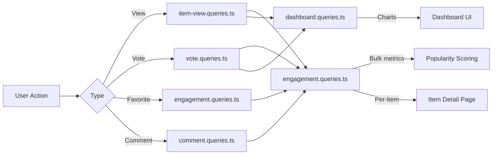

# Zapytania dotyczące zaangażowania i interakcji

Zapytania angażujące agregują interakcje użytkowników (wyświetlenia, głosy, ulubione, komentarze) pomiędzy elementami. Zapytania te wspomagają sortowanie popularności, wykresy na pulpicie nawigacyjnym i panele zaangażowania według pozycji. Odpowiednie moduły to `engagement.queries.ts`, `vote.queries.ts`, `comment.queries.ts`, `item-view.queries.ts` i `dashboard.queries.ts`.

## Przepływ danych dotyczących zaangażowania



## Metryki zbiorczego zaangażowania (`engagement.queries.ts`)

### `getEngagementMetricsPerItem`

Podstawowa funkcja punktacji popularności. Zwraca wszystkie wymiary zaangażowania dla wielu elementów w jednej równoległej partii zapytań:

```typescript
export async function getEngagementMetricsPerItem(
  itemSlugs: string[]
): Promise<Map<string, ItemEngagementMetrics>>
```

Typ zwrotu:

```typescript
export interface ItemEngagementMetrics {
  views: number;
  votes: number;       // Net votes (upvotes - downvotes)
  favorites: number;
  comments: number;
  avgRating: number;   // Average rating from comments (0-5)
}
```

### Strategia zapytań równoległych

Cztery niezależne zapytania uruchamiane poprzez `Promise.all` zapewniają maksymalną przepustowość:

```typescript
const [viewsData, votesData, favoritesData, commentsData] = await Promise.all([
  // 1. Views per item
  db.select({ itemId: itemViews.itemId, count: count() })
    .from(itemViews)
    .where(inArray(itemViews.itemId, itemSlugs))
    .groupBy(itemViews.itemId),

  // 2. Net votes per item (upvotes - downvotes)
  db.select({
      itemId: votes.itemId,
      netScore: sql<number>`SUM(CASE
        WHEN vote_type = 'upvote' THEN 1
        WHEN vote_type = 'downvote' THEN -1
        ELSE 0 END)`.as('netScore'),
    })
    .from(votes)
    .where(inArray(votes.itemId, itemSlugs))
    .groupBy(votes.itemId),

  // 3. Favorites per item
  db.select({ itemSlug: favorites.itemSlug, count: count() })
    .from(favorites)
    .where(inArray(favorites.itemSlug, itemSlugs))
    .groupBy(favorites.itemSlug),

  // 4. Comments count + average rating (excluding soft-deleted)
  db.select({
      itemId: comments.itemId,
      count: count(),
      avgRating: sql<number>`COALESCE(AVG(${comments.rating}), 0)`.as('avgRating'),
    })
    .from(comments)
    .where(and(inArray(comments.itemId, itemSlugs), isNull(comments.deletedAt)))
    .groupBy(comments.itemId),
]);
```

### Normalizacja wyników

Każdy wynik zapytania jest konwertowany na `Map` dla wyszukiwania O(1), a następnie łączony w ostateczną mapę metryk:

```typescript
const viewsMap = new Map<string, number>(
  viewsData.map(v => [v.itemId, Number(v.count)])
);
// ... same for votesMap, favoritesMap, commentsMap

for (const slug of itemSlugs) {
  metricsMap.set(slug, {
    views: viewsMap.get(slug) ?? 0,
    votes: votesMap.get(slug) ?? 0,
    favorites: favoritesMap.get(slug) ?? 0,
    comments: commentsMap.get(slug)?.count ?? 0,
    avgRating: commentsMap.get(slug)?.avgRating ?? 0,
  });
}
```

### Samodzielne funkcje metryczne

|Funkcja|Powroty|Opis|
|----------|---------|-------------|
|`getFavoritesPerItem(itemSlugs)`|`Map<string, number>`|Liczba ulubionych na przedmiot|
|`getCommentsPerItem(itemSlugs)`|`Map<string, { count, avgRating }>`|Liczba komentarzy i średnie oceny|

Obie funkcje korzystają z tego samego wzorca: wcześniejszy powrót dla pustych tablic, agregacja `groupBy`, konstrukcja `Map`.

## Zapytania dotyczące głosowania (`vote.queries.ts`)

### Głosuj na CRUD

|Funkcja|Opis|
|----------|-------------|
|`createVote(vote)`|Utwórz głosowanie z normalizacją ślimaka|
|`getVoteByUserIdAndItemId(userId, itemSlug)`|Sprawdź istniejący głos|
|`deleteVote(voteId)`|Twarde usunięcie głosu|

Wszystkie funkcje głosowania normalizują informacje o elementach poprzez `getItemIdFromSlug()` przed wysłaniem zapytania.

### Obliczanie wyniku netto

Indywidualna ocena pozycji przy użyciu warunkowego `SUM`:

```typescript
export async function getVoteCountForItem(itemSlug: string): Promise<number> {
  const itemId = getItemIdFromSlug(itemSlug);
  const [result] = await db
    .select({
      netScore: sql<number>`
        SUM(CASE
          WHEN vote_type = 'upvote' THEN 1
          WHEN vote_type = 'downvote' THEN -1
          ELSE 0
        END)`.as('netScore')
    })
    .from(votes)
    .where(eq(votes.itemId, itemId));
  return Number(result?.netScore ?? 0);
}
```

### Wyniki głosowania zbiorczego

`getVotesPerItem` zwraca `Map<string, number>` wyników netto dla wielu pozycji przy użyciu `inArray` i `groupBy`.

### Przedmioty posortowane według głosowania

```typescript
export async function getItemsSortedByVotes(limit = 10, offset = 0) {
  return db
    .select({
      itemId: votes.itemId,
      voteCount: sql<number>`count(${votes.id})`.as('vote_count')
    })
    .from(votes)
    .groupBy(votes.itemId)
    .orderBy(sql`vote_count DESC`)
    .limit(limit)
    .offset(offset);
}
```

## Zapytania w komentarzach (`comment.queries.ts`)

### Skomentuj CRUD

|Funkcja|Opis|
|----------|-------------|
|`createComment(data)`|Twórz z normalizacją ślimaka|
|`getCommentById(id)`|Surowy zapis komentarza|
|`getCommentWithUserById(id)`|Skomentuj, dołączając profil użytkownika|
|`updateComment(id, { content?, rating? })`|Zaktualizuj za pomocą znacznika czasu `editedAt`|
|`updateCommentRating(id, rating)`|Aktualizacja dotycząca wyłącznie ocen|
|`deleteComment(id)`|Miękkie usuwanie (`deletedAt = new Date()`)|

### Komentarze z danymi użytkownika

`getCommentsByItemId` używa `innerJoin` z `clientProfiles`, aby wzbogacić każdy komentarz o informacje o autorze:

```typescript
export async function getCommentsByItemId(itemSlug: string): Promise<CommentWithUser[]> {
  const itemId = getItemIdFromSlug(itemSlug);
  return db
    .select({
      id: comments.id,
      content: comments.content,
      rating: comments.rating,
      userId: comments.userId,
      itemId: comments.itemId,
      createdAt: comments.createdAt,
      updatedAt: comments.updatedAt,
      editedAt: comments.editedAt,
      deletedAt: comments.deletedAt,
      user: {
        id: clientProfiles.id,
        name: clientProfiles.name,
        email: clientProfiles.email,
        image: clientProfiles.avatar
      }
    })
    .from(comments)
    .innerJoin(clientProfiles, eq(comments.userId, clientProfiles.id))
    .where(and(eq(comments.itemId, itemId), isNull(comments.deletedAt)))
    .orderBy(desc(comments.createdAt));
}
```

## Wyświetl śledzenie (`item-view.queries.ts`)

### Codzienna deduplikacja

Wyświetlenia są deduplikowane na widza, na element, na dzień UTC, przy użyciu wzorca upsert `onConflictDoNothing`:

```typescript
export async function recordItemView(
  view: Pick<NewItemView, 'itemId' | 'viewerId' | 'viewedDateUtc'>
): Promise<boolean> {
  const result = await db
    .insert(itemViews)
    .values(view)
    .onConflictDoNothing()
    .returning({ id: itemViews.id });
  return result.length > 0; // true = new view, false = duplicate
}
```

### Wyświetl funkcje agregujące

|Funkcja|Parametry|Powroty|Opis|
|----------|-----------|---------|-------------|
|`getTotalViewsCount(itemSlugs)`|`string[]`|`number`|Łączna liczba wyświetleń elementów|
|`getRecentViewsCount(itemSlugs, days)`|`string[], number`|`number`|Wyświetlenia w ciągu ostatnich N dni|
|`getDailyViewsData(itemSlugs, days)`|`string[], number`|`Map<string, number>`|Liczy się dzienna liczba wyświetleń|
|`getViewsPerItem(itemSlugs)`|`string[]`|`Map<string, number>`|Liczba wyświetleń na element|

### Pomocnik daty UTC

Wszystkie obliczenia dat korzystają z czasu UTC, aby zapobiec błędom związanym ze strefą czasową:

```typescript
function getUtcDateString(daysAgo: number = 0): string {
  const date = new Date();
  date.setUTCDate(date.getUTCDate() - daysAgo);
  return date.toISOString().split('T')[0]; // "YYYY-MM-DD"
}
```

## Statystyki panelu (`dashboard.queries.ts`)

### Dostępne metryki

|Funkcja|Cel|
|----------|---------|
|`getVotesReceivedCount(itemSlugs)`|Całkowita liczba głosów na przedmioty użytkownika|
|`getCommentsReceivedCount(itemSlugs)`|Całkowita liczba komentarzy do elementów użytkownika|
|`getUniqueItemsInteractedCount(clientId)`|Elementy, z którymi użytkownik się kontaktował|
|`getUserTotalActivityCount(clientId)`|Całkowita liczba głosów + komentarze użytkownika|
|`getWeeklyEngagementData(itemSlugs, weeks)`|Tygodniowe zagregowane dane wykresu|
|`getDailyActivityData(clientId, itemSlugs, days)`|Dzienny podział aktywności|
|`getTopItemsEngagement(itemSlugs, limit)`|Najlepsze pozycje według wyniku zaangażowania|

### Tygodniowe podsumowanie zaangażowania

Używa `to_char` PostgreSQL z formatem tygodnia ISO w celu spójnego grupowania tygodni:

```typescript
const weeklyVotes = await db
  .select({
    week: sql<string>`to_char(${votes.createdAt}, 'IYYY-IW')`.as('week'),
    count: count(),
  })
  .from(votes)
  .where(and(inArray(votes.itemId, itemSlugs), gte(votes.createdAt, startDate)))
  .groupBy(sql`to_char(${votes.createdAt}, 'IYYY-IW')`)
  .orderBy(sql`to_char(${votes.createdAt}, 'IYYY-IW')`);
```

## Rozważania dotyczące wydajności

- Wszystkie funkcje masowe akceptują tablice i używają `inArray` do przetwarzania wsadowego
- Dane wejściowe pustej tablicy wracają wcześniej bez uderzania w bazę danych
- `Promise.all` uruchamia jednocześnie niezależne agregacje
- Struktury danych `Map` zapewniają wyszukiwanie O(1) podczas składania wyników
- Komentarze usunięte w sposób miękki są wykluczane za pośrednictwem `isNull(comments.deletedAt)` we wszystkich agregacjach
