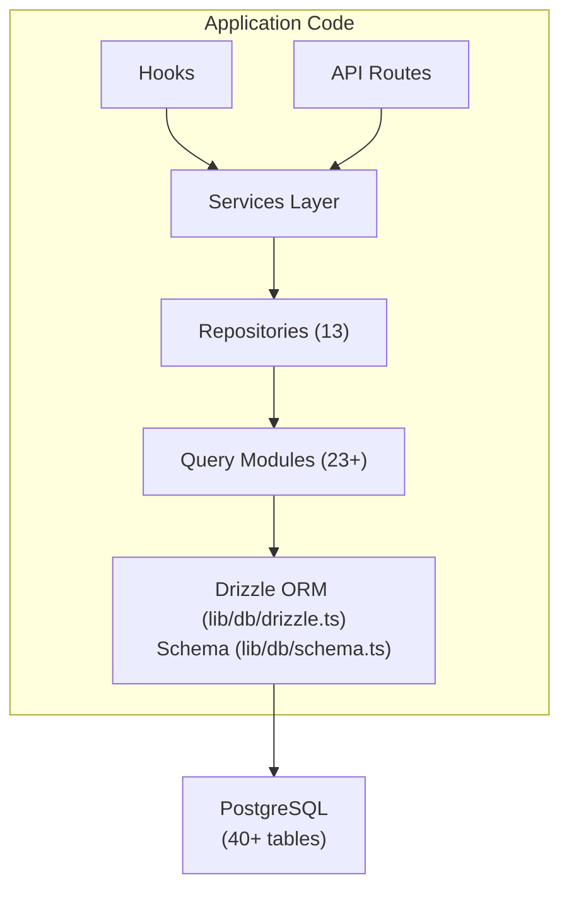

# Przegląd bazy danych

Szablon Ever Works wykorzystuje **Drizzle ORM** z **PostgreSQL** jako warstwę bazy danych. Baza danych jest opcjonalna — aplikacja może działać bez niej w przypadku wdrożeń obejmujących wyłącznie zawartość — ale obsługuje wszystkie funkcje użytkownika, subskrypcji, zaangażowania i administratora.

## Stos technologii

|Komponent|Technologia|Cel|
|-----------|-----------|---------|
|ORM|Skropić ORM|Kreator zapytań bezpieczny dla typu i zarządzanie schematami|
|Baza danych|PostgreSQL|Podstawowa relacyjna baza danych|
|Kierowca|`postgres` (postgres.js)|Klient PostgreSQL dla Node.js|
|Migracje|Zestaw do mżawki|Generowanie i wykonanie migracji schematu|
|Siew|`drizzle-seed` + niestandardowe skrypty|Inicjalizacja bazy danych z danymi domyślnymi|

## Architektura bazy danych



## Konfiguracja

### Konfiguracja Drizzle (`drizzle.config.ts`)

```typescript
export default {
  schema: "./lib/db/schema.ts",
  out: "./lib/db/migrations",
  dialect: "postgresql",
  dbCredentials: {
    url: process.env.DATABASE_URL,
  },
} satisfies Config;
```

Konfiguracja wskazuje na:
- **Plik schematu**: `lib/db/schema.ts` — pojedyncze źródło prawdy dla wszystkich definicji tabel
- **Wyjście migracji**: `lib/db/migrations/` — gdzie przechowywane są wygenerowane pliki migracji SQL
- **Dialekt**: PostgreSQL
- **Połączenie**: poprzez zmienną środowiskową `DATABASE_URL`

### Zarządzanie połączeniami (`lib/db/drizzle.ts`)

Połączenie z bazą danych jest inicjowane leniwie przy pierwszym użyciu i ponownie wykorzystuje połączenia podczas gorących przeładowań w fazie rozwoju za pośrednictwem globalnego wzorca singletonu.

Kluczowe cechy:
- **Leniwa inicjalizacja**: Połączenie z bazą danych nie zostanie utworzone, dopóki nie zostanie wykonane pierwsze zapytanie
- **Dostęp oparty na proxy**: Wyeksportowany obiekt `db` wykorzystuje JavaScript `Proxy` do przezroczystej inicjalizacji połączenia
- **Pule połączeń**: Konfigurowalny rozmiar puli za pomocą zmiennej środowiskowej `DB_POOL_SIZE` (domyślnie: 20 w produkcji, 10 w fazie rozwoju, zaciśnięte 1-50)
- **Limit czasu bezczynności**: Połączenia są zrywane po 20 sekundach bezczynności
- **Limit czasu połączenia**: 30-sekundowy limit czasu na nawiązanie nowych połączeń
- **Wzorzec Singleton**: Używa `globalThis` do utrzymywania połączeń podczas gorących przeładowań Next.js

```typescript
// Usage - just import and use
import { db } from '@/lib/db/drizzle';

const users = await db.select().from(schema.users);
```

### Zmienne środowiskowe

|Zmienna|Wymagane|Domyślne|Opis|
|----------|----------|---------|-------------|
|`DATABASE_URL`|Nie| - |Ciąg połączenia PostgreSQL|
|`DB_POOL_SIZE`|Nie| 10/20 |Rozmiar puli połączeń (dev/prod)|

Jeśli `DATABASE_URL` nie jest ustawione, funkcje bazy danych są dyskretnie wyłączone, umożliwiając aplikacji działanie w trybie tylko zawartości.

## Przegląd schematu

Schemat bazy danych jest zdefiniowany w jednym pliku (`lib/db/schema.ts`) zawierającym ponad 40 tabel uporządkowanych według domen:

|Domena|Stoły|Opis|
|--------|--------|-------------|
|Użytkownicy i autoryzacja| 8 |Użytkownicy, konta, sesje, tokeny, uwierzytelniacze|
|Role i uprawnienia| 3 |RBAC z rolami, uprawnieniami i mapowaniami ról i uprawnień|
|Profile klientów| 1 |Rozszerzone profile użytkowników dla kont klientów|
|Zaangażowanie treści| 4 |Komentarze, głosy, ulubione, widoki elementów|
|Subskrypcje| 4 |Plany, historia subskrypcji, dostawcy płatności, rachunki płatnicze|
|Powiadomienia| 1 |System powiadomień w aplikacji|
|Administracja i moderacja| 4 |Raporty, historia moderacji, dzienniki audytu elementów, dzienniki aktywności|
|Integracje| 2 |Konfiguracja CRM, mapowania integracji|
|Firmy| 2 |Spółki i stowarzyszenia przedmiotowo-firmowe|
|Reklamy sponsorskie| 1 |Reklamy artykułów sponsorowanych|
|Ankiety| 2 |Ankiety i odpowiedzi na ankiety|
|Biuletyn| 1 |Subskrypcje biuletynu|
|Systemu| 1 |Śledzenie statusu nasion|

## Inicjalizacja bazy danych

Podczas uruchamiania aplikacji (przez `instrumentation.ts`) szablon automatycznie:

1. **Uruchamia migracje**: Funkcja `migrate()` Drizzle stosuje wszystkie oczekujące migracje (idempotent – już zastosowane migracje są pomijane)
2. **Dane początkowe**: Jeśli baza danych nie została zaszczepiona, skrypt źródłowy działa z doradczą ochroną przed blokadą, aby zapobiec warunkom wyścigowym we wdrożeniach wieloprocesowych

Zajmuje się tym `lib/db/initialize.ts`. Aby uzyskać szczegółowe informacje, zobacz [Przewodnik po migracji](./migrations-guide) i [Zakładanie bazy danych](./seeding).

## Kluczowe polecenia

```bash
# Generate a migration from schema changes
pnpm db:generate

# Run pending migrations
pnpm db:migrate

# Seed the database
pnpm db:seed

# Open Drizzle Studio (database GUI)
pnpm db:studio
```
