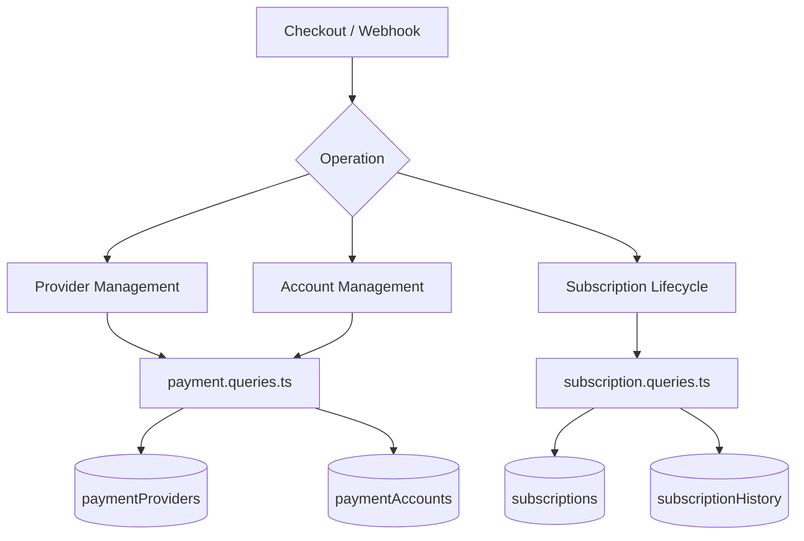
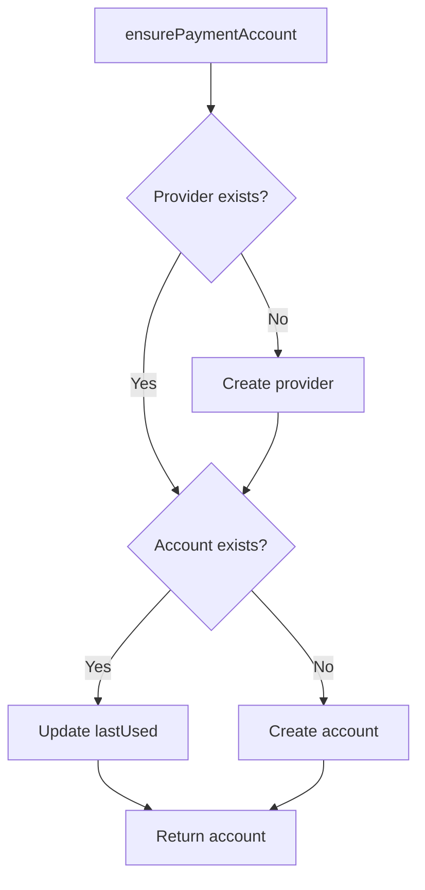
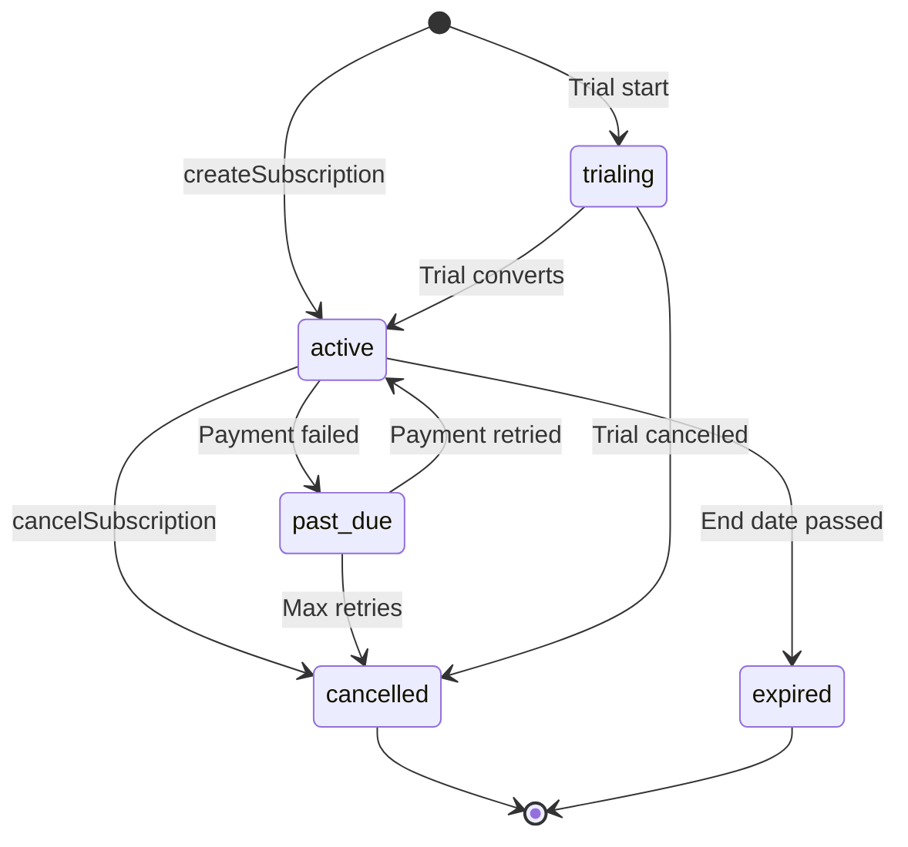

# Zapytania dotyczące płatności i subskrypcji

Zapytania dotyczące płatności zarządzają rejestrem dostawców, kontami płatniczymi użytkowników i pełnym cyklem życia subskrypcji. Odpowiednie moduły to `payment.queries.ts` i `subscription.queries.ts`.

## Architektura systemu płatności



## Zapytania dostawców płatności (`payment.queries.ts`)

### Dostawca CRUD

|Funkcja|Opis|
|----------|-------------|
|`getPaymentProvider(id)`|Uzyskaj dostawcę według identyfikatora|
|`getPaymentProviderByName(name)`|Uzyskaj dostawcę według nazwy (np. `'stripe'`)|
|`getActivePaymentProviders()`|Lista wszystkich aktywnych dostawców, uporządkowana według nazwy|
|`createPaymentProvider(data)`|Utwórz nowy rekord dostawcy|
|`updatePaymentProvider(id, data)`|Częściowa aktualizacja pól dostawców|
|`deactivatePaymentProvider(id)`|Ustaw `isActive = false`|

Obsługiwane nazwy dostawców: `stripe`, `lemonsqueezy`, `polar`, `solidgate`.

### Zapytania dotyczące konta płatniczego

Konta płatnicze łączą użytkownika z identyfikatorem klienta specyficznym dla dostawcy:

|Funkcja|Opis|
|----------|-------------|
|`getPaymentAccountByUserId(userId, providerId)`|Uzyskaj konto z aktywnym sprawdzeniem dostawcy|
|`getPaymentAccountByCustomerId(customerId, providerId)`|Wyszukiwanie wsteczne według identyfikatora klienta|
|`createPaymentAccount(data)`|Utwórz konto ze znacznikiem czasu `lastUsed`|
|`updatePaymentAccountLastUsed(accountId)`|Kliknij `lastUsed` sygnaturę czasową|
|`getUserPaymentAccountByProvider(userId, providerName)`|Wyszukaj według nazwy dostawcy (najpierw rozwiązuje dostawcę)|

### Weryfikacja aktywnego dostawcy

`getPaymentAccountByUserId` wykonuje potrójne sprzężenie wewnętrzne, aby upewnić się, że zarówno dostawca, jak i użytkownik są ważni:

```typescript
export async function getPaymentAccountByUserId(
  userId: string,
  providerId: string
): Promise<PaymentAccount | null> {
  const result = await db
    .select({ /* payment account fields */ })
    .from(paymentAccounts)
    .innerJoin(paymentProviders, eq(paymentAccounts.providerId, paymentProviders.id))
    .innerJoin(users, eq(paymentAccounts.userId, users.id))
    .where(and(
      eq(paymentAccounts.userId, userId),
      eq(paymentAccounts.providerId, providerId),
      eq(paymentProviders.isActive, true)
    ))
    .limit(1);
  return result[0] || null;
}
```

### Zapewnij konto płatnicze

`ensurePaymentAccount` implementuje idempotentny wzorzec upsert dla rachunków płatniczych:



```typescript
export async function ensurePaymentAccount(
  providerName: string,
  userId: string,
  customerId: string,
  accountId?: string
): Promise<PaymentAccount>
```

### Skonfiguruj konto płatnicze użytkownika

`setupUserPaymentAccount` rozszerza wzorzec zapewnienia o wykrywanie zmiany identyfikatora klienta:

```typescript
if (existingAccount.customerId !== customerId) {
  await db
    .update(paymentAccounts)
    .set({
      customerId,
      accountId: accountId || existingAccount.accountId,
      lastUsed: new Date(),
      updatedAt: new Date()
    })
    .where(eq(paymentAccounts.id, existingAccount.id));
}
```

### Wygodne aliasy

- `getOrCreatePaymentAccount` -- alias dla `ensurePaymentAccount`
- `createOrGetPaymentAccount` -- alias dla `setupUserPaymentAccount`

## Zapytania dotyczące subskrypcji (`subscription.queries.ts`)

### Wyszukiwanie subskrypcji

|Funkcja|Parametry|Powroty|
|----------|-----------|---------|
|`getUserActiveSubscription(userId)`|Identyfikator użytkownika|Aktywna subskrypcja lub null|
|`getUserSubscriptions(userId)`|Identyfikator użytkownika|Wszystkie subskrypcje (uporządkowane według daty)|
|`getSubscriptionByProviderSubscriptionId(provider, subId)`|Dostawca + identyfikator podrzędny|Subskrypcja lub null|
|`getSubscriptionByUserIdAndSubscriptionId(userId, subId)`|Użytkownik + identyfikator podrzędny|Subskrypcja lub null|
|`getSubscriptionWithUser(subId)`|Identyfikator subskrypcji|Subskrypcja z dołączeniem użytkownika|
|`hasActiveSubscription(userId)`|Identyfikator użytkownika|Wartość logiczna|

### Cykl życia subskrypcji

#### Utwórz

```typescript
export async function createSubscription(data: NewSubscription): Promise<Subscription> {
  const result = await db
    .insert(subscriptions)
    .values({ ...data, createdAt: new Date(), updatedAt: new Date() })
    .returning();
  return result[0];
}
```

#### Aktualizuj stan

Zmiany statusu są automatycznie ustawiane `cancelledAt` i `cancelReason` przy przejściu na `CANCELLED`:

```typescript
export async function updateSubscriptionStatus(
  subscriptionId: string,
  status: string,
  reason?: string
): Promise<Subscription | null>
```

#### Anuluj

Obsługuje zarówno natychmiastowe anulowanie, jak i anulowanie na koniec okresu:

```typescript
export async function cancelSubscription(
  subscriptionId: string,
  reason?: string,
  cancelAtPeriodEnd: boolean = false
): Promise<Subscription | null>
```

Gdy `cancelAtPeriodEnd = true`, status pozostaje `ACTIVE`, ale `cancelledAt` i `cancelAtPeriodEnd` są ustawione.

### Przepływ stanu subskrypcji



### Rozwiązanie planu

`getUserPlan` sprawdza wygaśnięcie subskrypcji i wraca do planu darmowego:

```typescript
export async function getUserPlan(userId: string): Promise<string> {
  const subscription = await getUserActiveSubscription(userId);
  if (!subscription) return PaymentPlan.FREE;
  return getEffectivePlan(subscription.planId, subscription.endDate, subscription.status);
}
```

`getUserPlanWithExpiration` zwraca pełne dane dotyczące ważności:

```typescript
{
  planId: string;         // Stored plan
  effectivePlan: string;  // Actual plan after expiration check
  isExpired: boolean;
  expiresAt: Date | null;
  status: string | null;
  subscriptionId: string | null;
}
```

### Wygaśnięcie i odnowienie

|Funkcja|Opis|
|----------|-------------|
|`getSubscriptionsExpiringSoon(days)`|Aktywne subskrypcje wygasają w ciągu N dni|
|`getExpiredSubscriptions()`|Subskrypcje po dacie zakończenia|
|`getSubscriptionsForRenewalReminder(days)`|Subskrypcje wymagające powiadomień o odnowieniu|

### Historia subskrypcji

Zmiany są rejestrowane w tabeli `subscriptionHistory`:

```typescript
export async function logSubscriptionHistory(data: NewSubscriptionHistory)
export async function getSubscriptionHistory(subscriptionId: string)
```

### Statystyki subskrypcji

`getSubscriptionStats` zwraca zagregowane liczby:

```typescript
{
  total: number;
  active: number;
  cancelled: number;
  expired: number;
  pastDue: number;
  trialing: number;
}
```

## Stałe schematu

```typescript
// lib/db/schema.ts
export const SubscriptionStatus = {
  ACTIVE: 'active',
  CANCELLED: 'cancelled',
  EXPIRED: 'expired',
  PAST_DUE: 'past_due',
  TRIALING: 'trialing',
} as const;

// lib/constants/payment.ts
export const PaymentPlan = {
  FREE: 'free',
  STANDARD: 'standard',
  PREMIUM: 'premium',
} as const;

export const PaymentProvider = {
  STRIPE: 'stripe',
  LEMONSQUEEZY: 'lemonsqueezy',
  POLAR: 'polar',
  SOLIDGATE: 'solidgate',
} as const;
```
