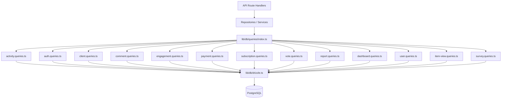

# System wzorców zapytań

Szablon organizuje wszystkie zapytania do bazy danych w moduły specyficzne dla domeny pod `lib/db/queries/`. Każdy moduł jest zgodny z zasadą pojedynczej odpowiedzialności (SRP), grupując powiązane operacje. Eksport beczki w `index.ts` zapewnia pojedynczy punkt wejścia dla wszystkich funkcji zapytań.

## Przegląd architektury



## Moduły zapytań

|Moduł|Plik|Cel|
|--------|------|---------|
|Aktywność|`activity.queries.ts`|Rejestrowanie aktywności i ścieżka audytu|
|Autoryt|`auth.queries.ts`|Tokeny resetowania hasła, tokeny weryfikacyjne|
|Klient|`client.queries.ts`|Profil klienta CRUD, wyszukiwanie, statystyki|
|Komentarz|`comment.queries.ts`|Skomentuj CRUD dołączając użytkownika|
|Firma|`company.queries.ts`|Zarządzanie firmą i łączenie pozycji z firmami|
|Pulpit nawigacyjny|`dashboard.queries.ts`|Statystyki panelu i wykresy zaangażowania|
|Zaangażowanie|`engagement.queries.ts`|Zagregowane wskaźniki zaangażowania (wyświetlenia, głosy, ulubione, komentarze)|
|Mapowanie integracji|`integration-mapping.queries.ts`|Mapowania integracji CRM|
|Przedmiot|`item.queries.ts`|Normalizacja i weryfikacja błędów pozycji|
|Audyt pozycji|`item-audit.queries.ts`|Historia zmian pozycji|
|Widok przedmiotu|`item-view.queries.ts`|Zobacz śledzenie z deduplikacją|
|Indeks lokalizacji|`location-index.queries.ts`|Indeksowanie pozycji geoprzestrzennych|
|Umiarkowanie|`moderation.queries.ts`|Działania związane z moderacją treści|
|Biuletyn|`newsletter.queries.ts`|Zarządzanie subskrybentami newslettera|
|Płatność|`payment.queries.ts`|Dostawca płatności i zarządzanie kontem|
|Raport|`report.queries.ts`|Raporty treści z filtrowaniem|
|Subskrypcja|`subscription.queries.ts`|Zarządzanie cyklem życia subskrypcji|
|Ankieta|`survey.queries.ts`|Odpowiedzi na ankiety i analizy|
|Użytkownik|`user.queries.ts`|CRUD użytkownika podstawowego i kontrole administratora|
|Głosuj|`vote.queries.ts`|Głosuj na CRUD i obliczanie wyniku netto|

## Typowe wzory

### 1. Wzór paginacji

Wszystkie zapytania listowe mają spójny wzorzec paginacji, używając `limit` i `offset`:

```typescript
export async function getClientProfiles(params: {
  page?: number;
  limit?: number;
  search?: string;
  status?: string;
}): Promise<{
  profiles: ClientProfileWithAuth[];
  total: number;
  page: number;
  totalPages: number;
  limit: number;
}> {
  const { page = 1, limit = 10, search, status } = params;
  const offset = (page - 1) * limit;

  // 1. Build WHERE conditions dynamically
  const whereConditions: SQL[] = [];
  if (search) { /* add ILIKE condition */ }
  if (status) { whereConditions.push(eq(clientProfiles.status, status)); }
  const whereClause = whereConditions.length > 0
    ? and(...whereConditions)
    : undefined;

  // 2. Count query for total
  const countResult = await db
    .select({ count: sql<number>`count(distinct ${clientProfiles.id})` })
    .from(clientProfiles)
    .where(whereClause);
  const total = Number(countResult[0]?.count || 0);

  // 3. Data query with limit/offset
  const profiles = await db
    .select({ /* fields */ })
    .from(clientProfiles)
    .where(whereClause)
    .orderBy(desc(clientProfiles.createdAt))
    .limit(limit)
    .offset(offset);

  return {
    profiles,
    total,
    page,
    totalPages: Math.ceil(total / limit),
    limit,
  };
}
```

### 2. Dynamiczny wzór filtrowania

Filtry są gromadzone jako tablica warunków SQL i składają się z `and()`:

```typescript
const whereConditions: SQL[] = [];

if (search) {
  const escapedSearch = search
    .replace(/\\/g, '\\\\')
    .replace(/[%_]/g, '\\$&');
  whereConditions.push(
    sql`(${clientProfiles.name} ILIKE ${`%${escapedSearch}%`} OR
         ${clientProfiles.email} ILIKE ${`%${escapedSearch}%`})`
  );
}

if (status) {
  whereConditions.push(eq(clientProfiles.status, status));
}

if (provider) {
  whereConditions.push(
    sql`exists (
      select 1 from ${accounts}
      where ${accounts.userId} = ${clientProfiles.userId}
        and ${accounts.provider} = ${provider}
    )`
  );
}

const whereClause = whereConditions.length > 0
  ? and(...whereConditions)
  : undefined;
```

### 3. Połącz wzór

Baza kodu wykorzystuje zarówno jawne `innerJoin`/`leftJoin`, jak i podzapytania do obsługi powiązanych danych:

**Złączenie wewnętrzne dla wymaganych relacji:**

```typescript
const result = await db
  .select({
    id: comments.id,
    content: comments.content,
    user: {
      id: clientProfiles.id,
      name: clientProfiles.name,
      email: clientProfiles.email,
      image: clientProfiles.avatar,
    },
  })
  .from(comments)
  .innerJoin(clientProfiles, eq(comments.userId, clientProfiles.id))
  .where(and(eq(comments.itemId, itemId), isNull(comments.deletedAt)))
  .orderBy(desc(comments.createdAt));
```

**Podzapytanie, aby uniknąć duplikatów wierszy z wielu złączeń:**

```typescript
const profiles = await db
  .select({
    id: clientProfiles.id,
    // ... other fields
    accountProvider: sql<string>`coalesce(
      (SELECT provider FROM ${accounts}
       WHERE ${accounts.userId} = ${clientProfiles.userId}
       LIMIT 1),
      'unknown'
    )`,
  })
  .from(clientProfiles);
```

### 4. Wzór agregacji

Funkcje agregujące, takie jak `count`, `SUM` i `AVG` są używane z `groupBy`:

```typescript
// Net vote score using conditional SUM
const voteCounts = await db
  .select({
    itemId: votes.itemId,
    netScore: sql<number>`
      SUM(CASE
        WHEN vote_type = 'upvote' THEN 1
        WHEN vote_type = 'downvote' THEN -1
        ELSE 0
      END)
    `.as('netScore'),
  })
  .from(votes)
  .where(inArray(votes.itemId, itemSlugs))
  .groupBy(votes.itemId);
```

### 5. Wzorzec zapytania równoległego

Gdy potrzebnych jest wiele niezależnych agregacji, zapytania działają równolegle z `Promise.all`:

```typescript
const [viewsData, votesData, favoritesData, commentsData] =
  await Promise.all([
    db.select({ itemId: itemViews.itemId, count: count() })
      .from(itemViews)
      .where(inArray(itemViews.itemId, itemSlugs))
      .groupBy(itemViews.itemId),

    db.select({ itemId: votes.itemId, netScore: sql`...` })
      .from(votes)
      .where(inArray(votes.itemId, itemSlugs))
      .groupBy(votes.itemId),

    db.select({ itemSlug: favorites.itemSlug, count: count() })
      .from(favorites)
      .where(inArray(favorites.itemSlug, itemSlugs))
      .groupBy(favorites.itemSlug),

    db.select({ itemId: comments.itemId, count: count(), avgRating: sql`...` })
      .from(comments)
      .where(and(inArray(comments.itemId, itemSlugs), isNull(comments.deletedAt)))
      .groupBy(comments.itemId),
  ]);
```

### 6. Wzorzec wznoszenia się/rozwiązywania konfliktów

Używany do deduplikacji, szczególnie przy śledzeniu wyświetleń:

```typescript
export async function recordItemView(
  view: Pick<NewItemView, 'itemId' | 'viewerId' | 'viewedDateUtc'>
): Promise<boolean> {
  const result = await db
    .insert(itemViews)
    .values(view)
    .onConflictDoNothing()
    .returning({ id: itemViews.id });

  return result.length > 0;
}
```

### 7. Wzór miękkiego usuwania

Rekordy są oznaczane jako usunięte, a nie usuwane fizycznie:

```typescript
export async function deleteComment(id: string) {
  const [comment] = await db
    .update(comments)
    .set({ deletedAt: new Date() })
    .where(eq(comments.id, id))
    .returning();
  return comment;
}

// Querying always filters out soft-deleted records
.where(and(eq(comments.itemId, itemId), isNull(comments.deletedAt)))
```

### 8. Wzorzec normalizacji wyników

Wyniki zapytań są często mapowane poprzez wyszukiwanie obiektów `Map` w celu zapewnienia wydajnego dostępu O(1):

```typescript
const viewsMap = new Map<string, number>(
  viewsData.map(v => [v.itemId, Number(v.count)])
);
const votesMap = new Map<string, number>(
  votesData.map(v => [v.itemId, Number(v.netScore ?? 0)])
);

// Combine into final metrics
for (const slug of itemSlugs) {
  metricsMap.set(slug, {
    views: viewsMap.get(slug) ?? 0,
    votes: votesMap.get(slug) ?? 0,
  });
}
```

## Wspólne narzędzia

### `lib/db/queries/utils.ts`

Zapewnia funkcje pomocnicze wspólne dla modułów zapytań:

- **`extractUsernameFromEmail(email)`** — Wyodrębnia i oczyszcza nazwę użytkownika z adresu e-mail
- **`ensureUniqueUsername(baseUsername)`** — Generuje unikalną nazwę użytkownika, dodając w razie potrzeby przyrostki numeryczne

### `lib/db/queries/types.ts`

Definiuje typy współdzielone używane w modułach zapytań:

- **`ClientProfileWithAuth`** — Profil klienta połączony z danymi dostawcy uwierzytelniania
- **`ClientStatus`** / **`ClientPlan`** / **`ClientAccountType`** -- Typy wyliczeniowe do filtrowania
- **`CommentWithUser`** — Dane komentarzy wzbogacone o informacje o użytkowniku

## Konwencja importowa

Wszystkie zapytania są importowane poprzez eksport beczki:

```typescript
import {
  getClientProfiles,
  createVote,
  getEngagementMetricsPerItem,
  getUserActiveSubscription,
} from '@/lib/db/queries';
```
