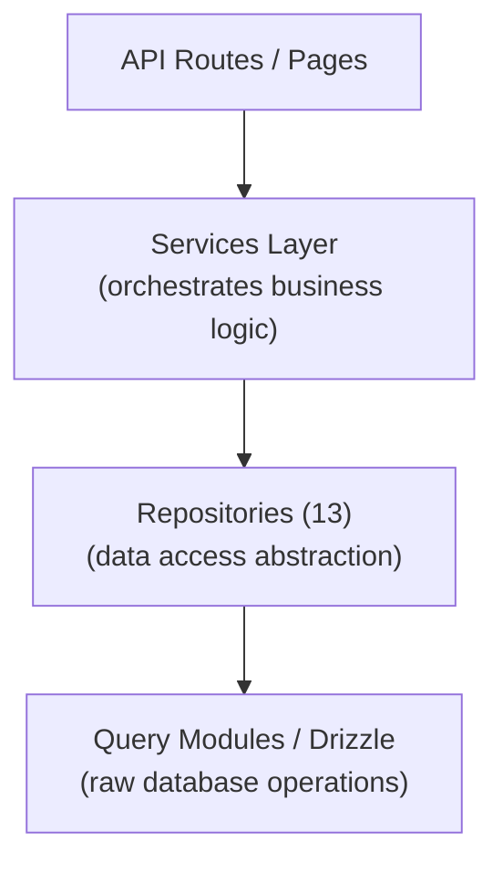

# Wzór repozytorium

Szablon Ever Works implementuje wzorzec repozytorium poprzez 13 wyspecjalizowanych klas repozytorium w `lib/repositories/`. Repozytoria zapewniają wyższy poziom abstrakcji w stosunku do surowych zapytań do baz danych, hermetyzując złożoną logikę zapytań, reguły biznesowe i transformację danych.

## Architektura



## Lista repozytoriów

|Repozytorium|Plik|Domena|
|------------|------|--------|
|Analityka administracyjna (zoptymalizowana)|`admin-analytics-optimized.repository.ts`|Analityka administracyjna z optymalizacją wydajności|
|Statystyki administratora|`admin-stats.repository.ts`|Statystyki panelu administratora|
|Kategoria|`category.repository.ts`|Zarządzanie kategoriami|
|Panel Klienta|`client-dashboard.repository.ts`|Operacje na panelu klienta|
|Przedmiot klienta|`client-item.repository.ts`|Przesyłanie elementów klienta|
|Kolekcja|`collection.repository.ts`|Zarządzanie zbiorami|
|Mapowanie integracji|`integration-mapping.repository.ts`|Mapowania integracji CRM|
|Przedmiot|`item.repository.ts`|Operacje na elementach|
|Rola|`role.repository.ts`|Zarządzanie rolami|
|Reklama sponsora|`sponsor-ad.repository.ts`|Zarządzanie reklamami sponsorowanymi|
|Oznacz|`tag.repository.ts`|Zarządzanie tagami|
|Konfiguracja Twenty CRM|`twenty-crm-config.repository.ts`|Konfiguracja CRM-a|
|Użytkownik|`user.repository.ts`|Zarządzanie użytkownikami|

## Repozytorium treści oparte na Git (`lib/repository.ts`)

Oprócz repozytoriów baz danych szablon zawiera repozytorium treści oparte na Git pod adresem `lib/repository.ts`. Obsługuje to operacje Git CMS:

- Sklonuj repozytorium treści z adresu URL `DATA_REPOSITORY`
- Synchronizuj zawartość z przesyłaniem danych (pull/push z wykrywaniem konfliktów)
- Śledź lokalne zmiany i zatwierdzaj je
- Ochrona przed przekroczeniem limitu czasu dla operacji Git (120-sekundowy limit czasu)

Różni się to od repozytoriów baz danych i zarządza katalogiem `.content/` używanym przez warstwę treści.

## Szczegóły repozytorium

### admin-analytics-optimized.repository.ts

Repozytorium analiz zoptymalizowane pod kątem wydajności dla panelu administracyjnego. Używa zapytań wsadowych i strategii buforowania, aby zminimalizować obciążenie bazy danych podczas generowania widoków analitycznych.

Kluczowe możliwości:
- Zagregowane statystyki wyświetleń
- Trendy wzrostu użytkowników
- Podsumowanie zaangażowania w treść
- Analityka przychodów

### admin-stats.repository.ts

Udostępnia statystyki dashboardu dla panelu administracyjnego.

Kluczowe możliwości:
- Całkowita liczba użytkowników
- Liczba aktywnych subskrypcji
- Statystyki treści (elementy, komentarze, raporty)
- Podsumowanie ostatnich działań

### kategoria.repozytorium.ts

Zarządza danymi kategorii za pomocą operacji CRUD i obsługi relacji.

Kluczowe możliwości:
- Lista kategorii z liczbą elementów
- Przeglądanie drzewa kategorii (rodzic/dziecko)
- Wyszukiwanie i filtrowanie kategorii
- Porządkowanie kategorii

### panel klienta.repository.ts

Największe repozytorium (28KB), obsługujące wszystkie dane dashboardu po stronie klienta.

Kluczowe możliwości:
- Zarządzanie zgłoszeniami klientów
- Analityka zgłoszeń (wyświetlenia, głosy, komentarze na każdy element)
- Historia aktywności klienta
- Statystyki podsumowujące pulpit nawigacyjny
- Lista elementów podzielona na strony z filtrami

### element-klienta.repository.ts

Zarządza elementami z perspektywy klienta (nadawcy).

Kluczowe możliwości:
- Tworzenie i aktualizacje zgłoszeń przedmiotów
- Śledzenie statusu przedmiotu
- Historia zgłoszeń
- Filtrowanie elementów specyficzne dla klienta

### kolekcja.repository.ts

Zarządzanie kolekcją dla wybranych grup produktów.

Kluczowe możliwości:
- Kolekcjonowanie operacji CRUD
- Powiązania z kolekcją przedmiotów
- Zamawianie i status kolekcji
- Paginowana lista kolekcji

### integracja-mapping.repository.ts

Trwałość mapowania integracji CRM.

Kluczowe możliwości:
- Twórz i aktualizuj mapowania między identyfikatorami wewnętrznymi a identyfikatorami CRM
- Zbiorcze operacje wstawiania
- Wyszukiwanie według identyfikatora wewnętrznego lub identyfikatora CRM
- Synchronizuj śledzenie znaczników czasu
- Zarządzanie skrótami wersji w celu wykrywania zmian

### item.repository.ts

Podstawowe operacje na danych elementów (dla metadanych przechowywanych w bazie danych, a nie treści Git).

Kluczowe możliwości:
- Zarządzanie metadanymi pozycji
- Wyszukiwanie elementów za pomocą wielu filtrów
- Agregacja danych o zaangażowaniu pozycji
- Polecane zarządzanie przedmiotami

### role.repository.ts

Zarządzanie rolami w systemie RBAC.

Kluczowe możliwości:
- Rola Operacje CRUD
- Powiązania ról i uprawnień
- Przypisania ról użytkowników
- Walidacja roli

### sponsor-ad.repository.ts

Zarządzanie cyklem życia reklamy sponsorowanej.

Kluczowe możliwości:
- Tworzenie i zarządzanie reklamami sponsorskimi
- Zmiany statusu (oczekujące, aktywne, wygasłe)
- Filtrowanie reklam według stanu, użytkownika lub elementu
- Dane integracji płatności
- Obsługa wygaśnięć

### tag.repository.ts

Zarządzanie tagami za pomocą powiązań elementów.

Kluczowe możliwości:
- Oznacz operacje CRUD
- Wyszukiwanie tagów i autouzupełnianie
- Statystyki użycia tagów
- Powiązania tagów pozycji

### dwadzieścia-crm-config.repository.ts

Zarządzanie konfiguracją singletonową Twenty CRM.

Kluczowe możliwości:
- Pobierz/zaktualizuj konfigurację CRM
- Włącz/wyłącz integrację z CRM
- Zarządzanie trybem synchronizacji
- Zarządzanie kluczami API

### użytkownik.repozytorium.ts

Zarządzanie kontem użytkownika.

Kluczowe możliwości:
- Operacje na profilu użytkownika
- Wyszukiwanie i filtrowanie użytkowników
- Zarządzanie stanem konta
- Usuwanie użytkownika (usuwanie miękkie)

## Wzór użycia

Repozytoria są importowane i wykorzystywane bezpośrednio w trasach API, usługach i komponentach serwera:

```typescript
import { clientDashboardRepository } from '@/lib/repositories/client-dashboard.repository';

// In an API route
export async function GET(request: NextRequest) {
  const session = await auth();
  const dashboard = await clientDashboardRepository.getDashboardStats(session.user.id);
  return NextResponse.json({ success: true, data: dashboard });
}
```

```typescript
import { itemRepository } from '@/lib/repositories/item.repository';

// In a server component
export default async function ItemPage({ params }) {
  const item = await itemRepository.findBySlug(params.slug);
  return <ItemDetail item={item} />;
}
```

## Repozytorium a moduły zapytań

|Aspekt|Moduły zapytań (`lib/db/queries/`)|Repozytoria (`lib/repositories/`)|
|--------|-----------------------------------|-------------------------------------|
|Złożoność|Proste, ukierunkowane zapytania|Złożone operacje na wielu tabelach|
|Logika biznesowa|Brak (czysty dostęp do danych)|Obejmuje walidację i reguły biznesowe|
|Transformacja danych|Surowe wyniki z bazy danych|Przekształcone/wzbogacone dane|
|Użyj przypadku|Bezpośrednie operacje na bazach danych|Dostęp do danych na poziomie funkcji|
|Typowy konsument|Inne moduły zapytań, proste trasy|Usługi, trasy API, komponenty serwerowe|

Obie warstwy korzystają z Drizzle ORM i importują połączenie z bazą danych z `lib/db/drizzle.ts`. Wybór między nimi zależy od złożoności operacji: proste odczyty wykorzystują bezpośrednio moduły zapytań, natomiast złożone funkcje przechodzą przez repozytoria.
