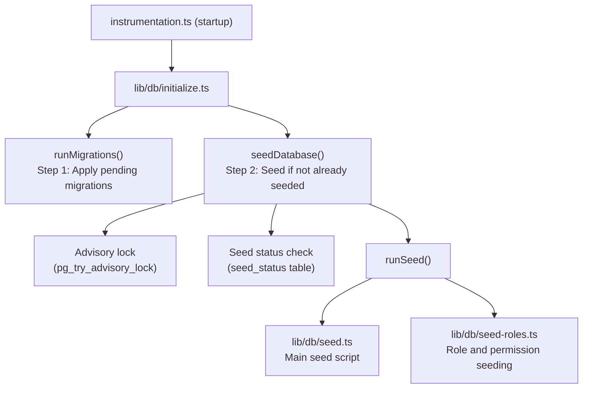

# Zasiew bazy danych

Szablon Ever Works zawiera kompleksowy system inicjowania bazy danych, który inicjuje niezbędne dane (role, uprawnienia, dostawcy płatności) i opcjonalnie generuje dane demonstracyjne do celów programowania i testowania.

## Architektura nasion



## Skrypty nasienne

### Główny skrypt źródłowy (`lib/db/seed.ts`)

Podstawowy skrypt źródłowy obsługuje całą inicjalizację bazy danych. Działa w dwóch trybach:

**Tryb produkcyjny**: Wysyła tylko niezbędne dane wymagane do działania aplikacji:
- Role administratora i klienta
- Uprawnienia systemowe
- Domyślni dostawcy płatności
- Wymagane zapisy systemowe

**Tryb demonstracyjny**: Dodatkowo udostępnia kompleksowe dane testowe do celów programistycznych:
- Przykładowi użytkownicy o różnych rolach
- Przykładowe profile klientów
- Przykładowe subskrypcje
- Komentarze demonstracyjne, głosy i ulubione
- Powiadomienia testowe
- Wpisy dziennika aktywności

Tryb demonstracyjny jest aktywowany po ustawieniu zmiennej środowiskowej `DEMO_MODE`.

Kluczowe cechy:
- **Idempotencja na tabelę**: Każda tabela jest sprawdzana przed wysiewem; wypełniane są tylko puste tabele
- **Sprawdzanie istnienia tabeli**: Sprawdza istnienie tabel przed próbą wstawienia
- **Wykorzystuje `drizzle-seed`**: Wykorzystuje oficjalną bibliotekę inicjującą Drizzle do generowania uporządkowanych danych
- **Bezpieczne dla ponownych uruchomień**: Można wywołać wiele razy bez duplikowania danych

```typescript
// Simplified seed flow
export async function runSeed(): Promise<void> {
  await ensureDb();
  const isDemo = isDemoMode();

  if (isDemo) {
    // Seed comprehensive test data
  } else {
    // Seed minimal essential data only
  }

  // Seed roles (always)
  if (await isTableEmpty('roles', roles)) {
    await seedRoles();
  }

  // Seed permissions (always)
  if (await isTableEmpty('permissions', permissions)) {
    await seedPermissions();
  }

  // Seed payment providers (always)
  if (await isTableEmpty('paymentProviders', paymentProviders)) {
    await seedPaymentProviders();
  }

  // Demo-only: seed users, profiles, subscriptions, etc.
  if (isDemo) {
    await seedDemoData();
  }
}
```

### Rozsiewanie ról (`lib/db/seed-roles.ts`)

Dedykowany skrypt do zaszczepiania systemu RBAC, który można również uruchomić niezależnie.

**`seedPermissions()`** tworzy początkowy zestaw uprawnień:

|Klucz uprawnień|Opis|
|---------------|-------------|
|`read:own`|Potrafi czytać własne dane|
|`write:own`|Możliwość zapisywania własnych danych|
|`admin:all`|Pełny dostęp administracyjny|
|`client:manage`|Potrafi zarządzać operacjami specyficznymi dla klienta|
|`user:read`|Może czytać dane użytkownika|
|`user:write`|Może zapisywać dane użytkownika|

Używa `onConflictDoUpdate` do bezpiecznej aktualizacji istniejących uprawnień bez niepowodzenia przy ponownym uruchomieniu.

**`linkRolesToPermissions()`** tworzy powiązania ról i uprawnień:

- **Rola administratora**: Otrzymuje WSZYSTKIE uprawnienia
- **Rola klienta**: Pobiera `read:own`, `write:own` i `client:manage`

Funkcja sprawdza, czy wymagane role (administrator, klient) istnieją i są aktywne przed utworzeniem powiązań.

**`seedRolesAndPermissions()`** koordynuje obie operacje w ramach transakcji bazy danych:

```typescript
export async function seedRolesAndPermissions() {
  await db.transaction(async () => {
    await seedPermissions();
    await linkRolesToPermissions();
  });
}
```

Można uruchomić samodzielnie:
```bash
# Run directly (if configured as a script)
npx tsx lib/db/seed-roles.ts
```

## System inicjalizacji (`lib/db/initialize.ts`)

System inicjalizacji zarządza pełną sekwencją uruchamiania z ochroną współbieżności.

### Śledzenie statusu nasion

Tabela `seed_status` śledzi stan inicjowania:

|Stan|Znaczenie|
|--------|---------|
|`seeding`|Trwa operacja wysiewu|
|`completed`|Seed został pomyślnie zakończony|
|`failed`|Zainicjowanie nie powiodło się (zapisano błąd)|

### Ochrona współbieżności

W przypadku wdrożeń wieloprocesowych (np. wiele funkcji bezserwerowych Vercel uruchamianych jednocześnie) system zapobiega dublowaniu za pomocą:

1. **Doradcze blokady PostgreSQL**: `pg_try_advisory_lock(12345)` zapewnia blokadę nieblokującą. Może go uzyskać tylko jeden proces.
2. **Tabela stanu nasion**: Inne procesy sprawdzają tabelę `seed_status` i czekają na zakończenie.
3. **Wykrywanie przestarzałych danych**: Jeśli status `seeding` jest starszy niż 5 minut, jest traktowany jako nieaktualny i usuwany.
4. **Limit czasu oczekiwania**: Procesy oczekujące na zakończenie innej instancji przekroczą limit czasu po 60 sekundach.

### Przepływ inicjalizacji

```
initializeDatabase()
│
├── DATABASE_URL not set? → Silent skip (DB is optional)
│
├── Step 1: Run migrations (always, idempotent)
│   └── Failure? → Error in production, warning in dev/preview
│
├── Step 2: Check if already seeded
│   └── seed_status = 'completed'? → Done
│
├── Step 3: Handle edge cases
│   ├── Previous seed failed? → Delete failed status, retry
│   ├── Stale seeding (>5min)? → Clean up, retry
│   └── Another instance seeding? → Wait for completion
│
├── Step 4: Acquire advisory lock
│   └── Lock not available? → Wait for other instance
│
├── Step 5: Double-check (another instance may have finished)
│
├── Step 6: Run seed
│   ├── Create seed_status record ('seeding')
│   ├── Execute runSeed()
│   └── Update seed_status ('completed' or 'failed')
│
└── Step 7: Release advisory lock (always, in finally block)
```

## Ręczne uruchamianie nasion

### Standardowe ziarno

```bash
pnpm db:seed
```

### Indywidualne skrypty nasion

```bash
# Seed roles and permissions only
npx tsx lib/db/seed-roles.ts
```

### Tryb demonstracyjny

Aby zasiać dane demonstracyjne, ustaw zmienną środowiskową `DEMO_MODE`:

```bash
DEMO_MODE=true pnpm db:seed
```

## Zmienne środowiskowe

|Zmienna|Domyślne|Opis|
|----------|---------|-------------|
|`DATABASE_URL`| - |Parametry połączenia PostgreSQL (wymagane do inicjowania)|
|`DEMO_MODE`|`false`|Włącz umieszczanie danych demonstracyjnych|

## Podsumowanie danych nasion

### Zawsze rozstawiony (tryb produkcyjny)

|Stół|Dane|
|-------|------|
|`roles`|Role administratora i klienta|
|`permissions`|Definicje uprawnień systemowych|
|`rolePermissions`|Powiązania ról i uprawnień|
|`paymentProviders`|Stripe, LemonSqueezy, Polar, Solidgate|

### Tylko tryb demonstracyjny

|Stół|Dane|
|-------|------|
|`users`|Przykładowi administratorzy i użytkownicy klienccy|
|`accounts`|Konta uwierzytelniające dla przykładowych użytkowników|
|`clientProfiles`|Profile klientów o różnych statusach|
|`subscriptions`|Przykładowe subskrypcje w różnych planach|
|`comments`|Przykładowe komentarze do pozycji|
|`votes`|Przykładowe głosy|
|`favorites`|Przykładowe ulubione|
|`notifications`|Przykładowe powiadomienia administratora|
|`activityLogs`|Przykładowa historia aktywności|

## Najlepsze praktyki

1. **Nigdy nie uruchamiaj nasion w środowisku produkcyjnym z DEMO_MODE**: Dane demonstracyjne powinny być używane wyłącznie w fazie programowania i testowania
2. **Sprawdź status wysyłania przed ręcznym ponownym wysianiem**: Zapytaj tabelę `seed_status`, aby zrozumieć bieżący stan
3. **Użyj transakcji**: inicjowanie roli wykorzystuje transakcje w celu zapewnienia spójności
4. **Projekt idempotentny**: Zawsze sprawdzaj, czy dane istnieją przed wstawieniem, aby zapewnić bezpieczne ponowne uruchomienie
5. **Blokady doradcze**: System blokad doradczych zapobiega problemom w środowiskach bezserwerowych, w których wiele instancji może uruchamiać się jednocześnie
