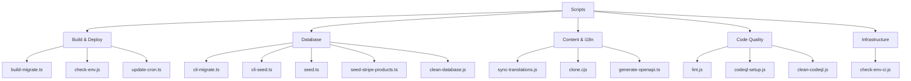
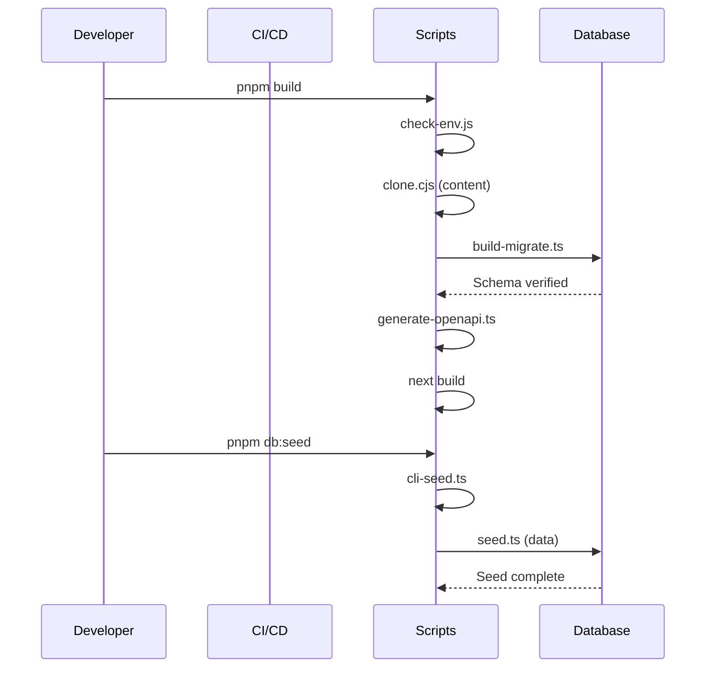

# Przegląd Skryptów

Katalog `scripts/` zawiera skrypty automatyzacji, które zarządzają potokiem budowania, cyklem życia bazy danych, synchronizacją treści, jakością kodu i infrastrukturą wdrożeń. Każdy skrypt jest przeznaczony do konkretnej fazy przepływu pracy deweloperskiego lub wdrożeniowego.

## Struktura Katalogów

```
scripts/
├── build-migrate.ts          # Migracje bazy danych w czasie budowania
├── check-env.js              # Walidacja zmiennych środowiskowych
├── check-env-ci.js           # Walidacja env specyficzna dla CI
├── clean-database.js         # Narzędzie resetowania bazy danych
├── cli-migrate.ts            # Ręczne CLI migracji
├── cli-seed.ts               # Ręczne CLI seedowania
├── clone.cjs                 # Klonowanie treści CMS opartego na Git
├── codeql-setup.js           # Konfiguracja analizy bezpieczeństwa CodeQL
├── clean-codeql.js           # Narzędzie czyszczenia CodeQL
├── generate-openapi.ts       # Generowanie specyfikacji OpenAPI
├── lint.js                   # Skrypt opakowujący ESLint
├── seed.ts                   # Pełny seeder bazy danych
├── seed-stripe-products.ts   # Seeder produktów/cen Stripe
├── sync-translations.js      # Synchronizacja tłumaczeń i18n
├── update-cron.ts            # Zarządzanie zadaniami cron Vercel
└── tsconfig.json             # Konfiguracja TypeScript dla skryptów
```

## Kategorie Skryptów



## Skrypty Budowania i Wdrożeń

### build-migrate.ts

Uruchamia migracje bazy danych podczas procesu budowania Vercel. Zapewnia spójność schematu przed uruchomieniem wdrożenia.

```bash
tsx scripts/build-migrate.ts
```

| Funkcja              | Zachowanie                                                          |
|----------------------|---------------------------------------------------------------------|
| Wykrywanie CI        | Pomija migracje w GitHub Actions (nie-Vercel)                       |
| Flaga pominięcia     | Ustaw `SKIP_BUILD_MIGRATIONS=true`, aby pominąć                     |
| Weryfikacja schematu | Sprawdza, czy krytyczne kolumny istnieją po migracji                |
| Bezpieczeństwo prod. | Przerywa budowanie, jeśli migracje produkcyjne się nie powiodą      |
| Tolerancja podglądu  | Zezwala na błędy połączenia przy wdrożeniach podglądowych           |

### check-env.js

Waliduje zmienne środowiskowe przed uruchomieniem aplikacji. Dynamicznie kategoryzuje zmienne według prefiksu i sprawdza kompletność.

```bash
node scripts/check-env.js [--silent] [--quick]
```

| Flaga            | Opis                                                  |
|------------------|-------------------------------------------------------|
| `--silent`, `-s` | Wycisza nieistotne wyjście                            |
| `--quick`, `-q`  | Pomija szczegółowe sprawdzenia, minimalne wyjście     |

Automatycznie wykrywane kategorie: `core`, `database`, `auth`, `supabase`, `content`, `email`, `payment`, `analytics`, `storage`, `api`, `security`, `background-jobs`.

### update-cron.ts

Zarządza harmonogramami zadań cron Vercel przez API Vercel. Dostosowuje częstotliwość synchronizacji na podstawie planu projektu.

```bash
tsx scripts/update-cron.ts
```

| Zmienna Środowiskowa  | Cel                                                   |
|-----------------------|-------------------------------------------------------|
| `VERCEL_TOKEN`        | Token uwierzytelniania API                            |
| `VERCEL_PROJECT_ID`   | Identyfikator projektu docelowego                     |
| `VERCEL_TEAM_SCOPE`   | Zakres zespołu dla wywołań API                        |
| `VERCEL_DEPLOYMENT_ID`| Wdrożenie, na które należy czekać przed aktualizacją  |
| `CRON_FREQUENCY`      | Ustaw na `5min` dla synchronizacji o wysokiej częstotliwości |

Domyślne harmonogramy: Plan darmowy używa `0 3 * * *` (codziennie o 3:00), Plan Pro używa `*/5 * * * *` (co 5 minut).

## Skrypty Bazy Danych

### seed.ts

Wypełnia bazę danych realistycznymi danymi testowymi, w tym użytkownikami, profilami, rolami, uprawnieniami, dziennikami aktywności, komentarzami i głosami.

```bash
DATABASE_URL=postgres://... pnpm seed
```

Zasiane dane (domyślnie 20 użytkowników):

| Encja              | Liczba | Szczegóły                                     |
|--------------------|--------|-----------------------------------------------|
| Role               | 2      | `admin` i `user`                              |
| Uprawnienia        | Wszystkie | Z definicji `getAllPermissions()`            |
| Użytkownicy        | 20     | Z sekwencyjnymi adresami e-mail               |
| Profile klientów   | 20     | Mieszane plany: darmowy, standardowy, premium |
| Role użytkowników  | 20     | Pierwszy użytkownik jest adminem              |
| Subskrypcje biuletynu | ~7  | Co 3. użytkownik                              |
| Dzienniki aktywności | 30   | Akcje SIGN_UP, SIGN_IN, COMMENT, VOTE         |
| Komentarze         | 15     | Przykładowe komentarze z ocenami              |
| Głosy              | 25     | Mieszanka głosów na tak i na nie              |

### seed-stripe-products.ts

Tworzy produkty i ceny Stripe odpowiadające poziomom rozliczeń szablonu.

```bash
npx tsx scripts/seed-stripe-products.ts
```

Utworzone produkty:

| Produkt                      | Miesięcznie | Rocznie          | Typ              |
|------------------------------|-------------|------------------|------------------|
| Darmowy                      | $0          | $0               | Subskrypcja      |
| Standardowy                  | $10/mies.   | $96/rok (20% zn.)| Subskrypcja      |
| Premium                      | $20/mies.   | $180/rok (25% zn.)| Subskrypcja     |
| Reklama Sponsorowana - Tyg.  | $100        | --               | Jednorazowa      |
| Reklama Sponsorowana - Mies. | $300        | --               | Jednorazowa      |

### clean-database.js

Usuwa wszystkie tabele w schemacie `public` i schemat śledzenia migracji `drizzle`. Używaj ostrożnie.

```bash
node scripts/clean-database.js
```

**Ostrzeżenie:** Jest to operacja destrukcyjna. Usuwa wszystkie dane i definicje schematów.

## Skrypty Treści i i18n

### clone.cjs

Klonuje repozytorium treści CMS oparte na Git do `.content/` na podstawie zmiennej środowiskowej `DATA_REPOSITORY`. Wywoływany automatycznie podczas budowania.

### sync-translations.js

Synchronizuje pliki tłumaczeń z angielskim odniesieniem. Zapewnia, że wszystkie pliki locale mają każdy klucz obecny w `en.json`.

```bash
node scripts/sync-translations.js
```

Aktualnie obsługiwane locale: `ar`, `bg`, `de`, `es`, `fr`, `he`, `hi`, `id`, `it`, `ja`, `ko`, `nl`, `pl`, `pt`, `ru`, `th`, `tr`, `uk`, `vi`.

### generate-openapi.ts

Skanuje adnotacje JSDoc `@swagger` w plikach tras i scala je z istniejącą specyfikacją `public/openapi.json`.

```bash
tsx scripts/generate-openapi.ts [--silent]
```

## Skrypty Jakości Kodu

### lint.js

Opakowuje ESLint w formacie konfiguracji flat, omijając problemy ze zgodnością lintera Next.js.

```bash
node scripts/lint.js
```

Uruchamia `npx eslint . --max-warnings=55` w tle.

## Mapowania Skryptów Package.json

| Skrypt npm          | Polecenie Bazowe               | Cel                          |
|---------------------|-------------------------------|------------------------------|
| `pnpm dev`          | `next dev`                    | Serwer deweloperski          |
| `pnpm build`        | Potok budowania z migracjami  | Budowanie produkcyjne        |
| `pnpm lint`         | `node scripts/lint.js`        | Lintowanie kodu              |
| `pnpm db:generate`  | `drizzle-kit generate`        | Generowanie plików migracji  |
| `pnpm db:migrate`   | `tsx scripts/build-migrate.ts`| Uruchamianie migracji        |
| `pnpm db:migrate:cli`| `tsx scripts/cli-migrate.ts` | Ręczne CLI migracji          |
| `pnpm db:seed`      | `tsx scripts/cli-seed.ts`     | Seedowanie bazy danych       |
| `pnpm db:studio`    | `drizzle-kit studio`          | GUI bazy danych              |

## Przepływ Wykonania



## Dodawanie Nowych Skryptów

Przy dodawaniu nowego skryptu:

1. Umieść go w katalogu `scripts/`
2. Używaj TypeScript (`.ts`) dla nowych skryptów, gdy to możliwe
3. Ładuj zmienne środowiskowe przez `dotenv` na górze
4. Dodaj odpowiednie nagłówki JSDoc z instrukcjami użycia
5. Zarejestruj go w skryptach `package.json`, jeśli ma być widoczny dla użytkownika
6. Obsługuj błędy odpowiednio z sensownymi kodami wyjścia
