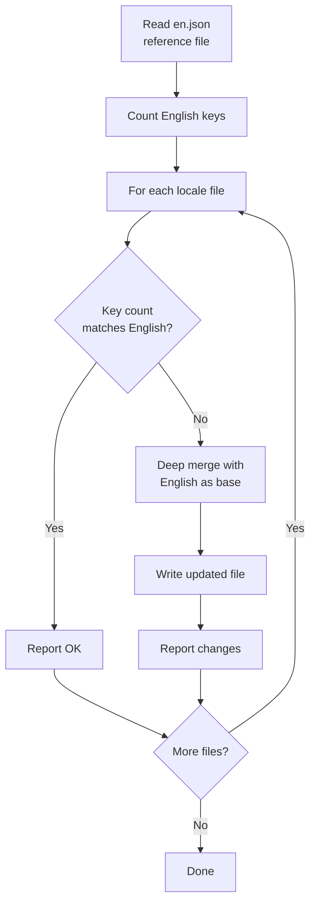
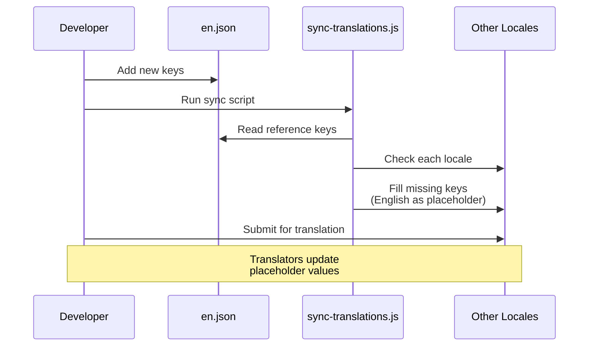

# Przepływ Pracy Tłumaczenia

Szablon używa `next-intl` do internacjonalizacji (i18n) z plikami wiadomości opartymi na JSON. Przepływ pracy tłumaczenia zapewnia, że wszystkie obsługiwane locale pozostają zsynchronizowane z angielskim plikiem referencyjnym przez zautomatyzowany skrypt synchronizacji.

## Obsługiwane Locale

Szablon jest dostarczany z 20 obsługiwanymi językami:

| Kod  | Język                | Kod  | Język      |
|------|----------------------|------|------------|
| `en` | Angielski (ref.)     | `ko` | Koreański  |
| `ar` | Arabski              | `nl` | Holenderski|
| `bg` | Bułgarski            | `pl` | Polski     |
| `de` | Niemiecki            | `pt` | Portugalski|
| `es` | Hiszpański           | `ru` | Rosyjski   |
| `fr` | Francuski            | `th` | Tajski     |
| `he` | Hebrajski            | `tr` | Turecki    |
| `hi` | Hindi                | `uk` | Ukraiński  |
| `id` | Indonezyjski         | `vi` | Wietnamski |
| `it` | Włoski               | `ja` | Japoński   |

## Struktura Plików

```
messages/
├── en.json          # Angielski (referencja - źródło prawdy)
├── ar.json          # Arabski
├── bg.json          # Bułgarski
├── de.json          # Niemiecki
├── es.json          # Hiszpański
├── fr.json          # Francuski
├── he.json          # Hebrajski
├── hi.json          # Hindi
├── id.json          # Indonezyjski
├── it.json          # Włoski
├── ja.json          # Japoński
├── ko.json          # Koreański
├── nl.json          # Holenderski
├── pl.json          # Polski
├── pt.json          # Portugalski
├── ru.json          # Rosyjski
├── th.json          # Tajski
├── tr.json          # Turecki
├── uk.json          # Ukraiński
└── vi.json          # Wietnamski
```

## Skrypt Synchronizacji Tłumaczeń

Skrypt `scripts/sync-translations.js` zapewnia, że wszystkie pliki locale mają każdy klucz zdefiniowany w `en.json`.

### Uruchamianie Synchronizacji

```bash
node scripts/sync-translations.js
```

### Jak To Działa



### Strategia Scalania

Synchronizacja używa głębokiego scalania, gdzie istniejące tłumaczenia mają priorytet:

```javascript
function deepMerge(target, source) {
  const result = { ...source };  // Start with English (source)
  for (const key in target) {
    if (typeof target[key] === 'object' && !Array.isArray(target[key])) {
      result[key] = deepMerge(target[key], source[key] || {});
    } else {
      result[key] = target[key]; // Existing translation wins
    }
  }
  return result;
}
```

**Kluczowe zachowanie:**

- Brakujące klucze są wypełniane angielskimi wartościami jako zastępcze
- Istniejące tłumaczenia nigdy nie są nadpisywane
- Zagnieżdżone struktury są obsługiwane rekurencyjnie
- Tablice są traktowane jako wartości liściowe (nie scalane)

### Przykładowe Wyjście

```
English file has 342 translation keys

ar.json: 340/342 keys (missing 2)
  -> Updated ar.json with missing keys from English

bg.json: 342/342 keys - OK
de.json: 342/342 keys - OK
es.json: 338/342 keys (missing 4)
  -> Updated es.json with missing keys from English

Done!
```

## Format Pliku Wiadomości

Pliki tłumaczeń używają zagnieżdżonego JSON z dostępem do kluczy przez notację kropkową:

```json
{
  "common": {
    "loading": "Loading...",
    "error": "An error occurred",
    "save": "Save",
    "cancel": "Cancel"
  },
  "auth": {
    "signIn": "Sign In",
    "signOut": "Sign Out",
    "email": "Email Address",
    "password": "Password"
  },
  "navigation": {
    "home": "Home",
    "about": "About",
    "contact": "Contact"
  }
}
```

## Używanie Tłumaczeń w Kodzie

### Komponenty Klienckie

```tsx
'use client';
import { useTranslations } from 'next-intl';

export function LoginButton() {
  const t = useTranslations('auth');
  return <button>{t('signIn')}</button>;
}
```

### Komponenty Serwerowe

```tsx
import { getTranslations } from 'next-intl/server';

export default async function Page() {
  const t = await getTranslations('common');
  return <h1>{t('loading')}</h1>;
}
```

### Ze Zmiennymi

```json
{
  "greeting": "Hello, {name}!",
  "itemCount": "You have {count, plural, =0 {no items} one {1 item} other {# items}}"
}
```

```tsx
const t = useTranslations('dashboard');
t('greeting', { name: 'John' });     // "Hello, John!"
t('itemCount', { count: 5 });         // "You have 5 items"
```

## Dodawanie Nowego Języka

Wykonaj następujące kroki, aby dodać nowe locale:

### Krok 1: Utwórz Plik Wiadomości

```bash
# Skopiuj angielski plik jako punkt wyjścia
cp messages/en.json messages/NEW_LOCALE.json
```

### Krok 2: Zarejestruj Locale

Dodaj locale do konfiguracji i18n:

```typescript
// i18n/config.ts (lub odpowiednik)
export const locales = ['en', 'ar', 'de', ..., 'NEW_LOCALE'];
```

### Krok 3: Przetłumacz Treść

Edytuj `messages/NEW_LOCALE.json` i zastąp angielskie ciągi przetłumaczonymi wartościami.

### Krok 4: Uruchom Synchronizację w Celu Weryfikacji

```bash
node scripts/sync-translations.js
```

Jeśli plik ma wszystkie klucze, zostanie zgłoszone "OK". Brakujące klucze zostaną wypełnione angielskimi zastępczymi.

## Dodawanie Nowych Kluczy Tłumaczeń

Przy dodawaniu nowych funkcji wymagających tekstu dla użytkownika:

### Krok 1: Dodaj do Angielskiego Odniesienia

```json
// messages/en.json
{
  "newFeature": {
    "title": "New Feature",
    "description": "This is a new feature"
  }
}
```

### Krok 2: Uruchom Synchronizację

```bash
node scripts/sync-translations.js
```

To automatycznie dodaje nowe klucze do wszystkich plików locale z angielskim tekstem jako zastępczym.

### Krok 3: Poproś o Tłumaczenia

Udostępnij nowo dodane klucze tłumaczom dla każdego locale. Muszą tylko zaktualizować angielskie wartości zastępcze.

## Liczenie Kluczy

Skrypt synchronizacji liczy klucze rekurencyjnie przez zagnieżdżone obiekty:

```javascript
function countKeys(obj) {
  let count = 0;
  for (const key in obj) {
    if (typeof obj[key] === 'object' && !Array.isArray(obj[key])) {
      count += countKeys(obj[key]); // Recurse into nested objects
    } else {
      count++;                      // Count leaf values
    }
  }
  return count;
}
```

To liczy tylko ciągi tłumaczeń na poziomie liści, nie pośrednie klucze grupowania.

## Obsługa Języków RTL

Szablon obsługuje języki pisane od prawej do lewej (RTL) w tym Arabski (`ar`) i Hebrajski (`he`). Układ RTL jest obsługiwany automatycznie przez konfigurację locale i atrybut CSS `dir`.

## Diagram Przepływu Pracy



## Najlepsze Praktyki

1. **Zawsze najpierw modyfikuj `en.json`** -- Jest to jedyne źródło prawdy
2. **Uruchamiaj synchronizację po każdej angielskiej zmianie** -- Utrzymuje wszystkie locale wyrównane
3. **Nigdy ręcznie nie dodawaj kluczy do plików nie-angielskich** -- Używaj skryptu synchronizacji
4. **Używaj zagnieżdżonego grupowania** -- Grupuj klucze według funkcji lub strony dla organizacji
5. **Unikaj zakodowanych ciągów** -- Zawsze używaj `useTranslations` lub `getTranslations`
6. **Testuj układy RTL** -- Regularnie weryfikuj renderowanie arabskie i hebrajskie
7. **Utrzymuj klucze opisowe** -- Używaj `auth.signInButton` nie `auth.btn1`
