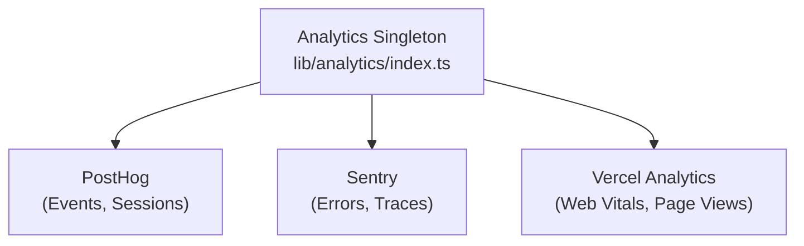

# System analityczny

Szablon Ever Works integruje się z **PostHog**, **Sentry** i **Vercel Analytics** w celu kompleksowego śledzenia zdarzeń, monitorowania błędów, rejestrowania sesji i analizy wydajności.

## Architektura



## Zajęcia analityczne

Podstawową klasą `Analytics` w `lib/analytics/index.ts` jest singleton zarządzający inicjalizacją i wysyłaniem zdarzeń pomiędzy dostawcami:

```typescript
class Analytics {
  private static instance: Analytics;
  private initialized: boolean;
  private exceptionTrackingProvider: ExceptionTrackingProvider;

  static getInstance(): Analytics;
  init(): void;
  trackEvent(name: string, properties?: EventProperties): void;
  trackPageView(url: string): void;
  identify(userId: string, properties?: UserProperties): void;
  reset(): void;
}
```

### Rozwiązanie dostawcy śledzenia wyjątków

System obsługuje elastyczną konfigurację śledzenia wyjątków:

```typescript
type ExceptionTrackingProvider = 'sentry' | 'posthog' | 'both' | 'none';
```

Dostawca jest ustalany poprzez sprawdzenie dostępności:
1. Przeczytaj wartość konfiguracyjną `EXCEPTION_TRACKING_PROVIDER` 2. Sprawdź, czy wybrany dostawca jest włączony
3. Wróć do dostępnej alternatywy, jeśli opcja podstawowa nie jest skonfigurowana

## Integracja z PostHog

### Konfiguracja

```bash
NEXT_PUBLIC_POSTHOG_KEY=phc_xxx
NEXT_PUBLIC_POSTHOG_HOST=https://us.i.posthog.com

# Optional
NEXT_PUBLIC_POSTHOG_DEBUG=false
NEXT_PUBLIC_POSTHOG_SESSION_RECORDING=true
NEXT_PUBLIC_POSTHOG_AUTO_CAPTURE=true
NEXT_PUBLIC_POSTHOG_SAMPLE_RATE=1.0
NEXT_PUBLIC_POSTHOG_SESSION_RECORDING_SAMPLE_RATE=0.1
NEXT_PUBLIC_POSTHOG_EXCEPTION_TRACKING=true
```

### Usługa API PostHog

Usługa po stronie serwera, zlokalizowana pod adresem `lib/services/posthog-api.service.ts` , udostępnia dane analityczne administratora:

```typescript
class PostHogApiService {
  constructor(); // Reads from analyticsConfig

  isConfigured(): boolean;
  async getTotalPageViews(days?: number): Promise<number>;
  async getTopPages(days?: number): Promise<PageData[]>;
  async getEventCounts(eventName: string, days?: number): Promise<number>;
}
```

**Wymagane do dostępu do API po stronie serwera:**
```bash
POSTHOG_PERSONAL_API_KEY=phx_xxx
POSTHOG_PROJECT_ID=12345
```

### Hak po stronie klienta

```typescript
import { useAnalytics } from '@/hooks/use-analytics';

const {
  trackEvent,      // (name: string, properties?: object) => void
  trackPageView,   // (url: string) => void
  identify,        // (userId: string, properties?: object) => void
} = useAnalytics();
```

### Hak do analizy geograficznej

```typescript
import { useGeoAnalytics } from '@/hooks/use-geo-analytics';

const {
  geoData,         // Geographic analytics data
  isLoading,
} = useGeoAnalytics();
```

## Integracja Wartownika

### Konfiguracja

```bash
NEXT_PUBLIC_SENTRY_DSN=https://xxx@sentry.io/xxx
SENTRY_AUTH_TOKEN=sntrys_xxx
SENTRY_ORG=your-org
SENTRY_PROJECT=your-project
NEXT_PUBLIC_SENTRY_EXCEPTION_TRACKING=true
```

Sentry zapewnia:
- **Śledzenie błędów** -- Automatyczne przechwytywanie nieobsługiwanych wyjątków
- **Monitorowanie wydajności** -- Śledzenie transakcji dla tras API i wczytywania stron
- **Powtórka sesji** -- Opcjonalne nagrywanie sesji

## Analityka Vercel

Vercel Analytics jest automatycznie dostępny po wdrożeniu w Vercel:

```bash
# Enabled by default on Vercel deployments
NEXT_PUBLIC_VERCEL_ANALYTICS=true
```

Zapewnia:
- **Web Vitals** – Monitorowanie podstawowych wskaźników internetowych (LCP, FID, CLS).
- **Wyświetlenia strony** -- Automatyczne śledzenie wyświetleń strony
– **Statystyki odbiorców** – Analityka geograficzna i dotycząca urządzeń

## Panel administratora Analytics

Panel administratora zapewnia zagregowane analizy za pośrednictwem haka `useAdminStats` :

```typescript
import { useAdminStats } from '@/hooks/use-admin-stats';

const {
  stats,           // Dashboard statistics
  isLoading,
} = useAdminStats();
```

Hak `useDashboardStats` zapewnia bardziej szczegółowe metryki:

```typescript
import { useDashboardStats } from '@/hooks/use-dashboard-stats';

const {
  stats,           // { items, users, revenue, pageViews, ... }
  isLoading,
  refetch,
} = useDashboardStats();
```

## Wyłączanie analityki

Dostawcy usług analitycznych są wyłączeni, jeśli brakuje ich konfiguracji. Żaden kod śledzenia nie zostanie załadowany, jeśli nie ustawiono odpowiednich zmiennych środowiskowych. Dzięki temu szablon może działać bez konieczności tworzenia analiz.
