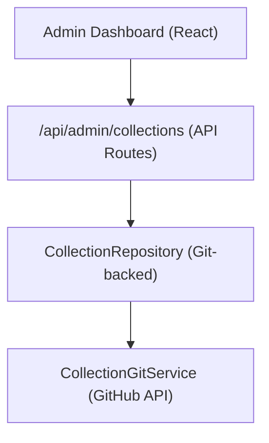

# System zbiorów

Kolekcje umożliwiają administratorom wybieranie grup elementów do wyświetlania w witrynie. System przechowuje dane kolekcji w repozytorium CMS opartym na Git i udostępnia operacje CRUD poprzez panel administracyjny.

## Architektura



Kolekcje są przechowywane jako pliki w repozytorium CMS opartym na Git (skonfigurowanym przez `DATA_REPOSITORY` ), przy użyciu `CollectionGitService` do operacji odczytu/zapisu poprzez API GitHub.

## Model danych

```typescript
interface Collection {
  id: string;
  name: string;
  slug: string;
  description?: string;
  isActive: boolean;
  items: string[];          // Array of item slugs
  item_count: number;       // Computed from items array
  displayOrder?: number;
  created_at: string;
  updated_at: string;
}
```

##Repozytorium kolekcji

Repozytorium zlokalizowane pod adresem `lib/repositories/collection.repository.ts` udostępnia:

```typescript
class CollectionRepository {
  async findAll(options?: CollectionListOptions): Promise<Collection[]>;
  async findById(id: string): Promise<Collection | null>;
  async findBySlug(slug: string): Promise<Collection | null>;
  async create(data: CreateCollectionRequest): Promise<Collection>;
  async update(id: string, data: UpdateCollectionRequest): Promise<Collection>;
  async delete(id: string): Promise<void>;
  async assignItems(id: string, itemSlugs: string[]): Promise<void>;
}
```

### Opcje listy

```typescript
interface CollectionListOptions {
  search?: string;           // Filter by name
  includeInactive?: boolean; // Include inactive collections
  sortBy?: 'name' | 'item_count' | 'created_at';
  sortOrder?: 'asc' | 'desc';
  page?: number;
  limit?: number;
}
```

## Hak administratora

```typescript
import { useAdminCollections } from '@/hooks/use-admin-collections';

const {
  collections,        // Collection[]
  total, page, totalPages, limit,
  isLoading, isSubmitting,
  createCollection,   // (data: CreateCollectionRequest) => Promise<boolean>
  updateCollection,   // (id: string, data: UpdateCollectionRequest) => Promise<boolean>
  deleteCollection,   // (id: string) => Promise<boolean>
  assignItems,        // (id: string, itemSlugs: string[]) => Promise<boolean>
  fetchAssignedItems, // (id: string) => Promise<Item[]>
  refetch, refreshData,
} = useAdminCollections({ page: 1, limit: 10, search: '' });
```

## Punkty końcowe interfejsu API

| Metoda | Punkt końcowy | Opis |
|--------|----------|------------|
| OTRZYMAJ | `/api/admin/collections` | Lista zbiorów (stronicowana) |
| POST | `/api/admin/collections` | Utwórz nową kolekcję |
| POSTAW | `/api/admin/collections/:id` | Aktualizuj kolekcję |
| USUŃ | `/api/admin/collections/:id` | Usuń kolekcję |
| OTRZYMAJ | `/api/admin/collections/:id/items` | Pobierz przydzielone elementy |
| POST | `/api/admin/collections/:id/items` | Przypisz elementy do kolekcji |

## Wyświetlacz po stronie klienta

Hak `useCollectionsExists` sprawdza, czy istnieją jakieś aktywne kolekcje używane do renderowania warunkowego:

```typescript
import { useCollectionsExists } from '@/hooks/use-collections-exists';
const { exists, isLoading } = useCollectionsExists();
```

## Konfiguracja

Kolekcje wymagają następujących zmiennych środowiskowych:

```bash
DATA_REPOSITORY=https://github.com/owner/repo   # Git CMS repository
GH_TOKEN=ghp_xxx                                  # GitHub API token
GITHUB_BRANCH=main                                # Branch for collection data
```

`CollectionRepository` analizuje adres URL `DATA_REPOSITORY` , aby wyodrębnić właściciela GitHub i repozytorium, a następnie używa tokena do uwierzytelnienia API.
