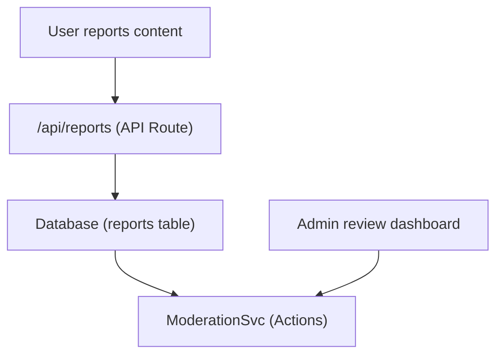

# Raporty i moderacja treści

Szablon Ever Works zawiera system raportowania i moderowania treści, który umożliwia użytkownikom oznaczanie nieodpowiednich treści, a administratorom podejmowanie działań w związku ze zgłoszonymi elementami i komentarzami.

## Architektura



## Typy treści

System obsługuje raportowanie dwóch typów treści:

```typescript
enum ReportContentType {
  ITEM = 'item',
  COMMENT = 'comment',
}
```

##Usługa moderacji

Zlokalizowany pod adresem `lib/services/moderation.service.ts` serwis zapewnia działania moderacyjne:

### Uchwała właściciela treści

```typescript
async function getContentOwner(
  contentType: ReportContentTypeValues,
  contentId: string
): Promise<ContentOwnerResult>;
// Returns: { success: boolean, userId?: string, error?: string }
```

Rozwiązuje problem autora zgłaszanej treści, sprawdzając komentarze za pomocą `getCommentById()` lub elementów za pomocą `ItemRepository.findById()` .

### Działania moderacyjne

| Akcja | Opis | Efekt |
|------------|------------|-------|
| **Usuń zawartość** | Usuń zgłoszony element lub komentarz | Treść usunięta, historia zapisana |
| **Ostrzeż użytkownika** | Zwiększ liczbę ostrzeżeń | Zwiększono licznik ostrzeżeń |
| **Zawieś użytkownika** | Tymczasowo zawieszj konto | Dostęp do konta ograniczony |
| **Zablokuj użytkownika** | Trwałe zablokowanie konta | Konto trwale ograniczone |
| **Odrzuć raport** | Oznacz raport jako rozwiązany bez podejmowania działań | Raport zamknięty |

### Implementacja akcji

Każda akcja tworzy wpis w historii moderacji i może wywołać powiadomienia e-mail:

```typescript
// Example: Remove content
async function removeContent(
  contentType: ReportContentTypeValues,
  contentId: string,
  reportId: string,
  adminId: string
): Promise<ModerationResult>;
```

Usługa deleguje do:
- `deleteComment()` -- Do usunięcia komentarza
- `ItemRepository` -- Do usuwania przedmiotów
- `createModerationHistory()` -- Dla ścieżki audytu
- `incrementWarningCount()` -- Ostrzeżenia użytkownika
- `suspendUserQuery()` / `banUserQuery()` — Dla działań na koncie
- `EmailNotificationService` -- W przypadku wiadomości e-mail z powiadomieniami dla użytkowników

## Hak administratora

```typescript
import { useAdminReports } from '@/hooks/use-admin-reports';

const {
  reports,           // Report[]
  total, page, totalPages,
  isLoading, isSubmitting,
  resolveReport,     // (id, action, reason?) => Promise<boolean>
  dismissReport,     // (id, reason?) => Promise<boolean>
  deleteReport,      // (id) => Promise<boolean>
  refetch, refreshData,
} = useAdminReports({ page: 1, limit: 10 });
```

## Przebieg moderacji

1. **Treść raportów użytkowników** – Wybiera powód i przesyła go za pośrednictwem interfejsu API raportu
2. **Powiadomienie administratora** — `NotificationService.createItemReportedNotification()` lub `createCommentReportedNotification()` powiadamia administratorów
3. **Recenzje administratorów** — wyświetla szczegóły raportu w panelu administratora
4. **Administrator podejmuje działanie** -- Wybiera spośród: usunięcia treści, ostrzeżenia użytkownika, zawieszenia, zablokowania lub zamknięcia
5. **Historia zarejestrowana** -- `createModerationHistory()` rejestruje akcję z identyfikatorem administratora, znacznikiem czasu i przyczyną
6. **Powiadomienie użytkownika** — Powiadomienie e-mail wysłane do właściciela treści o podjętym działaniu

## Lista działań moderacyjnych

```typescript
enum ModerationAction {
  REMOVE_CONTENT = 'remove_content',
  WARN_USER = 'warn_user',
  SUSPEND_USER = 'suspend_user',
  BAN_USER = 'ban_user',
  DISMISS = 'dismiss',
}
```

## Punkty końcowe interfejsu API

| Metoda | Punkt końcowy | Opis |
|--------|----------|------------|
| POST | `/api/reports` | Prześlij nowy raport |
| OTRZYMAJ | `/api/admin/reports` | Lista raportów (administracyjna, paginowana) |
| POST | `/api/admin/reports/:id/resolve` | Rozwiąż raport za pomocą działania |
| POST | `/api/admin/reports/:id/dismiss` | Odrzuć raport |
| USUŃ | `/api/admin/reports/:id` | Usuń raport |

## Powiązana dokumentacja

- [System powiadomień](./notifications.md) -- Sposób dostarczania powiadomień z raportów
- [Głosowanie i komentarze](./voting-comments.md) -- System komentarzy, który można zgłosić
