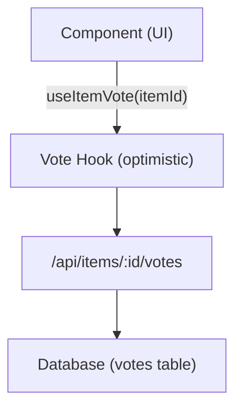

# System głosowania i komentarzy

Szablon Ever Works zawiera pełny system głosowania i komentowania, który pozwala użytkownikom oceniać lub odrzucać elementy, zostawiać recenzje z gwiazdkami i wchodzić w interakcję z treścią. Obydwa systemy korzystają z optymistycznych aktualizacji w celu uzyskania natychmiastowych informacji zwrotnych dotyczących interfejsu użytkownika.

## System głosowania

### Architektura

System głosowania wykorzystuje model głosowania na element, w którym każdy uwierzytelniony użytkownik może oddać jeden głos (w górę lub w dół) na element. System śledzi liczbę głosów netto i głosy poszczególnych użytkowników.



### hook useItemVote

```typescript
import { useItemVote } from '@/hooks/use-item-vote';

const {
  voteCount,       // number -- net vote count
  userVote,        // 'up' | 'down' | null
  isLoading,       // boolean
  handleVote,      // (type: 'up' | 'down') => void
  refreshVotes,    // () => void
} = useItemVote(itemId);
```

### Zachowanie podczas głosowania

| Stan obecny | Akcja | Wynik |
|-------------|--------|------------|
| Nie ma głosu | Kliknij W górę | Głos za (+1) |
| Nie ma głosu | Kliknij w dół | Głos w dół (-1) |
| Przegłosowano | Kliknij W górę | Usuń głos (przełącznik) |
| Przegłosowano | Kliknij w dół | Przełącz na głosowanie przeciw (-2 netto) |
| Odrzucono | Kliknij w dół | Usuń głos (przełącznik) |
| Odrzucono | Kliknij W górę | Przełącz na głos za (+2 netto) |

### Optymistyczne aktualizacje

Hak głosowania implementuje optymistyczne aktualizacje z wycofywaniem:

1. **onMutate** — Anuluj zapytania wychodzące, wykonaj migawkę bieżącego stanu, zastosuj aktualizację optymistyczną
2. **onSuccess** — Zastąp optymistyczne dane odpowiedzią serwera
3. **onError** — Przywróć migawkę, pokaż komunikat o błędzie

### Uwierzytelnianie

Nieuwierzytelnieni użytkownicy próbujący głosować widzą moduł logowania poprzez `useLoginModal` :

```typescript
if (!user) {
  loginModal.onOpen('Please sign in to vote on this item');
  throw new Error('Authentication required');
}
```

### Zarządzanie pamięcią podręczną

Hak narzędziowy `useVoteCache` umożliwia wykonywanie operacji na pamięci podręcznej między komponentami:

```typescript
import { useVoteCache } from '@/hooks/use-item-vote';

const {
  invalidateAllVotes,     // () => void
  invalidateItemVotes,    // (itemId: string) => void
  clearVoteCache,         // () => void
  prefetchItemVotes,      // (itemId: string) => Promise<void>
} = useVoteCache();
```

## System komentarzy

### Architektura

Komentarze obsługują pełne operacje CRUD z ocenami w postaci gwiazdek, moderacją i aktualizacjami w czasie rzeczywistym.

### użyj haka na komentarze

```typescript
import { useComments } from '@/hooks/use-comments';

const {
  comments,              // CommentWithUser[]
  isPending,
  createComment,         // ({ content, itemId, rating }) => Promise
  isCreating,
  updateComment,         // ({ commentId, content?, rating? }) => Promise
  isUpdating,
  deleteComment,         // (commentId) => Promise
  isDeleting,
  rateComment,           // ({ commentId, rating }) => void
  isRatingComment,
  updateCommentRating,   // ({ commentId, rating }) => void
  isUpdatingRating,
  commentRating,         // number
  isLoadingRating,
} = useComments(itemId);
```

### Komentarz do modelu danych

Każdy komentarz zawiera:
- `id` -- Unikalny identyfikator
- `content` -- Tekst komentarza
- `rating` -- Opcjonalna ocena w postaci gwiazdek (1-5)
- `userId` -- Referencje autora
- `itemId` -- Powiązany element
- `user` -- Wypełnione dane użytkownika (imię i nazwisko, adres e-mail, zdjęcie)
- `createdAt` / `updatedAt` -- Znaczniki czasu

### Integracja ocen

Komentarze i oceny są ściśle zintegrowane:
- Utworzenie komentarza z oceną aktualizuje zbiorczą ocenę przedmiotu
- Edycja oceny komentarza powoduje ponowne obliczenie
- Zapytanie `["item-rating", itemId]` jest pobierane ponownie po jakiejkolwiek mutacji komentarza

### Zdarzenia międzyskładnikowe

System komentarzy wywołuje niestandardowe zdarzenia DOM w celu koordynacji między komponentami:

```typescript
const COMMENT_MUTATION_EVENT = "comment:mutated";
window.dispatchEvent(new CustomEvent(COMMENT_MUTATION_EVENT, { detail: comment }));
```

Inne komponenty mogą nasłuchiwać zmian w komentarzach bez bezpośredniego łączenia React Query.

### Moderacja administracyjna

Hook `useAdminComments` umożliwia zarządzanie komentarzami na poziomie administratora:

```typescript
import { useAdminComments } from '@/hooks/use-admin-comments';

const {
  comments,         // AdminCommentItem[]
  totalComments,
  totalPages,
  isDeleting,       // string | null (ID of comment being deleted)
  deleteComment,    // (id: string) => Promise<boolean>
} = useAdminComments({ page: 1, limit: 10, search: '' });
```

### Punkty końcowe interfejsu API

| Metoda | Punkt końcowy | Opis |
|--------|----------|------------|
| OTRZYMAJ | `/api/items/:id/comments` | Pobierz komentarze do elementu |
| POST | `/api/items/:id/comments` | Utwórz nowy komentarz |
| POSTAW | `/api/items/:id/comments/:commentId` | Zaktualizuj komentarz |
| USUŃ | `/api/items/:id/comments/:commentId` | Usuń komentarz |
| POST | `/api/items/:id/comments/rating` | Oceń komentarz |
| POSTAW | `/api/items/:id/comments/rating` | Zaktualizuj ocenę komentarza |
| OTRZYMAJ | `/api/items/:id/comments/rating` | Uzyskaj ocenę zbiorczą |

## Integracja flagi funkcji

Zarówno głosowanie, jak i komentarze uwzględniają flagi funkcyjne:

```typescript
const flags = getFeatureFlags();
// flags.ratings -- Controls star rating display
// flags.comments -- Controls comment section visibility
```

Jeżeli baza danych nie jest skonfigurowana (brakuje `DATABASE_URL` ), funkcje te są automatycznie wyłączane.
