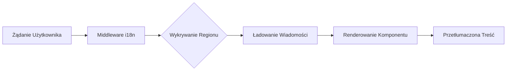

# Przegląd Internacjonalizacji

Ever Works jest zbudowany z myślą o internacjonalizacji, obsługując wiele języków za pomocą `next-intl`.

## 🌍 Obsługiwane Języki

Szablon zawiera wbudowaną obsługę:

- 🇬🇧 **Angielski** (en) – Domyślny język
- 🇫🇷 **Francuski** (fr)
- 🇪🇸 **Hiszpański** (es)
- 🇩🇪 **Niemiecki** (de)
- 🇨🇳 **Chiński** (zh)
- 🇸🇦 **Arabski** (ar)
- 🇧🇬 **Bułgarski** (bg)
- 🇳🇱 **Holenderski** (nl)
- 🇮🇱 **Hebrajski** (he)
- 🇮🇹 **Włoski** (it)
- 🇵🇱 **Polski** (pl)
- 🇵🇹 **Portugalski** (pt)
- 🇷🇺 **Rosyjski** (ru)

## Jak To Działa

### Lokalizacja Oparta na URL

Ever Works używa wykrywania regionu opartego na URL:

```
https://yoursite.com/en/about    → Angielski
https://yoursite.com/fr/about    → Francuski
https://yoursite.com/es/about    → Hiszpański
```

### Automatyczne Wykrywanie Języka

System automatycznie wykrywa:
1. Język przeglądarki użytkownika
2. Przekierowuje do odpowiedniego regionu
3. Zapamiętuje preferencję językową użytkownika
4. Wraca do domyślnego języka (Angielski)

## Architektura Tłumaczeń



## Pliki Tłumaczeń

Tłumaczenia są przechowywane w plikach JSON:

```
messages/
├── en.json    # Angielski
├── fr.json    # Francuski
├── es.json    # Hiszpański
├── de.json    # Niemiecki
├── zh.json    # Chiński
└── ar.json    # Arabski
```

## Szybki Przykład

```typescript
import { useTranslations } from 'next-intl';

export function MyComponent() {
  const t = useTranslations('common');

  return (
    <div>
      <h1>{t('welcome')}</h1>
      <p>{t('description')}</p>
    </div>
  );
}
```

## Funkcje

### ✅ Pełne Pokrycie Tłumaczeń
- Komponenty UI
- Etykiety formularzy i komunikaty walidacji
- Szablony email
- Komunikaty błędów
- Metadane SEO

### ✅ Obsługa RTL
- Automatyczny układ RTL dla arabskiego i hebrajskiego
- Lustrzane elementy UI
- Prawidłowe wyrównanie tekstu

### ✅ Formatowanie Dat i Liczb
- Formaty dat specyficzne dla regionu
- Formatowanie walut
- Formatowanie liczb

### ✅ Pluralizacja
- Automatyczne formy liczby mnogiej
- Reguły specyficzne dla języka

## Następne Kroki

- [Przewodnik po Tłumaczeniu →](./translation-guide) – Dowiedz się jak dodawać i zarządzać tłumaczeniami
- [Pierwsze Kroki](/getting-started) – Skonfiguruj swój projekt
- [Personalizacja](/guides/customization) – Dostosuj swoją stronę

## Potrzebujesz Pomocy?

Zapoznaj się ze stroną [wsparcia](/advanced-guide/support) w celu uzyskania pomocy z internacjonalizacją.
