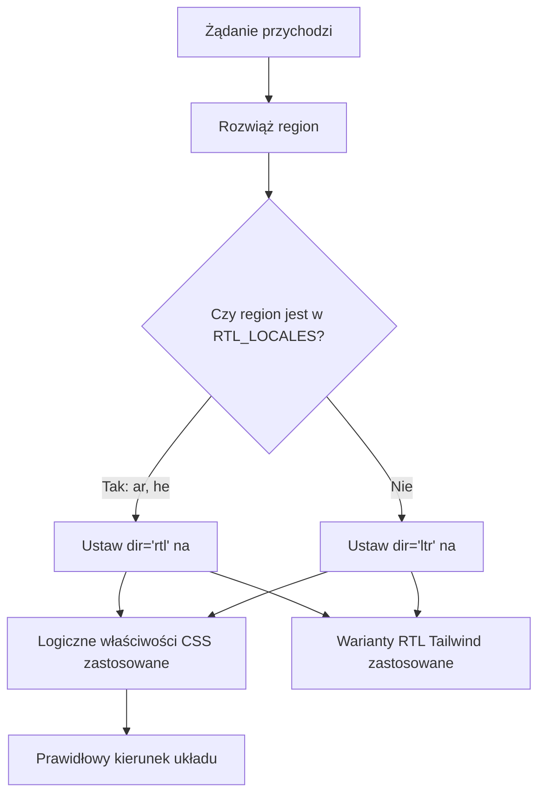

# Wsparcie RTL (Pisanie od Prawej do Lewej)

Szablon w pełni obsługuje języki pisane od prawej do lewej (RTL) takie jak arabski i hebrajski. Ta strona dokumentuje jak działa wykrywanie RTL, jak jest stosowany kierunek układu i jak komponenty dostosowują się do kontekstów RTL.

## Przegląd Architektury



## Pliki Źródłowe

| Plik | Cel |
|------|---------|
| `lib/constants.ts` | Definicja listy regionów RTL |
| `app/layout.tsx` | Główny layout z atrybutem `dir` |
| `components/language-switcher.tsx` | Mapa języków z metadanymi `isRTL` |

## Konfiguracja Regionu RTL

```typescript
export const RTL_LOCALES: readonly Locale[] = ['ar', 'he'] as const;
```

## Jak Jest Stosowany Kierunek

### Wykrywanie w Głównym Layoucie

```typescript
export default async function RootLayout({ children }) {
  const locale = await getLocale();
  const dir = RTL_LOCALES.includes(locale as Locale) ? 'rtl' : 'ltr';

  return (
    <html lang={locale} dir={dir} suppressHydrationWarning>
      <body className={`${getFontClassNames(locale)} antialiased`}>
        {children}
      </body>
    </html>
  );
}
```

## Strategie CSS dla RTL

### 1. Logiczne Właściwości CSS

| Właściwość Fizyczna | Właściwość Logiczna | Znaczenie LTR | Znaczenie RTL |
|-------------------|-----------------|-------------|-------------|
| `margin-left` | `margin-inline-start` | Margines lewy | Margines prawy |
| `margin-right` | `margin-inline-end` | Margines prawy | Margines lewy |
| `padding-left` | `padding-inline-start` | Padding lewy | Padding prawy |
| `text-align: left` | `text-align: start` | Wyrównany do lewej | Wyrównany do prawej |
| `left` | `inset-inline-start` | Pozycja lewa | Pozycja prawa |

### 2. Wsparcie RTL w Tailwind CSS

```html
<div class="ml-4 rtl:mr-4 rtl:ml-0">
  Treść z kierunkowym marginesem
</div>

<svg class="rtl:rotate-180">
  <path d="M1 9 4-4-4-4" />
</svg>
```

### 3. Logiczne Narzędzia Tailwind

```html
<div class="ps-4">  <!-- padding-inline-start: 1rem -->
<div class="pe-4">  <!-- padding-inline-end: 1rem -->
<div class="ms-4">  <!-- margin-inline-start: 1rem -->
<div class="me-4">  <!-- margin-inline-end: 1rem -->
```

## Typowe Problemy RTL

| Problem | Przyczyna | Rozwiązanie |
|-------|-------|-----|
| Nieprawidłowe wyrównanie tekstu | Użycie `text-left` zamiast `text-start` | Używać właściwości logicznych |
| Ikony nie są odbite | Brak `rtl:rotate-180` na ikonach kierunkowych | Dodać wariant RTL |
| Margines po złej stronie | Użycie `ml-*` zamiast `ms-*` | Używać logicznych narzędzi Tailwind |

## Dodawanie Nowego Języka RTL

1. **Dodać region** do `LOCALES` w `lib/constants.ts`
2. **Dodać do `RTL_LOCALES`**
3. **Stworzyć plik wiadomości** w `messages/ur.json`
4. **Dodać wpis w mapie języków** w `components/language-switcher.tsx`
5. **Dodać SVG flagi** w `public/flags/ur.svg`
6. **Dokładnie przetestować układ** w trybie RTL

## Najlepsze Praktyki

1. **Preferować logiczne właściwości CSS** nad fizycznymi
2. **Używać `dir="rtl"` na `<html>`** (już obsługiwane przez główny layout)
3. **Testować z prawdziwą arabską/hebrajską treścią**, a nie angielskim tekstem w trybie RTL
4. **Nie odbijać lustrzanie obrazów dekoracyjnych** ani logo marki
