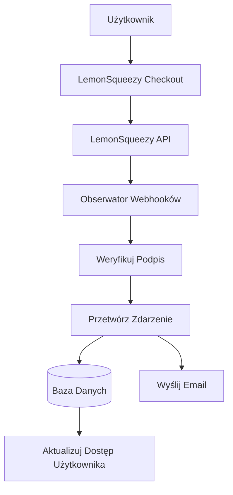

# Konfiguracja LemonSqueezy

Ten przewodnik wyjaśnia, jak skonfigurować LemonSqueezy jako dostawcę płatności w aplikacji Ever Works.

## Przegląd

LemonSqueezy to platforma merchant of record, która upraszcza:

- 💰 Globalne płatności z automatyczną zgodnością podatkową
- 🌍 Obsługę 135+ krajów
- 📊 Wbudowaną ochronę przed oszustwami
- 🔄 Zarządzanie subskrypcjami
- 💳 Wiele metod płatności
- 📧 Automatyczne potwierdzenia e-mail

:::tip Dlaczego LemonSqueezy?
LemonSqueezy działa jako merchant of record, automatycznie obsługując całą zgodność podatkową, VAT i podatek od sprzedaży. Oznacza to, że nie musisz rejestrować się do podatków w różnych krajach.
:::

## Wymagane zmienne środowiskowe

Dodaj te zmienne do pliku `.env.local`:

```env
# Konfiguracja LemonSqueezy
LEMONSQUEEZY_API_KEY=your_api_key_here
LEMONSQUEEZY_WEBHOOK_SECRET=your_webhook_secret_here
LEMONSQUEEZY_STORE_ID=your_store_id_here

# ID produktu/wariantu (opcjonalne)
NEXT_PUBLIC_LEMONSQUEEZY_PRO_VARIANT_ID=variant_id_here
NEXT_PUBLIC_LEMONSQUEEZY_SPONSOR_VARIANT_ID=variant_id_here
```

## Konfiguracja panelu LemonSqueezy

### Krok 1: Utwórz swój sklep

1. Zarejestruj się na [LemonSqueezy](https://lemonsqueezy.com)
2. Utwórz nowy sklep
3. Uzupełnij ustawienia sklepu (nazwa, waluta itp.)
4. Skopiuj **ID sklepu** z URL lub ustawień

### Krok 2: Utwórz produkty

1. Przejdź do **Produkty** → **Nowy Produkt**
2. Utwórz swoje poziomy cenowe:

| Produkt | Cena | Typ | Opis |
|---------|------|-----|------|
| **Plan Pro** | 10 $/miesiąc | Subskrypcja | Zaawansowane funkcje |
| **Plan Sponsor** | 20 $ | Jednorazowy | Wsparcie premium |

3. Dla każdego produktu utwórz **Warianty** z określonymi cenami
4. Skopiuj **ID wariantu** dla każdej opcji cenowej

### Krok 3: Pobierz klucz API

1. Przejdź do **Ustawienia** → **API**
2. Utwórz nowy klucz API
3. Skopiuj klucz API (zaczyna się od `ls_`)
4. Dodaj go do `.env.local` jako `LEMONSQUEEZY_API_KEY`

### Krok 4: Skonfiguruj webhooks

1. Przejdź do **Ustawienia** → **Webhooks**
2. Kliknij **Utwórz webhook**
3. Skonfiguruj webhook:
   - **URL**: `https://twojedomena.com/api/lemonsqueezy/webhook`
   - **Zdarzenia**: Wybierz wszystkie zdarzenia subskrypcji i zamówień
   - **Sekret**: Wygeneruj tajny klucz

4. Skopiuj **Sekret webhooka** i dodaj go do `.env.local`

#### Zalecane zdarzenia

Wybierz te zdarzenia w konfiguracji webhooka:

- ✅ `subscription_created` - Nowa subskrypcja
- ✅ `subscription_updated` - Zmiany subskrypcji
- ✅ `subscription_cancelled` - Anulowanie
- ✅ `subscription_payment_success` - Udana płatność
- ✅ `subscription_payment_failed` - Nieudana płatność
- ✅ `subscription_trial_will_end` - Kończący się okres próbny
- ✅ `order_created` - Jednorazowy zakup
- ✅ `order_refunded` - Przetworzony zwrot

## Endpoint webhooka

Webhook jest dostępny pod adresem: `/api/lemonsqueezy/webhook`

### Obsługiwane mapowanie zdarzeń

| Zdarzenie LemonSqueezy | Zdarzenie wewnętrzne | Opis |
|------------------------|---------------------|------|
| `subscription_created` | `SUBSCRIPTION_CREATED` | Utworzono nową subskrypcję |
| `subscription_updated` | `SUBSCRIPTION_UPDATED` | Zaktualizowano subskrypcję |
| `subscription_cancelled` | `SUBSCRIPTION_CANCELLED` | Anulowano subskrypcję |
| `subscription_payment_success` | `SUBSCRIPTION_PAYMENT_SUCCEEDED` | Płatność powiodła się |
| `subscription_payment_failed` | `SUBSCRIPTION_PAYMENT_FAILED` | Płatność nieudana |
| `subscription_trial_will_end` | `SUBSCRIPTION_TRIAL_ENDING` | Okres próbny wkrótce się kończy |
| `order_created` | `PAYMENT_SUCCEEDED` | Jednorazowa płatność |
| `order_refunded` | `REFUND_SUCCEEDED` | Przetworzono zwrot |

## Implementacja

### Architektura systemu płatności



### Funkcje

#### Bezpieczeństwo

- ✅ Weryfikacja podpisu HMAC (SHA-256)
- ✅ Walidacja sekretu webhooka
- ✅ Kompleksowa obsługa błędów
- ✅ Rejestrowanie żądań

#### Funkcjonalność

- ✅ Zarządzanie cyklem życia subskrypcji
- ✅ Automatyczne przetwarzanie płatności
- ✅ Powiadomienia e-mail
- ✅ Synchronizacja bazy danych
- ✅ Monitorowanie błędów

## Przykład użycia

### Utwórz checkout

```typescript
import { LemonSqueezyProvider } from '@/lib/payment/providers/lemonsqueezy-provider';

const lsProvider = new LemonSqueezyProvider({
  apiKey: process.env.LEMONSQUEEZY_API_KEY!,
  storeId: process.env.LEMONSQUEEZY_STORE_ID!,
});

// Utwórz sesję checkout
const checkout = await lsProvider.createCheckout({
  variantId: 'variant_id_here',
  customerId: 'customer_id',
  redirectUrl: 'https://yoursite.com/success',
});

// Przekieruj użytkownika na checkout.url
```

## Testowanie

### Tryb testowy

1. LemonSqueezy zapewnia tryb testowy do celów programistycznych
2. Używaj testowych kluczy API (dostępnych w panelu)
3. Testuj webhooki za pomocą narzędzia do testowania webhooków LemonSqueezy

### Lokalne testowanie

```bash
# Użyj narzędzia jak ngrok do ekspozycji lokalnego serwera
ngrok http 3000

# Zaktualizuj URL webhooka w panelu LemonSqueezy
https://your-ngrok-url.ngrok.io/api/lemonsqueezy/webhook
```

## Monitorowanie

Wszystkie zdarzenia webhook są rejestrowane:

- ✅ **Sukces**: `✅ LemonSqueezy [event] handled successfully`
- ❌ **Błędy**: `❌ Failed to handle [event]: [error details]`

Sprawdź logi aplikacji pod kątem aktywności webhooków.

## Rozwiązywanie problemów

### Typowe problemy

**Problem**: Błąd "No signature provided"

- **Rozwiązanie**: Upewnij się, że LemonSqueezy wysyła header `x-signature`
- Sprawdź konfigurację webhooka w panelu LemonSqueezy

**Problem**: Błąd "Invalid signature"

- **Rozwiązanie**: Sprawdź, czy `LEMONSQUEEZY_WEBHOOK_SECRET` pasuje do sekretu w LemonSqueezy
- Upewnij się, że URL webhooka jest poprawnie skonfigurowany

**Problem**: Webhook nie odbiera zdarzeń

- **Rozwiązanie**: Sprawdź, czy URL webhooka jest publicznie dostępny
- Użyj ngrok do lokalnego testowania
- Sprawdź logi webhooków LemonSqueezy

## Najlepsze praktyki bezpieczeństwa

1. **Tylko HTTPS**: Zawsze używaj HTTPS dla endpointów webhooków w produkcji
2. **Rotacja sekretów**: Regularnie rotuj sekrety webhooków
3. **Monitorowanie**: Monitoruj logi webhooków pod kątem podejrzanej aktywności
4. **Zmienne środowiskowe**: Nigdy nie commituj sekretów do kontroli wersji
5. **Rate limiting**: Implementuj rate limiting dla produkcyjnych webhooków
