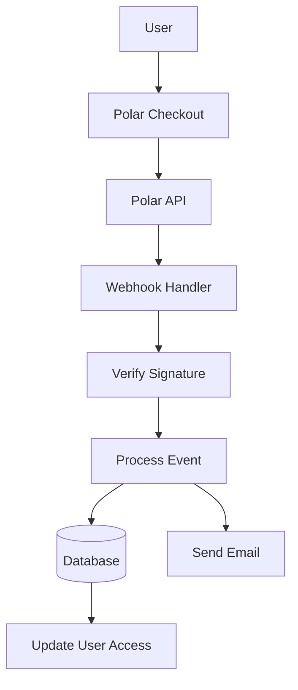

# Konfiguracja polarna

W tym przewodniku wyjaśniono, jak skonfigurować Polar jako dostawcę płatności w aplikacji Ever Works.

## Przegląd

Polar to nowoczesna platforma płatnicza przeznaczona dla programistów i twórców, która oferuje:

- 💻 Przyjazny dla programistów interfejs API i dokumentacja
- 🔄 Wsparcie w zakresie subskrypcji i płatności jednorazowych
- 🐙 Integracja z GitHubem dla sponsorów
- 💰 Przejrzysta struktura cenowa
- 🔒 Bezpieczne przetwarzanie płatności
- 📊 Wbudowane analizy i raportowanie

:::wskazówka Dlaczego Polar?
Polar został stworzony specjalnie dla programistów i projektów typu open source, oferując przejrzyste API, doskonałą dokumentację i bezproblemową integrację z GitHub w celu sponsorowania i monetyzacji.
:::

## Wymagane zmienne środowiskowe

Dodaj te zmienne do swojego pliku `.env.local` :

```env
# Polar Configuration
POLAR_API_KEY=your_polar_api_key_here
POLAR_WEBHOOK_SECRET=your_webhook_secret_here
POLAR_APP_URL=https://your-app-url.com

# Product IDs (optional)
NEXT_PUBLIC_POLAR_SUBSCRIPTION_PRODUCT_ID=product_id_here
NEXT_PUBLIC_POLAR_ONETIME_PRODUCT_ID=product_id_here
```

:::ostrzeżenie
Nigdy nie udostępniaj swoich tajnych kluczy kontroli wersji. Zachowaj `.env.local` w swoim pliku `.gitignore` .
:::

## Konfiguracja panelu Polar

### Krok 1: Utwórz swoje konto

1. Zarejestruj się w [Polar](https://polar.sh)
2. Dokończ konfigurację konta
3. Zweryfikuj swój adres e-mail

### Krok 2: Utwórz produkty

1. Przejdź do **Produkty** → **Nowy produkt**
2. Utwórz swoje poziomy cenowe:

| Produkt | Cena | Wpisz | Opis |
|--------|-------|------|------------|
| **Plan Pro** | 10 USD/miesiąc | Subskrypcja | Zaawansowane funkcje |
| **Plan sponsorski** | 20 dolarów | Jednorazowe | Wsparcie premium |

3. Skonfiguruj ustawienia produktu:
   - Ustaw ceny i cykl rozliczeniowy
   - Dodaj opisy produktów
   - Skonfiguruj poziomy dostępu
4. Skopiuj **ID produktu** dla każdego produktu

### Krok 3: Uzyskaj klucz API

1. Przejdź do **Ustawienia** → **Klucze API**
2. Utwórz nowy klucz API
3. Skopiuj klucz API
4. Dodaj go do `.env.local` jako `POLAR_API_KEY` :::wskazówka
Polar zapewnia osobne klucze do rozwoju i produkcji. Użyj kluczy testowych podczas programowania.
:::

### Krok 4: Skonfiguruj webhooki

1. Przejdź do **Ustawienia** → **Webhooki**
2. Kliknij **Utwórz webhooka**
3. Skonfiguruj webhooka:
   - **URL**: `https://yourdomain.com/api/polar/webhook` - **Wydarzenia**: Wybierz wszystkie zdarzenia dotyczące płatności i subskrypcji
   - **Sekret**: Wygeneruj tajny klucz

4. Skopiuj **Sekret webhooka** i dodaj go do swojego `.env.local` #### Polecane wydarzenia

Wybierz te zdarzenia w konfiguracji webhooka:

- ✅ `payment.succeeded` - Płatność pomyślna
- ✅ `payment.failed` - Nieudana płatność
- ✅ `subscription.created` - Nowa subskrypcja
- ✅ `subscription.updated` - Zmiany w abonamencie
- ✅ `subscription.cancelled` - Anulowanie
- ✅ `subscription.trial_will_end` - Zakończenie próby
- ✅ `refund.created` - Zwrot środków zrealizowany

## Architektura systemu płatności



### Dostawca Polar

Dostawca Polar ( `lib/payment/lib/providers/polar-provider.ts` ) wdraża:

- ✅Zarządzanie klientami
- ✅ Zarządzanie produktami i cenami
- ✅ Cykl życia subskrypcji
- ✅ Przetwarzanie płatności
- ✅ Obsługa webhoków
- ✅Zwrot wsparcia

### Trasy API

Dostępne są następujące trasy API:

| Trasa | Metoda | Opis |
|-------|--------|------------|
| `/api/polar/webhook` | POST | Obsługa webhooków Polar |
| `/api/polar/subscription` | POST | Utwórz subskrypcję |
| `/api/polar/subscription` | POSTAW | Aktualizuj subskrypcję |
| `/api/polar/subscription` | USUŃ | Anuluj subskrypcję |
| `/api/polar/checkout` | POST | Utwórz sesję realizacji transakcji |
| `/api/polar/payment` | OTRZYMAJ | Sprawdź status płatności |

### Składniki interfejsu użytkownika

W systemie wykorzystywane są komponenty kasowe firmy Polar:

- `PolarCheckoutButton` - Element przycisku kasy
- `PolarPaymentForm` - Formularz płatności z zatwierdzeniem
- Responsywny projekt dla urządzeń mobilnych i komputerów stacjonarnych
- Obsługa wielu metod płatności

## Przykłady użycia

### Utwórz subskrypcję

```typescript
import { PolarProvider } from '@/lib/payment/providers/polar-provider';

const configs = createProviderConfigs({
  apiKey: process.env.POLAR_API_KEY!,
  webhookSecret: process.env.POLAR_WEBHOOK_SECRET!,
  options: {
    appUrl: process.env.POLAR_APP_URL!
  }
});

const polarProvider = new PolarProvider(configs.polar);

const subscription = await polarProvider.createSubscription({
  customerId: 'customer_id',
  productId: 'product_id',
  paymentMethodId: 'payment_method_id',
  trialPeriodDays: 7
});
```

### Utwórz sesję realizacji transakcji

```typescript
const checkout = await polarProvider.createCheckout({
  productId: 'product_id_here',
  customerId: 'customer_id',
  successUrl: 'https://yoursite.com/success',
  cancelUrl: 'https://yoursite.com/cancel'
});

// Redirect user to checkout.url
```

### Użyj komponentu płatności

```tsx
import { PolarCheckoutButton } from '@/lib/payment';

function PaymentPage() {
  return (
    <PolarCheckoutButton
      productId="product_id_here"
      amount={1000} // 10.00 USD in cents
      currency="usd"
      isSubscription={true}
      onSuccess={(paymentId) => {
        console.log('Payment succeeded:', paymentId);
        // Redirect to success page or update UI
      }}
      onError={(error) => {
        console.error('Payment error:', error);
        // Show error message to user
      }}
    />
  );
}
```

## Testowanie integracji

### Tryb testowy

1. **Użyj testowych kluczy API** (dostępne w panelu Polar)
2. **Skorzystaj z testowych metod płatności**:
   - Karty testowe dostępne w panelu kontrolnym Polar
   - Tryb testowy dla wszystkich przepływów płatniczych

3. **Testuj webhooki lokalnie** za pomocą narzędzia takiego jak ngrok:

   ,,bicie
   ngrok http 3000
   ```

   Zaktualizuj adres URL webhooka w panelu Polar na adres URL ngrok.

### Testowanie webhooka

```bash
# Use ngrok to expose your local server
ngrok http 3000

# Update webhook URL in Polar dashboard
https://your-ngrok-url.ngrok.io/api/polar/webhook

# Trigger test events from Polar dashboard
```

## Obsługa błędów

System automatycznie radzi sobie z typowymi błędami:

| Typ błędu | Obsługa |
|------------|---------|
| Płatność odrzucona | Przyjazny dla użytkownika komunikat o błędzie |
| Problemy z siecią | Automatyczna logika ponownych prób |
| Awarie webhooka | Zalogowano do ręcznego przeglądu |
| Błędy walidacji | Podświetlenie pola formularza |
| Błędy subskrypcji | Usuń komunikaty o błędach |

## Najlepsze praktyki dotyczące bezpieczeństwa

1. **Klucze API**:
   - Nigdy nie ujawniaj tajnych kluczy w kodzie po stronie klienta
   - Użyj zmiennych środowiskowych
   - Regularnie obracaj klucze

2. **Weryfikacja webhooka**:
   - Zawsze sprawdzaj podpisy webhooków
   - Zweryfikuj dane zdarzenia przed przetworzeniem
   - Użyj protokołu HTTPS dla wszystkich punktów końcowych elementu webhook

3. **Dane dotyczące płatności**:
   - Nigdy nie przechowuj szczegółów płatności
   - Korzystaj z bezpiecznego przetwarzania płatności Polar
   - Wdrożyć odpowiednie uwierzytelnianie

4. **Sesje użytkownika**:
   - Sprawdź uwierzytelnienie użytkownika
   - Sprawdź uprawnienia użytkownika
   - Rejestruj wszystkie działania płatnicze

## Integracja z GitHubem

Polar oferuje bezproblemową integrację z GitHub:

- **Sponsorowanie GitHub**: Połącz Polar ze sponsorami GitHub
- **Dostęp do repozytorium**: Przyznaj dostęp na podstawie subskrypcji
- **Wsparcie organizacji**: Zarządzaj subskrypcjami zespołu
- **Dostęp automatyczny**: Automatyczne zarządzanie dostępem

### Skonfiguruj integrację z GitHubem

1. Przejdź do **Ustawienia** → **Integracje** → **GitHub**
2. Połącz swoje konto GitHub
3. Skonfiguruj reguły dostępu do repozytorium
4. Skonfiguruj automatyczne zarządzanie dostępem

## Zależności

Wymagane pakiety (już zawarte w Ever Works):

```json
{
  "@polar-sh/sdk": "^1.0.0"
}
```

## Rozwiązywanie problemów

### Typowe problemy

**Problem**: Webhook nie odbiera zdarzeń

- **Rozwiązanie**: Sprawdź, czy adres URL webhooka jest publicznie dostępny
- Użyj ngrok do testów lokalnych
- Sprawdź, czy sekret webhooka jest poprawny

**Problem**: Płatność kończy się niepowodzeniem w trybie cichym

- **Rozwiązanie**: Sprawdź konsolę przeglądarki pod kątem błędów
- Sprawdź, czy klucze API są poprawne
- Sprawdź logi panelu Polar

**Problem**: Subskrypcja nie aktualizuje się

- **Rozwiązanie**: Sprawdź, czy zdarzenia webhooka są skonfigurowane
- Sprawdź dzienniki obsługi elementu webhook
— Upewnij się, że aktualizacje baz danych działają

**Problem**: Integracja z GitHubem nie działa

- **Rozwiązanie**: Sprawdź połączenie GitHub w panelu Polar
- Sprawdź ustawienia dostępu do repozytorium
- Upewnij się, że zostały przyznane odpowiednie uprawnienia

## Porównanie: Polar i inni dostawcy

| Funkcja | Polarny | Pasek | Wyciskacz cytrynowy |
|--------|-------|--------|-------------|
| **Nacisk na programistę** | ✅ Znakomity | ⚠️Dobrze | ⚠️Dobrze |
| **Integracja z GitHubem** | ✅ Natywny | ❌ Nie | ❌ Nie |
| **Przyjazny dla otwartego oprogramowania** | ✅Tak | ⚠️ Ograniczona | ⚠️ Ograniczona |
| **Złożoność konfiguracji** | ✅Proste | ⚠️ Umiarkowane | ✅Proste |
| **Jakość API** | ✅ Znakomity | ✅ Znakomity | ⚠️Dobrze |
| **Przestrzeganie przepisów podatkowych** | ⚠️ Instrukcja | ⚠️ Instrukcja | ✅ Automatyczny |
| **Najlepsze dla** | Programiści, OSS | Wysoka głośność | Globalna sprzedaż |

## Następne kroki

- [Konfiguracja paska](./stripe) - Alternatywny dostawca płatności
- [Konfiguracja LemonSqueezy](./lemonsqueezy) - Alternatywny dostawca płatności
- [Przegląd płatności](/payment) - Porównaj dostawców usług płatniczych
- [Zmienne środowiskowe](/deployment/zmienne-środowiskowe) - Pełna konfiguracja środowiska
- [Wdrożenie](/deployment) - Wdróż integrację z płatnościami

## Zasoby

- [Dokumentacja Polar](https://docs.polar.sh/)
- [Dokumentacja API](https://docs.polar.sh/api)
- [Przewodnik po webhookach](https://docs.polar.sh/webhooks)
- [Integracja z GitHubem](https://docs.polar.sh/integrations/github)

## Wsparcie

Potrzebujesz pomocy przy integracji z Polar? Sprawdź naszą [stronę pomocy](/advanced-guide/support) lub dołącz do naszej społeczności.
