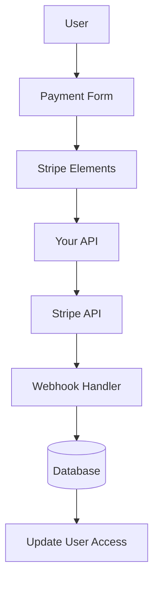

# Konfiguracja pasków

W tym przewodniku wyjaśniono, jak skonfigurować Stripe w aplikacji Ever Works z pełnym systemem subskrypcji i płatności.

## Przegląd

Stripe to kompleksowa platforma płatnicza obsługująca:

- 💳 Płatności jednorazowe
- 🔄 Subskrypcje cykliczne
- 🌍 Wiele metod płatności (karty, Apple Pay, Google Pay)
- 💰 Wiele walut
- 📊 Zaawansowana analityka i raportowanie

## Wymagane zmienne środowiskowe

Dodaj te zmienne do swojego pliku `.env.local` :

```bash
# Stripe Configuration
STRIPE_SECRET_KEY=sk_test_your_stripe_secret_key_here
STRIPE_WEBHOOK_SECRET=whsec_your_stripe_webhook_secret_here
NEXT_PUBLIC_STRIPE_PUBLISHABLE_KEY=pk_test_your_stripe_publishable_key_here

# Stripe Price IDs
NEXT_PUBLIC_STRIPE_SUBSCRIPTION_PRICE_ID=price_subscription_id_here
NEXT_PUBLIC_STRIPE_ONETIME_PRICE_ID=price_onetime_id_here
NEXT_PUBLIC_STRIPE_FREE_PRICE_ID=price_free_id_here

# Product Pricing (for display purposes)
NEXT_PUBLIC_PRODUCT_PRICE_PRO=10.00
NEXT_PUBLIC_PRODUCT_PRICE_SPONSOR=20.00
NEXT_PUBLIC_PRODUCT_PRICE_FREE=0.00
```

:::ostrzeżenie
Nigdy nie udostępniaj swoich tajnych kluczy kontroli wersji. Zachowaj `.env.local` w swoim pliku `.gitignore` .
:::

## Konfiguracja panelu Stripe

### Krok 1: Utwórz produkty

W Twoim [Panelu Stripe](https://dashboard.stripe.com/):

1. Przejdź do **Produkty** → **Dodaj produkt**
2. Utwórz następujące produkty:

| Produkt | Cena | Wpisz | Opis |
|--------|-------|------|------------|
| **Darmowy plan** | 0,00 $ | Jednorazowe | Podstawowe funkcje |
| **Plan Pro** | 10,00 dolarów | Abonament miesięczny | Zaawansowane funkcje |
| **Plan sponsorski** | 20,00 dolarów | Jednorazowe | Wsparcie premium |

3. Skopiuj **ID ceny** dla każdego produktu (zaczyna się od `price_` )

### Krok 2: Skonfiguruj webhooki

Webhooki pozwalają Stripe powiadamiać Twoją aplikację o zdarzeniach płatniczych.

1. Przejdź do **Programiści** → **Webhooki** → **Dodaj punkt końcowy**
2. Ustaw adres URL punktu końcowego:
   - Rozwój: `http://localhost:3000/api/stripe/webhook` - Produkcja: `https://your-domain.com/api/stripe/webhook` 3. Wybierz zdarzenia, których chcesz słuchać:
   - `payment_intent.succeeded` - `payment_intent.payment_failed` - `customer.subscription.created` - `customer.subscription.updated` - `customer.subscription.deleted` - `customer.subscription.trial_will_end` - `invoice.payment_succeeded` - `invoice.payment_failed` 4. Skopiuj **tajemnica podpisu** (zaczyna się od `whsec_` )

### Krok 3: Pobierz klucze API

W panelu Stripe:

1. **Tajny klucz**: **Programiści** → **Klucze API** → **Tajny klucz** (zaczyna się od `sk_` )
2. **Klucz do publikacji**: **Programiści** → **Klucze API** → **Klucz do publikacji** (zaczyna się od `pk_` )
3. **Sekret webhooka**: **Programiści** → **Webhook** → Wybierz swojego webhooka → **Sekret podpisu**

:::wskazówka
Podczas programowania używaj klawiszy **trybu testowego** (zaczynają się od `sk_test_` i `pk_test_` ). Przełącz na klucze **trybu na żywo** na potrzeby produkcji.
:::

## Architektura systemu płatności



### Dostawca pasków

Dostawca Stripe ( `lib/payment/lib/providers/stripe-provider.ts` ) wdraża:

- ✅Zarządzanie klientami
- ✅ Tworzenie intencji płatniczych
- ✅ Zarządzanie subskrypcjami
- ✅ Obsługa webhoków
- ✅ Obsługa zamiaru konfiguracji
- ✅ Zwroty kosztów i anulowanie rezerwacji

### Trasy API

Dostępne są następujące trasy API:

| Trasa | Metoda | Opis |
|-------|--------|------------|
| `/api/stripe/webhook` | POST | Obsługa webhooków Stripe |
| `/api/stripe/subscription` | POST | Utwórz subskrypcję |
| `/api/stripe/subscription` | POSTAW | Aktualizuj subskrypcję |
| `/api/stripe/subscription` | USUŃ | Anuluj subskrypcję |
| `/api/stripe/payment-intent` | POST | Utwórz intencję płatniczą |
| `/api/stripe/payment-intent` | OTRZYMAJ | Zweryfikuj płatność |
| `/api/stripe/setup-intent` | POST | Skonfiguruj metodę płatności |

### Składniki interfejsu użytkownika

System wykorzystuje Stripe Elements do bezpiecznych form płatności:

- `StripeElementsWrapper` - Główny element opakowania
- `StripePaymentForm` - Formularz płatności z zatwierdzeniem
- Wsparcie dla Apple Pay i Google Pay
- Responsywny projekt dla urządzeń mobilnych i komputerów stacjonarnych

## Przykłady użycia

### Utwórz subskrypcję

```typescript
import { StripeProvider } from '@/lib/payment/providers/stripe-provider';

const configs = createProviderConfigs({
  apiKey: process.env.STRIPE_SECRET_KEY!,
  webhookSecret: process.env.STRIPE_WEBHOOK_SECRET!,
  options: {
    publishableKey: process.env.NEXT_PUBLIC_STRIPE_PUBLISHABLE_KEY!,
    apiVersion: '2023-10-16'
  }
});

const stripeProvider = new StripeProvider(configs.stripe);

const subscription = await stripeProvider.createSubscription({
  customerId: 'cus_customer_id',
  priceId: 'price_subscription_id',
  paymentMethodId: 'pm_payment_method_id',
  trialPeriodDays: 7
});
```

### Użyj komponentu płatności

```tsx
import { PaymentForm } from '@/lib/payment';

function PaymentPage() {
  return (
    <PaymentForm
      amount={1000} // 10.00 USD in cents
      currency="usd"
      isSubscription={true}
      onSuccess={(paymentId) => {
        console.log('Payment succeeded:', paymentId);
        // Redirect to success page or update UI
      }}
      onError={(error) => {
        console.error('Payment error:', error);
        // Show error message to user
      }}
    />
  );
}
```

## Testowanie integracji

### Tryb testowy

1. **Użyj testowych kluczy API** (zacznij od `sk_test_` i `pk_test_` )
2. **Użyj numerów kart testowych**:
   - Sukces: `4242 4242 4242 4242` - Spadek: `4000 0000 0000 0002` - 3D Secure: `4000 0025 0000 3155` 3. **Testuj webhooki lokalnie** za pomocą Stripe CLI:

   ,,bicie
   Stripe Listen --forward-to localhost:3000/api/stripe/webhook
   ```

### Testowanie webhooka

```bash
# Install Stripe CLI
brew install stripe/stripe-cli/stripe

# Login to your Stripe account
stripe login

# Forward webhooks to your local server
stripe listen --forward-to localhost:3000/api/stripe/webhook

# Trigger test events
stripe trigger payment_intent.succeeded
```

## Obsługa błędów

System automatycznie radzi sobie z typowymi błędami:

| Typ błędu | Obsługa |
|------------|---------|
| Karta odrzucona | Przyjazny dla użytkownika komunikat o błędzie |
| Niewystarczające środki | Spróbuj ponownie, używając innej karty |
| Problemy z siecią | Automatyczna logika ponownych prób |
| Awarie webhooka | Zalogowano do ręcznego przeglądu |
| Błędy walidacji | Podświetlenie pola formularza |

## Najlepsze praktyki dotyczące bezpieczeństwa

1. **Klucze API**:
   - Nigdy nie ujawniaj tajnych kluczy w kodzie po stronie klienta
   - Użyj zmiennych środowiskowych
   - Regularnie obracaj klucze

2. **Weryfikacja webhooka**:
   - Zawsze sprawdzaj podpisy webhooków
   - Zweryfikuj dane zdarzenia przed przetworzeniem

3. **Dane dotyczące płatności**:
   - Nigdy nie przechowuj numerów kart
   - Użyj tokenizacji Stripe
   - Wdrażaj zgodność z PCI

4. **Sesje użytkownika**:
   - Sprawdź uwierzytelnienie użytkownika
   - Sprawdź uprawnienia użytkownika
   - Rejestruj wszystkie działania płatnicze

## Zależności

Wymagane pakiety (już zawarte w Ever Works):

```json
{
  "@stripe/react-stripe-js": "^3.7.0",
  "@stripe/stripe-js": "^7.3.0",
  "stripe": "^18.1.0"
}
```

## Rozwiązywanie problemów

### Typowe problemy

**Problem**: Webhook nie odbiera zdarzeń

- **Rozwiązanie**: Sprawdź, czy adres URL webhooka jest publicznie dostępny
- Użyj Stripe CLI do testów lokalnych
- Sprawdź, czy sekret webhooka jest poprawny

**Problem**: Płatność kończy się niepowodzeniem w trybie cichym

- **Rozwiązanie**: Sprawdź konsolę przeglądarki pod kątem błędów
- Sprawdź, czy klucze API są poprawne
- Sprawdź dzienniki panelu Stripe

**Problem**: 3D Secure nie działa

- **Rozwiązanie**: Upewnij się, że obsługujesz status `requires_action` - Zaimplementuj odpowiedni przepływ przekierowań
- Przetestuj za pomocą kart testowych 3D Secure

## Następne kroki

- [Konfiguracja LemonSqueezy](./lemonsqueezy) - Alternatywny dostawca płatności
- [Zmienne środowiskowe](/deployment/zmienne-środowiskowe) - Pełna konfiguracja środowiska
- [Wdrożenie](/deployment) - Wdróż integrację z płatnościami

## Zasoby

- [Dokumentacja Stripe](https://stripe.com/docs)
- [Przewodnik integracji Next.js](https://stripe.com/docs/payments/accept-a-payment?platform=web&ui=elements)
- [Zarządzanie subskrypcjami](https://stripe.com/docs/billing/subscriptions)
- [Wydarzenia webhooka](https://stripe.com/docs/api/events/types)

## Wsparcie

Potrzebujesz pomocy przy integracji Stripe? Sprawdź naszą [stronę pomocy](/advanced-guide/support) lub dołącz do naszej społeczności.
