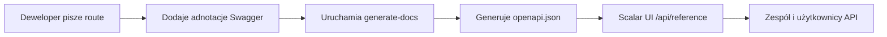

# Szkolenie z Dokumentacji API

Opanuj zautomatyzowany system dokumentacji API używając adnotacji Swagger i interfejsu Scalar UI.

## 🎯 Cele

Po ukończeniu tego modułu będziesz w stanie:

- ✅ Rozumieć przepływ pracy dokumentacji API
- ✅ Pisać poprawne adnotacje Swagger
- ✅ Przestrzegać standardowych konwencji tagów
- ✅ Generować i walidować dokumentację
- ✅ Rozwiązywać typowe problemy
- ✅ Utrzymywać wysokiej jakości dokumentację API

**Szacowany czas**: 2–3 dni

---

## Dlaczego Ten System?

### Rozwiązane Problemy

- **Niespójna dokumentacja**: Wcześniej było 8 różnych tagów Stripe rozrzuconych po endpointach
- **Ręczna synchronizacja**: Dokumentacja często nieaktualna względem rzeczywistego kodu
- **Słabe doświadczenie dewelopera**: Podstawowe Swagger UI z ograniczonymi funkcjami

### Uzyskane Korzyści

- **Automatyczna synchronizacja**: Dokumentacja generowana bezpośrednio z adnotacji w kodzie
- **Nowoczesny interfejs**: Scalar UI z interaktywnym testowaniem i lepszym UX
- **Spójne standardy**: Zunifikowany system tagów i szablony dokumentacji

---

## Architektura Systemu

### Główne Komponenty

1. **Adnotacje Swagger w kodzie**
   - Komentarze JSDoc z tagiem `@swagger`
   - Format specyfikacji OpenAPI 3.0
   - Osadzone bezpośrednio w plikach route

2. **Skrypt generate-docs**
   - Skanuje wszystkie pliki `app/api/**/route.ts`
   - Wyodrębnia i waliduje adnotacje Swagger
   - Generuje zunifikowany `public/openapi.json`

3. **Interfejs Scalar UI**
   - Nowoczesny, responsywny interfejs dokumentacji
   - Interaktywne testowanie API
   - Dostępny pod `/api/reference`

### Kompletny Przepływ Pracy



---

## Niezbędne Komendy

```bash
yarn generate-docs
yarn docs:watch
yarn docs:validate
git status public/openapi.json
```

---

## Standardowy System Tagów

### Konwencje Tagów

#### Operacje Administracyjne

```yaml
"Admin - Users"        # Zarządzanie użytkownikami
"Admin - Categories"   # Zarządzanie kategoriami
"Admin - Items"        # Zarządzanie treścią
"Admin - Comments"     # Moderacja komentarzy
```

#### Główne Funkcje Aplikacji

```yaml
"Authentication"       # Logowanie, wylogowanie, reset hasła
"Favorites"           # Ulubione użytkownika
"Items & Content"     # Przeglądanie publicznych treści
```

#### Systemy Płatności

```yaml
"Stripe - Core"              # Checkout, Payment Intent
"Stripe - Subscriptions"     # Zarządzanie subskrypcjami
"LemonSqueezy - Core"        # Wszystkie operacje LemonSqueezy
```

---

## Najlepsze Praktyki

### Pisanie Efektywnych Opisów

- Używać czasowników czynnych: "Utwórz", "Aktualizuj", "Usuń", "Pobierz"
- Być konkretnym: "Pobierz profil użytkownika" nie "Pobierz użytkownika"
- Utrzymywać poniżej 50 znaków dla czytelności w UI

### Realistyczne Przykłady

```yaml
# ❌ Złe przykłady
example: "string"

# ✅ Dobre przykłady
example: "john.doe@company.com"
example: "user_123abc456def"
```

---

## Lista Kontrolna Dewelopera

Przed zatwierdzeniem zmian API:

- [ ] Adnotacja Swagger dodana lub zaktualizowana
- [ ] Prawidłowy tag ze standardowego systemu użyty
- [ ] Znaczące podsumowanie i opis obecne
- [ ] Wszystkie pola ciała żądania udokumentowane
- [ ] Wszystkie kody odpowiedzi udokumentowane
- [ ] `yarn generate-docs` uruchomiony
- [ ] Dokumentacja zweryfikowana pod `/api/reference`
- [ ] `public/openapi.json` zawarty w commicie
