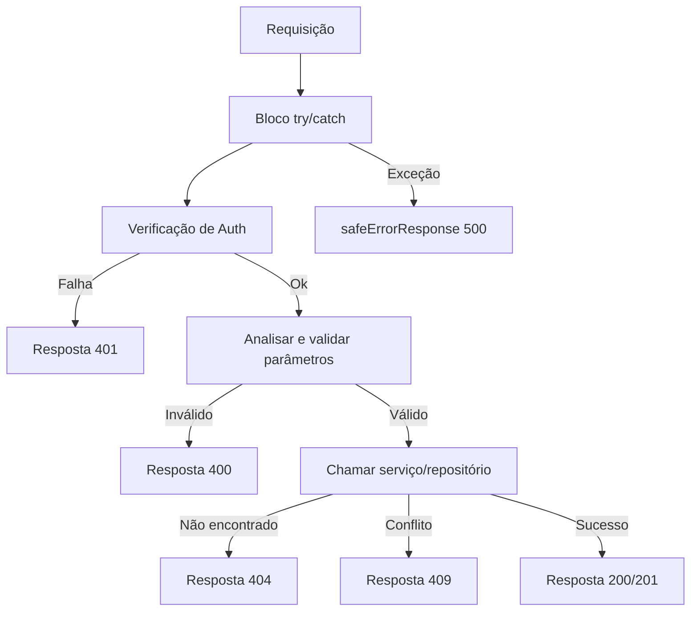

---
id: response-patterns
title: "Padrões de Resposta da API"
sidebar_label: "Padrões de Resposta"
sidebar_position: 9
---

# Padrões de Resposta da API

Todas as rotas da API seguem convenções de resposta consistentes: tipos de união discriminada para sucesso/erro, mensagens de erro com ciência do ambiente, códigos de status HTTP padronizados e documentação Swagger/JSDoc. Esta página cobre cada padrão.

## Sistema de Tipos de Resposta

### União Discriminada (`lib/api/types.ts`)

As respostas da API usam um booleano `success` como discriminante:

```typescript
export type ApiResponse<T = unknown> =
  | { success: true; data: T; total?: number; page?: number; limit?: number; totalPages?: number }
  | { success: false; error: string };
```

Isso permite que os chamadores reduzam o tipo com segurança:

```typescript
const response: ApiResponse<User[]> = await fetchUsers();
if (response.success) {
  // TypeScript sabe: response.data é User[]
  console.log(response.data);
} else {
  // TypeScript sabe: response.error é string
  console.error(response.error);
}
```

### Resposta Paginada

Endpoints de lista usam um wrapper paginado dedicado:

```typescript
export type PaginatedResponse<T> =
  | {
      success: true;
      data: T[];
      meta: {
        page: number;
        totalPages: number;
        total: number;
        limit: number;
      };
    }
  | { success: false; error: string };
```

### Tipos de Erro

```typescript
export interface ApiError {
  message: string;
  status?: number;
  code?: string;
}

export interface ErrorResponse {
  success: false;
  error: string;
}
```

## Formatos Padrão de Resposta

### Respostas de Sucesso

#### Recurso Único

```typescript
return NextResponse.json({
  success: true,
  item,
  message: "Item created successfully",
}, { status: 201 });
```

#### Lista com Paginação

```typescript
return NextResponse.json({
  success: true,
  items: result.items,
  total: result.total,
  page: result.page,
  limit: result.limit,
  totalPages: result.totalPages,
});
```

#### Confirmação de Ação

```typescript
return NextResponse.json({
  success: true,
  message: "Profile updated successfully",
});
```

### Respostas de Erro

Todas as respostas de erro incluem `success: false` e uma string `error`:

```typescript
// Não autorizado
return NextResponse.json(
  { success: false, error: "Unauthorized. Admin access required." },
  { status: 401 }
);

// Erro de validação
return NextResponse.json(
  { success: false, error: "Invalid page parameter. Must be a positive integer." },
  { status: 400 }
);

// Conflito
return NextResponse.json(
  { success: false, error: `Item with slug '${slug}' already exists` },
  { status: 409 }
);
```

## Convenções de Códigos de Status HTTP

| Status | Uso | Exemplo |
|--------|-----|--------|
| `200` | GET, PUT, PATCH, DELETE bem-sucedidos | Listar itens, atualizar perfil |
| `201` | POST bem-sucedido (recurso criado) | Criar item, criar comentário |
| `400` | Parâmetros ou corpo inválidos | Paginação incorreta, campos obrigatórios ausentes |
| `401` | Autenticação necessária ou falhou | Sessão ausente, usuário não é admin |
| `404` | Recurso não encontrado | Item não encontrado, perfil não encontrado |
| `409` | Conflito (recurso duplicado) | ID ou slug de item duplicado |
| `413` | Corpo da requisição muito grande | Corpo excede o máximo do `readBodyWithLimit` |
| `500` | Erro interno do servidor | Exceções não tratadas |

## Resposta de Erro Segura (`lib/utils/api-error.ts`)

### `safeErrorResponse`

Previne vazamento de informações exibindo mensagens genéricas em produção e mensagens detalhadas em desenvolvimento:

```typescript
export function safeErrorResponse(
  error: unknown,
  fallbackMessage: string,
  status: number = 500
): NextResponse {
  const detail = error instanceof Error ? error.message : String(error);

  // Sempre registra os detalhes completos no servidor
  console.error(`[API Error] ${fallbackMessage}:`, detail);

  const message = process.env.NODE_ENV === "development" ? detail : fallbackMessage;

  return NextResponse.json({ success: false, error: message }, { status });
}
```

Uso nos manipuladores de rotas:

```typescript
export async function GET(request: NextRequest) {
  try {
    // ... lógica do manipulador
  } catch (error) {
    return safeErrorResponse(error, 'Failed to fetch items');
  }
}
```

### `safeErrorMessage`

Extrai uma string de mensagem segura sem criar um `NextResponse`:

```typescript
export function safeErrorMessage(error: unknown, fallbackMessage: string): string {
  if (process.env.NODE_ENV === "development") {
    return error instanceof Error ? error.message : String(error);
  }
  return fallbackMessage;
}
```

### Comportamento por Ambiente

| Ambiente | Saída de Erro | Log no Servidor |
|----------|--------------|----------------|
| Desenvolvimento | `error.message` (detalhe completo) | Erro completo registrado |
| Produção | `fallbackMessage` (genérico) | Erro completo registrado |

## Estrutura do Manipulador de Rota

Todos os manipuladores de rotas da API seguem uma estrutura consistente:



### Exemplo Canônico de Manipulador GET

```typescript
export async function GET(request: NextRequest) {
  try {
    // 1. Verificação de auth
    const session = await auth();
    if (!session?.user?.isAdmin) {
      return NextResponse.json(
        { success: false, error: "Unauthorized. Admin access required." },
        { status: 401 }
      );
    }

    // 2. Analisar e validar parâmetros
    const { searchParams } = new URL(request.url);
    const paginationResult = validatePaginationParams(searchParams);
    if ('error' in paginationResult) {
      return NextResponse.json(
        { success: false, error: paginationResult.error },
        { status: paginationResult.status }
      );
    }

    // 3. Chamar a camada de serviço
    const result = await repository.findAll(paginationResult);

    // 4. Retornar resposta estruturada
    return NextResponse.json({
      success: true,
      items: result.items,
      total: result.total,
      page: result.page,
      limit: result.limit,
      totalPages: result.totalPages,
    });

  } catch (error) {
    return safeErrorResponse(error, 'Failed to fetch items');
  }
}
```

### Exemplo Canônico de Manipulador POST

```typescript
export async function POST(request: NextRequest) {
  try {
    // 1. Verificação de auth
    const session = await auth();
    if (!session?.user?.isAdmin) {
      return NextResponse.json(
        { success: false, error: "Unauthorized." },
        { status: 401 }
      );
    }

    // 2. Analisar e validar corpo
    const body = await request.json();
    if (!body.name || !body.description) {
      return NextResponse.json(
        { success: false, error: "Name and description are required" },
        { status: 400 }
      );
    }

    // 3. Verificar conflitos
    const existing = await repository.findBySlug(body.slug);
    if (existing) {
      return NextResponse.json(
        { success: false, error: `Resource with slug '${body.slug}' already exists` },
        { status: 409 }
      );
    }

    // 4. Criar recurso
    const item = await repository.create(body);

    // 5. Retornar recurso criado
    return NextResponse.json({
      success: true,
      item,
      message: "Created successfully",
    }, { status: 201 });

  } catch (error) {
    return safeErrorResponse(error, 'Failed to create resource');
  }
}
```

## Documentação Swagger / JSDoc

As rotas da API são documentadas com anotações Swagger inline para geração automática de documentação:

```typescript
/**
 * @swagger
 * /api/admin/items:
 *   get:
 *     tags: ["Admin - Items"]
 *     summary: "Get paginated items list"
 *     security:
 *       - sessionAuth: []
 *     parameters:
 *       - name: "page"
 *         in: "query"
 *         schema:
 *           type: integer
 *           minimum: 1
 *           default: 1
 *     responses:
 *       200:
 *         description: "Items list retrieved successfully"
 *       400:
 *         description: "Bad request"
 *       401:
 *         description: "Unauthorized"
 *       500:
 *         description: "Internal server error"
 */
```

## Tipos da API no Cliente

A configuração do cliente de API e opções de fetch:

```typescript
export interface ApiClientConfig extends Partial<AxiosRequestConfig> {
  baseURL?: string;
  timeout?: number;
  headers?: Record<string, string>;
  accessToken?: string;
  frontendUrl?: string;
}

export interface FetchOptions {
  method?: 'GET' | 'POST' | 'PUT' | 'PATCH' | 'DELETE';
  headers?: Record<string, string>;
  body?: unknown;
  params?: Record<string, string | number | boolean | undefined>;
}
```

## Resumo das Convenções

| Convenção | Descrição |
|-----------|----------|
| Todas as respostas incluem `success` | União discriminada para type safety |
| Erros usam `{ success: false, error: string }` | Formato de erro consistente |
| `safeErrorResponse` encapsula blocos catch | Mascaramento de erro cônscio do ambiente |
| Paginação usa `total`, `page`, `limit`, `totalPages` | Metadados consistentes |
| Verificação de auth é a primeira operação | Padrão fail-fast |
| Validação retorna antecipadamente em caso de falha | Sem condicionais aninhados |
| Anotações Swagger em todas as rotas de admin | Docs de API gerados automaticamente |
