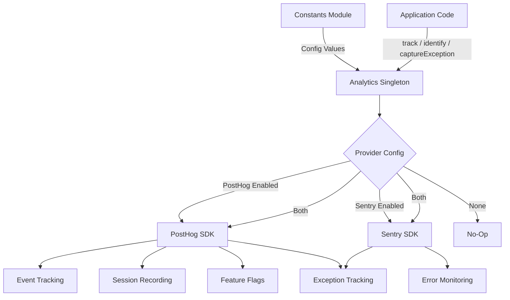
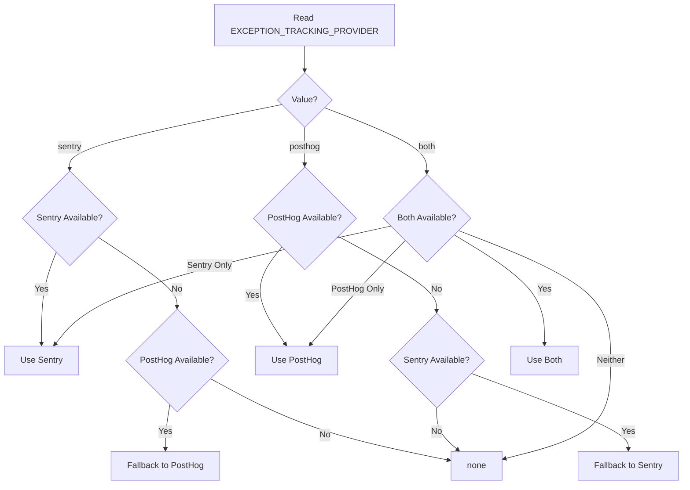

# Módulo analítico

O módulo analítico (`template/lib/analytics/`) fornece uma classe singleton unificada para rastreamento de eventos do lado do cliente, identificação do usuário, avaliação de sinalizadores de recursos e captura de exceções. Ele integra o **PostHog** para análise de produtos e o **Sentry** para monitoramento de erros, com suporte para usar qualquer um dos provedores individualmente, ambos simultaneamente ou nenhum.

## Visão geral da arquitetura



## Arquivos de origem

|Arquivo|Descrição|
|------|-------------|
|`lib/analytics/index.ts`|`Analytics` classe singleton e `analytics` exportação|

## Classe principal: `Analytics`

A classe `Analytics` é um singleton que envolve PostHog e Sentry. É seguro chamar no lado do servidor - todos os métodos retornam silenciosamente quando `window` é indefinido.

### Definições de tipo

```typescript
type EventProperties = Properties;          // PostHog Properties type
type UserProperties = Record<string, any>;
type ExceptionTrackingProvider = 'sentry' | 'posthog' | 'both' | 'none';
```

### Acesso único

```typescript
// Get the singleton instance
const analytics = Analytics.getInstance();

// Or use the pre-created export
import { analytics } from '@/lib/analytics';
```

### `init(): void`

Inicializa o PostHog com configuração centralizada e configura o rastreamento de exceções. Deve ser chamado uma vez no lado do cliente (normalmente em um layout raiz ou componente de provedor).

```typescript
// In your root layout or PostHog provider
'use client';
import { analytics } from '@/lib/analytics';

useEffect(() => {
  analytics.init();
}, []);
```

**Comportamento:**
- Ignora a inicialização se já estiver inicializado ou se estiver executando no lado do servidor
- Lê a configuração de constantes (`POSTHOG_KEY`, `POSTHOG_HOST`, `POSTHOG_ENABLED`, etc.)
- Configura a gravação da sessão com mascaramento quando `POSTHOG_SESSION_RECORDING_ENABLED` é verdadeiro
- Aplica taxa de amostragem (`POSTHOG_SAMPLE_RATE`) - na produção o padrão é 10%
- Configura manipuladores globais `window.onerror` e `unhandledrejection` quando o rastreamento de exceção PostHog está ativado
- Vincula PostHog com Sentry quando ambos os provedores estão ativos

### `identify(userId: string, properties?: UserProperties): void`

Associa o usuário anônimo atual a um ID de usuário identificado. Também define o contexto do usuário do Sentry quando o Sentry está habilitado.

```typescript
analytics.identify(session.user.id, {
  email: session.user.email,
  plan: 'premium',
});
```

### `reset(): void`

Redefine a identidade do usuário atual (por exemplo, ao sair). Limpa os contextos de usuário PostHog e Sentry.

```typescript
analytics.reset();
```

### `track(eventName: string, properties?: EventProperties): void`

Captura um evento personalizado no PostHog.

```typescript
analytics.track('item_submitted', {
  itemId: 'abc-123',
  category: 'SaaS Tools',
});
```

### `trackPageView(url: string, properties?: EventProperties): void`

Captura manualmente um evento de visualização de página. Use quando `POSTHOG_AUTO_CAPTURE` estiver desativado e você precisar de rastreamento explícito de visualizações de página.

```typescript
analytics.trackPageView(window.location.href, {
  referrer: document.referrer,
});
```

### `isFeatureEnabled(flagKey: string, defaultValue?: boolean): boolean`

Avalia um sinalizador de recurso PostHog de forma síncrona.

```typescript
const showNewUI = analytics.isFeatureEnabled('new-dashboard-ui', false);
```

### `reloadFeatureFlags(): Promise<void>`

Força uma nova busca de sinalizadores de recursos do servidor PostHog.

```typescript
await analytics.reloadFeatureFlags();
```

### `captureException(error: Error | string, context?: Record<string, any>): void`

Rastreamento de exceção unificado que é despachado para o(s) provedor(es) configurado(s).

```typescript
try {
  await riskyOperation();
} catch (error) {
  analytics.captureException(error, {
    component: 'PaymentForm',
    action: 'submit',
  });
}
```

**Roteamento do provedor:**
- `'posthog'` -- Envia evento `$exception` para PostHog com rastreamento de pilha
- `'sentry'` -- Chama `Sentry.captureException` com contexto extra
- `'both'` -- Envia para ambos os provedores
- `'none'` -- Descarta silenciosamente

### `captureError(error: Error, context?: Record<string, any>): void`

**Descontinuado.** Alias para `captureException`. Registra um aviso de descontinuação.

### `getExceptionTrackingProvider(): ExceptionTrackingProvider`

Retorna o provedor de rastreamento de exceções atualmente ativo.

### `setUserProperties(properties: UserProperties): void`

Define propriedades de usuário persistentes no perfil pessoal PostHog via `posthog.people.set()`.

```typescript
analytics.setUserProperties({
  subscription_tier: 'premium',
  company: 'Acme Corp',
});
```

### `setSuperProperties(properties: Record<string, any>): void`

Registra superpropriedades enviadas com cada evento subsequente via `posthog.register()`.

```typescript
analytics.setSuperProperties({
  app_version: '2.1.0',
  environment: 'production',
});
```

## Constantes de configuração

Toda a configuração analítica é orientada por constantes de `lib/constants.ts`:

|Constante|Padrão|Descrição|
|----------|---------|-------------|
|`POSTHOG_KEY`|env var|Chave de API do projeto PostHog|
|`POSTHOG_HOST`|env var|URL do host da API PostHog|
|`POSTHOG_ENABLED`|derivado|Verdadeiro quando a chave e o host estão definidos|
|`POSTHOG_DEBUG`|env var|Habilitar registro de depuração do PostHog|
|`POSTHOG_SESSION_RECORDING_ENABLED`|`'true'`|Habilitar gravação de sessão|
|`POSTHOG_AUTO_CAPTURE`|`'false'`|Captura automática de visualizações de página|
|`POSTHOG_SAMPLE_RATE`|`0.1` (produção) / `1.0` (desenvolvimento)|Taxa de amostragem de eventos|
|`POSTHOG_SESSION_RECORDING_SAMPLE_RATE`|`0.1` (produção) / `1.0` (desenvolvimento)|Taxa de amostragem de gravação|
|`EXCEPTION_TRACKING_PROVIDER`|`'both'`|Qual provedor lida com exceções|
|`SENTRY_ENABLED`|derivado|Verdadeiro quando o DSN está definido e o ambiente permite|

## Resolução do Provedor de Rastreamento de Exceções

O provedor é determinado no momento da construção com lógica de fallback:



## Uso com Next.js

Integração típica em um projeto Next.js App Router:

```tsx
// app/providers.tsx
'use client';
import { useEffect } from 'react';
import { analytics } from '@/lib/analytics';
import { useSession } from 'next-auth/react';
import { usePathname } from 'next/navigation';

export function AnalyticsProvider({ children }: { children: React.ReactNode }) {
  const { data: session } = useSession();
  const pathname = usePathname();

  useEffect(() => {
    analytics.init();
  }, []);

  useEffect(() => {
    if (session?.user?.id) {
      analytics.identify(session.user.id, {
        email: session.user.email,
      });
    }
  }, [session]);

  useEffect(() => {
    analytics.trackPageView(pathname);
  }, [pathname]);

  return <>{children}</>;
}
```
