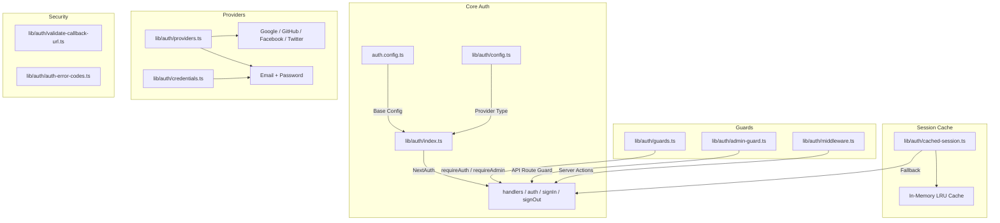
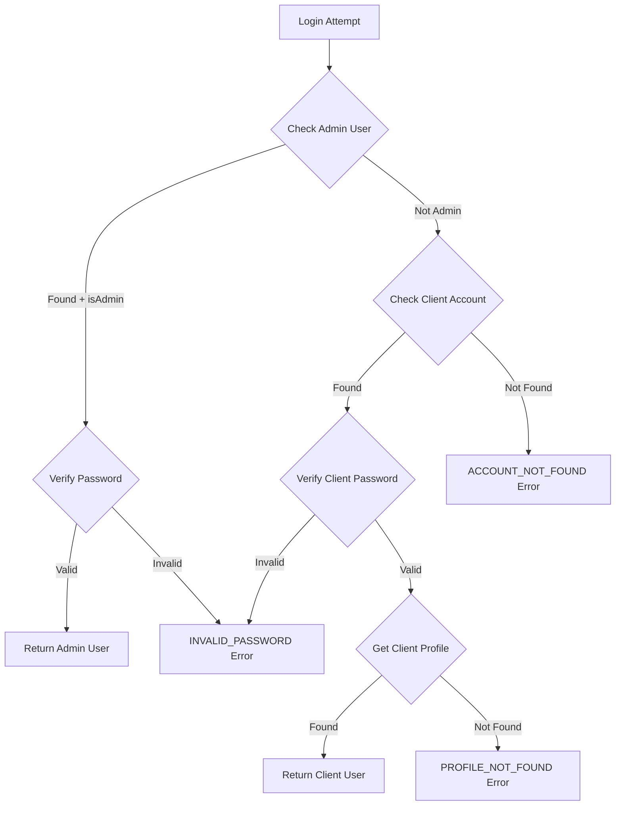

# Módulo de utilitários de autenticação

O módulo de utilitários de autenticação (`template/lib/auth/`) fornece uma camada de autenticação abrangente construída em NextAuth.js (Auth.js) com suporte para vários provedores, cache de sessão, proteções do lado do servidor, ações de servidor validadas e Supabase como back-end de autenticação alternativo.

## Visão geral da arquitetura



## Arquivos de origem

|Arquivo|Descrição|
|------|-------------|
|`lib/auth/index.ts`|Configuração NextAuth.js com adaptador Drizzle|
|`lib/auth/config.ts`|Configuração do tipo de provedor de autenticação|
|`lib/auth/credentials.ts`|Provedor de credenciais de e-mail/senha|
|`lib/auth/providers.ts`|Fábrica de provedores OAuth|
|`lib/auth/guards.ts`|Protetores de página do lado do servidor|
|`lib/auth/admin-guard.ts`|Guarda de administrador de rota API|
|`lib/auth/middleware.ts`|Middleware de ação de servidor validado|
|`lib/auth/cached-session.ts`|Camada de cache de sessão|
|`lib/auth/session-cache.ts`|Implementação de cache|
|`lib/auth/validate-callback-url.ts`|Validação de URL de redirecionamento|
|`lib/auth/auth-error-codes.ts`|Enumeração do código de erro|
|`lib/auth/supabase/`|Cliente/servidor/middleware de autenticação Supabase|

## Configuração NextAuth.js (`index.ts`)

A exportação principal fornece a interface NextAuth.js padrão:

```typescript
import { auth, signIn, signOut, handlers, unstable_update } from '@/lib/auth';
```

### Estratégia de Sessão

- **Estratégia:** JWT (não sessões de banco de dados)
- **Idade máxima:** 30 dias
- **Idade da atualização:** 24 horas (intervalo de atualização da sessão)

### Retorno de chamada JWT

O retorno de chamada JWT enriquece os tokens com:
- `userId` -- do objeto de usuário ou token `sub`
- `clientProfileId` -- criado automaticamente para usuários OAuth no primeiro login
- `isAdmin` - determinado a partir de sinalizadores `isClient`/`isAdmin` ou padrão para `false`
- `provider` -- o nome do provedor de autenticação

### Retorno de chamada de sessão

O retorno de chamada da sessão mapeia campos JWT para o objeto de sessão:
- `session.user.id`
- `session.user.clientProfileId`
- `session.user.provider`
- `session.user.isAdmin`

### Páginas personalizadas

```typescript
pages: {
  signIn: '/auth/signin',
  signOut: '/auth/signout',
  error: '/auth/error',
  verifyRequest: '/auth/verify-request',
  newUser: '/auth/register',
}
```

### Eventos

- **signOut** – invalida o cache da sessão do usuário
- **updateUser** – invalida o cache da sessão quando os dados do usuário são alterados

## Configuração de autenticação (`config.ts`)

### `AuthProviderType`

```typescript
type AuthProviderType = 'supabase' | 'next-auth' | 'both';
```

### `AuthConfig`

```typescript
interface AuthConfig {
  provider: AuthProviderType;
  supabase?: {
    url: string;
    anonKey: string;
    redirectUrl?: string;
  };
  nextAuth?: {
    enableCredentials?: boolean;
    enableOAuth?: boolean;
    providers?: any[];
  };
}
```

### `getAuthConfig(): AuthConfig`

Resolve a configuração com esta prioridade:
1. Substituição global via `configureAuth()`
2. Detecção baseada em ambiente (URL Supabase/presença de chave)
3. Padrão: `next-auth` com credenciais e OAuth habilitado

## Provedor de credenciais (`credentials.ts`)

### Funções de senha

```typescript
async function hashPassword(password: string): Promise<string>;
// Uses bcryptjs with 10 salt rounds, loaded via dynamic import

async function comparePasswords(plainText: string, hashed: string | null): Promise<boolean>;
// Returns false if hashed is null
```

### Fluxo de autenticação



### `AuthProviders` Enumeração

```typescript
enum AuthProviders {
  CREDENTIALS = 'credentials',
  GOOGLE = 'google',
  FACEBOOK = 'facebook',
  GITHUB = 'github',
  TWITTER = 'twitter',
  X = 'x',
  MICROSOFT = 'microsoft',
}
```

## Provedores OAuth (`providers.ts`)

### `createNextAuthProviders(config?): Provider[]`

Cria dinamicamente instâncias do provedor NextAuth com base na configuração:

```typescript
import { createNextAuthProviders } from '@/lib/auth/providers';

const providers = createNextAuthProviders({
  google: { enabled: true, clientId: '...', clientSecret: '...' },
  github: { enabled: true, clientId: '...', clientSecret: '...' },
  credentials: { enabled: true },
});
```

Provedores compatíveis: **Google**, **GitHub**, **Facebook**, **Twitter**, **Credenciais**.

## Protetores do lado do servidor (`guards.ts`)

### `requireAuth(): Promise<Session>`

Requer autenticação. Redireciona para `/auth/signin` se não for autenticado.

```typescript
export default async function ProtectedPage() {
  const session = await requireAuth();
  return <div>Welcome {session.user.email}</div>;
}
```

### `requireAdmin(): Promise<Session>`

Requer função de administrador. Redireciona para `/admin/auth/signin` se não for autenticado, `/unauthorized` se não for admin.

```typescript
export default async function AdminPage() {
  const session = await requireAdmin();
  return <div>Admin Dashboard</div>;
}
```

### `getSession(): Promise<Session | null>`

Obtém a sessão atual sem redirecionar. Retorna `null` para usuários não autenticados.

### `checkIsAdmin(): Promise<boolean>`

Verifica o status do administrador sem redirecionar.

## API Route Guard (`admin-guard.ts`)

### `checkAdminAuth(): Promise<NextResponse | null>`

Retorna `null` se autorizado ou um erro `NextResponse` (401/403/500) se não:

```typescript
export async function GET() {
  const authError = await checkAdminAuth();
  if (authError) return authError;
  // ... handle authorized request
}
```

### `withAdminAuth(handler): handler`

Função de ordem superior que agrupa manipuladores de rotas de API:

```typescript
import { withAdminAuth } from '@/lib/auth/admin-guard';

export const GET = withAdminAuth(async (request) => {
  // Only reached if user is authenticated admin
  return NextResponse.json({ data: await getAdminData() });
});
```

## Ações de servidor validadas (`middleware.ts`)

### `validatedAction(schema, action)`

Envolve uma ação do servidor com validação Zod:

```typescript
import { validatedAction } from '@/lib/auth/middleware';
import { z } from 'zod';

const schema = z.object({ name: z.string().min(1), email: z.string().email() });

export const updateProfile = validatedAction(schema, async (data, formData) => {
  await db.update(users).set(data);
  return { success: 'Profile updated' };
});
```

### `validatedActionWithUser(schema, action)`

O mesmo que acima, mas também verifica a autenticação e injeta o usuário:

```typescript
export const submitItem = validatedActionWithUser(schema, async (data, formData, user) => {
  await db.insert(items).values({ ...data, userId: user.id });
  return { success: 'Item submitted' };
});
```

### `ActionState` Digite

```typescript
type ActionState = {
  error?: string;
  success?: string;
  redirect?: string;
  [key: string]: any;
};
```

## Cache de sessão (`cached-session.ts`)

Reduz a sobrecarga de autenticação armazenando em cache sessões decodificadas na memória.

### `getCachedSession(request?): Promise<Session | null>`

```typescript
import { getCachedSession } from '@/lib/auth/cached-session';

// In server components
const session = await getCachedSession();

// In API routes (pass request for token extraction)
const session = await getCachedSession(request);
```

### `invalidateSessionCache(token?, userId?): Promise<void>`

Invalida sessões armazenadas em cache por token ou ID de usuário.

### `clearSessionCache(): void`

Limpa todas as sessões em cache (para implantações ou atualizações críticas).

### Extração de token

Os tokens são extraídos das solicitações nesta ordem:
1. `next-auth.session-token` ou `__Secure-next-auth.session-token` biscoito
2. `Authorization: Bearer <token>` cabeçalho
3. `X-Session-Token` cabeçalho personalizado

## Códigos de erro (`auth-error-codes.ts`)

```typescript
enum AuthErrorCode {
  ACCOUNT_NOT_FOUND = 'ACCOUNT_NOT_FOUND',
  INVALID_PASSWORD = 'INVALID_PASSWORD',
  PROFILE_NOT_FOUND = 'PROFILE_NOT_FOUND',
  GENERIC_ERROR = 'GENERIC_ERROR',
  RATE_LIMITED = 'RATE_LIMITED',
  USE_OAUTH_PROVIDER = 'USE_OAUTH_PROVIDER',
  SESSION_REFRESH_FAILED = 'SESSION_REFRESH_FAILED',
  PAGE_REFRESH_FAILED = 'PAGE_REFRESH_FAILED',
}
```

## Validação de URL de retorno de chamada (`validate-callback-url.ts`)

### `isValidCallbackUrl(url: string | null): boolean`

Evita vulnerabilidades de redirecionamento aberto:

```typescript
isValidCallbackUrl('/admin/items')       // true
isValidCallbackUrl('/client/dashboard')  // true
isValidCallbackUrl('https://evil.com')   // false
isValidCallbackUrl('//evil.com')         // false
```

### `getSafeRedirectPath(callbackUrl, fallbackPath): string`

Retorna o URL de retorno de chamada, se válido, caso contrário, o caminho de retorno.

### `createSafeCallbackUrl(pathname, search?): string`

Cria um URL de retorno de chamada limitado a 2.048 caracteres para evitar poluição de parâmetros.
