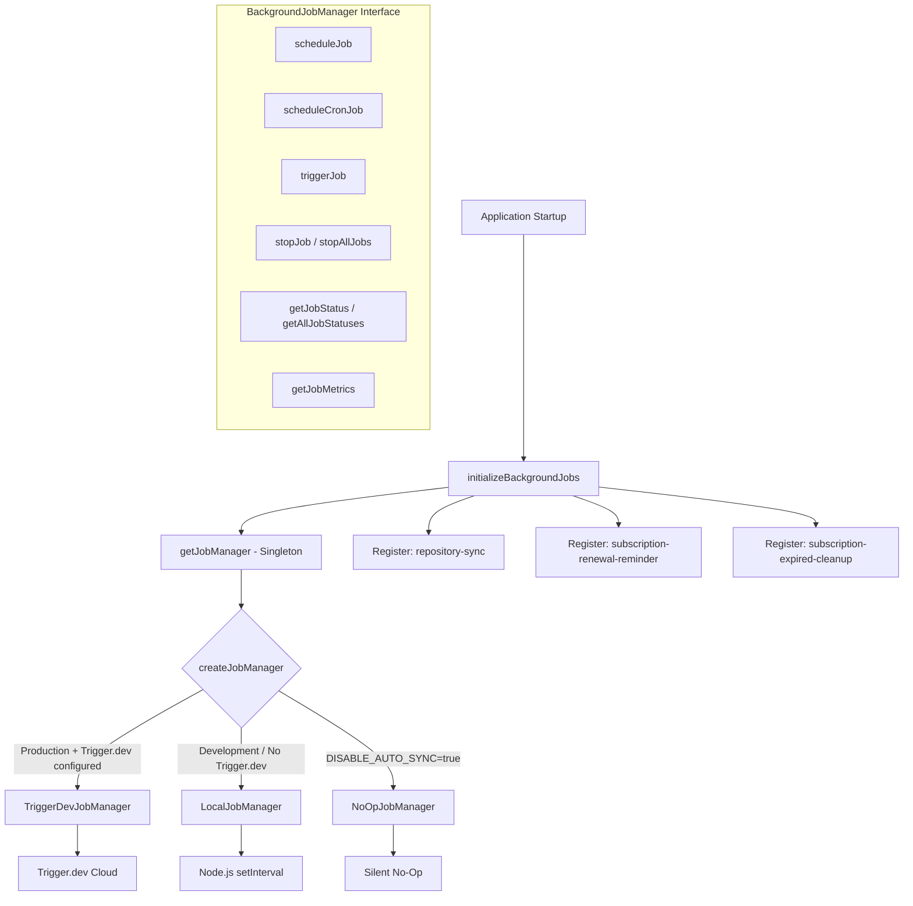
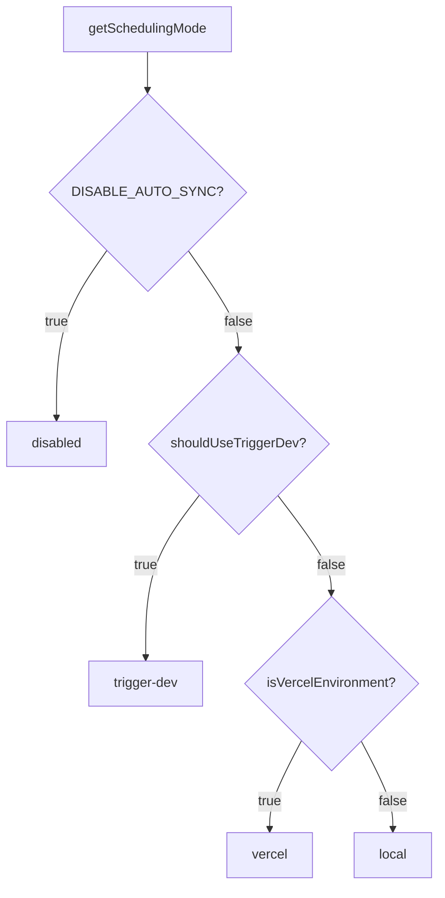

# Módulo de trabalhos em segundo plano

O módulo de trabalhos em segundo plano (`template/lib/background-jobs/`) fornece uma camada de abstração para agendar e executar tarefas recorrentes. Ele oferece suporte a três estratégias de tempo de execução – **Trigger.dev** para produção, **local `setInterval`** para desenvolvimento e um modo **no-op** para desativar totalmente os trabalhos – selecionados automaticamente com base na configuração do ambiente.

## Visão geral da arquitetura



## Arquivos de origem

|Arquivo|Descrição|
|------|-------------|
|`lib/background-jobs/types.ts`|Definições de interface e tipo|
|`lib/background-jobs/config.ts`|Configuração do Trigger.dev e detecção do modo de agendamento|
|`lib/background-jobs/job-factory.ts`|Função de fábrica e gerenciador singleton|
|`lib/background-jobs/local-job-manager.ts`|Implementação `LocalJobManager`|
|`lib/background-jobs/trigger-dev-job-manager.ts`|Implementação `TriggerDevJobManager`|
|`lib/background-jobs/noop-job-manager.ts`|Implementação `NoOpJobManager`|
|`lib/background-jobs/initialize-jobs.ts`|Registro de trabalho na inicialização do aplicativo|
|`lib/background-jobs/index.ts`|Exportações de barril|

## Definições de tipo

### `BackgroundJobManager`Interface

```typescript
interface BackgroundJobManager {
  scheduleJob(id: string, name: string, job: () => void | Promise<void>, interval: number): void;
  scheduleCronJob(id: string, name: string, job: () => void | Promise<void>, cronExpression: string): void;
  triggerJob(id: string): Promise<void>;
  stopJob(id: string): void;
  stopAllJobs(): void;
  getJobStatus(id: string): JobStatus | undefined;
  getAllJobStatuses(): JobStatus[];
  getJobMetrics(): JobMetrics;
}
```

### `JobStatus`

```typescript
type JobStatusType = 'running' | 'completed' | 'failed' | 'scheduled' | 'stopped';

interface JobStatus {
  id: string;
  name: string;
  status: JobStatusType;
  lastRun: Date | null;
  nextRun: Date | null;
  duration: number;     // Last execution duration in ms
  error?: string;       // Error message if status is 'failed'
}
```

### `JobMetrics`

```typescript
interface JobMetrics {
  totalExecutions: number;       // Total invocations (not unique jobs)
  successfulJobs: number;
  failedJobs: number;
  averageJobDuration: number;    // Rolling average in ms
  lastCleanup: Date;
}
```

### `TriggerDevConfig`

```typescript
interface TriggerDevConfig {
  enabled: boolean;
  apiKey?: string;
  apiUrl?: string;
  environment: string;
  isFullyConfigured: boolean;
  isPartiallyConfigured: boolean;
}
```

### `SchedulingMode`

```typescript
type SchedulingMode = 'trigger-dev' | 'vercel' | 'local' | 'disabled';
```

## Funções de configuração

### `getTriggerDevConfig(): TriggerDevConfig`

Lê as configurações do Trigger.dev do ConfigService.

### `shouldUseTriggerDev(): boolean`

Retorna `true` quando Trigger.dev está totalmente configurado, habilitado e o ambiente é de produção.

### `getSchedulingMode(): SchedulingMode`

Determina qual sistema de agendamento deve estar ativo usando esta prioridade:



## Fábrica e Singleton

### `createJobManager(): BackgroundJobManager`

Cria o gerenciador de tarefas apropriado com base no ambiente:

```typescript
import { createJobManager } from '@/lib/background-jobs';

const manager = createJobManager();
// Returns: TriggerDevJobManager | LocalJobManager | NoOpJobManager
```

### `getJobManager(): BackgroundJobManager`

Retorna a instância singleton, criando-a na primeira chamada:

```typescript
import { getJobManager } from '@/lib/background-jobs';

const manager = getJobManager();
manager.scheduleJob('my-job', 'My Job', async () => {
  await doWork();
}, 60_000);
```

### `resetJobManager(): void`

Interrompe todos os trabalhos e destrói o singleton (útil para testes):

```typescript
import { resetJobManager } from '@/lib/background-jobs';
resetJobManager();
```

## LocalJobManager

Usa Node.js `setInterval` para ambientes de desenvolvimento e fallback.

**Comportamentos principais:**
- Ignora a execução quando um trabalho já está em execução (evita sobreposição)
- Rastreia métricas com duração média móvel
- Converte expressões cron em intervalos por meio de mapeamento simplificado
- Reduz o log do console no modo de desenvolvimento

### Mapeamento Cron para Intervalo

|Padrão Cron|Intervalo|
|-------------|----------|
| `*/30 * * * * *` |30 segundos|
| `*/2 * * * *` |2 minutos|
| `*/5 * * * *` |5 minutos|
| `*/15 * * * *` |15 minutos|
| `0 * * * *` |1 hora|
| `0 9 * * *` |24 horas|
|Padrão|1 minuto|

## TriggerDevJobManager

Registra agendamentos com a API de agendamentos `@trigger.dev/sdk` v4. **não** executa temporizadores locais - a execução é controlada pelo processo de trabalho Trigger.dev.

**Comportamentos principais:**
- Cargas lentas `@trigger.dev/sdk` via importação dinâmica
- Converte programações baseadas em intervalos em expressões cron
- Rastreia métricas locais quando as tarefas são executadas no contexto do trabalhador
- `stopJob` / `stopAllJobs` apenas limpa o estado local (programações remotas são gerenciadas por Trigger.dev)

## NoOpJobManager

Todas as operações são silenciosas e independentes. Usado quando `DISABLE_AUTO_SYNC=true` em desenvolvimento.

## Registro de emprego

A função `initializeBackgroundJobs()` registra todos os trabalhos do aplicativo na inicialização:

```typescript
import { initializeBackgroundJobs } from '@/lib/background-jobs/initialize-jobs';

// Called once during app initialization
await initializeBackgroundJobs();
```

### Empregos registrados

|ID do trabalho|Cronograma|Descrição|
|--------|----------|-------------|
|`repository-sync`|A cada 5 minutos|Sincroniza conteúdo CMS baseado em Git via `syncManager.performSync()`|
|`subscription-renewal-reminder`|Diariamente às 9h|Envia lembretes de renovação para assinaturas que expiram em 7 dias|
|`subscription-expired-cleanup`|Diariamente à meia-noite|Processa e expira assinaturas após a data de término|

**Importante:** Todos os retornos de chamada de trabalho usam importações dinâmicas para evitar que o webpack agrupe módulos específicos do Node.js no momento da compilação:

```typescript
manager.scheduleJob('repository-sync', 'Repository Synchronization', async () => {
  // Dynamic import prevents webpack bundling of isomorphic-git chain
  const { syncManager } = await import('@/lib/services/sync-service');
  await syncManager.performSync();
}, 5 * 60 * 1000);
```

## Exemplos de uso

### Agendando um trabalho personalizado

```typescript
import { getJobManager } from '@/lib/background-jobs';

const manager = getJobManager();

// Interval-based (every 10 minutes)
manager.scheduleJob('cleanup-temp', 'Temp File Cleanup', async () => {
  await cleanupTempFiles();
}, 10 * 60 * 1000);

// Cron-based (every hour)
manager.scheduleCronJob('hourly-report', 'Hourly Report', async () => {
  await generateReport();
}, '0 * * * *');
```

### Monitoramento de trabalhos

```typescript
const manager = getJobManager();

// Check specific job
const status = manager.getJobStatus('repository-sync');
console.log(status?.status, status?.lastRun, status?.duration);

// List all jobs
const allStatuses = manager.getAllJobStatuses();

// Get aggregate metrics
const metrics = manager.getJobMetrics();
console.log(`Total: ${metrics.totalExecutions}, Failed: ${metrics.failedJobs}`);
```

### Gatilho manual

```typescript
const manager = getJobManager();
await manager.triggerJob('repository-sync');
```
