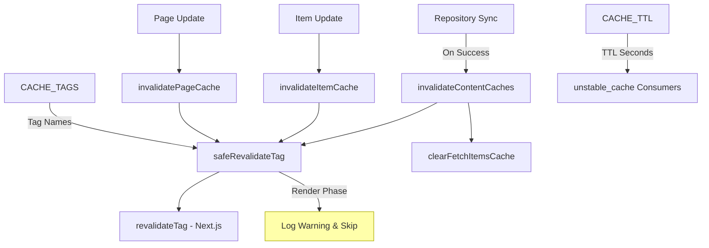
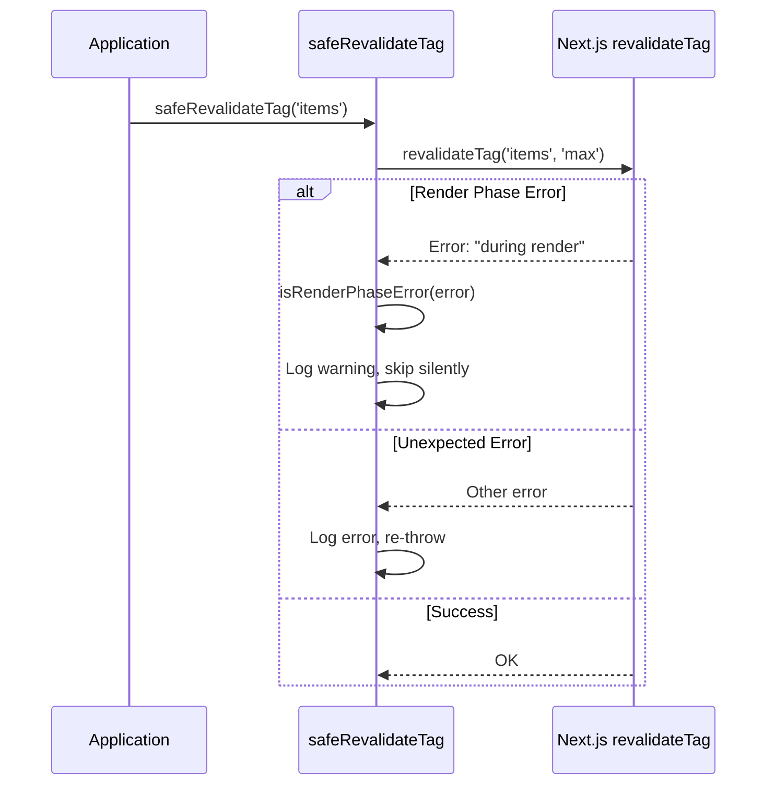
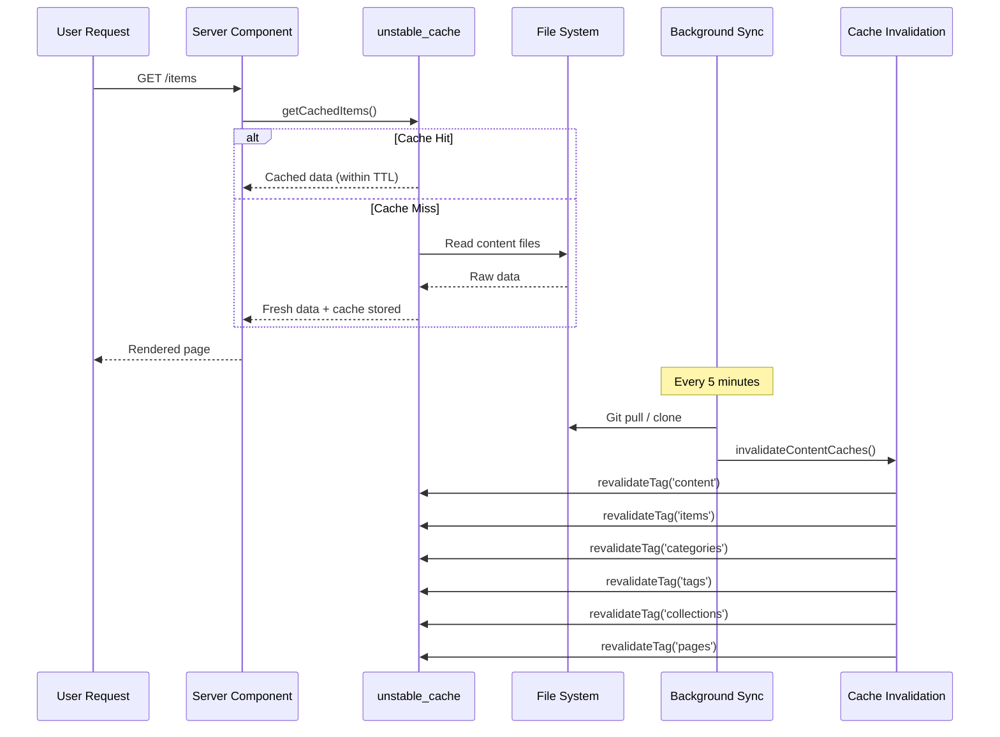

# Módulo de invalidação de cache

O módulo de invalidação de cache (`template/lib/cache-config.ts` e `template/lib/cache-invalidation.ts`) fornece um sistema centralizado de tags de cache e funções de invalidação para Next.js `unstable_cache` e `revalidateTag`. Ele garante que os caches de conteúdo sejam invalidados adequadamente após a sincronização do repositório, ao mesmo tempo em que lida com as restrições da fase de renderização do Next.js normalmente.

## Visão geral da arquitetura



## Arquivos de origem

|Arquivo|Descrição|
|------|-------------|
|`lib/cache-config.ts`|Cache de constantes TTL e definições de tags|
|`lib/cache-invalidation.ts`|Funções de invalidação com segurança na fase de renderização|

## Configuração de cache TTL

Todos os valores TTL estão em **segundos**, usados com Next.js `unstable_cache`:

```typescript
const CACHE_TTL = {
  CONTENT: 600,   // 10 minutes -- content listings
  ITEM: 600,      // 10 minutes -- individual items
  CONFIG: 600,    // 10 minutes -- site configuration
  PAGES: 600,     // 10 minutes -- static pages
} as const;
```

### Uso com `unstable_cache`

```typescript
import { unstable_cache } from 'next/cache';
import { CACHE_TTL, CACHE_TAGS } from '@/lib/cache-config';

const getCachedItems = unstable_cache(
  async () => fetchAllItems(),
  ['items-list'],
  {
    revalidate: CACHE_TTL.CONTENT,
    tags: [CACHE_TAGS.CONTENT, CACHE_TAGS.ITEMS],
  }
);
```

## Tags de cache

Tags são usadas com `revalidateTag()` para invalidar seletivamente caches.

### Tags estáticas

|Constante de etiqueta|Valor|Descrição|
|-------------|-------|-------------|
|`CACHE_TAGS.CONTENT`|`'content'`|Tag mestre – invalida todos os caches de conteúdo|
|`CACHE_TAGS.ITEMS`|`'items'`|Coleção de todos os itens|
|`CACHE_TAGS.CATEGORIES`|`'categories'`|Todas as categorias|
|`CACHE_TAGS.TAGS`|`'tags'`|Todas as tags|
|`CACHE_TAGS.COLLECTIONS`|`'collections'`|Todas as coleções|
|`CACHE_TAGS.CONFIG`|`'config'`|Configuração do site|
|`CACHE_TAGS.PAGES`|`'pages'`|Todas as páginas estáticas|

### Tags dinâmicas (funções)

|Função de etiqueta|Exemplo de saída|Descrição|
|-------------|---------------|-------------|
|`CACHE_TAGS.ITEM(slug)`|`'item:my-tool'`|Item específico por slug|
|`CACHE_TAGS.PAGE(slug)`|`'page:about'`|Página específica por slug|
|`CACHE_TAGS.ITEMS_LOCALE(locale)`|`'items:en'`|Itens filtrados por localidade|
|`CACHE_TAGS.CATEGORIES_LOCALE(locale)`|`'categories:fr'`|Categorias por localidade|
|`CACHE_TAGS.TAGS_LOCALE(locale)`|`'tags:de'`|Tags por localidade|
|`CACHE_TAGS.COLLECTIONS_LOCALE(locale)`|`'collections:es'`|Coleções por localidade|

### Exemplo: cache específico de localidade

```typescript
import { CACHE_TAGS, CACHE_TTL } from '@/lib/cache-config';

const getCachedItemsByLocale = unstable_cache(
  async (locale: string) => fetchItemsByLocale(locale),
  ['items-by-locale'],
  {
    revalidate: CACHE_TTL.CONTENT,
    tags: [CACHE_TAGS.ITEMS, CACHE_TAGS.ITEMS_LOCALE('en')],
  }
);
```

## Funções de invalidação

### `invalidateContentCaches(): Promise<void>`

Invalida **todos** os caches relacionados ao conteúdo. Chamado após a conclusão bem-sucedida da sincronização do repositório.

```typescript
import { invalidateContentCaches } from '@/lib/cache-invalidation';

// After successful repository sync
await performSync();
await invalidateContentCaches();
```

**Invalida estas tags:**
- `CONTENT`, `ITEMS`, `CATEGORIES`, `TAGS`, `COLLECTIONS`, `PAGES`
- Também limpa o cache `fetchItems` da memória via `clearFetchItemsCache()`

### `invalidateItemCache(slug: string): Promise<void>`

Invalida o cache de um único item.

```typescript
import { invalidateItemCache } from '@/lib/cache-invalidation';

await invalidateItemCache('my-saas-tool');
// Revalidates tag: 'item:my-saas-tool'
```

### `invalidatePageCache(slug: string): Promise<void>`

Invalida o cache de uma única página estática.

```typescript
import { invalidatePageCache } from '@/lib/cache-invalidation';

await invalidatePageCache('about');
// Revalidates tag: 'page:about'
```

## Segurança da fase de renderização

Next.js não permite `revalidateTag()` durante a fase de renderização dos componentes do servidor. O módulo lida com isso com um wrapper `safeRevalidateTag`.

### Como funciona



### Padrões de detecção de erros

A função `isRenderPhaseError` verifica vários padrões para serem resilientes às alterações da mensagem de erro Next.js:

- `"during render"` - Mensagem Next.js atual
- `"render phase"` -- Frase alternativa
- `"revalidate"` + `"render"` -- Ambas as palavras-chave presentes
- `"unsupported"` + `"render"` -- Verificação de combinação

## Diagrama de fluxo de cache


