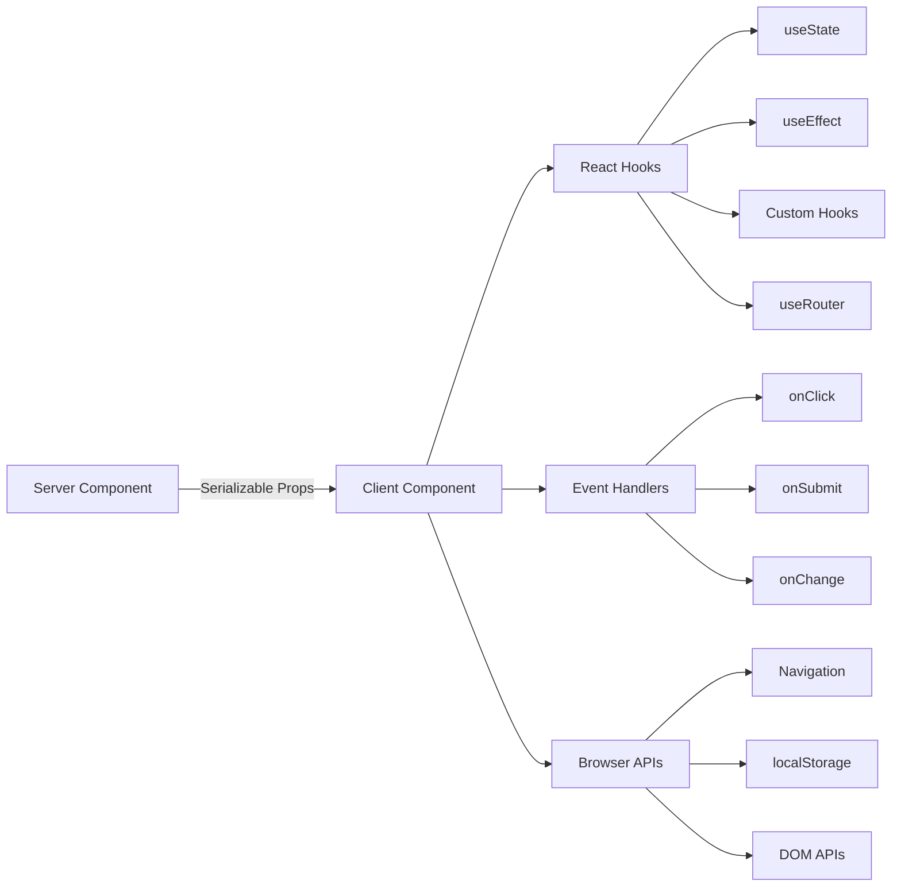

# Padrões de componentes do cliente

## Visão geral

Os componentes do cliente no modelo Ever Works são "ilhas" interativas que lidam com eventos do usuário, gerenciam o estado local e se integram às APIs do navegador. Eles são identificados pela diretiva `"use client"` na parte superior do arquivo e são usados ​​seletivamente onde a interatividade é necessária.

## Arquitetura



## Arquivos de origem

|Arquivo|Padrão|
|------|---------|
|`template/app/[locale]/admin/page.tsx`|Wrapper de cliente mínimo delegando ao componente|
|`template/app/not-found.tsx`|Navegação do cliente com `useRouter`|
|`template/app/global-error.tsx`|Limite de erro com funcionalidade de redefinição|
|`template/components/filters/filter-url-parser.tsx`|Gerenciamento de estado de URL|
|`template/components/header/more-menu.tsx`|Menus suspensos interativos|

## Padrões principais

### Padrão 1: Wrappers mínimos de cliente

Muitos componentes de página usam o wrapper de cliente mais fino possível:

```typescript
"use client";

import { AdminDashboard } from "@/components/admin";

export default function AdminPage() {
    return <AdminDashboard />;
}
```

Esse padrão mantém o arquivo de paginação pequeno enquanto delega toda a lógica a um componente separado. A diretiva `"use client"` marca o limite onde a árvore de componentes do servidor faz a transição para a renderização do cliente.

### Padrão 2: Componentes de limite de erro

O manipulador de erros global demonstra o padrão de limite de erro:

```typescript
'use client';

export default function GlobalError({
    error,
    reset,
}: {
    error: Error & { digest?: string };
    reset: () => void;
}) {
    useEffect(() => {
        console.error(error);
    }, [error]);

    return (
        <html lang="en">
            <body>
                <div>
                    <h1>Something went wrong!</h1>
                    {process.env.NODE_ENV !== 'production' && (
                        <div>
                            <p>{error.message}</p>
                            {error.digest && <p>Error ID: {error.digest}</p>}
                        </div>
                    )}
                    <Button onPress={() => reset()}>Refresh</Button>
                    <Link href="/">Go Home</Link>
                </div>
            </body>
        </html>
    );
}
```

Aspectos principais:
- O suporte `error` inclui um `digest` opcional para rastreamento de erros do servidor
- A função `reset()` renderiza novamente os filhos do limite de erro
- Os rastreamentos de pilha são mostrados apenas em desenvolvimento
- O componente agrupa suas próprias tags `<html>` e `<body>`, pois erros globais substituem a página inteira

### Padrão 3: Navegação do lado do cliente

A página Not Found demonstra padrões de navegação do lado do cliente:

```typescript
'use client';

import { useRouter } from 'next/navigation';

export default function NotFound() {
    const router = useRouter();

    return (
        <div>
            <Button onClick={() => router.back()}>Go Back</Button>
            <Button onClick={() => router.push('/')}>Back to Home</Button>
            <button onClick={() => router.push('/help')}>Contact Support</button>
        </div>
    );
}
```

O gancho `useRouter` de `next/navigation` fornece navegação programática. Observe que isso é de `next/navigation`, não de `next/router` (Roteador de páginas).

### Padrão 4: navegação de cliente i18n-Aware

O modelo fornece ganchos de navegação com reconhecimento de localidade via `i18n/navigation.ts`:

```typescript
import { createNavigation } from "next-intl/navigation";
import { routing } from "./routing";

export const { Link, redirect, usePathname, useRouter, getPathname } =
    createNavigation(routing);
```

Componentes do cliente que precisam de importação de navegação com reconhecimento de localidade deste módulo em vez de `next/navigation`:

```typescript
'use client';

import { Link, useRouter, usePathname } from '@/i18n/navigation';

function LocaleAwareComponent() {
    const router = useRouter();
    const pathname = usePathname();

    // router.push('/about') automatically includes the current locale prefix
    return <Link href="/about">About</Link>;
}
```

### Padrão 5: Ações do Servidor com Validação de Formulário

Os componentes do cliente integram-se às ações do servidor usando o padrão de ação validado de `lib/auth/middleware.ts`:

```typescript
// Server action (lib/auth/middleware.ts)
export function validatedAction<S extends z.ZodType, T>(
    schema: S,
    action: ValidatedActionFunction<S, T>
) {
    return async (prevState: ActionState, formData: FormData): Promise<T> => {
        const result = schema.safeParse(Object.fromEntries(formData));
        if (!result.success) {
            return { error: result.error.issues[0].message } as T;
        }
        return action(result.data, formData);
    };
}

// Client component
'use client';

import { useActionState } from 'react';
import { myServerAction } from './actions';

function MyForm() {
    const [state, formAction, isPending] = useActionState(myServerAction, {});

    return (
        <form action={formAction}>
            {state.error && <p>{state.error}</p>}
            <input name="email" type="email" />
            <button type="submit" disabled={isPending}>Submit</button>
        </form>
    );
}
```

### Padrão 6: Gerenciamento de estado com ganchos personalizados

O modelo organiza a lógica do lado do cliente em ganchos personalizados no diretório `hooks/`:

```typescript
'use client';

import { useFavorites } from '@/hooks/useFavorites';
import { useFilters } from '@/hooks/useFilters';

function ItemList() {
    const { favorites, toggleFavorite } = useFavorites();
    const { filters, updateFilter, resetFilters } = useFilters();

    return (
        <div>
            <FilterBar filters={filters} onChange={updateFilter} onReset={resetFilters} />
            <ItemGrid items={items} favorites={favorites} onToggleFavorite={toggleFavorite} />
        </div>
    );
}
```

## Limites do componente cliente

### Quando usar `"use client"`

- **Manipuladores de eventos**: `onClick`, `onSubmit`, `onChange`
- **Ganchos React**: `useState`, `useEffect`, `useRef`, ganchos personalizados
- **APIs do navegador**: `window`, `localStorage`, `navigator`
- **Bibliotecas cliente de terceiros**: bibliotecas de componentes de UI que exigem interatividade

### Quando manter como componente de servidor

- Renderização de conteúdo estático
- Busca e transformação de dados
- Carregamento de tradução (`getTranslations`)
- Geração de metadados
- Invólucros de layout

## Melhores práticas no modelo

1. **Empurre `"use client"` o mais fundo possível** - mantenha o limite próximo à folha interativa
2. **Passe os dados do servidor como adereços** – evite buscar novamente no cliente
3. **Use `useEffect` apenas para efeitos colaterais** - não para busca de dados
4. **Prefira ações do servidor em vez de rotas de API** – para envios de formulários e mutações
5. **Importar navegação de `@/i18n/navigation`** – garante roteamento com reconhecimento de localidade
6. **IU somente para desenvolvimento do Gate** -- use verificações `process.env.NODE_ENV !== 'production'`
