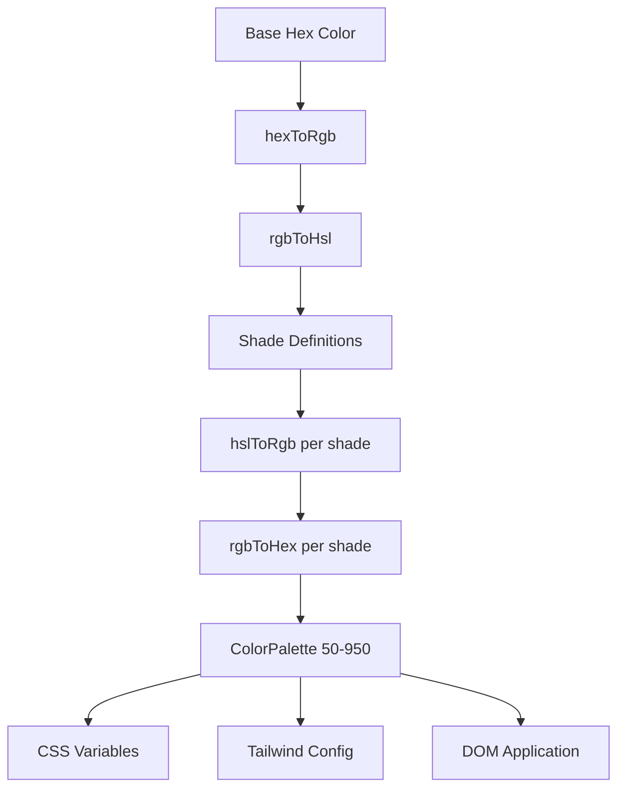

# Sistema de cores

O modelo usa um sistema dinâmico de geração de cores que cria paletas de cores completas a partir de cores hexadecimais básicas. Isso alimenta o mecanismo de temas e permite a personalização de cores em tempo de execução por meio de variáveis ​​​​CSS e integração CSS do Tailwind.

## Visão geral da arquitetura



## Arquivos de origem

|Arquivo|Objetivo|
|------|---------|
|`lib/color-generator.ts`|Geração de paleta central a partir de cores hexadecimais|
|`lib/theme-color-manager.ts`|Aplicação de cores em nível de tema e geração de CSS|
|`lib/theme-utils.ts`|Classes utilitárias, auxiliares de opacidade e predefinições de tema|

## Pipeline de conversão de cores

O sistema converte cores por meio de múltiplas representações para gerar tonalidades com precisão. Quatro funções de conversão cuidam de todo o percurso de ida e volta.

```typescript
// Hex -> RGB -> HSL (for manipulation) -> RGB -> Hex (output)
export function hexToRgb(hex: string): { r: number; g: number; b: number };
export function rgbToHsl(r: number, g: number, b: number): { h: number; s: number; l: number };
export function hslToRgb(h: number, s: number, l: number): { r: number; g: number; b: number };
export function rgbToHex(r: number, g: number, b: number): string;
```

Os ajustes de luminosidade e saturação acontecem no espaço de cores HSL, que fornece transições de tonalidade perceptualmente uniformes em toda a paleta.

## Definições de sombra

Cada nível de tonalidade possui ajustes fixos de luminosidade e saturação em relação à cor base (500):

|Sombra|Ajuste de luminosidade|Ajuste de saturação|Uso|
|-------|-----------------|-------------------|-------|
| 50 | +45 | -30 |Fundos mais claros|
| 100 | +40 | -25 |Passe o mouse sobre fundos|
| 200 | +30 | -20 |Planos de fundo ativos|
| 300 | +20 | -10 |Fronteiras|
| 400 | +10 | -5 |Texto de espaço reservado|
| **500** | **0** | **0** |**Cor base**|
| 600 | -10 | +5 |Estados de foco|
| 700 | -20 | +10 |Estados ativos|
| 800 | -30 | +15 |Texto de ênfase|
| 900 | -40 | +20 |Manchetes|
| 950 | -45 | +25 |Planos de fundo mais escuros|

## Interface ColorPalette

```typescript
export interface ColorPalette {
  50: string;
  100: string;
  200: string;
  300: string;
  400: string;
  500: string;  // Base color
  600: string;
  700: string;
  800: string;
  900: string;
  950: string;
}
```

## Gerando uma paleta

A função `generateColorPalette` pega qualquer cor hexadecimal e produz a paleta completa de 11 tons:

```typescript
import { generateColorPalette } from '@/lib/color-generator';

const palette = generateColorPalette('#3b82f6');
// Returns: { 50: '#e8f0fe', 100: '#d4e4fd', ..., 950: '#0a1d3d' }
```

Os valores são fixados entre 0 e 100 para luminosidade e saturação para evitar cores fora do intervalo.

## Geração de variáveis CSS

O sistema gera propriedades CSS personalizadas para cada tonalidade:

```typescript
import { generateCssVariables } from '@/lib/color-generator';

const palette = generateColorPalette('#3b82f6');
const css = generateCssVariables('theme-primary', palette);
// Output:
// --theme-primary: #3b82f6;
// --theme-primary-50: #e8f0fe;
// --theme-primary-100: #d4e4fd;
// ... (all 11 shades)
```

## Integração CSS Tailwind

Gere objetos de configuração do Tailwind que fazem referência a variáveis CSS:

```typescript
import { generateTailwindConfig } from '@/lib/color-generator';

const config = generateTailwindConfig('theme-primary');
// Returns: {
//   DEFAULT: 'var(--theme-primary)',
//   50: 'var(--theme-primary-50)',
//   100: 'var(--theme-primary-100)',
//   ...
// }
```

## Gerenciador de cores do tema

O módulo `theme-color-manager.ts` aplica paletas ao DOM em tempo de execução.

### Configurações de tema estendidas

Quatro temas integrados definem cores básicas para primária, secundária, destaque, plano de fundo, superfície e texto:

```typescript
export const EXTENDED_THEME_CONFIGS: Record<ThemeKey, ThemeConfig> = {
  everworks: {
    primary: "#3d70ef",
    secondary: "#00c853",
    accent: "#0056b3",
    background: "#ffffff",
    surface: "#f8f9fa",
    text: "#1a1a1a",
    textSecondary: "#6c757d",
  },
  corporate: { /* ... */ },
  material: { /* ... */ },
  funny: { /* ... */ },
};
```

### Aplicando paletas ao DOM

```typescript
import { applyColorPalette, applyThemeWithPalettes } from '@/lib/theme-color-manager';

// Apply a single color palette
applyColorPalette('theme-primary', '#3d70ef');

// Apply an entire theme (primary + secondary + accent + utility colors)
applyThemeWithPalettes('everworks');
```

A função `applyColorPalette` também gera uma variante RGB para suporte à opacidade:

```typescript
// Sets both:
// --theme-primary: #3d70ef
// --theme-primary-rgb: 61, 112, 239
```

### Gerando CSS estático

Para renderização no lado do servidor ou geração de CSS em tempo de construção:

```typescript
import { generateThemeCss } from '@/lib/theme-color-manager';

const css = generateThemeCss('everworks');
// Returns full CSS variable string for all theme colors
```

## Aulas de utilitários temáticos

O módulo `theme-utils.ts` fornece combinações de classes Tailwind pré-construídas:

```typescript
import { themeClasses } from '@/lib/theme-utils';

// Button variants
themeClasses.button.primary   // "bg-theme-primary hover:bg-theme-accent text-white"
themeClasses.button.secondary // "bg-theme-secondary hover:bg-theme-secondary/80 text-white"
themeClasses.button.outline   // "border-2 border-theme-primary text-theme-primary ..."
themeClasses.button.ghost     // "text-theme-primary hover:bg-theme-primary/10"

// Text variants
themeClasses.text.primary     // "text-theme-text"
themeClasses.text.secondary   // "text-theme-text-secondary"
themeClasses.text.accent      // "text-theme-primary"
```

### Funções auxiliares

```typescript
import { withOpacity, getCssVariable, cn, buildThemeClasses } from '@/lib/theme-utils';

// Generate opacity variant
withOpacity('bg-theme-primary', 50); // "bg-theme-primary/50"

// Get CSS variable reference
getCssVariable('theme-primary'); // "var(--theme-primary)"

// Conditional class building
buildThemeClasses('base-class', 'theme-class', {
  'active-class': isActive,
  'disabled-class': isDisabled,
});
```

## Geração de cores de tema em lote

Gere configuração CSS e Tailwind para várias cores de uma vez:

```typescript
import { generateThemeColors } from '@/lib/color-generator';

const result = generateThemeColors({
  primary: '#3d70ef',
  secondary: '#00c853',
  accent: '#0056b3',
});

// result.css - Complete CSS variable declarations
// result.tailwind - Tailwind config object for all colors
```

## Aplicativo de tema personalizado

Aplique cores arbitrárias sem usar os temas predefinidos:

```typescript
import { applyCustomTheme } from '@/lib/theme-color-manager';

applyCustomTheme({
  primary: '#e91e63',
  secondary: '#9c27b0',
  accent: '#673ab7',
});
```

## Tratamento de erros

O gerenciador de cores do tema inclui comportamento substituto:

- Se uma chave de tema não for encontrada, ela retornará ao tema padrão `everworks`.
- Se a aplicação de um tema gerar um erro e o tema solicitado não for `everworks`, ele tentará automaticamente com o tema padrão.
- Segurança SSR: `useThemeWithPalettes` verifica a disponibilidade de `window` antes de aplicar alterações no DOM.
