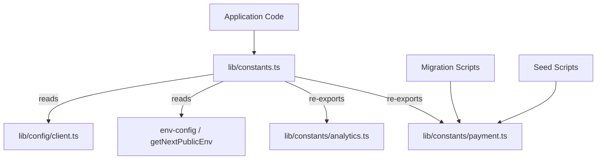

# Referência de Constantes

O módulo de constantes (`template/lib/constants.ts` e `template/lib/constants/`) centraliza todos os valores de configuração de todo o aplicativo, enumerações, configurações orientadas ao ambiente e números mágicos. As constantes são organizadas em arquivos específicos do domínio para permitir importações seguras em contextos fora do tempo de execução do Next.js (por exemplo, scripts de migração, scripts de sementes).

## Visão geral da arquitetura



## Arquivos de origem

|Arquivo|Descrição|
|------|-------------|
|`lib/constants.ts`|Constantes principais barril - importa submódulos env-config e reexporta|
|`lib/constants/payment.ts`|Enumerações e tipos de pagamento (seguros para scripts)|
|`lib/constants/analytics.ts`|Constantes relacionadas ao Analytics|

## Constantes de localização

```typescript
const DEFAULT_LOCALE = 'en';

const LOCALES = [
  'en', 'fr', 'es', 'de', 'zh', 'ar', 'he', 'ru', 'uk', 'pt',
  'it', 'ja', 'ko', 'nl', 'pl', 'tr', 'vi', 'th', 'hi', 'id', 'bg'
] as const;

type Locale = (typeof LOCALES)[number];

/** Right-to-left locales */
const RTL_LOCALES: readonly Locale[] = ['ar', 'he'] as const;
```

## Marca e IU

```typescript
const LOGO_URL = '/logo-ever-work-3.png';
```

## API e back-end

```typescript
/** Base URL for internal Next.js API routes */
const API_BASE_URL = getNextPublicEnv('NEXT_PUBLIC_API_BASE_URL');
```

## Autenticação e Segurança

```typescript
const COOKIE_SECRET = getNextPublicEnv('COOKIE_SECRET');
const JWT_ACCESS_TOKEN_EXPIRES_IN = getNextPublicEnv('JWT_ACCESS_TOKEN_EXPIRES_IN');
const JWT_REFRESH_TOKEN_EXPIRES_IN = getNextPublicEnv('JWT_REFRESH_TOKEN_EXPIRES_IN');
```

## Análise – PostHog

|Constante|Fonte|Descrição|
|----------|--------|-------------|
|`POSTHOG_KEY`|`NEXT_PUBLIC_POSTHOG_KEY`|Chave de API do projeto PostHog|
|`POSTHOG_HOST`|`NEXT_PUBLIC_POSTHOG_HOST`|Host da API PostHog|
|`POSTHOG_ENABLED`|Derivado|Verdadeiro quando a chave e o host existem|
|`POSTHOG_DEBUG`|`POSTHOG_DEBUG`|Habilitar registro de depuração|
|`POSTHOG_SESSION_RECORDING_ENABLED`|ambiente / `'true'`|Alternar gravação de sessão|
|`POSTHOG_AUTO_CAPTURE`|ambiente / `'false'`|Captura automática de visualizações de página|
|`POSTHOG_SAMPLE_RATE`|Calculado|`0.1` em produção, `1.0` em desenvolvimento|
|`POSTHOG_SESSION_RECORDING_SAMPLE_RATE`|Calculado|`0.1` em produção, `1.0` em desenvolvimento|

## Rastreamento de erros - Sentinela

|Constante|Fonte|Descrição|
|----------|--------|-------------|
|`SENTRY_DSN`|`NEXT_PUBLIC_SENTRY_DSN`|Nome da fonte de dados do Sentinela|
|`SENTRY_ENABLE_DEV`|`SENTRY_ENABLE_DEV`|Habilitar Sentry em desenvolvimento|
|`SENTRY_DEBUG`|`SENTRY_DEBUG`|Modo de depuração Sentry|
|`SENTRY_ENABLED`|Derivado|Verdadeiro quando o DSN está definido e o ambiente permite|

## Rastreamento unificado de exceções

```typescript
const EXCEPTION_TRACKING_PROVIDER = getNextPublicEnv('EXCEPTION_TRACKING_PROVIDER', 'both');
const POSTHOG_EXCEPTION_TRACKING = getNextPublicEnv('POSTHOG_EXCEPTION_TRACKING', 'true');
const SENTRY_EXCEPTION_TRACKING = getNextPublicEnv('SENTRY_EXCEPTION_TRACKING', 'true');

type ExceptionTrackingProvider = 'sentry' | 'posthog' | 'both' | 'none';
```

## ReCAPTCHA

```typescript
const RECAPTCHA_SITE_KEY = getNextPublicEnv('NEXT_PUBLIC_RECAPTCHA_SITE_KEY');
const RECAPTCHA_SECRET_KEY = getNextPublicEnv('RECAPTCHA_SECRET_KEY');
```

## Constantes de pagamento (`constants/payment.ts`)

Este arquivo é intencionalmente separado de `constants.ts` para evitar a importação de `@/lib/config`, permitindo o uso em scripts de migração e propagação que são executados fora do Next.js.

### Enums

```typescript
enum PaymentFlow {
  PAY_AT_START = 'pay_at_start',
  PAY_AT_END = 'pay_at_end',
}

enum PaymentStatus {
  PENDING = 'pending',
  PAID = 'paid',
  FAILED = 'failed',
}

enum PaymentInterval {
  DAILY = 'daily',
  WEEKLY = 'weekly',
  MONTHLY = 'monthly',
  YEARLY = 'yearly',
  ONE_TIME = 'one-time',
  PER_SUBMISSION = 'per-submission',
}

enum PaymentPlan {
  FREE = 'free',
  STANDARD = 'standard',
  PREMIUM = 'premium',
}

enum PaymentMethod {
  CREDIT_CARD = 'credit_card',
  PAYPAL = 'paypal',
}

enum PaymentCurrency {
  USD = 'USD',
  EUR = 'EUR',
  GBP = 'GBP',
  CAD = 'CAD',
  AUD = 'AUD',
  ETH = 'ETH',
}

enum PaymentProvider {
  STRIPE = 'stripe',
  SOLIDGATE = 'solidgate',
  LEMONSQUEEZY = 'lemonsqueezy',
  POLAR = 'polar',
}

enum SubmissionStatus {
  DRAFT = 'draft',
  PENDING = 'pending',
  APPROVED = 'approved',
  REJECTED = 'rejected',
  PUBLISHED = 'published',
  ARCHIVED = 'archived',
}
```

### Nomes de exibição do plano

```typescript
const PAYMENT_PLAN_NAMES: Record<PaymentPlan, string> = {
  free: 'Free Plan',
  standard: 'Standard Plan',
  premium: 'Premium Plan',
};
```

### Preço do anúncio do patrocinador

```typescript
const SponsorAdPricing = {
  WEEKLY: 100,    // $100.00
  MONTHLY: 300,   // $300.00
} as const;
```

## Constantes analíticas (`constants/analytics.ts`)

```typescript
/** Cookie name for anonymous viewer tracking */
const VIEWER_COOKIE_NAME = 'ever_viewer_id';

/** Cookie max age: 365 days in seconds */
const VIEWER_COOKIE_MAX_AGE = 365 * 24 * 60 * 60;  // 31,536,000
```

## Importar padrões

### Código completo do aplicativo

```typescript
// Import everything from the main barrel
import {
  DEFAULT_LOCALE,
  LOCALES,
  POSTHOG_ENABLED,
  PaymentPlan,
  PaymentProvider,
  SubmissionStatus,
  VIEWER_COOKIE_NAME,
} from '@/lib/constants';
```

### Scripts fora do tempo de execução Next.js

```typescript
// Import only from payment.ts to avoid Next.js dependencies
import { PaymentPlan, PaymentStatus, SubmissionStatus } from '@/lib/constants/payment';
```
