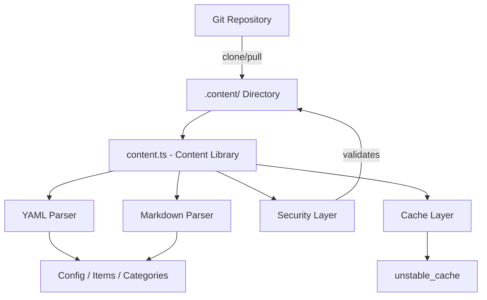
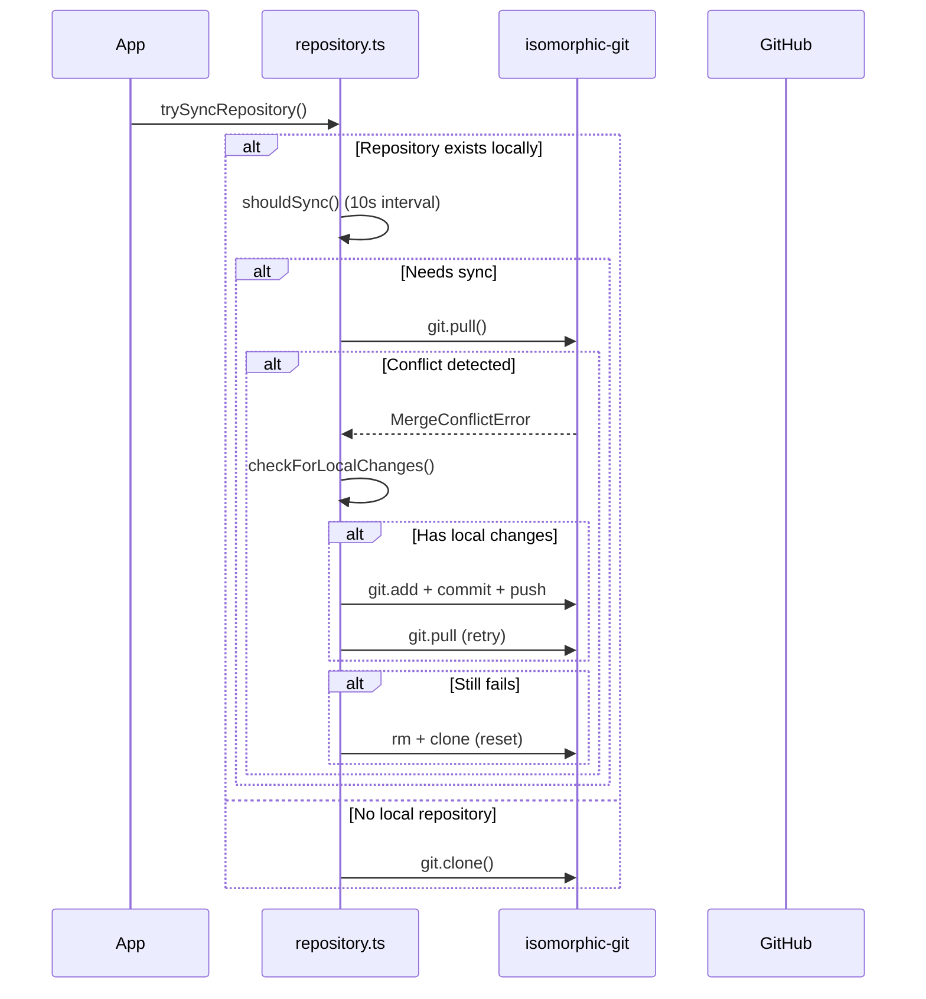

# Biblioteca de conteúdo

A biblioteca de conteúdo (`lib/content.ts`) fornece utilitários do lado do servidor para leitura, análise e armazenamento em cache de conteúdo de um repositório CMS baseado em Git. Ele lida com arquivos de conteúdo YAML/Markdown, gerenciamento de configuração e sincronização de conteúdo com medidas de segurança robustas.

## Visão geral da arquitetura



## Arquivos de origem

|Arquivo|Objetivo|
|------|---------|
|`lib/content.ts`|Processamento, leitura e cache de conteúdo principal|
|`lib/repository.ts`|Sincronização clone/pull do Git com repositório remoto|
|`lib/lib.ts`|Utilitários de caminho (`getContentPath`, `fsExists`, `dirExists`)|
|`lib/cache-config.ts`|Tags de cache e configuração TTL|

## Camada de segurança

A biblioteca de conteúdo impõe diversas medidas de segurança para evitar ataques de passagem de caminho e injeção.

### Validação de código de idioma

```typescript
function validateLanguageCode(lang: string): boolean {
  const validLangPattern = /^[a-zA-Z0-9_-]+$/;
  return validLangPattern.test(lang) && lang.length <= 10;
}
```

Somente caracteres alfanuméricos, hifens e sublinhados são aceitos com comprimento máximo de 10 caracteres.

### Sanitização de nome de arquivo

```typescript
function sanitizeFilename(filename: string): string {
  const sanitized = path.basename(filename);
  if (sanitized.includes('..') || sanitized.includes('/') || sanitized.includes('\\')) {
    throw new Error('Invalid filename: contains dangerous characters');
  }
  return sanitized;
}
```

Usa `path.basename` para remover componentes do diretório e rejeita quaisquer caracteres de passagem restantes.

### Validação de caminho

```typescript
function validatePath(filepath: string, basePath: string): void {
  const resolvedPath = path.resolve(filepath);
  const resolvedBase = path.resolve(basePath);
  if (!resolvedPath.startsWith(resolvedBase + path.sep) && resolvedPath !== resolvedBase) {
    throw new Error('Invalid file path: outside of allowed directory');
  }
}
```

A função `safeReadFile` realiza uma verificação dupla: ela valida o caminho e então verifica se o caminho real resolvido (seguindo links simbólicos) permanece dentro do diretório base.

### Validação de URL

```typescript
function isValidUrl(url: string): boolean {
  const trimmed = url.trim();
  if (trimmed.startsWith('/') && !trimmed.startsWith('//')) return true;
  return trimmed.startsWith('http://') || trimmed.startsWith('https://');
}
```

Bloqueia `javascript:`, `data:`, `vbscript:` e outros esquemas de protocolo perigosos.

### Validação de tamanho CSS

```typescript
function isValidCssSize(value: string): boolean {
  if (['auto', 'inherit', 'initial', 'unset'].includes(value.trim())) return true;
  return /^\d+(\.\d+)?(px|em|rem|vh|vw|%|pt|cm|mm|in)?$/.test(value.trim());
}
```

Impede a injeção de CSS por meio de campos de frontmatter de herói personalizados.

## Processamento de Conteúdo

### Análise YAML

Os arquivos de conteúdo são analisados usando a biblioteca `yaml` com validação de esquema Zod para frontmatter:

```typescript
const customHeroFrontmatterSchema = z.object({
  background_image: z.string().refine(isValidUrl, {
    message: 'Invalid URL: must be http, https, or relative path'
  }).optional(),
  // ... additional validated fields
});
```

### Cache de configuração

A configuração do site é armazenada em cache usando Next.js `unstable_cache` com TTLs e tags de cache definidos:

```typescript
import { CACHE_TAGS, CACHE_TTL } from './cache-config';

const getCachedConfig = unstable_cache(
  async () => { /* read and parse config.yml */ },
  [CACHE_TAGS.CONFIG],
  { revalidate: CACHE_TTL }
);
```

## Sincronização do repositório Git

O módulo `repository.ts` gerencia operações Git usando `isomorphic-git`.

### Fluxo de sincronização



### Proteção de tempo limite

Todas as operações do Git são encapsuladas com tempos limite configuráveis:

```typescript
async function withTimeout<T>(promise: Promise<T>, timeoutMs: number = 120000): Promise<T> {
  const timeoutPromise = new Promise<never>((_, reject) => {
    setTimeout(() => reject(new Error(`Operation timeout after ${timeoutMs}ms`)), timeoutMs);
  });
  return Promise.race([promise, timeoutPromise]);
}
```

### Resolução de Conflitos

O sistema lida com conflitos de mesclagem por meio de uma estratégia de várias etapas:

1. **Detectar alterações locais** via `git.statusMatrix()`
2. **Tente enviar alterações locais** antes de efetuar pull
3. **Tente puxar novamente** após empurrar com sucesso
4. **Redefinição completa** (excluir + clonar novamente) como último recurso

### Comportamento substituto

Se `DATA_REPOSITORY` não estiver configurado ou a clonagem falhar, o sistema criará conteúdo substituto mínimo:

```typescript
// Creates empty content directory with minimal config
const DEFAULT_CONFIG = `site_name: Website
item_name: Item
items_name: Items
copyright_year: ${new Date().getFullYear()}
`;
```

## Aplicação somente de servidor

Tanto `content.ts` quanto `repository.ts` usam a importação `server-only` para evitar o uso acidental do lado do cliente:

```typescript
'use server';
import 'server-only';
```

Isso garante que as operações de conteúdo com acesso ao sistema de arquivos nunca vazem para os pacotes configuráveis do cliente.

## Principais funções exportadas

|Função|Descrição|
|----------|-------------|
|`getCachedConfig()`|Retorna a configuração do site em cache de `config.yml`|
|`trySyncRepository()`|Clona ou extrai conteúdo do repositório Git remoto|
|`pullChanges()`|Extrai as alterações mais recentes com resolução de conflitos|
|`validateLanguageCode()`|Valida o formato do código de idioma i18n|
|`sanitizeFilename()`|Remove componentes de diretório de nomes de arquivos|
|`safeReadFile()`|Lê arquivos com proteção completa contra passagem de caminho|
