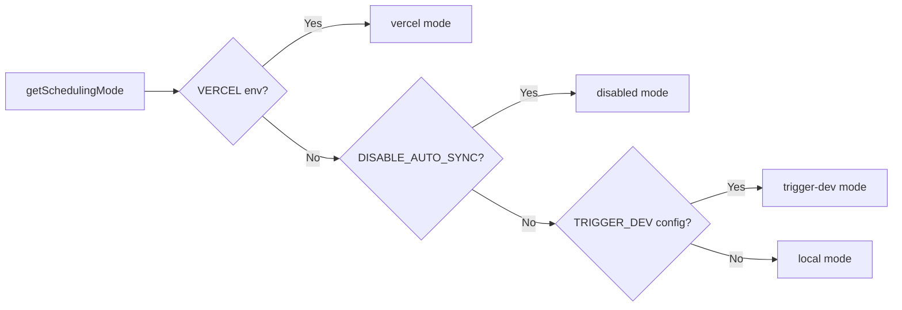

# Sistema Cron Job

## Visão geral

O modelo Ever Works implementa um sistema flexível de tarefas em segundo plano que suporta três modos de agendamento: **Vercel Cron**, **Trigger.dev** e um **agendador local**. Os endpoints Cron são rotas de API Next.js padrão autenticadas via `CRON_SECRET`, e o sistema inclui um módulo de inicialização singleton que garante que os trabalhos sejam configurados exatamente uma vez por processo.

## Arquitetura

```mermaid
flowchart TD
    A[Scheduling Mode Detection] --> B{getSchedulingMode}

    B -->|vercel| C[Vercel Cron]
    B -->|trigger-dev| D[Trigger.dev]
    B -->|local| E[Local Scheduler]
    B -->|disabled| F[No Jobs]

    C --> G[vercel.json crons]
    G --> G1[/api/cron/sync]
    G --> G2[/api/cron/subscription-reminders]
    G --> G3[/api/cron/subscription-expiration]

    G1 --> H[CRON_SECRET Verification]
    G2 --> H
    G3 --> H

    H -->|Valid| I[Execute Job]
    H -->|Invalid| J[401 Unauthorized]

    I --> I1[triggerManualSync]
    I --> I2[subscriptionRenewalReminderJob]
    I --> I3[processExpiredSubscriptions]

    D --> K[Trigger.dev SDK]
    E --> L[Internal setInterval]

    K --> I
    L --> I
```

## Arquivos de origem

|Arquivo|Objetivo|
|------|---------|
|`template/vercel.json`|Definições de cronograma Vercel cron|
|`template/app/api/cron/sync/route.ts`|Endpoint cron de sincronização de conteúdo|
|`template/app/api/cron/subscription-reminders/route.ts`|E-mails de lembrete de renovação|
|`template/app/api/cron/subscription-expiration/route.ts`|Processamento de assinatura expirada|
|`template/app/api/cron/jobs/background-jobs-init.ts`|Inicialização de trabalho singleton|

## Configuração de agendamento Cron

### vercel.json

```json
{
    "crons": [
        {
            "path": "/api/cron/sync",
            "schedule": "0 3 * * *"
        },
        {
            "path": "/api/cron/subscription-reminders",
            "schedule": "0 9 * * *"
        },
        {
            "path": "/api/cron/subscription-expiration",
            "schedule": "0 0 * * *"
        }
    ]
}
```

|Trabalho|Cronograma|Hora|Descrição|
|-----|----------|------|-------------|
|Sincronização de conteúdo| `0 3 * * *` |3h UTC diariamente|Sincroniza conteúdo de CMS baseado em Git|
|Lembretes de assinatura| `0 9 * * *` |9h UTC diariamente|Envia e-mails de lembrete de renovação|
|Expiração da assinatura| `0 0 * * *` |Meia-noite UTC diariamente|Processa assinaturas expiradas|

## Autenticação

### Verificação secreta de tempo seguro

Todos os endpoints cron verificam `CRON_SECRET` usando comparação de tempo seguro para evitar ataques de temporização:

```typescript
import crypto from 'crypto';

function verifyCronSecret(request: NextRequest): boolean {
    const authHeader = request.headers.get('authorization');
    const cronSecret = process.env.CRON_SECRET;

    // Development bypass
    if (!cronSecret && process.env.NODE_ENV === 'development') {
        console.log('[Cron] Bypassing cron auth in development');
        return true;
    }

    if (!cronSecret || !authHeader) return false;

    const expectedValue = `Bearer ${cronSecret}`;

    // Length check before timing-safe comparison
    if (authHeader.length !== expectedValue.length) return false;

    return crypto.timingSafeEqual(
        Buffer.from(authHeader, 'utf8'),
        Buffer.from(expectedValue, 'utf8')
    );
}
```

Principais recursos de segurança:
- **Comparação segura de tempo de resposta** via `crypto.timingSafeEqual` - evita que invasores meçam diferenças de tempo de resposta para adivinhar o segredo
- **Pré-verificação de comprimento** -- `timingSafeEqual` requer buffers de comprimento igual
- **Desvio de desenvolvimento** - somente quando `CRON_SECRET` não estiver configurado e `NODE_ENV=development`

### Autenticação Automática Vercel

Quando implantada no Vercel, a plataforma inclui automaticamente o cabeçalho `Authorization: Bearer <CRON_SECRET>` para tarefas cron configuradas. Você só precisa definir a variável de ambiente `CRON_SECRET` no painel do Vercel.

## Implementações de trabalho

### Trabalho de sincronização de conteúdo

```typescript
export async function GET(request: Request): Promise<NextResponse> {
    const startTime = Date.now();

    // Verify authorization
    if (!isAuthorized) {
        return NextResponse.json({ success: false, message: "Unauthorized" }, { status: 401 });
    }

    try {
        const result = await triggerManualSync();
        const duration = Date.now() - startTime;

        return NextResponse.json({
            success: result.success,
            timestamp: new Date().toISOString(),
            duration,
            message: result.message,
        }, {
            headers: { "Cache-Control": "no-cache, no-store, must-revalidate" },
        });
    } catch (error) {
        return NextResponse.json({
            success: false,
            message: "Cron sync failed",
            details: safeErrorMessage(error, "Unknown error"),
        }, { status: 500 });
    }
}
```

Formato de resposta:
```json
{
    "success": true,
    "timestamp": "2025-01-15T03:00:05.123Z",
    "duration": 5123,
    "message": "Sync completed successfully"
}
```

### Trabalho de expiração de assinatura

Este trabalho processa assinaturas expiradas e envia e-mails de notificação:

```typescript
export async function GET(request: NextRequest) {
    if (!verifyCronSecret(request)) {
        return NextResponse.json({ success: false, message: 'Unauthorized' }, { status: 401 });
    }

    // 1. Find and update expired subscriptions
    const result = await subscriptionService.processExpiredSubscriptions();

    // 2. Send notification emails
    const { service: emailService } = await createEmailService();
    if (emailService.isServiceAvailable()) {
        for (const subscription of result.subscriptions) {
            const user = await getUserById(subscription.userId);
            const emailTemplate = getSubscriptionExpiredTemplate({ /* ... */ });
            await sendEmailSafely(emailService, emailConfig, emailTemplate, user.email);
        }
    }

    // 3. Return results
    return NextResponse.json({
        success: true,
        data: {
            processed: result.processed,
            affectedUsers,
            errors: result.errors,
            timestamp: new Date().toISOString()
        }
    });
}
```

Comportamentos principais:
- Falhas de email não causam falha no trabalho
- O método `POST` também é exportado como um alias para gatilhos manuais
- Retorna `207 Multi-Status` para sucessos parciais

### Trabalho de lembretes de assinatura

```typescript
export async function GET(request: NextRequest) {
    if (!verifyCronSecret(request)) {
        return NextResponse.json({ error: 'Unauthorized' }, { status: 401 });
    }

    const result = await subscriptionRenewalReminderJob();

    if (!result.success) {
        return NextResponse.json(
            { error: 'Job completed with errors', ...result },
            { status: 207 }  // Multi-Status for partial success
        );
    }

    return NextResponse.json({
        message: 'Subscription reminder job completed',
        ...result
    });
}

// Support POST for Vercel Cron
export async function POST(request: NextRequest) {
    return GET(request);
}
```

## Inicialização de trabalhos em segundo plano

### Padrão Singleton

O módulo de inicialização usa `globalThis` para garantir que os trabalhos sejam configurados exatamente uma vez, mesmo em invocações de função sem servidor:

```typescript
const GLOBAL_KEY = '__BACKGROUND_JOBS_INIT__' as const;

interface BackgroundJobsGlobalState {
    initializationState: 'pending' | 'initializing' | 'completed';
    initializationPromise: Promise<void> | null;
    loggedMode: SchedulingMode | null;
}

export async function ensureBackgroundJobsInitialized(): Promise<void> {
    // Skip during tests and builds
    if (process.env.NODE_ENV === 'test') return;
    if (process.env.NEXT_PHASE === 'phase-production-build') return;

    const state = getGlobalState();

    // Fast path: already completed
    if (state.initializationState === 'completed') return;

    // Wait for in-progress initialization
    if (state.initializationState === 'initializing') {
        return state.initializationPromise;
    }

    // Start initialization
    state.initializationState = 'initializing';
    state.initializationPromise = doInitialize();

    try {
        await state.initializationPromise;
        state.initializationState = 'completed';
    } catch (error) {
        state.initializationState = 'pending'; // Allow retry
        throw error;
    }
}
```

### Modos de agendamento



|Modo|Comportamento|
|------|----------|
|`vercel`|Jobs manipulados por Vercel Cron via endpoints HTTP|
|`trigger-dev`|Trabalhos gerenciados pelo agendador de nuvem Trigger.dev|
|`local`|Agendador interno baseado em `setInterval` para desenvolvimento|
|`disabled`|Sem agendamento automático (`DISABLE_AUTO_SYNC=true`)|

## Variáveis de ambiente

|Variável|Obrigatório|Descrição|
|----------|----------|-------------|
|`CRON_SECRET`|Somente produção|Token de portador para autenticação cron|
|`DISABLE_AUTO_SYNC`|Não|Defina como `true` para desativar todos os trabalhos em segundo plano|
|`VERCEL`|Configuração automática|Definido automaticamente pela plataforma Vercel|

## Melhores práticas

1. **Sempre use comparação de tempo seguro** para segredos do cron - evita ataques de temporização
2. **Exporte GET e POST** - Vercel Cron pode usar qualquer um dos métodos
3. **Defina `Cache-Control: no-cache`** nas respostas - evite o armazenamento em cache dos resultados do trabalho
4. **Duração do trabalho de registro** – ajuda a identificar regressões de desempenho
5. **Trate de falhas de e-mail normalmente** – não deixe que falhas de notificação atrapalhem o trabalho
6. **Use `207 Multi-Status`** para sucessos parciais - distingue de sucesso/falha total
