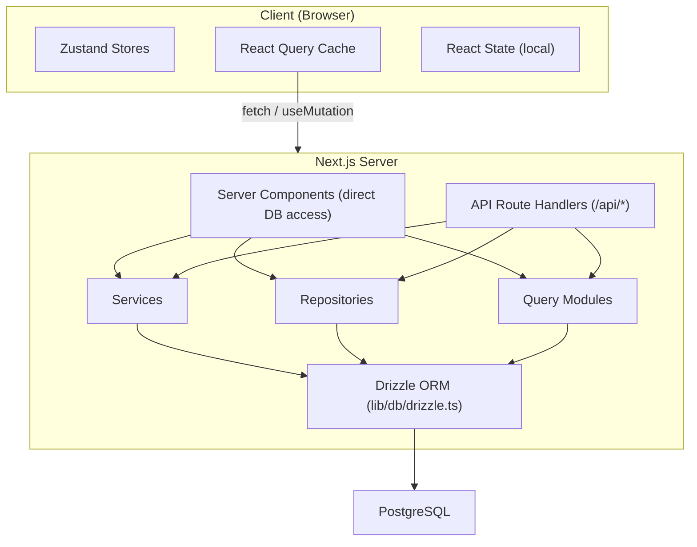

# Fluxo de dados e gerenciamento de estado

Este documento descreve como os dados fluem através do modelo Ever Works, do banco de dados à UI, cobrindo componentes do servidor, rotas de API, React Query, armazenamentos Zustand e o padrão de repositório.

## Visão geral da arquitetura

O modelo emprega uma arquitetura de dados multicamadas:



## Busca de dados do lado do servidor

### Componentes do servidor (acesso direto ao banco de dados)

Os componentes do servidor no diretório `app/` podem importar e chamar diretamente funções de consulta de banco de dados ou métodos de repositório. Este é o caminho mais eficiente porque evita viagens de ida e volta HTTP desnecessárias.

```typescript
// app/[locale]/admin/items/page.tsx (simplified)
import { getItems } from '@/lib/db/queries';

export default async function AdminItemsPage() {
  const items = await getItems();
  return <ItemsList items={items} />;
}
```

### Manipuladores de rota de API

As rotas de API em `app/api/` servem como ponte entre os componentes do cliente e a lógica do lado do servidor. Eles seguem um padrão de manipulador fino: validam a entrada, chamam o serviço ou repositório apropriado e retornam uma resposta HTTP.

```typescript
// Typical API route pattern
export async function GET(request: NextRequest) {
  const session = await auth();
  if (!session?.user) {
    return NextResponse.json({ error: 'Unauthorized' }, { status: 401 });
  }

  const data = await someRepository.findAll();
  return NextResponse.json({ success: true, data });
}
```

## Gerenciamento de estado do lado do cliente

### Consulta TanStack (Consulta React 5)

React Query é a principal ferramenta para gerenciamento de estado do servidor do lado do cliente. O modelo o utiliza extensivamente por meio de ganchos personalizados no diretório `hooks/`.

**Configuração Global** (`lib/react-query-config.ts`):
- Tempo desatualizado padrão: 5 minutos
- Tempo de coleta de lixo: 10 minutos
- Nova tentativa automática com espera exponencial (até 3 tentativas)
- Busque novamente o foco da janela e reconecte
- Nenhuma nova tentativa em erros do cliente 4xx

**Padrão de gancho**: cada área de recurso possui ganchos dedicados que envolvem o React Query:

```typescript
// hooks/use-admin-items.ts (simplified pattern)
import { useQuery, useMutation, useQueryClient } from '@tanstack/react-query';

export function useAdminItems(params) {
  return useQuery({
    queryKey: ['admin', 'items', params],
    queryFn: () => fetch('/api/admin/items').then(r => r.json()),
    staleTime: 5 * 60 * 1000,
  });
}

export function useCreateItem() {
  const queryClient = useQueryClient();
  return useMutation({
    mutationFn: (data) => fetch('/api/admin/items', {
      method: 'POST',
      body: JSON.stringify(data),
    }).then(r => r.json()),
    onSuccess: () => {
      queryClient.invalidateQueries({ queryKey: ['admin', 'items'] });
    },
  });
}
```

### Lojas Zustand

Zustand é usado para estado de UI somente cliente que não precisa de sincronização de servidor. Os exemplos incluem:

- **Estado do tema**: preferência de modo claro/escuro
- **Estado do filtro**: seleções de filtros ativos
- **Estado modal**: estado aberto/fechado para modais e sobreposições
- **Preferências de layout**: visualização em grade versus lista, estado da barra lateral

### Contexto de reação

Provedores de contexto React em `components/context/` e `components/providers/` fornecem estado compartilhado para subárvores de componentes. O wrapper dos provedores raiz (`app/[locale]/providers.tsx`) compõe:

- Provedor React Query (com cliente de consulta)
- Provedor de tema
- Provedor de sessão de autenticação
- Provedor de notificação do sistema

## Camadas de acesso a dados

### Padrão de repositório

Os repositórios em `lib/repositories/` fornecem uma abstração limpa sobre as operações do banco de dados. Cada repositório encapsula consultas para uma entidade de domínio específica.

```
lib/repositories/
├── admin-analytics-optimized.repository.ts
├── admin-stats.repository.ts
├── category.repository.ts
├── client-dashboard.repository.ts
├── client-item.repository.ts
├── collection.repository.ts
├── integration-mapping.repository.ts
├── item.repository.ts
├── role.repository.ts
├── sponsor-ad.repository.ts
├── tag.repository.ts
├── twenty-crm-config.repository.ts
└── user.repository.ts
```

### Módulos de consulta

O diretório `lib/db/queries/` contém mais de 23 módulos de consulta organizados por domínio. Eles fornecem funções de consulta Drizzle ORM brutas que os repositórios e serviços consomem.

### Camada de Serviços

O diretório `lib/services/` contém mais de 30 arquivos de serviço que implementam a lógica de negócios. Os serviços orquestram vários repositórios, chamadas externas de API e efeitos colaterais (e-mail, notificações, webhooks).

## Arquitetura do cliente API

### Cliente API do lado do servidor

`lib/api/server-api-client.ts` fornece um cliente HTTP centralizado para chamadas do lado do servidor com:
- Nova tentativa automática com espera exponencial
- Tempos limite configuráveis (padrão 30 segundos)
- Log estruturado em desenvolvimento
- Normalização de erros

### Cliente API do navegador

`lib/api/api-client.ts` e `lib/api/api-client-class.ts` fornecem a abstração de API do lado do cliente usada pelos ganchos React Query para chamar rotas de API.

## Dados de conteúdo (CMS baseado em Git)

O conteúdo do item (listagens de diretórios) é armazenado em um repositório Git e gerenciado por `lib/content.ts` e `lib/repository.ts`. Este conteúdo é clonado em `.content/` no momento da construção e sincronizado periodicamente. O sistema de conteúdo usa `isomorphic-git` para operações Git diretamente do Node.js.

## Estratégia de Cache

O modelo implementa uma abordagem de cache multinível:

1. **Cache de consulta React**: lado do cliente com tempos obsoletos/GC configuráveis por consulta
2. **Cache Next.js**: renderização no lado do servidor e cache de dados via `lib/cache-config.ts`
3. **Invalidação de cache**: invalidação direcionada por meio de `lib/cache-invalidation.ts` usando tags de revalidação
4. **Pooling de conexões de banco de dados**: configurado em `lib/db/drizzle.ts` com tamanhos de pool entre 1 e 50 conexões
