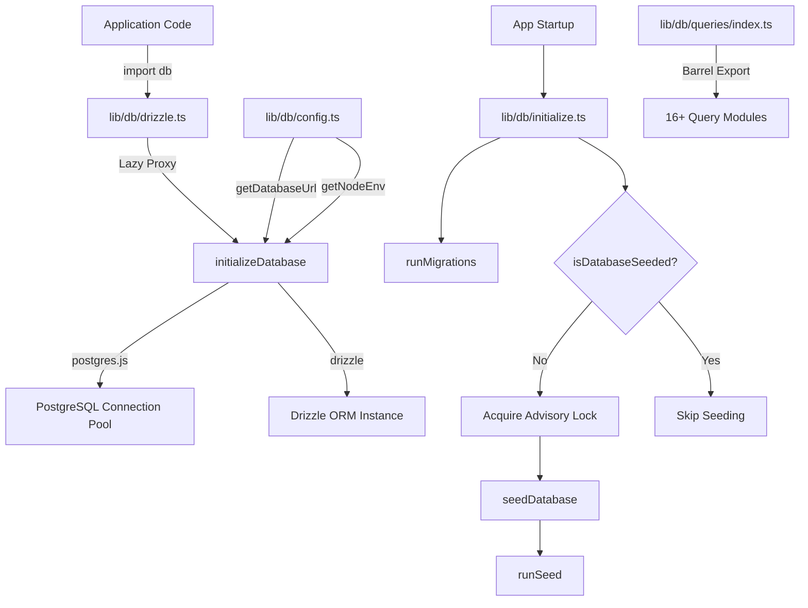
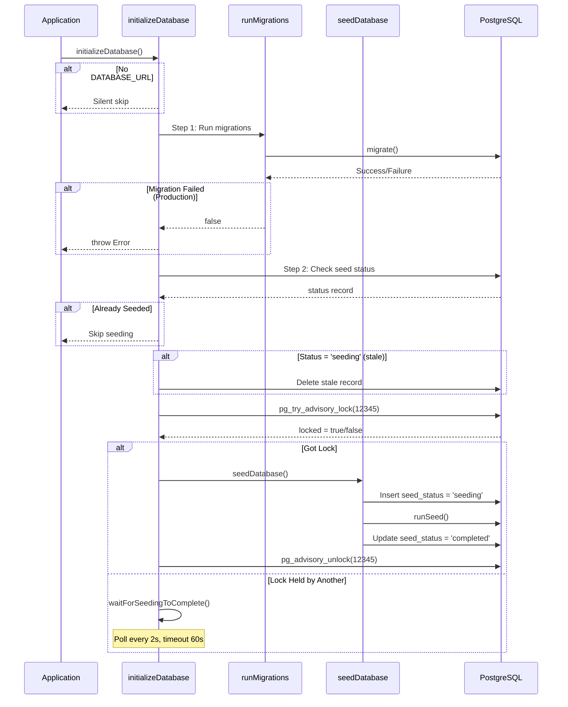

# Módulo Utilitários de Banco de Dados

O módulo de utilitários de banco de dados (`template/lib/db/`) gerencia o pool de conexões PostgreSQL via `postgres.js`, inicialização Drizzle ORM, migrações automatizadas e propagação de banco de dados com bloqueio seguro de simultaneidade. Ele foi projetado para funcionar em ambientes sem servidor (Vercel), onde várias inicializações a frio podem correr para inicializar o banco de dados.

## Visão geral da arquitetura



## Arquivos de origem

|Arquivo|Descrição|
|------|-------------|
|`lib/db/config.ts`|Configuração de banco de dados segura para script (sem `server-only`)|
|`lib/db/drizzle.ts`|Pool de conexões e instância do Drizzle com proxy lento|
|`lib/db/initialize.ts`|Migração automática e orquestração de propagação|
|`lib/db/migrate.ts`|Corredor de migração|
|`lib/db/queries/index.ts`|Exportação de barril para todos os módulos de consulta|

## Configuração do banco de dados (`config.ts`)

Funções seguras para script que **não** importam `server-only`, permitindo o uso em scripts de migração e propagação:

```typescript
function getDatabaseUrl(): string | undefined;
function getNodeEnv(): 'development' | 'production' | 'test';
function isProduction(): boolean;
```

## Conexão e ORM (`drizzle.ts`)

### Padrão de proxy preguiçoso

A exportação `db` usa um JavaScript `Proxy` para adiar a inicialização da conexão até o primeiro uso. Isso evita erros de conexão durante o tempo de construção, quando `DATABASE_URL` pode não estar disponível.

```typescript
// Proxy intercepts all property access and initializes on demand
export const db = new Proxy({} as ReturnType<typeof drizzle>, {
  get(target, prop) {
    const database = initializeDatabase();
    return database[prop as keyof typeof database];
  },
});
```

### Configuração do pool de conexões

```typescript
function getPoolSize(): number;
// - Reads DB_POOL_SIZE env var (clamped to 1-50)
// - Defaults: 20 (production), 10 (development)
```

Configurações do pool:
- `idle_timeout`: 20 segundos
- `connect_timeout`: 30 segundos
- `prepare`: false (obrigatório para alguns ambientes sem servidor)

### Singleton via `globalThis`

A conexão é armazenada em cache em `globalThis` para sobreviver às recargas do módulo ativo Next.js em desenvolvimento:

```typescript
const globalForDb = globalThis as unknown as {
  conn: postgres.Sql | undefined;
  db: ReturnType<typeof drizzle> | undefined;
};
```

### Acesso direto à instância

Para casos que exigem a instância real do Drizzle (por exemplo, o adaptador NextAuth.js Drizzle):

```typescript
import { getDrizzleInstance } from '@/lib/db/drizzle';

const adapter = DrizzleAdapter(getDrizzleInstance(), { ... });
```

## Corredor de migração (`migrate.ts`)

### `runMigrations(): Promise<boolean>`

Executa migrações do Drizzle da pasta `./lib/db/migrations`. É seguro ligar em todas as startups porque o `migrate()` do Drizzle é idempotente - ele rastreia migrações aplicadas em uma tabela `__drizzle_migrations`.

```typescript
import { runMigrations } from '@/lib/db/migrate';

const success = await runMigrations();
if (!success) {
  console.error('Migrations failed -- run pnpm db:migrate manually');
}
```

**Comportamento:**
- Registra o histórico de migração recente antes e depois da execução
- Retorna `true` em caso de sucesso, `false` em caso de falha
- Não lança - as falhas são registradas e retornadas como booleanas

## Inicialização do banco de dados (`initialize.ts`)

### `initializeDatabase(): Promise<void>`

A principal função de inicialização chamada na inicialização do aplicativo. Lida com o ciclo de vida completo:



### Segurança de simultaneidade

Várias instâncias sem servidor podem ser iniciadas simultaneamente. O módulo evita propagação duplicada usando:

1. **Bloqueio de aviso do PostgreSQL** (`pg_try_advisory_lock(12345)`) - sem bloqueio
2. **Tabela de status de sementes** rastreamento de estados `seeding`, `completed`, `failed`
3. **Detecção obsoleta** – Limite de 5 minutos para status `seeding` travado
4. **Wait-and-poll** – instâncias que não podem adquirir a sondagem de bloqueio a cada 2 segundos

### Funções auxiliares

```typescript
// Check if database has been successfully seeded
async function isDatabaseSeeded(): Promise<boolean>;

// Wait for another instance to finish seeding (60s timeout, 2s intervals)
async function waitForSeedingToComplete(): Promise<boolean>;
```

## Módulos de consulta

O diretório `lib/db/queries/` contém módulos de consulta específicos de domínio, todos reexportados via `index.ts`:

|Módulo|Domínio|
|--------|--------|
|`activity.queries.ts`|Registro de atividades|
|`auth.queries.ts`|Autenticação (pesquisa de usuário, verificação de senha)|
|`client.queries.ts`|Perfis de clientes|
|`comment.queries.ts`|Comentários|
|`company.queries.ts`|Perfis de empresa|
|`dashboard.queries.ts`|Estatísticas do painel|
|`engagement.queries.ts`|Visualizações, votos, agregação de favoritos|
|`item.queries.ts`|Item CRUD|
|`location-index.queries.ts`|Indexação baseada em localização|
|`newsletter.queries.ts`|Assinaturas de boletins informativos|
|`payment.queries.ts`|Registros de pagamento|
|`report.queries.ts`|Relatórios|
|`subscription.queries.ts`|Assinaturas|
|`survey.queries.ts`|Pesquisas e respostas|
|`user.queries.ts`|Gerenciamento de usuários|
|`vote.queries.ts`|Sistema de votação|

### Padrão de importação

```typescript
import {
  getUserByEmail,
  getClientProfileByUserId,
  logActivity,
  isUserAdmin,
} from '@/lib/db/queries';
```

## Variáveis de ambiente

|Variável|Obrigatório|Descrição|
|----------|----------|-------------|
|`DATABASE_URL`|Não (banco de dados opcional)|Cadeia de conexão PostgreSQL|
|`DB_POOL_SIZE`|Não|Tamanho do pool de conexões (padrão: 10/20)|
|`NODE_ENV`|Não|Determina os padrões de tamanho do pool e o registro em log|
